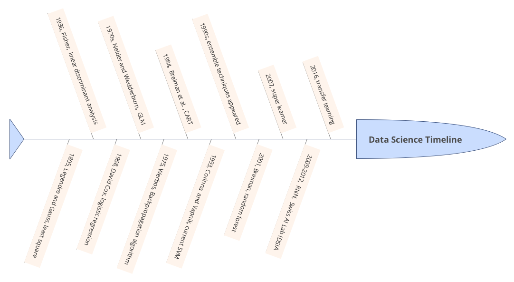
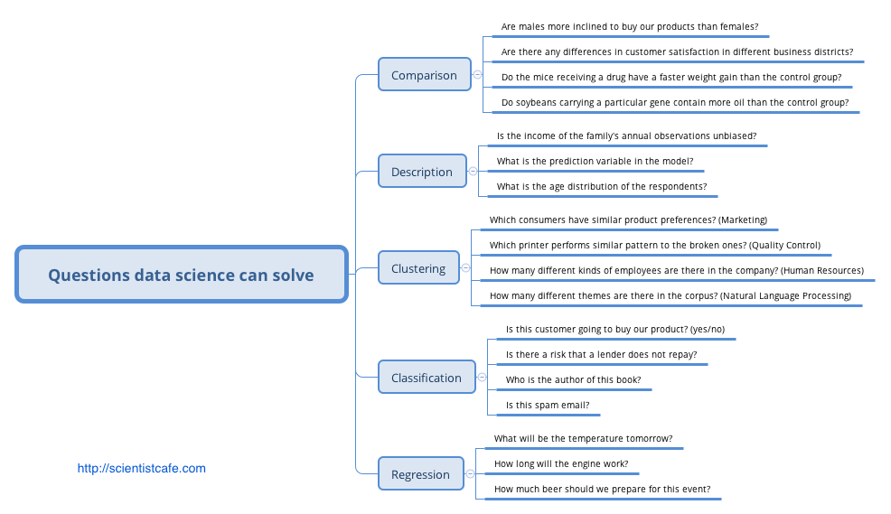
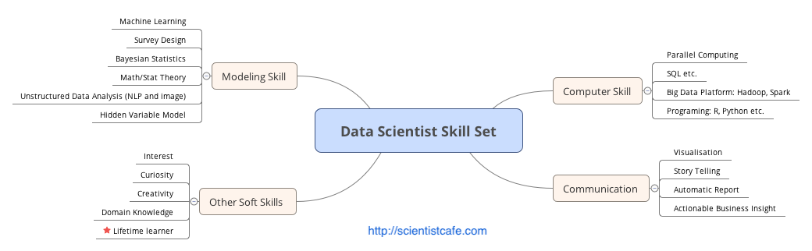
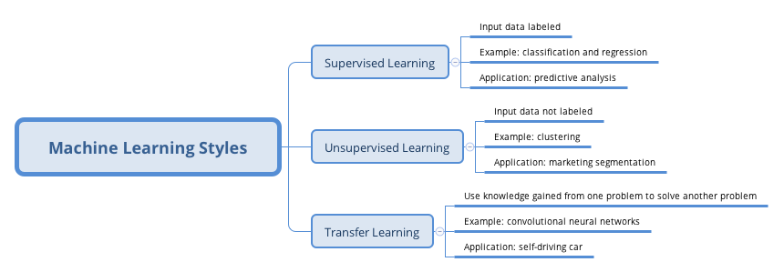
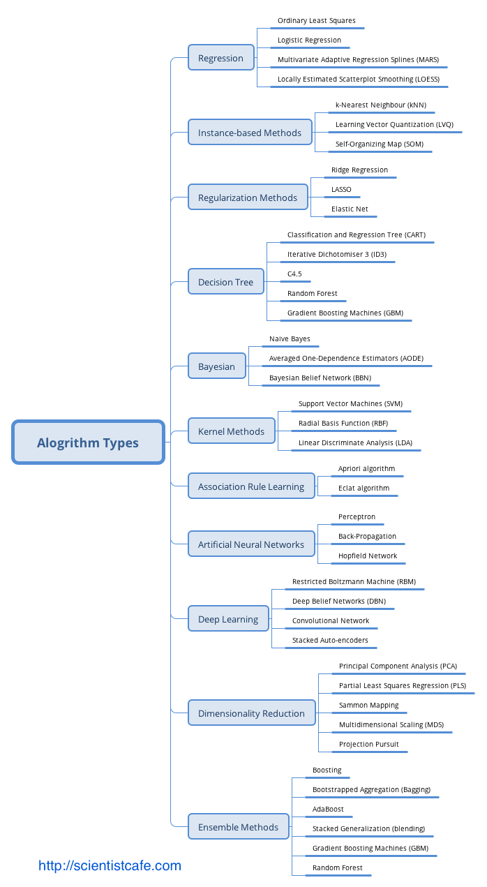

\mainmatter

# Introduction

Interest in data science is at an all-time high and has exploded in popularity in the last couple of years. Data scientists today are from various backgrounds. If someone ran into you asked what data science was all about, what would you tell them? It is not easy to answer. Data science is one of the areas where you ask ten people who will give ten different answers. It is not well-defined as an academic subject but broadly used in the industry.  Media has been hyping about "Data Science" "Big Data" and "Artificial Intelligence" over the fast few years. With the data science hype picking up stream, many professionals changed their titles to "Data Scientist" without any of the necessary qualifications. Your first reaction to all of this might be some combination of skepticism and confusion. We want to address this up front that: we had that exact reaction. To make things clear, let's start with the fundamental question. 

## What is data science?

David Donoho  [@data50] summarizes in “50 Years of Data Science” the main recurring “Memes” about data sciences:
 
1. The ‘Big Data’ Meme
1. The ‘Skills’ Meme
1. The ‘Jobs’ Meme

Everyone should have heard about big data. Data science trainees now need the skills to cope with such big data sets. What are those skills? You may hear about: Hadoop, a system using Map/Reduce to process large data sets distributed across a cluster of computers. The new skills are for dealing with organizational artifacts of large-scale cluster computing but not for better solving the real problem. A lot of data on its own is worthless. It isn’t the size of the data that’s important. It’s what you do with it. The big data skills that so many are touting today are not skills for better solving the real problem of inference from data. 

We are transiting to universal connectivity with a deluge of data filling telecom servers. But these facts don’t immediately create a science. The statisticians and computer scientists have been laying the groundwork for data science for at least 50 years. Today’s data science is an enlargement and combination of statistics and computer science rather than a brand new discipline.

Data Science doesn't come out of the blue. Its predecessor is data analysis. Back in 1962, John Tukey wrote in “The Future of Data Analysis”:

> For a long time I have thought I was a statistician, interested in inferences from the particular to the general. But as I have watched mathematical statistics evolve, I have had cause to wonder and to doubt. ...All in all, I have come to feel that my central interest is in data analysis, which I take to include, among other things: procedures for analyzing data, techniques for interpreting the results of such procedures, ways of planning the gathering of data to make its analysis easier, more precise or more accurate, and all the machinery and results of (mathematical) statistics which apply to analyzing data.

It deeply shocked his academic readers. Aren’t you supposed to present something mathematically precise, such as definitions, theorems, and proofs? If we use one sentence to summarize what John said, it is:

> data analysis is more than mathematics.

In September 2015, the University of Michigan made plans to invest $100 million over the next five years in a new Data Science Initiative (DSI) that will enhance opportunities for student and faculty researchers across the university to tap into the enormous potential of big data.  How does DSI define Data science? Their website gives us an idea:

> “This coupling of scientific discovery and practice involves the collection, management, processing, analysis, visualization, and interpretation of vast amounts of heterogeneous data associated with a diverse array of scientific, translational, and interdisciplinary applications.”

How about data scientist? Here is a list of somewhat whimsical definitions for a “data scientist”:

- “A data scientist is a data analyst who lives in California”
- “A data scientist is someone who is better at statistics than any software engineer and better at software engineering than any statistician.”
- “A data scientist is a statistician who lives in San Francisco.”
- “Data Science is statistics on a Mac.”

There is lots of confusion between Data Scientist, Statistician, Business/Financial/Risk(etc.) Analyst and BI professional due to the apparent intersections among skillsets. We see data science as a discipline to make sense of data. The techniques and methodologies of data science stem from the fields of computer science and statistics. One of the most well-cited diagrams describing the area comes from Drew Conway where he suggested data science is the intersection of hacking skills, math and stats knowledge, and substantial expertise. This diagram might be a bit of an oversimplification, but it's a great start. 

In the obscenity case of Jacobellis v. Ohio (1964), Potter Stewart wrote in his short concurrence that “hard-core pornography” was hard to define, but that “I know it when I see it.” This applies to many things including data science. It is hard to define, but you know it when you see it.

So instead of figuring out a good definition, we are going to sketch the history of data science, show you what kind of questions data science can answer, and describe the skills required for being a data scientist. We hope this can give you a better depiction of data science.

In the early 19th century when Legendre and Gauss came up the least squares method for linear regression, only physicists would use it to fit linear regression. Now, even non-technical people can fit linear regressions using excel. In 1936 Fisher came up with linear discriminant analysis. In the 1940s, we had another widely used model – logistic regression. In the 1970s, Nelder and Wedderburn formulated “generalized linear model (GLM)” which: 

> "generalized linear regression by allowing the linear model to be related to the response variable via a link function and by allowing the magnitude of the variance of each measurement to be a function of its predicted value." [from Wikipedia] 

By the end of the 1970s, there was a range of analytical models and most of them were linear because computers were not powerful enough to fit non-linear model until the 1980s.

In 1984 Breiman et al. introduced classification and regression tree (CART) which is one of the oldest and most utilized classifications and regression techniques. After that Ross Quinlan came up with more tree algorithms such as ID3, C4.5, and C5.0. In the 1990s, ensemble techniques (methods that combine many models’ predictions) began to appear. Bagging is a general approach that uses bootstrapping in conjunction with any regression or classification model to construct an ensemble. Based on the ensemble idea, Breiman came up with random forest in 2001. Later, Yoav Freund and Robert Schapire came up with the AdaBoost.M1 algorithm. Benefiting from the increasing availability of digitized information, and the possibility to distribute that via the internet, the toolbox has been expanding fast. The applications include business, health, biology, social science, politics, etc.

John Tukey identified four forces driving data analysis (there was no “data science” then):

1. The formal theories of math and statistics 
1. Acceleration of developments in computers and display devices 
1. The challenge, in many fields, of more and ever larger bodies of data 
1. The emphasis on quantification in an ever wider variety of disciplines 

Tukey’s 1962 list is surprisingly modern. Let's inspect those points in today's context. There is always a time gap between a theory and its application. We had the theories much earlier than application. Fortunately, for the past 50 years, statisticians have been laying the theoretical groundwork for constructing "data science" today. The development of computers enables us to calculate much faster and deliver results in a friendly and intuitive way. The striking transition to the internet of things generates vast amounts of commercial data. Industries have also sensed the value of exploiting that data. Data science seems certain to be a major preoccupation of commercial life in coming decades. All the four forces John identified exist today and have been driving data science.   

## What kind of questions can data science solve?

### Prerequisites

Data science is not a panacea, and data scientists are not magicians. There are problems data science can't help. It is best to make a judgment as early in the analytical cycle as possible. Tell your clients honestly and clearly when you figure data analytics can't give the answer they want. What kind of questions can data science solve? What are the requirements for our question?

1. Your question needs to be specific enough

Look at two examples:

- Question 1:  How can I increase product sales?
- Question 2:  Is the new promotional tool introduced at the beginning of this year boosting the annual sales of P1197 in Iowa and Wisconsin? (P1197 is an impressive corn seed product from DuPont Pioneer)

It is easy to see the difference between the two questions. Question 1 is a grammatically correct question, but it is proper for data analysis to answer. Why? It is too general. What is the response variable here? Product sales? Which product? Is it annual sales or monthly sales? What are the candidate predictors? You nearly can't get any useful information from the questions. In contrast, question 2 is much more specific. From the analysis point of view, the response variable is clearly "annual sales of P1197 in Iowa and Wisconsin". Even we don't know all the predictors, but the variable of interest is "the new promotional tool introduced early this year." We want to study the impact of the promotion of the sales. You can start from there and move on to figure out other variables need to include in the model by further communication. 

As a data scientist, you may start with something general and unspecific like question 1 and eventually get to question 2.  Effective communication and in-depth domain knowledge about the business problem are essential to convert a general business question into a solvable analytical problem. Domain knowledge helps data scientist communicate with the language the other people can understand and obtain the required information. 

However, defining the question and variables involved don't guarantee that you can answer it.  I have encountered a well-defined supply chain problem. My client asked about the stock needed for a product in a particular area. Why can not this question be answered? I did fit a Multivariate Adaptive Regression Spline (MARS) model and thought I found a reasonable solution. But it turned out later that the data they gave me was inaccurate. In some areas, only estimates of past supply figures were available.  The lesson lends itself to the next point.

2.  You need to have sound and relevant data

One cannot make a silk purse out of a sow's ear.  Data scientists need data, sound and relevant data. The supply problem is a case in point. There was relevant data, but not sound. All the later analytics based on that data was a building on sand. Of course, data nearly almost have noise, but it has to be in a certain range.  Generally speaking, the accuracy requirement for the independent variables of interest and response variable is higher than others. In question 2, it is data related to the "new promotion" and "sales of P1197".

The data has to be helpful for the question. If you want to predict which product consumers are most likely to buy in the next three months,  you need to have historical purchasing data: the last buying time, the amount of invoice, coupons and so on. Information about customers' credit card number, ID number, the email address is not going to help.

Often the quality of the data is more important than the quantity, but the quantity cannot be overlooked. In the premise of guaranteeing quality, usually the more data, the better.  If you have a specific and reasonable question, also sound and relevant data, then congratulations, you can start playing data science!

### Problem type

Many of the data science books classify the various models from a technical point of view. Such as supervised vs. unsupervised models, linear vs. nonlinear models, parametric models vs. non-parametric models, and so on. Here we will continue on "problem-oriented" track. We first introduce different groups of real problems and then present which models can be used to answer the corresponding category of questions. 

1. Comparison

The first common problem is to compare different groups. Such as: Is A better in some way than B? Or more comparisons: Is there any difference among A, B, C in a certain aspect? Here are some examples:

- Are the purchasing amounts different between consumers receiving coupons and those without coupons?
- Are males more inclined to buy our products than females?
- Are there any differences in customer satisfaction in different business districts?
- Do the mice receiving a drug have a faster weight gain than the control group?
- Do soybeans carrying a particular gene contain more oil than the control group?

For those problems, it is usually to start exploring from the summary statistics and visualization by groups. After a preliminary visualization, you can test the differences between treatment and control group statistically. The commonly used statistical tests are chi-square test, t-test, and ANOVA. There are also methods using Bayesian methods. In biology industry, such as new drug development, crop breeding, mixed effect models are the dominant technique.

2. Description

In the problem such as customer segmentation, after you cluster the sample, the next step is to figure out the profile of each class by comparing the descriptive statistics of the various variables. Questions of this kind are:

- Is the income of the family's annual observations unbiased?
- What is the mean/variance of the monthly sales volume of a product in different regions?
- What is the difference in the magnitude of the variable? (Decide whether the data needs to be standardized)
- What is the prediction variable in the model?
- What is the age distribution of the respondents?

Data description is often used to check data, find the appropriate data preprocessing method, and demonstrate the model results.

3. Clustering

Clustering is a widespread problem, which is usually related to classification. Clustering answers questions like:

- Which consumers have similar product preferences? (Marketing)
- Which printer performs similar pattern to the broken ones? (Quality Control)
- How many different kinds of employees are there in the company? (Human Resources)
- How many different themes are there in the corpus? (Natural Language Processing)

Note that clustering is unsupervised learning. The most common clustering algorithms include K-Means and Hierarchical Clustering. 

4. Classification

Usually, a labeled sample set is used as a training set to train the classifier. Then the classifier is used to predict the category of a future sample.  Here are some example questions:

- Is this customer going to buy our product? (yes/no)
- Is there a risk that a lender does not repay?
- Who is the author of this book?
- Is this spam email?

There are hundreds of classifiers. In practice, we do not have to try all the models as long as we fit in several of the best models in most cases. 

5. Regression

In general, regression deals with the problem of "how much is it?" and return a numerical answer.  In some cases, it is necessary to coerce the model results to be 0, or round the result to the nearest integer. It is the most common problem. 

- What will be the temperature tomorrow?
- What will be the company's sales in the fourth quarter of this year?
- How long will the engine work?
- How much beer should we prepare for this event?

## What are the required skills for a data scientist?

We talked about the bewildering definitions of data scientist. What are the required skills for a data scientist?

- Educational Background

Most of the data scientists today have undergraduate or higher degree from one of the following areas: computer science, electronic engineering, mathematics or statistics. According to a 2017 survey, 25% of US data scientists have a Ph.D. degree, 64% have a Master’s degree, and 11% are Bachelors. 

- Database Skills

Data scientists in the industry need to use SQL to pull data from the database. So it is necessary to be familiar with how data is structured and how to do basic data manipulation using SQL. Many statistics/mathematics students do not have experience with SQL in school. Don't worry. If you are proficient in one programming language, it is easy to pick up SQL. The main purpose of graduate school should be to develop the ability to learn and analytical thinking rather than the technical skills. Even the technical skills are necessary to enter the professional area. Most of the skills needed at work are not taught in school. 

- Programming Skills

Programming skills are critical for data scientists. According to a 2017 survey from [Burtch Works](http://www.burtchworks.com/2017/06/19/2017-sas-r-python-flash-survey-results/), 97% of the data scientists today using R or Python. We will focus on R in this book, but both are great tools for data science. There is not one "have-to-use" tool. The goal is to solve the problem not which tool to choose. However, a good tool needs to be flexible and scalable.

- Modeling Skills

Data scientists need to know statistical and machine learning models. There is no clear line separating these two. Many statistical models are also machine learning models, vice versa. Generally speaking, a data scientist is familiar with basic statistical tests such as t-test, chi-square test, and analysis of variance. They can explain the difference between Spearman rank correlation and Pearson correlation, be aware of basic sampling schemes, such as Simple Random Sampling, Stratified Random Sampling, and Multi-Stage Sampling. Know commonly used probability distributions such as Normal distribution, Binomial distribution, Poisson distribution, F distribution, T distribution, and Chi-square distribution. Experimental design plays a significant role in the biological study.  Understanding the main tenants of Bayesian methods is necessary (at least be able to write the Bayes theorem on the whiteboard and know what does it mean).  Know the difference between supervised and unsupervised learning. Understand commonly used cluster algorithms, classifiers, and regression models. Some powerful tools in predictive analytics are tree models (such as random forest and AdaBoost) and penalized model (such as lasso and SVM).  Data scientist working on social science (such as consumer awareness surveys), also needs to know the latent variable model, such as exploratory factor analysis, confirmatory factor analysis, structural equation model. 

Is the list getting a little scary? It can get even longer. Don't worry if you don't know all of them now. You will learn as you go. Standard mathematics, statistics or computer science training in graduate school can get you started. But you have to learn lots of new skills after school.  Learning is happening increasingly outside of formal educational settings and in unsupervised environments. An excellent data scientist must be a lifetime learner. Fortunately, technological advantages provide new tools and opportunities for lifetime learners, MOOC, online data science workshops and various online tutorials.  So above all, **self-learning ability** is the most critical skill. 

- Soft Skills

In addition to technical knowledge, there are some critical soft skills.  These include the ability to translate practical problems into data problems, excellent communication skill, attention to detail,  storytelling and so on. We will discuss it in a later chapter in more detail. 

## Types of Learning

There are three broad groups of styles: supervised learning, reinforcement learning, and unsupervised learning. 

In supervised learning, each observation of the predictor measurement(s) corresponds to a response measurement. There are two flavors of supervised learning: regression and classification. In regression, the response is a real number such as the total net sales in 2017, or the yield of corn next year. The goal is to approximate the response measurement as much as possible. In classification, the response is a class label, such as dichotomous response such as yes/no. The response can also have more than two categories, such as four segments of customers. A supervised learning model is a function that maps some input variables with corresponding parameters to a response y.  Modeling tuning is to adjust the value of parameters to make the mapping fit the given response.  In other words, it is to minimize the discrepancy between given response and the model output. When the response y is a real value, it is intuitive to define discrepancy as the squared difference between model output and given the response. When y is categorical,  there are other ways to measure the difference, such as AUC or information gain. 

In reinforcement learning, the correct input/output pairs are not present. The model will learn from a sequence of actions and select the action maximizing the expected sum of the future rewards.  There is a discount factor that makes future rewards less valuable than current rewards. Reinforcement learning is difficult for the following reasons: 

(1) The rewards are not instant. If the action sequence is long, it is hard to know which action was wrong. 

(2) The rewards are occasional. Each reward does not supply much information, so its impact of parameter change is limited.  Typically, it is not likely to learn a large number of parameters using reinforcement learning.   However, it is possible for supervised and unsupervised learning. The number of parameters in reinforcement learning usually range from dozens to maybe 1,000, but not millions. 
 
In unsupervised learning, there is no response variable. For a long time, the machine learning community overlooked unsupervised learning except for one called clustering. Moreover, many researchers thought that clustering was the only form of unsupervised learning. One reason is that it is hard to define the goal of unsupervised learning explicitly. Unsupervised learning can be used to do the following:

(1) Identify a good internal representation or pattern of the input that is useful for subsequent supervised or reinforcement learning, such as finding clusters.

(2) It is a dimension reduction tool that is to provide compact, low dimensional representations of the input, such as factor analysis. 
 
(3) Provide a reduced number of uncorrelated learned features from original variables, such as principal component regression. 

## Types of Algorithm

The summary of various algorithms for data science in this section is based on Jason Brownlee's blog "(A Tour of Machine Learning Algorithms)[http://machinelearningmastery.com/a-tour-of-machine-learning-algorithms/]." We added and subtracted some algorithms in each category and gave additional comments.  The categorization here is based on the structure (such as tree model, Regularization Methods) or type of question to answer (such as regression). It is far less than perfect but will help to show a bigger map of different algorithms. Some can be legitimately classified into multiple categories, such as support vector machine (SVM) can be a classifier, and can also be used for regression. So you may see other ways of grouping. Also, the following summary does not list all the existing algorithms (there are just too many). 

1. Regression

Regression can refer to the algorithm or a particular type of problem. It is supervised learning. Regression is one of the oldest and most widely used statistical models. It is often called the statistical machine learning method. Standard regression models are:

- Ordinary Least Squares Regression
- Logistic Regression
- Multivariate Adaptive Regression Splines (MARS)
- Locally Estimated Scatterplot Smoothing (LOESS)

The least squares regression and logistic regression are traditional statistical models. Both of them are highly interpretable. MARS is similar to neural networks and partial least squares (PLS) in the respect that they all use surrogate features instead of original predictors.  

They differ in how to create the surrogate features. PLS and neural networks use linear combinations of the original predictors as surrogate features ^[To be clear on neural networks, the linear combinations of predictors are put through non-linear activation functions, deeper neural networks have many layers of non-linear transformation]. MARS creates two contrasted versions of a predictor by a truncation point. And LOESS is a non-parametric model, usually only used in visualization.

2. Similarity-based Algorithms

This type of model is based on a similarity measure. There are three main steps: (1) compare the new sample with the existing ones; (2) search for the closest sample; (3) and let the response of the nearest sample be used as the prediction. 

-   K-Nearest Neighbour [KNN]
-   Learning Vector Quantization [LVQ]
-   Self-Organizing Map [SOM]

The biggest advantage of this type of model is that they are intuitive.  K-Nearest Neighbour is generally the most popular algorithm in this set.  The other two are less common.   The key to similarity-based algorithms is to find an appropriate distance metric for your data.

3. Feature Selection Algorithms

The primary purpose of feature selection is to exclude non-information or redundant variables and also reduce dimension. Although it is possible that all the independent variables are significant for explaining the response. But more often, the response is only related to a portion of the predictors. We will expand the feature selection in detail later. 

- Filter method
- Wrapper method
- Embedded method

Filter method focuses on the relationship between a single feature and a target variable. It evaluates each feature (or an independent variable) before modeling and selects "important" variables. 

Wrapper method removes the variable according to particular law and finds the feature combination that optimizes the model fitting by evaluating a set of feature combinations. In essence, it is a searching algorithm.

Embedding method is part of the machine learning model.  Some model has built-in variable selection function such as lasso, and decision tree. 

4. Regularization Method

This method itself is not a complete model, but rather an add-on to other models (such as regression models). It appends a penalty function on the criteria used by the original model to estimate the variables (such as likelihood function or the sum of squared error). In this way, it penalizes model complexity and contracts the model parameters. That is why people call them "shrinkage method." This approach is advantageous in practice. 

-  Ridge Regression
-  Least Absolute Shrinkage and Selection Operator (LASSO)
-  Elastic Net

5. Decision Tree

Decision trees are no doubt one of the most popular machine learning algorithms. Thanks to all kinds of software, implementation is a no-brainer which requires nearly zero understanding of the mechanism. The followings are some of the common trees: 

-  Classification and Regression Tree (CART)
-  Iterative Dichotomiser 3 (ID3)
-  C4.5
-  Random Forest
-  Gradient Boosting Machines (GBM)

6. Bayesian Models

People usually confuse Bayes theorem with Bayesian models. Bayes theorem is an implication of probability theory which gives Bayesian data analysis its name. 

$$Pr(\theta|y)=\frac{Pr(y|\theta)Pr(\theta)}{Pr(y)}$$

The actual Bayesian model is not identical to Bayes theorem. Given a likelihood, parameters to estimate, and a prior for each parameter, a Bayesian model treats the estimates as a purely logical consequence of those assumptions. The resulting estimates are the posterior distribution which is the relative plausibility of different parameter values, conditional on the observations.
The Bayesian model here is not strictly in the sense of Bayesian but rather model using Bayes theorem. 

- Naïve Bayes
- Averaged One-Dependence Estimators (AODE)
- Bayesian Belief Network (BBN)

7.  Kernel Methods    

The most common kernel method is the support vector machine (SVM). This type of algorithm maps the input data to a higher order vector space where classification or regression problems are easier to solve.

- Support Vector Machine (SVM)
- Radial Basis Function (RBF)
- Linear Discriminate Analysis  (LDA)

8. Clustering Methods

Like regression, when people mention clustering,  sometimes they mean a class of problems, sometimes a class of algorithms. The clustering algorithm usually clusters similar samples to categories in a centroidal or hierarchical manner. The two are the most common clustering methods:

- K-Means
- Hierarchical Clustering

9. Association Rule

The basic idea of an association rule is: when events occur together more often than one would expect from their rates of occurrence, such co-occurrence is an interesting pattern.  The most used algorithms are: 

-  Apriori algorithm
-  Eclat algorithm

10. Artificial Neural Network

The term neural network has evolved to encompass a repertoire of models and learning methods. There has been lots of hype around the model family making them seem magical and mysterious.  A neural network is a two-stage regression or classification model.  The basic idea is that it uses linear combinations of the original predictors as surrogate features, and then the new features are put through non-linear activation functions to get hidden units in the 2nd stage. When there are multiple hidden layers, it is called deep learning, another over hyped term. Among varieties of neural network models, the most widely used "vanilla" net is the single hidden layer back-propagation network. 

- Perceptron Neural Network
- Back Propagation
- Hopield Network
- Self-Organizing Map (SOM)
- Learning Vector Quantization (LVQ)

11. Deep Learning

The name is a little misleading. As mentioned before, it is multilayer neural network. It is hyped tremendously especially after AlphaGO defeated Li Shishi at the board game Go. We don't have too much experience with the application of deep learning and are not in the right position to talk more about it. Here are some of the common algorithms:

<!--Many of the deep learning algorithms are semi-supervised learning algorithms that deal with large datasets with a few unlabeled samples. -->

<!-- Alex's comments:
There are many different types of deep learning applications, some are supervised (computer vision image classification), some are reinforcement learning (I think I read that a lot of game AIs use this, such as bots to beat games like Super Mario), and can also be used to build features in an unsupervised way (autoencoders).  There is a lot of hype in this topic but I think deep learning differentiates itself from earlier ANN because of many recent advancements that make it possible to have very large and very deep networks: backprop, new ways to initialize weights, dropout etc.-->

- Restricted Boltzmann Machine (RBN)
- Deep Belief Networks (DBN)
- Convolutional Network
- Stacked Autoencoders
- Long short-term memory (LSTM)

12. Dimensionality Reduction

Its purpose is to construct new features that have significant physical or statistical characteristics, such as capturing as much of the variance as possible.

- Principle Component Analysis (PCA)
- Partial Least Square Regression (PLS)
- Multi-Dimensional Scaling (MDS)
- Exploratory Factor Analysis (EFA)

PCA attempts to find uncorrelated linear combinations of original variables that can explain the variance to the greatest extent possible. EFA also tries to explain as much variance as possible in a lower dimension. MDS maps the observed similarity to a low dimension, such as a two-dimensional plane.  Instead of extracting underlying components or latent factors, MDS attempts to find a lower-dimensional map that best preserves all the observed similarities between items. So it needs to define a similarity measure as in clustering methods. 

13. Ensemble Methods

Ensemble method made its debut in the 1990s. The idea is to build a prediction model by combining the strengths of a collection of simpler base models.  Bagging, originally proposed by Leo Breiman, is one of the earliest ensemble methods. After that, people developed Random Forest [@Ho1998; @amit1997] and Boosting method [@Valiant1984; @KV1989]. This is a class of powerful and effective algorithms.

- Bootstrapped Aggregation (Bagging)
- Random Forest
- Gradient Boosting Machine (GBM)

