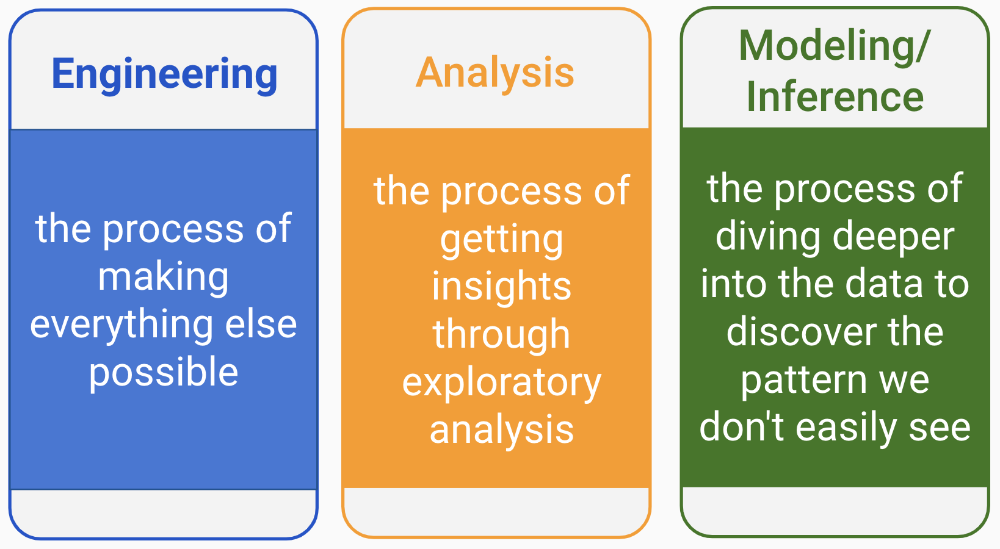
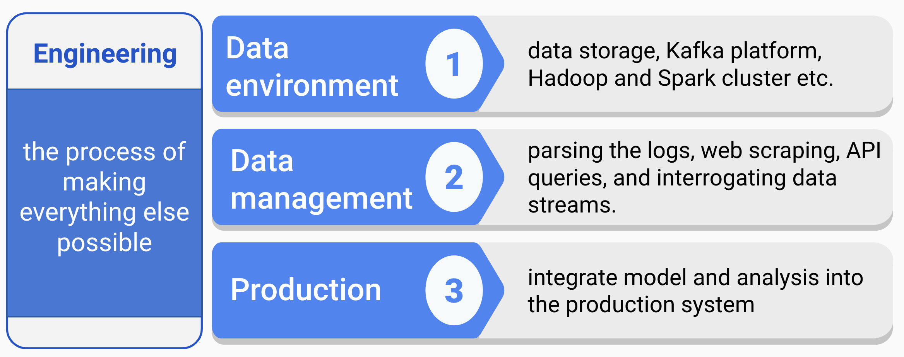
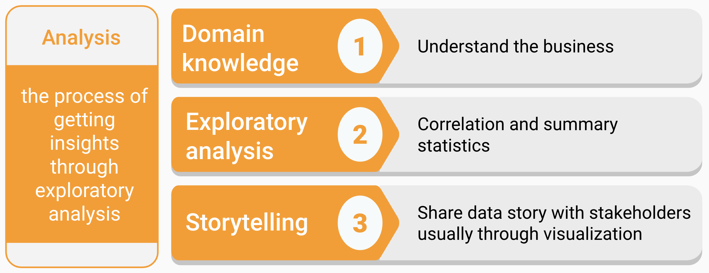
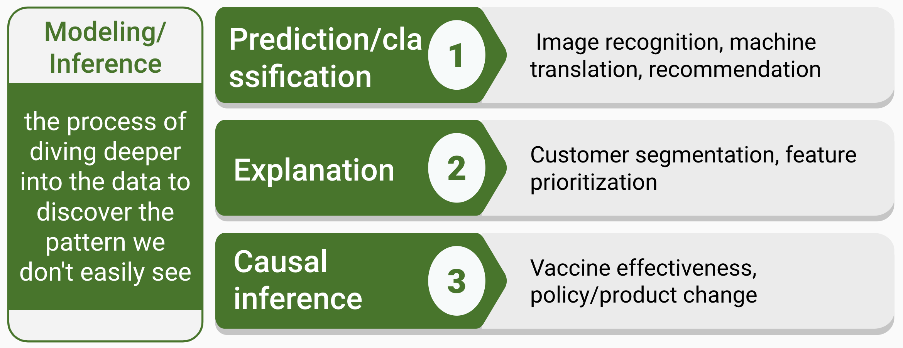
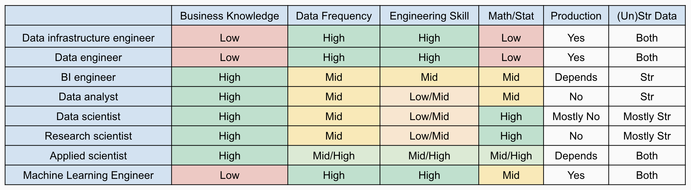
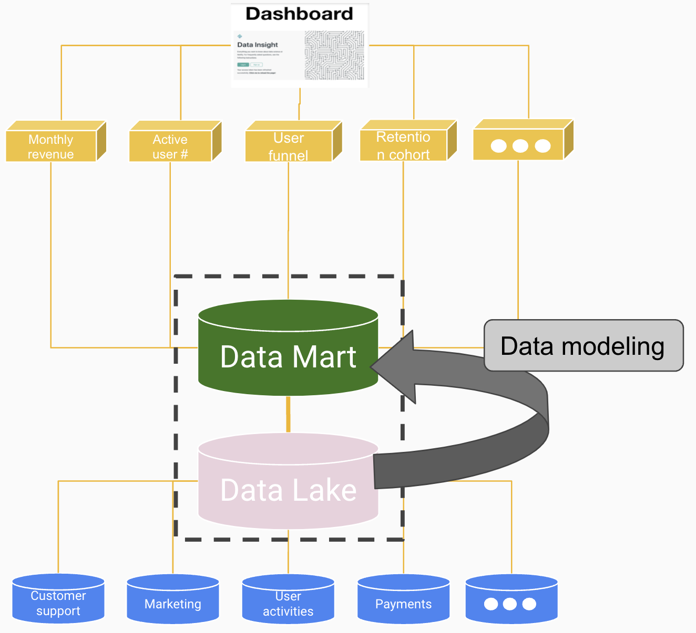

\mainmatter

# Introduction

Data science is a rapidly evolving field. This chapter will explore various aspects of data science. We will discuss the various career paths and skills needed for data science, as well as the structure of a data science team. We will focus on the demand of data science from a business and industrial perspective. We hope this chapter will provide a complementary perspective to other data sciences books.

## A Brief History of Data Science

Interest in data science-related careers is witnessing unprecedented growth and has seen a surge in popularity over the last few years. Data scientists come from a variety of backgrounds and disciplines, making it difficult to provide a concise answer when asked what data science is all about. Data science is a widely discussed topic, yet few can accurately define it.

Media has been hyping about "Data Science," "Big Data", and "Artificial Intelligence" over the past few years. There is an amusing statement from the internet:

> “When you’re fundraising, it’s AI. When you’re hiring, it’s ML. When you’re implementing, it’s logistic regression.”

For outsiders, data science is the magic that can extract useful information from data. Everyone is familiar with the concept of big data. Data science trainees must now possess the skills to manage large data sets. These skills may include Hadoop, a system that uses Map/Reduce to process large data sets distributed across a cluster of computers or Spark, a system that builds on top of Hadoop to speed up the process by loading massive data sets into shared memory (RAM) across clusters with an additional suite of machine learning functions for big data. 

The new skills are essential for dealing with large data sets beyond a single computer's memory or hard disk and the large-scale cluster computing. However, they are not necessary for deriving meaningful insights from data.. However, they are not necessary for deriving meaningful insights from data.

A lot of data means more sophisticated tinkering with computers, especially a cluster of computers. The computing and programming skills to handle big data were the biggest hurdle for traditional analysis practitioners to be a successful data scientist. However, this barrier has been significantly lowered thanks to the cloud computing revolution, as discussed in Chapter 2. After all, it isn't the size of the data that's important, but what you do with it. You may be feeling a mix of skepticism and confusion. We understand; we had the same reaction.

To declutter, let's start with a brief history of data science. If you search on Google Trends, which shows search keyword information over time, the term "data science" dates back further than 2004. Media coverage may give the impression that machine learning algorithms are a recent invention and that there was no "big" data before Google. However, this is not true. While there are new and exciting developments in data science, many of the techniques we use are based on decades of work by statisticians, computer scientists, mathematicians, and scientists from a variety of other fields.

In the early 19th century, Legendre and Gauss came up with the least squares method for linear regression \index{linear regression}. At the time, it was mainly used by physicists to fit their data. Nowadays, nearly anyone can build linear regression models using spreadsheet with just a little bit of self-guided online training. 

In 1936, Fisher came up with linear discriminant analysis. In the 1940s, logistic regression \index{logistic regression} became a widely used model. Then, in the 1970s, Nelder and Wedderburn formulated the "generalized linear mode (GLM)\index{generalized linear model}\index{GLM}" which:

> "generalized linear regression by allowing the linear model to be related to the response variable via a link function and by allowing the magnitude of the variance of each measurement to be a function of its predicted value." [from Wikipedia]

<!-- 2023-02-24 -->
By the end of the 1970s, a variety of models existed, most of them were linear due to the limited computing power available at the time. Non-linear models weren't able to be fitted until the 1980s.

In 1984, Breiman introduced the Classification and Regression Tree (CART) \index{classification and regression tree}\index{CART}, one of the oldest and most widely used classification and regression techniques [@Breiman1984].

After that, Ross Quinlan developed tree algorithms such as ID3, C4.5, and C5.0. In the 1990s, ensemble techniques, which combine the predictions of many models, began to emerge. Bagging is a general approach that uses bootstrapping in conjunction with regression or classification models to construct an ensemble. Based on the ensemble idea, Breiman came up with the random forest \index{random forest} model in 2001 [@Breiman2001]. In the same year, Leo Breiman published a paper “Statistical Modeling: The Two Cultures” [@Breiman2001TwoCulture], in which he identified two cultures in the use of statistical modeling to get information from data:

(1)  Data is from a given stochastic data model
(2)  Data mechanism is unknown and people approach the data using algorithmic model

Most of the classical statistical models are the first type of stochastic data model. Black-box models, such as random forest, GBM, and deep learning \index{random forest} \index{GBM} \index{deep learning}, are algorithmic models. As Breiman pointed out, algorithmic models can be used on large complex data as a more accurate and informative alternative to stochastic data modeling on smaller data sets. Those algorithms have developed rapidly with much-expanded applications in fields outside traditional statistics. That is one of the most important reasons that statisticians are not in the mainstream of today's data science, both in theory and practice. We observe that Python is passing R as the most commonly used language in data science, mainly due to many data scientists' background. Since 2000, the approaches to getting information out of data have shifted from traditional statistical models to a more diverse toolbox that includes machine learning and deep learning models. To help readers who are traditional data practitioners, we provide both R and Python codes.

What is the driving force behind the shifting trend? John Tukey identified four forces driving data analysis (there was no “data science” when this was written in 1962):

1. The formal theories of math and statistics
1. Acceleration of developments in computers and display devices
1. The challenge, in many fields, of more and ever larger bodies of data
1. The emphasis on quantification in an ever-wider variety of disciplines

Tukey's 1962 list is surprisingly modern. Let's inspect those points in today's context. People usually develop theories way before they find potential applications. In the past 50 years, statisticians, mathematicians, and computer scientists have laid the theoretical groundwork for constructing "data science" today. The development of computers enables us to apply the algorithmic models (which can be very computationally expensive) and deliver results in a friendly and intuitive way. The transition to the internet and the internet of things generates vast amounts of commercial data. Industries have also sensed the value of exploiting that data. Data science seems sure to be a significant preoccupation of commercial life in the coming decades. All the four forces John identified exist today and have been driving data science.

The applications have been expanding fast, benefiting from the increasing availability of digitized information and the possibility of distributing it through the internet. Today, people apply data science in many areas, including business, health, biology, social science, politics, etc. Now data science is everywhere. But what is today's data science?

## Data science role and skill tracks

There is a widely diffused Chinese parable about a group of blind men conceptualizing what the elephant is like by touching it. The first person, whose hand landed on the trunk, said: "This being is like a thick snake." For another one whose hand reached its ear, it seemed like a fan. Another person whose hand was upon its leg said the elephant is a pillar-like tree trunk. The blind man who placed his hand upon its side said: "elephant is a wall." Another who felt its tail described it as a rope. The last felt its tusk, stating the elephant is hard, smooth like a spear.

Data science is the elephant. With the data science hype picking upstream, many professionals changed their titles to be "Data Scientist" without any necessary qualifications. Today's data scientists have vastly different backgrounds, yet each conceptualizes the elephant based on his/her professional training and application area. And to make matters worse, most of us are not even fully aware of our conceptualizations, much less the uniqueness of the experience from which they are derived.

> "We don’t see things as they are, we see them as we are. [by Anais Nin]"

So, the answer to the question "what is data science?" depends on who you are talking to.  Data science has three main skill tracks (figure \@ref(fig:threetracks)): engineering, analysis, and modeling/inference (and yes, the order matters!).

```{r threetracks, fig.cap = "Three tracks of data science", out.width="80%", fig.asp=.75, fig.align="center", echo = FALSE}

```

There are some representative skills in each track. Different tracks and combinations of tracks will define different roles in data science. ^[This is based on "Industry recommendations for academic data science programs: https://github.com/brohrer/academic_advisory". It is a collection of thoughts of different data scientist across industries about what a data scientist does, and what differentiates an exceptional data scientist.]

When people talk about all the machine learning and AI algorithms, they often overlook the critical data engineering part that makes everything possible. Data engineering is the unseen iceberg under the water surface. Does your company need a data scientist? You are not ready for a data scientist if you don't have a data engineer yet. You need to have the ability to get data before making sense of it. If you only deal with small datasets with formatted data, you may be able to get by with plain text files such as CSV (i.e., comma-separated values) or even spreadsheet. As the data increasing in volume, variety, and velocity, data engineering becomes a sophisticated discipline in its own right.

### Engineering

Data engineering is the foundation that makes everything else possible (figure \@ref(fig:track1engineering)). It mainly involves in building the data pipeline infrastructure. In the (not that) old days, when data was stored on local servers, computers, or other devices, building the data infrastructure as a massive IT project. It involved the software, hardware for servers to store the data and the ETL \index{ETL} (i.e., extract, transform, and load \index{extract, transform, and load}) process. With cloud development, the new norm to store and compute data is on the cloud. Data engineering today, at its core, is software engineering with data flow as the focus. The fundamental building block for automation is maintaining the data pipeline through modular, well-commented code and version control.

```{r track1engineering, fig.cap = "Engineering track", out.width="80%", fig.asp=.75, fig.align="center", echo = FALSE}

```

(1) Data environment

Designing and setting up the entire environment to support data science workflow is the prerequisite for data science projects. It may include setting up storage in the cloud, Kafka \index{Kafka} platform, Hadoop \index{Hadoop} and Spark \index{Spark} clusters, etc. Each company has a unique data condition and need. The data environment will be different depending on the size of the data, update frequency, the complexity of analytics, compatibility with the back-end infrastructure, and (of course) budget.

(2) Data management  

Automated data collection is a common task that includes parsing the logs (depending on the stage of the company and the type of industry you are in), web scraping, API queries, and interrogating data streams. Data management includes constructing data schema to support analytics and modeling needs, and ensuring data is correct, standardized, and documented.

(3) Production

If you want to integrate the model or analysis into the production system, you have to automate all data handling steps. It involves the whole pipeline from data access, preprocessing, modeling to final deployment. It is necessary to make the system work smoothly with all existing software stacks. So, it requires monitoring the system through some robust measures, such as rigorous error handling, fault tolerance, and graceful degradation to make sure the system is running smoothly and users are happy.

### Analysis

Analysis turns raw information into insights in a fast and often exploratory way. In general, an analyst needs to have decent domain knowledge, do exploratory analysis efficiently, and present the results using storytelling (figure \@ref(fig:track2analysis)).

```{r track2analysis, fig.cap = "Analysis track", out.width="80%", fig.asp=.75, fig.align="center", echo = FALSE}

```

(1) Domain knowledge

Domain knowledge is the understanding of the organization or industry where you apply data science. You can’t make sense of data without context. Some questions about the context are:

- What are the critical metrics for this kind of business?
- What are the business questions?
- What type of data do they have, and what does the data represent?
- How to translate a business need to a data problem?
- What has been tried before, and with what results?
- What are the accuracy-cost-time trade-offs?
- How can things fail?
- What are other factors not accounted for?
- What are the reasonable assumptions, and what are faulty?

Domain knowledge helps you to deliver the results in an audience-friendly way with the right solution to the right problem.

(2) Exploratory analysis

This type of analysis is about exploration and discovery. Rigorous conclusions are not the primary driver, which means the goal is to get insights driven by correlation, not causation. The latter one requires more advanced statistical skills and hence more time and resource expensive. Instead, this role will help your team look at as much data as possible so that the decision-makers can get a sense of what’s worth further pursuing. It often involves different ways to slice and aggregate data. An important thing to note here is that you should be careful not to get a conclusion beyond the data. You don’t need to write production-level robust codes to perform well in this role.

(3) Storytelling

Storytelling with data is critical to deliver insights and drive better decision making. It is the art of telling people what the numbers signify. It usually requires data summarization, aggregation, and visualization. It is crucial to answering the following questions before you begin down the path of creating a data story.

- Who is your audience?
- What do you want your audience to know or do?
- How can you use data to help make your point?

A business-friendly report or an interactive dashboard is the typical outcome of the analysis.   

### Modeling/inference

Modeling/inference is a process that dives deeper into the data to discover patterns that are not easily seen. It may be the most misunderstood track. When the general public thinks about data science, the first thing that comes to mind might be fancy machine learning models. Despite the overrepresentation of machine learning in the public's mind, the truth is that you don't have to use machine learning to be a data scientist. Even data scientists who use machine learning in their work spend less than 20% of their time working on machine learning. They spend most of their time communicating with different stakeholders and collecting and cleaning data.

This track mainly focuses on three problems: 1) prediction, 2) explanation, and 3) causal inference (figure \@ref(fig:track3modeling))).

Prediction focuses on predicting based on what has happened, and understanding each variable's role is not a concern. Many black-box models, such as ensemble methods and deep learning, are often used to make a prediction. Examples of problems are image recognition, machine translation, and recommendation. Despite the remarkable success of many deep-learning models, they operate almost entirely in an associational mode. As Judea Pearl pointed out in his book "The book of why" [@Judea2019], complex black-box algorithms like AlphaGo "do not really know why it works, only that it does." Judea Pearl came up with a Ladder of Causation [@Judea2019] with three levels: 1) association, 2) intervention, and 3) counterfactuals. According to this framework, prediction problems are on the first level.

The next level of the ladder, intervention, requires model interpretability. Questions on this level involve not just seeing but changing. The question pattern is like, "what happens if I do ...?" For example, product managers often need to prioritize a list of features by user preference. They need to know what happens if we build feature a instead of feature b. Choice modeling is a standard method for this problem which allows you to explain the drivers behind users' decisions on using/purchasing a product. Another way to directly study the result of an intervention is through experiments. Tech companies constantly perform A/B tests to examine what happens if they make some product change. 

Causal inference is on the third level, which is counterfactual. When an experiment is not possible, and the cost of a wrong decision is too high, you need to use the existing data to answer a counterfactual question: "what would have happened if I went back in time and took a different approach?" For example, if you are a policymaker who wants to find a way to reduce the divorce rate in the United States, you see from the data the southern states have a higher divorce rate and a lower median age at marriage. You may assume that getting married when you are young leads to a higher chance of divorce. But it is impossible to experiment by randomly selecting a group of people and asking them to get married earlier and the other group to get married later as a control. In this case, you must find a way to match samples or create a balanced pseudo-population. This type of problem is out of the scope of this book. An excellent non-technical introduction to causal inference is “The book of why” [@Judea2019].


```{r track3modeling, fig.cap = "Modeling/inference track", out.width="80%", fig.asp=.75, fig.align="center", echo = FALSE}

```

If we look at this track through the lens of the technical methods used, there are three types.

(1) Supervised learning

In supervised learning, each sample corresponds to a response measurement. There are two flavors of supervised learning: regression and classification. In regression, the response is a real number, such as the total net sales in 2017 for a company or the yield of wheat next year for a state. The goal for regression is to approximate the response measurement. In classification, the response is a class label, such as a dichotomous response of yes/no. The response can also have more than two categories, such as four segments of customers. A supervised learning model is a function that maps some input variables (X) with corresponding parameters (beta) to a response (y). The modeling process is to adjust the value of parameters to make the mapping fit the given response. In other words, it is to minimize the discrepancy between given responses and the model output. When the response y is a real value number, it is intuitive to define discrepancy as the squared difference between model output and the response. When y is categorical, there are other ways to measure the difference, such as the area under the receiver operating characteristic curve (i.e., AUC) or information gain.

(2) Unsupervised learning

In unsupervised learning, there is no response variable. For a long time, the machine learning community overlooked unsupervised learning except clustering. Moreover, many researchers thought that clustering was the only form of unsupervised learning. One reason is that it is hard to define the goal of unsupervised learning explicitly. Unsupervised learning can be used to do the following:

- Identify a good internal representation or pattern of the input that is useful for subsequent supervised or reinforcement learning, such as finding clusters;

- It is a dimension reduction tool that provides compact, low dimensional representations of the input, such as factor analysis.

- Provide a reduced number of uncorrelated learned features from original variables, such as principal component regression.

(3) Customized model development

In most cases, after a business problem is fully translated into a data science problem, a data scientist needs to use out of the box algorithms to solve the problem with the right data. But in some situations, there isn't enough data to use any machine learning model, or the question doesn't fit neatly in the specifications of existing tools, or the model needs to incorporate some prior domain knowledge. A data scientist may need to develop new models to accommodate the subtleties of the problem at hand. For example, people may use Bayesian models to include domain knowledge as the modeling process's prior distribution.

Here is a list of questions that can help you decide the type of technique to use:

- Is your data labeled? It is straightforward since supervised learning needs labeled data.

- Do you want to deploy your model at scale? There is a fundamental difference between building and deploying models. It is like the difference between making bread and making a bread machine. One is a baker who will mix and bake ingredients according to recipes to make a variety of bread. One is a machine builder who builds a machine to automate the process and produce bread at scale.

- Is your data easy to collect? One of the major sources of cost in deploying machine learning is collecting, preparing, and cleaning the data. Because model maintenance includes continuously collecting data to keep the model updated. If the data collection process requires too much human labor, the maintenance cost can be too high.

- Does your problem have a unique context? If so, you may not be able to find any off-the-shelf method that can directly apply to your question and need to customize the model.

**What others?**

There are some common skills to have, regardless of the role people have in data science.

- **Data Preprocessing: the process nobody wants to go through yet nobody can avoid**

No matter what role you hold in the data science team, you will have to do some data cleaning, which tends to be the least enjoyable part of anyone’s job. Data preprocessing is the process of converting raw data into clean data.

(1) Data preprocessing for data engineer

Getting data from different sources and dumping them into a data lake.  A data lake is a storage repository that stores a vast amount of raw data in its native format, including XML, JSON, CSV, Parquet, etc. It is a data cesspool rather than a data lake. The data engineer’s job is to get a clean schema out of the data lake by transforming and formatting the data. Some common problems to resolve are:

* Enforce new tables' schema to be the desired one
* Repair broken records in newly inserted data
* Aggregate the data to form the tables with a proper granularity

(2) Data preprocessing for data analyst and scientist

Not just for a data engineer, preprocessing also occupies a large portion of data analyst and scientist’s working hours. A facility and a willingness to do these tasks are a prerequisite for a good data scientist. If you are lucky as a data scientist, you may end up spending 50% of your time doing this. If you are like most of us, you will probably spend over 80% of your working hours wrangling data.

The data a data scientist gets can still be very rough even if it is from a nice and clean database that a data engineer sets up. For example, dates and times are notorious for having many representations and time zone ambiguity. You may also get market survey responses from your clients in an excel file where the table title could be multi-line, or the format does not meet the requirements, such as using 50% to represent the percentage rather than 0.5. In many cases, you need to set the data to be the right format before moving on to analysis.

Even the data is in the right format. There are other issues to solve before or during analysis and modeling. For example, variables can have missing values. Knowledge about the data collection process and what it will be used for is necessary to decide a way to handle the missing. Also, different models have different requirements for the data. For example, some models may require a consistent scale; some may be susceptible to outliers or collinearity; some may not be able to handle categorical variables, and so on. The modeler has to preprocess the data to make it proper for the specific model.

Most of the people in data science today focus on one of the tracks. A small number of people are experts on two tracks.

<!--
## What should data science do?

### Let's dream big

Here is my two points for the question:

* Make human better human by alleviating bounded rationality and minimize politics/emotion (rather than make machine more like human)
* Strive for the “democratization” of data as legally possible: empower everyone in the organization to acquire, process, and leverage data in a timely and efficient fashion

I know it is vague. Behold, I am going to explain more.  

It’s easy to pretend that you are data driven. But if you get into the mindset to collect and measure everything you can, and think about what the data you’ve collected means, you’ll be ahead of most of the organizations that claim to be data driven. If you know the difference between "data driven" and "data confirmed", you'll be sailing at the right direction. What on earth is the difference?

Imagine that you are buying something online and you need to decide whether or not to trust the product without seeing it physically. You see the  average rating is 4.1 out of 5.0. Is this a good score? It depends on your subconscious decision. If you really need the thing, you may happily cheer "It is more than 4.0!". If you are still not sure whether you need it, you can't help to check the few low rating reviews and tell yourself "look at those 1-star reviews". Sounds familiar? Psychologists call it confirmation bias.

> Confirmation bias is the tendency to search for, interpret, favor, and recall information in a way that confirms one's preexisting beliefs or hypotheses [Wikipedia]

So if you use data to feel better (confirm) decisions/assumptions that are already made before you analyze the data, that is "data confirmed". A clear sign of confirmation bias is when you go back to tinker the definition of your metic because the current result is not impressive. However, this bias is not always easy to see. It is not only misleading but also expensive. Because it could take data science team days of toil to boil everything down to that magic number and put the result on the report.  Data scientists are not totally immune to the bias either. Good news is that there is antidote to confirmation bias.

Antidote 1: Do the brainstorming of data definition and set the goal in advance and resist temptation to move them later. In other words, the decision makers have to set decision criteria and the boundary up front in your data science project.  

Antidote 2: Data democratization. Keep in mind that data isn’t just for the professionals or a small group of people in the organization that are "key decision makers". Everyone should be able to get access to and look at the data (as much as legally possible). In that way, there will be more eyes on the decision.

The way data science can help is to provide a sound data framework and necessary training for the organization to access data with least amount of pain. Also be clear about the data definition and documentation. Data science holds the responsibility for data stewardship in the organization with high integrity. (there is data science for social good which is data science's responsibility for outside the organization but we are not going to discuss that here)

That is still very abstract, I hear you. Now, Let's be more specific...
-->

## What kind of questions can data science solve?

### Prerequisites

Data science is not a panacea, and there are problems data science can't help. It is best to make a judgment as early in the analytical cycle as possible. First and foremost, we need to tell customers, clients, and stakeholders honestly and clearly when we think data analytics can't answer their question after careful evaluation of the request, data availability, computation resources, and modeling details. Often, we can tell them what we can do as an alternative. It is essential to "negotiate" with others what data science can do specifically; simply answering "we cannot do what you want" will end the collaboration. Now let's see what kind of questions data science can solve:

1. The question needs to be specific enough

Let us look at the two examples below:

* Question 1:  How can I increase product sales?
* Question 2:  Is the new promotional tool introduced at the beginning of this year boosting the annual sales of P1197 in Iowa and Wisconsin? (P1197 is a corn seed product)

It is easy to see the difference between the two questions. Question 1 is grammatically correct, but it is not proper for data analysis to answer. Why? It is too general. What is the response variable here? Product sales? Which product? Is it annual sales or monthly sales? What are the candidate predictors? We nearly can't get any useful information from the questions.

In contrast, question 2 is much more specific. From the analysis point of view, the response variable is clearly "annual sales of P1197 in Iowa and Wisconsin". Even if we don't know all the predictors, the variable of interest is "the new promotional tool introduced early this year." We want to study the impact of the promotion on sales. We can start there and figure out other variables that need to be included in the model.

As a data scientist, we may start with general questions from customers, clients, or stakeholders and eventually get to more specific and data science solvable questions with a series of communication, evaluation, and negotiation. Effective communication and in-depth knowledge about the business problems are essential to converting a general business question into a solvable analytical problem. Domain knowledge helps data scientists communicate using the language other people can understand and obtain the required context.

Defining the question and variables involved won't guarantee that we can answer it. For example, we could encounter this situation with a well-defined supply chain problem. The client may ask us to estimate the stock needed for a product in a particular area. Why can't this question be answered? We can try to fit various models such as a Multivariate Adaptive Regression Spline (MARS) model and find a reasonable solution from a modeling perspective. But it can turn out later that the client's data is an estimated value, not the actual observation. There is no good way for data science to solve the problem with the desired accuracy with inaccurate data.

2.  You need to have accurate and relevant data

One cannot make a silk purse out of a sow's ear. Data scientists relevant and accurate data. The supply problem mentioned above is a case in point. There was relevant data, but not sound. All the later analytics based on that data was a building on sand. Of course, data nearly almost have noise, but it has to be in a certain range. Generally speaking, the accuracy requirement for the independent variables of interest and response variable is higher than others. For the above question 2, it is variables related to the "new promotion" and "sales of P1197".

The data has to be helpful for the question. If we want to predict which product consumers are most likely to buy in the next three months, we need to have historical purchasing data: the last buying time, the amount of invoice, coupons, etc. Information about customers' credit card numbers, ID numbers, and email addresses will not help much.

Often, the data quality is more important than the quantity, but you can not completely overlook quantity. Suppose you can guarantee data quality, even then the more data, the better. If we have a specific and reasonable question with sound and relevant data, then congratulations, we can start playing data science!

### Problem type

Many of the data science books classify various models from a technical point of view. Such as supervised vs. unsupervised models, linear vs. nonlinear models, parametric models vs. non-parametric models, and so on. Here we will continue on a "problem-oriented" track. We first introduce different groups of real-world problems and then present which models can answer the corresponding category of questions.

1. Description

The primary analytic problem is to summarize and explore a data set with descriptive statistics (mean, standard deviation, and so forth) and visualization methods. It is the most straightforward problem and yet the most crucial and common one. We will need to describe and explore the dataset before moving on to a more complex analysis. For problems such as customer segmentation, after we cluster the sample, the next step is to figure out each class's profile by comparing the descriptive statistics of various variables. Questions of this kind are:

* What is the annual income distribution?
* Are there any outliers?
* What are the mean active days of different accounts?

Data description is often used to check data, find the appropriate data preprocessing method, and demonstrate the model results.

2. Comparison

The first common modeling problem is to compare different groups. Is A better in some way than B? Or more comparisons: Is there any difference among A, B, and C in a particular aspect? Here are some examples:

* Are males more inclined to buy our products than females?
* Are there any differences in customer satisfaction in different business districts?
* Do soybean carrying a particular gene have higher oil content?

For those problems, it usually starts with some summary statistics and visualization by groups. After a preliminary visualization, you can test the differences between the treatment and control groups statistically.  The commonly used statistical tests are chi-square test, t-test, and ANOVA. There are also methods using Bayesian methods. In the biology industry, such as new drug development, crop breeding, fixed/random/mixed effect models are standard techniques.

3. Clustering

Clustering is a widespread problem, and it can answer questions like:

* How many reasonable customer segments are there based on historical purchase patterns?
* How are the customer segments different from each other?

Please note that clustering is unsupervised learning; there are no response variables. The most common clustering algorithms include K-Means and Hierarchical Clustering.

4. Classification

For classification problems, there are one or more label columns to define the ground truth of classes. We use other features of the training dataset as explanatory variables for model training. We can use the trained classifier to predict the labels of a new observation. Here are some example questions:

* Will this customer likely to buy our product?
* Is the borrower going to pay us back?
* Is it spam email or not?

There are hundreds of different classifiers. In practice, we do not need to try all the models but several models that perform well generally. For example, the random forest algorithm is usually used as the baseline model to set model performance expectations.

5. Regression

In general, regression deals with a question like "how much is it?" and return a numerical answer. It is necessary to coerce the model results to be 0 or round it to the nearest integer in some cases. It is still the most common problem in the data science world.

* What will be the temperature tomorrow?
* What is the projected net income for the next season?
* How much inventory should we have?

6. Optimization

Optimization is another common type of problems in data science to find an optimal solution by tuning a few tune-able variables with other non-controllable environmental variables. It is an expansion of comparison problem and can solve problems such as:

* What is the best route to deliver the packages?
* What is the optimal advertisement strategy to promote a new product?

## Structure of data science team

A vast amount of data has become available and readily accessible for analysis in many companies across different business sectors during the past decade. The size, complexity, and speed of increment of data suddenly beyond the traditional scope of statistical analysis or business intelligence (i.e., BI) reporting. To leverage the big data collected, do you need an internal data science team to be a core competency, or can you outsource it? The answer depends on the problems you want to solve using data. If they are critical to the business, you can't afford to outsource it. Also, each company has its business context, and it needs new kinds of data as the business grows and uses the results in novel ways. Being a data-driven organization requires cross-organization commitments to identify what data each department needs to collect, establish the infrastructure and process for collecting and maintaining that data, and standardize how to deliver analytical results. Unfortunately, it is unlikely that an off-the-shelf solution will be flexible enough to adapt to the specific business context. In general, most of the companies establish their data science team.

Where should the data science team fit? In general, the data science team is organized in three ways.

(1) A standalone team

Data science is an autonomous unit parallel to the other organizations (such as engineering, product, etc.). The head of data science reports directly to senior leadership, ideally to the CEO or at least someone who understands data strategy and is willing to invest and give it what it needs. The advantages of this type of data organization are:

- The data science team has autonomy and is well-positioned to tackle whatever problems it deems important to the company.
- It is advantageous for people in the data science team to share knowledge and grow professionally.
- It provides a clear career path for data science professionals and shows the company treats data as a first-class asset. So, it tends to attract and retain top talent people.

The biggest concern of this type of organization is the risk of marginalization. Data science only has value if data drives action, which requires collaboration among data scientists, engineers, product managers, and other business stakeholders across the organization. Suppose you have a standalone data science team. It is critical to choose a data science leader who is knowledgeable about the applications of data science in different areas and has strong inter-discipline communication skills. The head of data science needs to build a strong collaboration with other departments.

As companies grow, each department prefers to be self-sufficient and tries to hire its data personal under different titles even when they can get support from the standalone data science team. That is why it is unlikely for an already mature company to have a standalone data science team. If you start your data science team in the early stage as a startup, it is important that the CEO sets a clear vision from the beginning and sends out a strong message to the whole company about accessing data support.

(2) An embedded model

There is still a head of data science, but his/her role is mostly a hiring manager and coach, and he/she may report to a senior manager in the engineering department. The data science team brings in talented people and farms them out to the rest of the company. In other words, it gives up autonomy to ensure utility. The advantages are:

- Data science is closer to its applications.
- There is still a data science group, so it is easy to share knowledge.
- It has high flexibility to allocate data science resources across the company.

However, there are also concerns.

- It brings difficulty to the management since the designated team's lead is not responsible for data science professionals' growth and happiness. In contrast, data science managers are not directly vested in their work.
- Data scientists are second-class citizens everywhere, and it is hard to attract and retain top talent.

(3) Integrated team

There is no data science team. Each team hires its data science people. For example, a marketing analytics group consists of a data engineer, data analyst, and data scientist. The team leader is a marketing manager who has an analytical mind and in-depth business knowledge. The advantages are apparent.

- Data science resource aligns with the organization very well.
- Data science professionals are first-class members and valued in their team. The manager is responsible for data science professionals' growth and happiness.
- The insights from the data are quickly put into action.

It works well in the short term for both the company and the data science hires. However, there are also many concerns.

- It sacrifices data science hires' professional growth since they work in silos and specialize in a specific application. It is also difficult to share knowledge across different applied areas.
- It is harder to move people around since they are highly associated with a specific organization's specific function.
- There is no career path for data science people, and it is difficult to retain talent.

There is no universal answer to the best way to organize the data science team. It depends on the answer to many other questions. How important do you think the data science team is for your company? What is the stage of your company when you start to build a data science team? Are you a startup or a relatively mature company? How valuable it is to use data to tell the truth, how dangerous it is to use data to affirm existing opinions.

Data science has its skillset, workflow, tooling, integration process, and culture. If it is critical to your organization, it is best not to bury it under any part of the organization. Otherwise, data science will only serve the need for a specific branch. No matter which way you choose, be aware of both sides of the coin. If you are looking for a data science position, it is crucial to know where the data science team fits.

## Data science roles

As companies learn about using data to help with the business, there is a continuous specialization of different data science roles. As a result, the old "data scientist" title is fading, and some other data science job titles are emerging. In the past, misunderstanding data science's fundamental work led to confusing job postings and frustrations for stakeholders and data scientists. Stakeholders were frustrated that they weren't getting what they expected, and data scientists were frustrated that the company didn't appreciate their talent. 

On the one hand, the competitive hiring market has pushed organizations to have a streamlined and transparent interview process. They must clarify the role and responsibilities, tool usage, and daily work for the candidates to understand what the role entails. Role clarity is critical for building a career path and retaining data science talents. As a result, we are glad to see the job definition **within an organization** has improved dramatically. 

On the other hand, however, there is **title inconsistency across different companies or industries**, especially for the analytical roles (i.e., data analysts and data scientists). An analyst at one company may be close to a data scientist at another company. 

The following table shows a list of data science job titles. Some are relatively new, and others have been around for some time but are now well-defined. In the rest of this section, we will illustrate different data science roles, backgrounds, and required skills in general. The title and profile combination in the following text may not represent the truth of a particular company. You may find the description of a role under a different title.  


| Role  |Skills  |
|---|---|
| Data infrastructure engineer  |  Go, Python, AWS/Google Cloud/Azure, logstash, Kafka, and Hadoop |
| Data engineer  |  spark/scala, python, SQL, AWS/Google Cloud/Azure, Data modeling |
| BI engineer  | Tableau/looker/Mode, etc., data visualization, SQL, Python  |
| Data analyst | SQL, basic statistics, data visualization |
| Data scientist |  R/Python, SQL, basic applied statistics, data visualization, experimental design |
| Research scientist | R/Python, advanced statistics, experimental design, ML, research background, publications, conference contributions, algorithms |
| Applied scientist | ML algorithm design, often with an expectation of fundamental software engineering skills |
| Machine Learning Engineer | More advanced software engineering skillset, algorithms, machine learning algorithm design, system design |

The above table shows some data science roles and common technical keywords in job descriptions. Those roles are different in the following key aspects:

- How much business knowledge is required?
- Does it need to deploy code in the production environment?
- How frequently is data updated?
- How much engineering skill is required?
- How much math/stat knowledge is needed?
- Does the role work with structured or unstructured data?



Data infrastructure engineers work at the beginning of the data pipeline. They are software engineers who work in the production system and usually handle high-frequency data. They are responsible for bringing data of different forms and formats and ensuring data comes in smoothly and correctly. They work directly with other engineers (for example, data engineers and backend engineers). They typically don't need to know the data's business context or how data scientists will use it. For example, integrate the company's services with AWS/GCP/Azure services and set up an Apache Kafka environment to stream the events. 

People call a storage repository with vast raw data in its native format (XML, JSON, CSV, Parquet, etc.) a **data lake** (figure \@ref(fig:databases)). As the number of data sources multiplies, having data scattered in various formats prevents the organization from using the data to help with business decisions or building products. That is when data engineers come to help.

Data engineers transform, clean, and organize the data from the data lake. They commonly design schemas, store data in query-able forms, and build and maintain data warehouses. People call this cleaner and better-organized database **data mart** (figure \@ref(fig:databases)) which contains a subset of data for business needs. They use technologies like Hadoop/Spark and SQL. Since the database is for non-engineers, data engineers need to know more about the business and how analytical personnel uses the data. Some may have a basic understanding of machine learning to deploy models developed by data/research scientists.

```{r databases, fig.cap = "Data lake (a focused version of a data warehouse that contains a subset of data for business needs) and data mart (a storage repository that cheaply stores a vast amount of raw data in its native format (XML, JSON, CSV, Parquet, etc))", out.width="100%", fig.asp=.75, fig.align="center", echo = FALSE}

```

Business intelligence (BI) engineers and data analysts are close to the business, so they need to know the business context well. The critical difference is that BI engineers build automated dashboards, so they are engineers. They are usually experts in SQL and have the engineering skill to write production-level code to construct the later steam data pipeline and automate their work. Data analysts are technical but not engineers. They analyze ad hoc data and deliver the results through presentations. The data is, most of the time, structured. They need to know coding basics (SQL or R/Python), but they rarely need to write production-level code. This role was mixed with "data scientist" by many companies but is now much better refined in mature companies.

The most significant difference between a data analyst and a data scientist is the requirement of mathematics and statistics. Most data scientists have a quantitative background and do A/B experiments and sometimes machine learning models. Data analysts usually don't need a quantitative background or an advanced degree. The analytics they do are primarily descriptive with visualizations. They mainly handle structured and ad hoc data.

Research scientists are experts who have a research background. They do rigorous analysis and make causal inferences by framing experiments and developing hypotheses, and proving whether they are true or not. They are researchers that can create new models and publish peer-reviewed papers. Most of the small/mid companies don't have this role.

Applied scientist is the role that aims to fill the gap between data/research scientists and data engineers. They have a decent scientific background but are also experts in applying their knowledge and implementing solutions at scale. They have a different focus than research scientists. Instead of scientific discovery, they focus on real-life applications. They usually need to pass a coding bar.

In the past, some data scientist roles encapsulated statistics, machine learning, and algorithmic knowledge, including taking models from proof of concept to production. However, more recently, some of these responsibilities are now more common in another role: machine learning engineer. Often larger companies may distinguish between data scientists and machine learning engineer roles. Machine learning engineer roles will deal more with the algorithmic and machine learning side and strongly emphasize software engineering. In contrast, data scientist roles will emphasize analytics (as with data analysts) and statistics, such as significance testing and causal inference.
