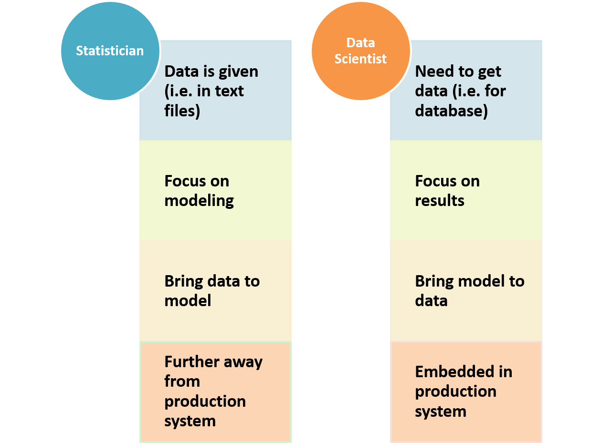
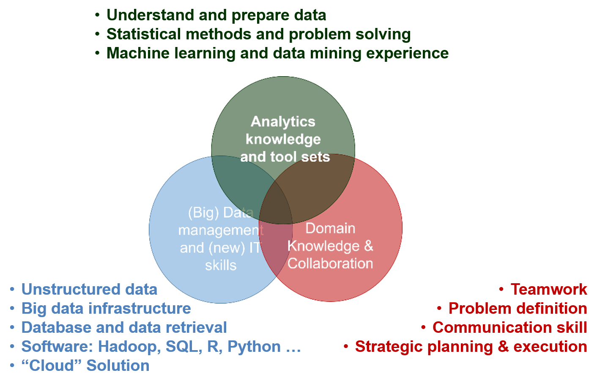

# Soft Skills for Data Scientists

## Comparison between Statistician and Data Scientist

Statistics as a scientific area can be traced back to 1749 and statistician as a career has been around for hundreds of years with well-established theory and application. Data Scientist becomes an attractive career for only a few years along with the fact that data size and variety beyond the traditional statistician’s toolbox and the fast-growing of computation power. Statistician and data scientist have a lot of in common, but there are also significant differences.

Both statistician and data scientist work closely with data. For the traditional statistician, the data is usually well-formatted text files with numbers and labels. The size of the data usually can be fitted in a PC’s memory. Comparing to statisticians, data scientists need to deal with more varieties of data: 

- well-formatted data stored in a database system with size much larger than a PC’s memory or hard-disk;
- huge amount of verbatim text, voice, image, and video;
- real-time streaming data and other types of records. 

One unique power of statistics is to make statistical inference based on a small set of data. Statisticians spend most of their time developing models and don't need to put too much effort on data cleaning. Today, data is relatively abundant, and modeling is only part of the overall effort, often a small part. Due to the active development of some open source communities, fitting models is not too far from button pushing. Data scientists instead spend lot of time preprocessing and wrangling the data before feeding them to the model. 

Different from statisticians, data scientists often focus on delivering actionable results and sometimes need to fit model on the cloud. The data can be too large to read in laptop.  From the entire problem-solving cycle, statisticians are usually not well integrated with the production system where data is obtained in real time; while data scientists are more embedded in the production system and closer to the data generation procedures.

## Beyond Data and Analytics

Data scientists usually have a good sense of data and analytics, but data scientist project is more than that. A data science project may involve people with different roles, especially in a big company:

- a business owner or leader to identify business value;
- program manager to ensure the data science project fits into the overall technical program development and coordinate all parties to set periodical tasks so that the project meets the preset milestones and results;
- data owner and computation resource and infrastructure owner from the IT department;
- dedicated team to make sure the data and model are under model governance and privacy guidelines;
- a team to implement, maintain and refresh the model;
- multiple rounds of discussion of resource allocation among groups (i.e., who pay for the data science project).

Effective communication and in-depth domain knowledge about the business problem are essential requirements for a successful data scientist. A data scientist may interact with people at various levels from senior leaders who set the corporate strategies to front-line employees who do the daily work. A data scientist needs to have the capability to view the problem from 10,000 feet above the ground, as well as down to the detail to the very bottom. To convert a business question into a data problem, a data scientist needs to communicate using the language the other people can understand and obtain the required information.

In the entire process of data science project defining, planning, executing and implementing, every step involves the data scientist to ensure people correctly define the business problem  and reasonably evaluate the business value and success. Corporates are investing heavily in data science and machine learning with a very high expectation of return. 

However, it is easy to set unrealistic goal and wrongly estimate the business impact. The data scientist lead should navigate the discussions to make sure the goal can be backed by data and analytics. Many data science projects over promise and are too optimistic on the timeline. These projects eventually fail by not delivering the preset business impact within the timeline. As data scientists, we need to identify these issues early in the stage and communicate with the entire team to make sure the project has a realistic deliverable and timeline. The data scientist team also need to work closely with data owners to identify relevant internal and external data source and evaluate the quality of the data; as well as working closely with the infrastructure team to understand the computation resources (i.e. hardware and software) available for the data science project.

## Three Pillars of Knowledge

(1) Analytics knowledge and tool sets

A successful data scientist needs to have a strong technical background in data mining, statistics and machine learning. The in-depth understanding of modeling with the insight about data enable a data scientist to convert a business problem to a data science problem.

(2) Domain knowledge and collaboration

A successful data scientist needs some domain knowledge to understand the business problem. For any data science project, the data scientist need to collaborate with other team members and effective communication and leadership skills are critical, especially when you are the only data person in the room and you need to decide with uncertainty.

(3) (Big) data management and (new) IT skills

The last pillar is about computation environment and model implementation in a big data platform. This used to be the most difficult one for a data scientist with statistics background (i.e. lack computer science or programming skills). The good news is that with the rise of cloud computation big data platform, it is easier for a statistician to overcome this barrier.

## Data Science Project Cycle

A data science project has various stages. Many textbooks and blogs focus on one or two specific stages and it is rare to see the end-to-end life cycle of data science projects. In fact, to get a good grasp of the end-to-end cycle requires many years of experience of doing real-world data science. We will share our opinions on that in this section. Seeing a holistic picture of the whole cycle helps you to better prepare for real-world applications.

### Types of Data Science Projects

People often use data science project to describe any project that uses data to solve a business problem, including traditional business analytics or data visualization. Here we limit our discussion of data science projects that involve data and some statistical or machine learning models. The business problem itself gives us the flavor of the project, data is the raw ingredient to start with, and the model makes the dish. Different types of data science projects can be determined by the types of data used and the final model development and implementation.

#### Offline and online Data

There are offline and online data. Offline data are historical archived data stored in databases or data warehouses. With the development of data storage, the cost to store a large amount of data is cheap and offline data are very rich in general (for example website may track and store each individual user's mouse position, click and typing information while the user is visiting the website). Offline data is usually stored in a distributed system and it can be extracted in batch as raw materials to create features that can be used in model training. Online data are real-time information that can be feed to models to make automatic actions. Real-time information can changes frequently such as the keywords a customer is searching for. Capturing and using real-time online data requires the integration of machine learning to the production infrastructure. It used to be a steep learning curve for data scientists, but the cloud infrastructure makes it much easier.

#### Offline training and offline application

This type of data science project is for a specific business problem which needs to be solved once or multiple times. But the dynamic nature of the business problem requires substantial work every time. One example of such a project is "whether a new workflow is going to improve efficiency." In this situation, we often use offline internal and external data, build models, and deliver the final results as a report to answer the specific business question. It is similar to the traditional business intelligence project but with more focus on data and model. Sometimes the data size and model complexity are beyond the capacity of a single computer. So you need to use distributed storage and computation. Since the model is based on the historical data and the output is a report, there is no need for real-time execution. Usually, there is no run-time constraint on the machine learning model unless the model is running beyond a reasonable time frame such as a few hours or a few days. We can call this type of data science project "offline training, offline application" project.

#### Offline training and online application

Another type of data science project is to use offline data for training and apply the trained model to real-time online data in the production environment. One example of such a project is "using historical data to train a personalized advertisement model, and then provides real-time ad recommendation when customers visit the website." The model is trained based on offline data, and then use a customer's online real-time data as features to run the model in real time to provide an automatic action. The model training is very similar to the "offline training, offline application" project, but as the trained model will be put to production, there are specific requirements such as features used in the offline training have to be available online in real time, and the online run-time of the model has to be short enough without impacting user experience. In most cases, data science projects in this category create continuous and scalable business value. We will use this type of data science project to describe the project cycle.

#### Online training and online application

For some business problems, it is so dynamic that even yesterday's data is out of date. For such cases, we can use online data to train the model and then applying it in real time. We call this type of data science project "online training, online application." This type of data science project requires high automation and low latency.

### At the Planning Stage

To ensure a successful data science project, a data-driven and fact-based planning stage is essential. With the recent big data and data science hype, there is a high demand for data science projects to create business value across different business sectors. Often times, these data science project proposals are initiated by the leaders of an organization. This top-down style data science projects usually have high visibility with certain human and computation resources pre-allocated. However, it is crucial to understand the business problem first and align the goal across different teams including 

(1) the business team which may include members from the business operation team, business analyst, insight and reporting team; 

(2) technology team which may include members from database and data warehouse team, data engineering team, infrastructure team, core machine learning team, and software development team; (3) project management team which may include program management team and product management team depending on the scope of the data science project.

 To start the conversation, we can ask the following questions to everyone in the team:

- What are the pain points in current business operation?
- What data are available and how is the quality and quantity of the data?
- What might be the most significant impacts of a data science project?
- Are there any negative impact to other teams?
- What computation resources are available for model training and model execution?
- Can we define key metrics to compare and quantity business value?
- Are there any data security, privacy and legal concerns?
- What are the desired milestones, check points and timeline?
- Is the final application online or offline?
- Are the data online or offline?

It is likely to have a series of intense meetings and heated discussions to frame the project to a reasonable scope. After the planning stage, we should be able to define a set of key metrics related to the project, identify some offline and online data sources, request needed computation resources, draft tentative timeline and milestones, and form a team of data scientist, data engineer, software developer, project manager and members from business operation.  Data scientists should play a major role in these discussions. If data scientist is not leading the data science project formulation, it is very likely the entire project will not reach the timeline and milestones.
