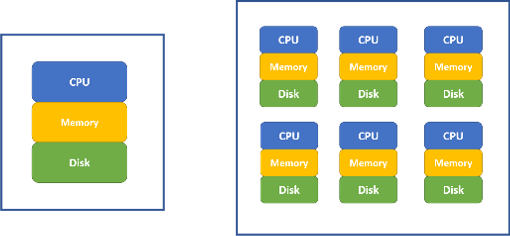

# Big Data Cloud Platform

## How Data Becomes Science?

Data has been statistician and analyst's friend for hundreds of years. Tabulated data are the most common format that we use daily. People used to store data on papers, tapes, diskettes, or hard drives. Only recently, with the development of computer hardware and software, the volume, variety, and speed of the data exceed the capacity of a traditional statistician or analyst. So using data becomes a science that focuses on the question: how can we store, access, process, analyze the massive amount of data and provide actionable insights? In the past few years, by utilizing commodity hardware and open-source software, people created a big data ecosystem for data storage, data retrieval, and parallel computation. Hadoop and Spark have become a popular platform that enables data scientist, statistician, and analyst to access the data and to build models. Programming skills in the big data platform have been an obstacle for a traditional statistician or analyst to become a successful data scientist. However, cloud computing reduces the difficulty significantly. The user interface of the data platform is much more friendly today, and people push mush of the technical details to the background. Today's cloud systems also enable quick implementation to the production environment. Now data science emphasizes more on the data itself, models and algorithms on top of the data, rather than the platform, infrastructure and low-level programming such as Java.

## Power of Cluster of Computers

We are familiar with our laptop/desktop computers which have three main components to do data computation: (1) Hard disk, (2) Memory, and (3) CPU.

The data and codes stored in the hard disk have specific features such as slow to read and write, and large capacity of around a few TB in today's market. Memory is fast to read and write but with small capacity in the order of a few dozens of GB in today's market. CPU is where all the computation happens.

```{r sparkcluster, fig.cap = "Single computer (left) and a cluster of computers (right)", out.width="80%", fig.asp=.75, fig.align="center", echo = FALSE}

```

For statistical software such as R, the amount of data it can process is limited by the computer's memory. The memory of computers before 2000 is less than 1 GB. The memory capacity grows way slower than the amount of the data. Now it is common that we need to analyze data far beyond the capacity of a single computer's memory, especially in an enterprise environment. Meanwhile, as the data size increases,  to solve the same problem (such as regressions), the computation time is growing faster than linear. Using a cluster of computers become a common way to solve a big data problem. In Figure \@ref(fig:sparkcluster)  (right), a cluster of computers can be viewed as one powerful machine with memory, hard disk and CPU equivalent to the sum of individual computers. It is common to have hundreds or even thousands of nodes for a cluster.


