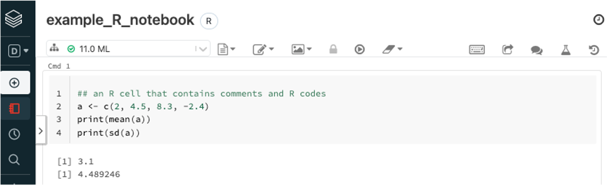

# Big Data Cloud Platform {#bigdatacloudplatform}

Data has been  a friend to statisticians and analysts' for hundreds of years. Tabulated data is the most common format used. People used to store data on papers, tapes, diskettes, or hard drives. Only recently, with the development of computer hardware and software, the volume, variety, and speed of the data exceed the capacity of a traditional statistician or analyst. So using data becomes a science that focuses on the question: how can we store, access, process, analyze the massive amount of data and provide actionable insights? In the past few years, by utilizing commodity hardware and open-source software, people created a big data ecosystem for data storage, data retrieval, and parallel computation. Hadoop and Spark have become a popular platform that enables data scientists, statisticians, and analysts to access the data and to build models. Programming skills in the big data platform have been an obstacle for a traditional statistician or analyst to become a successful data scientist. However, cloud computing reduces the difficulty significantly. The user interface of the data platform is much more friendly today, and people push much of the technical details to the background. Today's cloud systems also enable quick implementation of the production environment. Now data science emphasizes more on the data itself, models and algorithms on top of the data, rather than the platform, infrastructure and low-level programming such as Java.

## Power of Cluster of Computers

We are familiar with our laptop/desktop computers which have three main components to do data computation: (1) Hard disk, (2) Memory, and (3) CPU.

The data and codes stored in the hard disk have specific features such as slow to read and write, and large capacity of around a few TB in today's market. Memory is fast to read and write but with small capacity in the order of a few dozens of GB in today's market. CPU is where all the computation happens.

```{r sparkcluster, fig.cap = "Single computer (left) and a cluster of computers (right)", out.width="100%", fig.asp=.75, fig.align="center", echo = FALSE}
knitr::include_graphics("images/cluster.png")
```

For statistical software such as R, the amount of data it can process is limited by the computer's memory. The memory of computers before 2000 is less than 1 GB. The memory capacity grows way slower than the amount of the data. Now it is common that we need to analyze data far beyond the capacity of a single computer's memory, especially in an enterprise environment. Meanwhile, as the data size increases,  to solve the same problem (such as regressions), the computation time is growing faster than linear. Using a cluster of computers become a common way to solve a big data problem. In figure \@ref(fig:sparkcluster)  (right), a cluster of computers can be viewed as one powerful machine with memory, hard disk and CPU equivalent to the sum of individual computers. It is common to have hundreds or even thousands of nodes for a cluster.

In the past, users need to write code (such as MPI) to distribute data and do parallel computing.  Fortunately, with the recent new development, the cloud environment for big data analysis is more user-friendly. As data is often beyond the size of the hard disk, the dataset itself is stored across different nodes (i.e., the Hadoop system). When doing analysis, the data is distributed across different nodes, and algorithms are parallel to leverage corresponding nodes' CPUs to compute (i.e., the Spark system).

## Evolution of Cluster Computing

Using computer clusters to solve general-purpose data and analytics problems needs a lot of effort if we have to specifically control every element and steps such as data storage, memory allocation, and parallel computation. Fortunately, high tech companies and open source communities have developed the entire ecosystem based on Hadoop and Spark. Users need only to know high-level scripting languages such as Python and R to leverage computer clusters' distributed storage, memory and parallel computation power.

### Hadoop

The very first problem internet companies face is that a lot of data has been collected and how to better store these data for future analysis. Google developed its own file system to provide efficient, reliable access to data using large clusters of commodity hardware. The open-source version is known as Hadoop Distributed File System (HDFS). Both systems use Map-Reduce to allocate computation across computation nodes on top of the file system. Hadoop is written in Java and writing map-reduce job using Java is a direct way to interact with Hadoop which is not familiar to many in the data and analytics community. To help better use the Hadoop system, an SQL-like data warehouse system called Hive, and a scripting language for analytics interface called Pig were introduced for people with analytics background to interact with Hadoop system. Within Hive, we can create user-defined functions through R or Python to leverage the distributed and parallel computing infrastructure. Map-reduce on top of HDFS is the main concept of the Hadoop ecosystem. Each map-reduce operation requires retrieving data from hard disk, then performing the computation, and storing the result onto the disk again. So, jobs on top of Hadoop require a lot of disk operation which may slow down the entire computation process.

### Spark

Spark works on top of a distributed file system including HDFS with better data and analytics efficiency by leveraging in-memory operations. Spark is more tailored for data processing and analytics and the need to interact with Hadoop directly is greatly reduced. The spark system includes an SQL-like framework called Spark SQL and a parallel machine learning library called MLlib Fortunately for many in the analytics community, Spark also supports R and Python. We can interact with data stored in a distributed file system using parallel computing across nodes easily with R and Python through the Spark API and do not need to worry about lower-level details of distributed computing. We will introduce how to use an R notebook to drive Spark computations.

## Introduction of Cloud Environment {#CloudEnvironment}

Even though Spark provides a solution for big data analytics, the maintenance of the computing cluster and Spark system requires a dedicated team. Historically for each organization the IT departments own the hardware and the regular maintenance. It usually takes months for a new environment to be built and the cost is high. Luckily, the time to deployment and cost are dramatically down due to the cloud computation trend. Now we can create a Spark computing cluster in the cloud in a few minutes with the desired configuration and the user only pay when the cluster is up. Cloud computing environments enable smaller organizations to adopt big data analytics.

There are many cloud computing environments such as Amazon's AWS, Google cloud and Microsoft Azure which provide a complete list of functions for heavy-duty enterprise applications. For example, Netflix runs its business entirely on AWS without owning any data centers. For beginners, however, Databricks provides an easy to use cloud system for learning purposes. Databricks is a company founded by the creators of Apache Spark and it provides a user-friendly web-based notebook environment that can create a Spark cluster on the fly to run R/Python/Scala/SQL scripts. We will use Databricks' free community edition to run demos in this book. Please note, to help readers to get familiar with the Databricks cloud system, the content of this section is partially adopted from the following web pages:

- [https://docs.databricks.com/sparkr/sparklyr.html](https://docs.databricks.com/sparkr/sparklyr.html)
- [http://spark.rstudio.com/index.html](http://spark.rstudio.com/index.html)

### Open Account and Create a Cluster

Anyone can apply for a free Databrick account through https://databricks.com/try-databricks and please make sure to choose the "**COMMUNITY EDITION**" which does not require payment information and will always be free. Once the community edition account is open and activated. Users can create a cluster computation environment with Spark. The computing cluster associated with community edition account is relatively small, but it is good enough for running all the examples in this book. The main user interface to the computing environment is notebook: a collection of cells that contains formatted text or codes. When a new notebook is created, user will need to choose the default programming language type (i.e. Python, R, Scala, or SQL) and every cells in the notebook will assume the default programming language. However, user can easily override the default selection of programming language by adding `%sql`, `%python`, `%r` or `%scala` at the first line of each cell to indicate the programming language in that cell. Allowing running different cells with different programming language in the same notebook enable user to have the flexibility to choose the best tools for each task. User can also define a cell to be markdown cell by adding `%md` at the first line of the cell. A markdown cell does not performance computation and it is just a cell to show formatted text. Well separated cells with computation, graph and formatted text enable user to create easy to maintain reproducible reports. The link to a video showing how to open Databricks account, how to create a cluster, and how to create notebooks is included in the book's website.

### R Notebook

For this book, we will use R notebook for examples and demos and the corresponding Python notebook will be available online too. For an R notebook, it contains multiple cells, and, by default, the content within each cell are R scripts. Usually, each cell is a well-managed segment of a few lines of codes that accomplish a specific task. For example, Figure  \@ref(fig:rnotebook) shows the default cell for an R notebook. We can type in R scripts and comments same as we are using R console. By default, only the result from the last line will be shown following the cell. However, you can use `print()` function to output results for any lines. If we move the mouse to the middle of the lower edge of the cell below the results, a "`+`" symbol will show up and click on the symbol will insert a new cell below. When we click any area within a cell, it will make it editable and you will see a few icons on the top right corn of the cell where we can run the cell, as well as add a cell below or above, copy the cell, cut the cell etc. One quick way to run the cell is `Shift+Enter` when the cell is chosen. User will become familiar with the notebook environment quickly.

```{r rnotebook, fig.cap = "Example of R Notebook", out.width="100%", fig.asp=.75, fig.align="center", echo = FALSE}

```

### Markdown Cells

For an R notebook, every cell by default will contain R scripts. But if we put `%md`, `%sql` or `%python` at the first line of a cell, that cell becomes Markdown cell, SQL script cell, and Python script cell accordingly. For example, Figure \@ref(fig:dbxmarkdown) shows a markdown cell with scripts and the actual appearance when exits editing mode. Markdown cell provides a straightforward way to descript what each cell is doing as well as what the entire notebook is about. It is a better way than a simple comment within the code.

```{r dbxmarkdown, fig.cap = "Example of Markdown Cell", out.width="100%", fig.asp=.75, fig.align="center", echo = FALSE}
knitr::include_graphics("images/dbxmarkdown.png")
```

## Leverage Spark Using R Notebook {#leveragesparkr}

R is a powerful tool for data analysis given the data can be fit into memory. Because of the memory bounded dataset limit, R itself cannot be used directly for big data analysis where the data is likely stored in Hadoop and Spark system. By leverage the `sparklyr` package created by RStudio, we can use Databricks' R notebook to analyze data stored in the Spark system. As the data are stored across different nodes, Spark enables parallel computation using the collection of memory and CPU across all nodes. The fundamental data element in the Spark system is called Spark DataFrames (SDF). In this section, we will illustrate how to use Databricks' R notebook for big data analysis on top of the Spark environment through `sparklyr` package.

**Install pacakge**

First, we need to install `sparklyr` package which enables the connection between local node to Spark cluster environments. As it will install more than 10 dependencies, it may take a few minutes to finish. Be patient while it is installing! Once the installation finishes, load the `sparklyr` package as illustrated by the following code:

```r
# Install sparklyr
if (!require("sparklyr")) {
install.packages("sparklyr")
}
# Load sparklyr package
library(sparklyr)
```

**Create a Spark Connection**

Once the library is loaded, we need to create a Spark Connection to link the computing node (i.e. local node) running the R notebook to the Spark environment. Here we use the `"databricks"` option for parameter `method` which is specific for databricks' cloud system. In other enterprise environments, please consult your administrator for details. The Spark Connection (i.e. `sc`) is the pipe to connect R notebook in the local node with the Spark Cluster. We can think of the R notebook is running on a local node that has its memory and CPU; the Spark system has a cluster of connected computation nodes, and the Spark Connection creates a mechanism to connect both systems. The Spark Connection can be established with:

```r
# create a sparklyr connection
sc <- spark_connect(method = "databricks")
```

To simplify the learning process, let us use a very familiar small dataset: the iris dataset. It is part of the `dplyr` library and we can load that library to use the `iris` data frame. Now the `iris` dataset is still on the local node where the R notebook is running on. And we can check the first a few lines of the `iris` dataset using the code below:

```{r}
library(dplyr)
head(iris)
```

**IMPORTANT - Copy Data to Spark Environment**

In real applications, the data set may be massive and cannot fit in a single hard disk and most likely such data are already stored in the Spark system. If the data is already in Hadoop/Spark ecosystem in the form of SDF, we can create a local R object to link to the SDF by the `tbl()` function where `my_sdf` is the SDF in the Spark system, and `my_sdf_tbl` is the R local object that referring to `my_sdf`:

```r
my_sdf_tbl <- tbl(sc, my_sdf)
```

As we just created a brand new Spark computing environment, there is no SDF in the system yet. We will need to copy a local dataset to the Spark environment. As we have already created the Spark Connection `sc`, it is easy to copy data to spark system using `sdf_copy_to()` function as below:

```r
iris_tbl <- sdf_copy_to(sc = sc, x = iris, overwrite = T)
```

The above one-line code copies iris dataset from the local node to Spark cluster environment. "`sc`" is the Spark Connection we just created; "**x**" is the data frame that we want to copy; "`overwrite`" is the option whether we want to overwrite the target object if the same name SDF exists in the Spark environment. Finally, `sdf_copy_to()` function will return an R object representing the copied SDF (i.e. creating a "pointer" to the SDF such that we can refer `iris_tbl` in the R notebook to operate `iris` SDF). Now `irir_tbl` in the local R environment can be used to refer to the `iris` SDF in the Spark system.

To check whether the `iris` data was copied to the Spark environment successfully or not, we can use `src_tbls()` function to the Spark Connection (`sc`):

```r
## code to return all the data frames associated with sc
src_tbls(sc) 
```

**Analyzing the Data**

Now we have successfully copied the `iris` dataset to the Spark environment as a SDF. This means that `iris_tbl` is an R object representing the `iris` SDF and we can use `iris_tbl` in R to refer the `iris` dataset in the Spark system (i.e. the `iris` SDF). With the `sparklyr` packages, we can use nearly all the functions in `dplyr` to Spark DataFrame directly through `iris_tbl`, same as we are applying `dplyr` functions to a local R data frame in our laptop. For example, we can use the `%>%` operator to pass `iris_tbl` to the `count()` function:

```r
iris_tbl %>% count
```

or using the `head()` function to return the first few rows in `iris_tbl`:

```r
head(iris_tbl)
```

or applying more advanced data manipulation directly to `iris_tbl`:

```r
iris_tbl %>%
    mutate(Sepal_Add = Sepal_Length + Sepal_Width) %>%
    group_by(Species) %>%
    summarize(count = n(), Sepal_Add_Avg = mean(Sepal_Add))
```

**Collect Results Back to Local Node**

Even though we can run nearly all of the `dplyr` functions on SDF, we cannot apply functions from other packages directly to SDF (such as `ggplot()`). For functions that can only work on local R data frames, we must copy the SDF back to the local node as an R data frame. To copy SDF back to the local node, we use the `collect()` function. The following code using `collect()` will collect the results of a few operations and assign the collected data to `iris_summary`, a local R data frame:

```r
iris_summary <- iris_tbl %>%
    mutate(Sepal_Width_round = round(Sepal_Width * 2) / 2) %>%
    group_by(Species, Sepal_Width_round) %>%
    summarize(count = n(), Sepal_Length_avg = mean(Sepal_Length),
    Sepal_Length_stdev = sd(Sepal_Length)) %>%
    collect()
```

Now, `iris_summary` is a local R object to the R notebook and we can use any R packages and functions to it. In the following code, we will apply `ggplot()` to it, exactly the same as a stand along R console:

```r
library(ggplot2)
ggplot(iris_summary, aes(Sepal_Width_round, 
                         Sepal_Length_avg, 
                         color = Species)) +
    geom_line(size = 1.2) +
    geom_errorbar(aes(ymin = Sepal_Length_avg - Sepal_Length_stdev, 
                      ymax = Sepal_Length_avg + Sepal_Length_stdev),
                      width = 0.05) +
    geom_text(aes(label = count), 
              vjust = -0.2, 
              hjust = 1.2,
              color = "black") +
theme(legend.position="top")
```

In most cases, the heavy-duty data preprocessing and aggregation is done in Spark using functions in `dplyr`. Once the data is aggregated, the size is usually dramatically reduced and such reduced data can be collected to an R local object for downstream analysis.

**Fit Regression to SDF**

One of the advantages of the Spark system is the parallel machine learning algorithm. There are many statistical and machine learning algorithms developed to run in parallel across many CPUs with data across many memory units for SDF. In this example, we have already uploaded the `iris` data to the Spark system, and the data in the SDF can be referred through `iris_tbl` as in the last section. The linear regression algorithm implemented in the Spark system can be called through `ml_linear_regression()` function. The syntax to call the function is to define the local R object that representing the SDF (i.e. `iris_tbl` (local R object) for `iris` (SDF)), response variable (i.e. the y variable in linear regression in the SDF) and features (i.e. the x variables in linear regression in the SDF). Now, we can easily fit a linear regression for large dataset far beyond the memory limit of one single computer, and it is truly scalable and only constrained by the resource of the Spark cluster. Below is an illustration of how to fit a linear regression to SDF using R notebook:

```r
fit1 <- ml_linear_regression(x = iris_tbl, 
                response = "Sepal_Length",
                features = c("Sepal_Width", "Petal_Length", "Petal_Width"))
summary(fit1)
```

In the above code, `x` is the R object pointing to the SDF; `response` is y-variable, `features` are the collection of explanatory variables. For this function, both the data and computation are in the Spark cluster which leverages multiple CPUs, distributed memories and parallel computing.

**Fit a K-means Cluster**

Through the `sparklyr` package, we can use an R notebook to access many Spark Machine Learning Library (MLlib) algorithms such as Linear Regression, Logistic Regression, Survival Regression, Generalized Linear Regression, Decision Trees, Random Forests, Gradient-Boosted Trees, Principal Components Analysis, Naive-Bayes, K-Means Clustering, and a few other methods. Below codes fit a k-means cluster algorithm:

```r
## Now fit a k-means clustering using iris_tbl data
## with only two out of four features in iris_tbl
fit2 <- ml_kmeans(x = iris_tbl, k = 3,
                    features = c("Petal_Length", "Petal_Width"))
# print our model fit
print(fit2)
```

After fitting the k-means model, we can apply the model to predict other datasets through `ml_predict()` function. Following code applies the model to `iris_tbl` again to predict the cluster and collect the results as a local R object (i.e. `prediction`) using `collect()` function:

```r
prediction = collect(ml_predict(fit2, iris_tbl))
```

As `prediction` is a local R object, we can apply any R functions from any libraries to it. For example:

```r
prediction %>%
  ggplot(aes(Petal_Length, Petal_Width)) +
  geom_point(aes(Petal_Width, Petal_Length, 
                 col = factor(prediction + 1)),
             size = 2, alpha = 0.5) +
  geom_point(data = fit2$centers, aes(Petal_Width, Petal_Length),
             col = scales::muted(c("red", "green", "blue")),
             pch = 'x', size = 12) +
  scale_color_discrete(name = "Predicted Cluster",
                       labels = paste("Cluster", 1:3)) + 
  labs(x = "Petal Length", 
       y = "Petal Width", 
       title = "K-Means Clustering",
       subtitle = "Use Spark ML to predict cluster 
       membership with the iris dataset")
```

So far, we have illustrated

1. the relationship between a local node (i.e. where R notebook is running) and Spark Clusters (i..e where data are stored and computation are done);
2. how to copy a local data frame to a Spark DataFrames (please note if your data is already in Spark environment, there is no need to copy and we only need to build the connection. This is likely to be the case for enterprise environment);
3. how to manipulate Spark DataFrames for data cleaning and preprocessing through `dplyr` functions with the installation of `sparklyr` package;
4. how to fit statistical and machine learning models to Spark DataFrame in a truly parallel manner;
5. how to collect information from Spark DataFrames back to a local R object (i.e. local R data frame) for future analysis.

These procedures cover the basics of big data analysis that a data scientist needs to know as a beginner. We have an R notebook on the book website that contains the contents of this chapter. We also have a Python notebook on the book website.

## Databases and SQL

### History

Databases have been around for many years to efficiently organize, store, retrieve, and update data systematically. In the past, statisticians and analysts usually dealt with small datasets stored in text or spreadsheet files and often did not interact with database systems. Students from the traditional statistics department usually lack the necessary database knowledge. However, as data grow bigger, database knowledge becomes essential and required for statisticians, analysts and data scientists in an enterprise environment where data are stored in some form of database systems. Databases often contain a collection of tables and the relationship among these tables (i.e. schema). The table is the fundamental structure for databases that contain rows and columns similar to data frames in R or Python. Database management systems (DBMS) ensure data integration and security in real time operations. There are many different DBMS such as Oracle, SQL Server, MySQL, Teradata, Hive, Redshift and Hana. The majority of database operations are very similar among different DBMS, and Structured Query Language (SQL) is the standard language to use these systems.

SQL became a standard of the American National Standards Institute (ANSI) in 1986, and of the International Organization for Standardization (ISO) in 1987. The most recent version is published in December 2016. For typical users, fundamental knowledge is nearly the same across all database systems. In addition to the standard features, each DBMS providers include their own specific functions and features. So, for the same query, there may be slightly different implementations (i.e. SQL script) for different systems. In this section, we use the Databricks' SQL implementation (i.e. all the SQL scripts can run in Databricks SQL notebook).

More recent data is stored in a distributed system such as Hive for disk storage or Hana for in-memory storage. Most relational databases are row-based (i.e. data for each row are stored closely), whereas analytics workflows often favor column-based systems (i.e. data for each column are stored closely). Fortunately, as a database user, we only need to learn how to write SQL scripts to retrieve and manipulate data. Even though there are different implantations of SQL across different DBMS, SQL is nearly universal across relational databases including Hive and Spark, which means once we know SQL, our knowledge can be transferred among different database systems. SQL is easy to learn even if you do not have previous experience. In this session, we will go over the key concepts in the database and SQL.

### Database, Table and View

A database is a collection of tables that are related to each other. A database has its own database name and each table has its name as well. We can think a database is a "folder" where tables within a database are "files" within the folder. A table has rows and columns exactly as an R or Python pandas data frame. Each row (also called record) represents a unique instance of the subject and each column (also called field or attribute) represents a characteristic of the subject on the table. For each table, there is a special column called the primary key which uniquely identifies each of its records.

Tables within a specific database contain related information and the schema of a database illustrates all fields in every table as well as how these tables and fields relate to each other (i.e. the structure of a database). Tables can be filtered, joined and aggregated to return specific information. The view is a virtual table composed of fields from one or more base tables. The view does not store data and only store table structure. The view is also referred to as a saved query. The view is typically used to protect the data stored in the table and users can only query information from a view and cannot change or update its contents.

We will use two simple tables to illustrate basic SQL operations. These two tables are from an R dataset which contains the 50 states' population and income (https://stat.ethz.ch/R-manual/R-patched/library/datasets/html/state.html). The first table is called `divisions` which has two columns: `state` and `division` and the first few rows are shown in the following table:

| state      | division           |
|:------------:|:--------------------:|
| Alabama    | East South Central |
| Alaska     | Pacific            |
| Arizona    | Mountain           |
| Arkansas   | West South Central |
| California | Pacific            |	

The second table is called `metrics` which contains three columns: `state`, `population` and `income` and first few rows of the table are shown below:

| state      | population | income |
|:------------:|:------------:|:--------:|
| Alabama    | 3615       | 3624   |
| Alaska     | 365        | 6315   |
| Arizona    | 2212       | 4530   |
| Arkansas   | 2110       | 3378   |
| California | 21198      | 5114   |
	
To illustrate missing information, three more rows are added at the end of the original division table with state Alberta, Ontario, and Quebec with their corresponding division NULL. We first creat these two tables and save them as csv files, and then we upload these two files as Databricks tables.

### Basic SQL Statement

After logging into Databricks and creating two tables, we can now create a notebook and choose the default language of the notebook to be SQL. There are a few very easy SQL statements to help us understand the database and table structure:

- `show database`: show current databases in the system
- `create database db_name`: create a new database with name `db_name`
- `drop database db_name`: delete database `db_name` (be careful when using it!)
- `use db_name`: set up the current database to be used
- `show tables`: show all the tables within the currently used database
- `describe tbl_name`: show the structure of table with name `tbl_name` (i.e. list of column name and data type)
- `drop tbl_name`: delete a table with name `tbl_name` (be careful when using it!)
- `select * from metrics limit 10`: show the first 10 rows of a table

If you are familiar with a procedural programming language such as C and FORTRAN or scripting languages such as R and Python, you may find SQL code a little bit strange. We should view SQL code by each specific chunk where it defines a specific task. SQL codes descript a specific task and DBMS will run and finish the task. SQL does not follow typical procedure program rules and we can think SQL is "descriptive" (i.e. we describe what we want using SQL and DBMS figures out how to do it).

#### `SELECT` Statement

`SELECT` is the most used statement in SQL, especially for database users and business analysts. It is used to extract specific information (i.e. column or columns) `FROM` one or multiple tables. It can be used to combine multiple tables. `WHERE` can be used in the `SELECT` statement to selected rows with specific conditions (i.e. filters). `ORDER BY` can be used in the `SELECT` statement to order the results in descending or ascending order of one or multiple columns. We can use `*` after `SELECT` to represent all columns in the table, or specifically write the column names separated by a comma. Below is the basic structure of a `SELECT` statement:

```sql
SELECT Col_Name1, Col_Name2
FROM Table_Name
WHERE Specific_Condition
ORDER BY Col_Name1, Col_Name2;
```

Here `Specific_Condition` is the typical logical conditions and only columns with `TRUE` for this condition will be chosen. For example, if we want to choose states and its total income where the population larger than 10000 and individual income less than 5000 with the result order by state name, we can use the following query:

```sql
select state, income*population as total_income
from metrics
where population > 10000 and income < 5000
order by state
```

The `SELECT` statement is used to slicing and dicing the dataset as well as create new columns of interest (such as `total_income`) using basic computation functions.


#### Aggregation Functions and `GROUP BY`

We can also use aggregation functions in the `SELECT` statement to summarize the data. For example, `count(col_name)` function will return the total number of not `NULL` rows for a specific column. Other aggregation function on numerical values include `min(col_name)`, `max(col_name)`, `avg(col_name)`. Let's use the `metrics` table again to illustrate aggregation functions. For aggregation function, it takes all the rows that match WHERE condition (if any) and return one number. The following statement will calculate the maximum, minimum, and average population for all states starts with letter A to E.

```sql        
select sum(population) as sum_pop, max(population) as
max_pop, min(population) as min_pop, avg(population)
as avg_pop, count(population) as count_pop
from metrics
where substring(state, 1, 1) in ('A', 'B', 'C', 'D', 'E')
```

The results from the above query only return one row as expected. Sometimes we want to find the aggregated value based on groups that can be defined by one or more columns. Instead of writing multiple SQL to calculate the aggregated value for each group, we can easily use the GROUP BY to calculate the aggregated value for each group in the `SELECT` statement. For example, if we want to find how many states in each division, we can use the following:

```sql
select division, count(state) as number_of_states
from divisions
group by division
```

Another special aggregation function is to return distinct values for one column or a combination of multiple columns. Simple use `SELECT DISTINCT col_name1, col_name2` in the first line of the `SELECT` statement.

#### Join Multiple Tables

The database system is usually designed such that each table contains a piece of specific information and oftentimes we need to JOIN multiple tables to achieve a specific task. There are few types typically JOINs: inner join (keep only rows that match the join condition from both tables), left outer join (rows from inner join + unmatched rows from the first table), right outer join (rows from inner join + unmatched rows from the second table) and full outer join (rows from inner join + unmatched rows from both tables). The typical `JOIN` statement is illustrated below:

```sql
SELECT a.col_name1 as var1, b.col_name2 as var2
FROM tbl_one as a
LEFT JOIN tabl_two as b
ON a.col_to_match = b.col_to_match
```

For example, let us join the division table and metrics table to find what is the average population and income for each division, and the results order by division names:

```sql
select a.division, avg(b.population) as avg_pop,
avg(b.income) as avg_inc
from divisions as a
inner join metrics as b
on a.state = b.state
group by division
order by division
```

#### Add More Content into a Table

We can use the `INSERT` statement to add additional rows into a particular table, for example, we can add one more row to the metrics table by using the following query:

```sql
insert into metrics
values ('Alberta', 4146, 7370)
```

### Advanced Topics in Database

There are many advanced topics such as how to efficiently query data using index; how to take care of data integrity when multiple users are using the same table; algorithm behind data storage (i.e. column-wise or row-wise data storage); how to design the database schema. Users can learn these advanced topics gradually. We hope the basic knowledge covered in this section will kick off the initial momentum to learn SQL. As you can see, it is easy to write SQL statement to retrieve, join, slice, dice and aggregate data. The SQL notebook that contains all the above operations is included in the book’s website.
