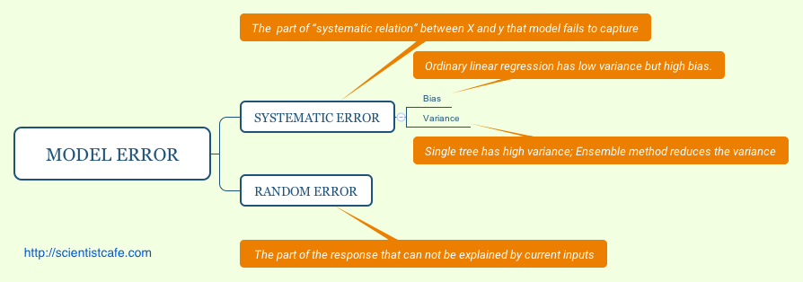
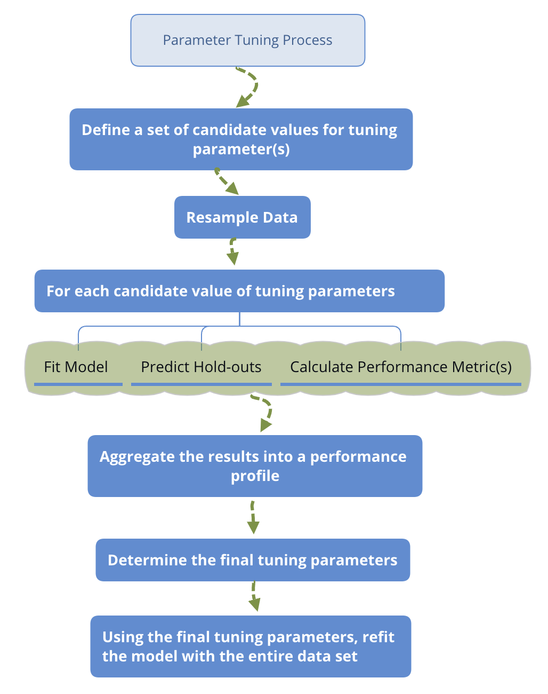

# Model Tuning Strategy

When training a machine learning model, there are many decisions to make. For example, when training a random forest, you need to decide the number of trees and the number of variables at each node. For lasso method, you need to determine the penalty parameter. There may be standard settings for some of the parameters, but it's unlikely to guess the right values for all of these correctly. Other than that, making good choices on how you split the data into training and testing sets can make a huge difference in helping you find a high-performance model efficiently. 

This chapter will illustrate the practical aspects of model tuning. We will talk about different types of model error, sources of model error, hyperparameter tuning, how to set up your data and how to make sure your model implementation is correct.  In practice applying machine learning is a highly iterative process. 

## Systematic Error and Random Error

Assume $\mathbf{X}$ is $n \times p$ observation matrix and $\mathbf{y}$ is response variable, we have:

$$\mathbf{y}=f(\mathbf{X})+\mathbf{\epsilon}$$

where $\mathbf{\epsilon}$ is the random error with a mean of zero. The function $f(\cdot)$ is our modeling target, which represents the information in the response variable that predictors can explain. The main goal of estimating $f(\cdot)$ is inference or prediction, or sometimes both. In general, there is a trade-off between flexibility and interpretability of the model. So data scientists need to comprehend the delicate balance between these two. 

Depending on the modeling purposes, the requirement for interpretability varies. If the prediction is the only goal, then as long as the prediction is accurate enough,  the interpretability is not under consideration. In this case, people can use "black box" model, such as random forest, boosting tree, neural network and so on. These models are very flexible but nearly impossible to explain. Their accuracy is usually higher on the training set, but not necessary when it predicts. It is not surprising since those models have a huge number of parameters and high flexibility that they can "memorize" the entire training data. A paper by Chiyuan Zhang et al. in 2017 pointed out that "Deep neural networks (even just two-layer net) easily fit random labels" [@rethinkDL]. The traditional forms of regularization, such as weight decay, dropout, and data augmentation, fail to control generalization error. It poses a conceptual challenge to statistical theory and also calls our attention when we use such black-box models. 

There are two kinds of application problems: complete information problem and incomplete information problem. The complete information problem has all the information you need to know the correct response. Take the famous cat recognition, for example, all the information you need to identify a cat is in the picture. In this situation, the algorithm that penetrates the data the most wins. There are some other similar problems such as the self-driving car, chess game, facial recognition and speech recognition. But in most of the data science applications, the information is incomplete. If you want to know whether a customer is going to purchase again or not, it is unlikely to have 360-degree of the customer's information. You may have their historical purchasing record, discounts and service received. But you don't know if the customer sees your advertisement, or has a friend recommends competitor's product, or encounters some unhappy purchasing experience somewhere. There could be a myriad of factors that will influence the customer's purchase decision while what you have as data is only a small part. To make things worse, in many cases, you don't even know what you don't know. Deep learning doesn't have any advantage in solving those problems. Instead, some parametric models often work better in this situation. You will comprehend this more after learning the different types of model error. 
Assume we have $\hat{f}$ which is an estimator of $f$. Then we can further get  $\mathbf{\hat{y}}=\hat{f}(\mathbf{X})$. The predicted error is divided into two parts, systematic error, and random error:

$$E(\mathbf{y}-\hat{\mathbf{y}})^{2}=E[f(\mathbf{X})+\mathbf{\epsilon}-\hat{f}(\mathbf{X})]^{2}=\underset{\text{(1)}}{\underbrace{E[f(\mathbf{X})-\hat{f}(\mathbf{X})]^{2}}}+\underset{\text{(2)}}{\underbrace{Var(\mathbf{\epsilon})}}
\label{eq:error}$$

It is also called Mean Square Error (MSE) where (1) is the systematic error. It exists because $\hat{f}$  usually does not entirely describe the "systematic relation" between X and y which refers to the stable relationship that exists across different samples or time. Model improvement can help reduce this kind of error; (2) is the random error which represents the part of y that cannot be explained by X. A more complex model does not reduce the error. There are three reasons for random error:

1. the current sample is not representative, so the pattern in one sample set does not generalize to a broader scale. 
1. The information is incomplete. In other words, you don't have all variables needed to explain the response. 
1. Measurement error in the variables. 

Deep learning has significant success solving problems with complete information and usually low measurement error. As mentioned before, in a task like image recognition, all you need are the pixels in the pictures. So in deep learning applications, increasing the sample size can improve the model performance significantly. But it may not perform well in problems with incomplete information. The biggest problem with the black-box model is that it fits random error, i.e., over-fitting. The notable feature of random error is that it varies over different samples. So one way to determine whether overfitting happens is to reserve a part of the data as the test set and then check the performance of the trained model on the test data. Note that overfitting is a general problem from which any model could suffer. However, since black-box models usually have a large number of parameters,  it is much more suspectable to over-fitting. 




The systematic error can be further decomposed as:

\[
\begin{array}{ccc}
E[f(\mathbf{X})-\hat{f}(\mathbf{X})]^{2} & = & E\left(f(\mathbf{X})-E[\hat{f}(\mathbf{X})]+E[\hat{f}(\mathbf{X})]-\hat{f}(\mathbf{X})\right)^{2}\\
 & = & E\left(E[\hat{f}(\mathbf{X})]-f(\mathbf{X})\right)^{2}+E\left(\hat{f}(\mathbf{X})-E[\hat{f}(\mathbf{X})]\right)^{2}\\
 & = & [Bias(\hat{f}(\mathbf{X}))]^{2}+Var(\hat{f}(\mathbf{X}))
\end{array}
\]

The systematic error consists of two parts,  $Bias(\hat{f}(\mathbf{X}))$ and  $Var (\hat{f}(\mathbf{X}))$. To minimize the systematic error, we need to minimize both. The bias represents the error caused by the model's approximation of the reality, i.e., systematic relation, which may be very complex. For example, linear regression assumes a linear relationship between the predictors and the response, but rarely is there a perfect linear relationship in real life. So linear regression is more likely to have a high bias.

To explore bias and variance, let's begin with a simple simulation. We will simulate a data with a non-linear relationship and fit different models on it. An intuitive way to show these is to compare the plots of various models. 

The code below simulates one predictor (`x`) and one response variable (`fx`). The relationship between `x` and `fx` is non-linear.  

```{r}
source("https://raw.githubusercontent.com/happyrabbit/DataScientistR/master/R/multiplot.r")
# randomly simulate some non-linear samples
x=seq(1,10,0.01)*pi
e=rnorm(length(x),mean=0,sd=0.2)
fx<-sin(x)+e+sqrt(x)
dat=data.frame(x,fx)
```

Then fit a simple linear regression on these data:

```{r linearbias, fig.cap= "High bias model", out.width="80%", fig.asp=.75, fig.align="center"}
# plot fitting result
library(ggplot2)
ggplot(dat,aes(x,fx))+ 
  geom_point() +
  geom_smooth(method = "lm", se = FALSE)
```

Despite a large sample size, trained linear regression cannot describe the relationship very well. In other words, in this case, the model has a high bias (Fig. \@ref(fig:linearbias)). People also call it underfitting. 

Since the estimated parameters will be somewhat different for the different samples, there is the variance of estimates. Intuitively, it gives you some sense that if we fit the same model with different samples (presumably, they are from the same population), how much will the estimates change. Ideally, the change is trivial. For high variance models, small changes in the training data result in very different estimates. In general, a model with high flexibility also has high variance., such as the CART tree, and the initial boosting method. To overcome that problem, the Random Forest and Gradient Boosting Model aim to reduce the variance by summarizing the results obtained from different samples. 

Let's fit the above data using a smoothing method which is highly flexible and can fit the current data tightly:

```{r linearvar, fig.cap= "High variance model", out.width="80%", fig.asp=.75, fig.align="center", message=FALSE}
ggplot(dat,aes(x,fx))+geom_smooth(span = 0.03)
```

The resulting plot (Fig. \@ref(fig:linearvar)) indicates the smoothing method fit the data much better so it has a much smaller bias. However, this method has a high variance. If we simulate different subsets of the sample, the result curve will change significantly:

```{r, warning=FALSE, message=FALSE}
# set random seed
set.seed(2016)
# sample part of the data to fit model
# sample 1
idx1=sample(1:length(x),100)
dat1=data.frame(x1=x[idx1],fx1=fx[idx1])
p1=ggplot(dat1,aes(x1,fx1))+geom_smooth(span = 0.03)
# sample 2
idx2=sample(1:length(x),100)
dat2=data.frame(x2=x[idx2],fx2=fx[idx2])
p2=ggplot(dat2,aes(x2,fx2))+geom_smooth(span = 0.03)
# sample 3
idx3=sample(1:length(x),100)
dat3=data.frame(x3=x[idx3],fx3=fx[idx3])
p3=ggplot(dat3,aes(x3,fx3))+geom_smooth(span = 0.03)
# sample 4
idx4=sample(1:length(x),100)
dat4=data.frame(x4=x[idx4],fx4=fx[idx4])
p4=ggplot(dat4,aes(x4,fx4))+geom_smooth(span = 0.03)
multiplot(p1,p2,p3,p4,cols=2)
```

The fitted lines (blue) change over different samples which means it has high variance. People also call it overfitting. Fitting the linear model using the same four subsets, the result barely changes:

```{r,warning=FALSE}
p1=ggplot(dat1,aes(x1,fx1))+ 
  geom_point() +
  geom_smooth(method = "lm", se = FALSE)
p2=ggplot(dat2,aes(x2,fx2))+ 
  geom_point() +
  geom_smooth(method = "lm", se = FALSE)
p3=ggplot(dat3,aes(x3,fx3))+ 
  geom_point() +
  geom_smooth(method = "lm", se = FALSE)
p4=ggplot(dat4,aes(x4,fx4))+ 
  geom_point() +
  geom_smooth(method = "lm", se = FALSE)
multiplot(p1,p2,p3,p4,cols=2)
```

In general, the variance ($Var(\hat{f}(\mathbf{X}))$) **increases** and the bias ($Bias(\hat{f}(\mathbf{X}))$) **decreases** as the model flexibility increases. Variance and bias together determine the systematic error. As we increase the flexibility of the model, at first the rate at which $Bias(\hat{f}(\mathbf{X}))$ decreases is faster than $Var (\hat{f} (\mathbf{X}))$, so the MSE decreases. However, to some degree, higher flexibility has little effect on $Bias(\hat{f}(\mathbf{X}))$ but $Var(\hat{f} (\mathbf{X}))$ increases significantly, so the MSE increases. 


### Measurement Error in the Response

The measurement error in the response contributes to the random error ($\mathbf{\epsilon}$).  This part of the error is irreducible if you change the data collection mechanism, and so it makes the root mean square error (RMSE) and $R^2$ have the corresponding upper and lower limits. RMSE and $R^2$ are commonly used performance measures for the regression model which we will talk in more detail later.  Therefore, the random error term not only represents the part of fluctuations the model cannot explain but also contains measurement error in the response variables. Section 20.2 of Applied Predictive Modeling [@APM] has an example that shows the effect of the measurement error in the response variable on the model performance (RMSE and $R^2$). 

The authors increased the error in the response proportional to a base level error which was gotten using the original data without introducing extra noise.  Then fit a set of models repeatedly using the "contaminated" data sets to study the change of $RMSE$ and $R^2$ as the level of noise. Here we use clothing consumer data for a similar illustration. Suppose many people do not want to disclose their income and so we need to use other variables to establish a model to predict income. We set up the following model:

```{r}
# load data
sim.dat <- read.csv("https://raw.githubusercontent.com/happyrabbit/DataScientistR/master/Data/SegData.csv ")
ymad<-mad(na.omit(sim.dat$income))
# calculate z-score
zs<-(sim.dat$income-mean(na.omit(sim.dat$income)))/ymad
# which(na.omit(zs>3.5)): identify outliers
# which(is.na(zs)): identify missing values
idex<-c(which(na.omit(zs>3.5)),which(is.na(zs)))
# delete rows with outliers and missing values
sim.dat<-sim.dat[-idex,]
fit<-lm(income~store_exp+online_exp+store_trans+online_trans,data=sim.dat)
```

The output shows that without additional noise, the root mean square error (RMSE) of the model is `r as.integer (summary(fit)$sigma)`, $R^2$ is `r round(summary(fit)$adj.r.squared,2)`.  

Let's add various degrees of noise (0 to 3 times the RMSE) to the variable `income`:

$$ RMSE \times (0.0, 0.5, 1.0, 1.5, 2.0, 2.5, 3.0) $$

```r
noise<-matrix(rep(NA,7*nrow(sim.dat)),nrow=nrow(sim.dat),ncol=7)
for (i in 1:nrow(sim.dat)){
noise[i,]<-rnorm(7,rep(0,7),summary(fit)$sigma*seq(0,3,by=0.5))
}
```

We then examine the effect of noise intensity on $R^2$ for models with different complexity. The models with complexity from low to high are: ordinary linear regression, partial least square regression(PLS), multivariate adaptive regression spline (MARS), support vector machine (SVM, the kernel function is radial basis function), and random forest.

```r
# fit ordinary linear regression
rsq_linear<-rep(0,ncol(noise))
for (i in 1:7){
withnoise<-sim.dat$income+noise[,i]
fit0<-lm(withnoise~store_exp+online_exp+store_trans+online_trans,data=sim.dat)
rsq_linear[i]<-summary(fit0)$adj.r.squared
}
```

PLS is a method of linearizing nonlinear relationships through hidden layers. It is similar to the principal component regression (PCR), except that PCR does not take into account the information of the dependent variable when selecting the components, and its purpose is to find the linear combinations (i.e., unsupervised) that capture the most variance of the independent variables. When the independent variables and response variables are related, PCR can well identify the systematic relationship between them. However, when there exist independent variables not associated with response variable, it will undermine PCR's performance. And PLS maximizes the linear combination of dependencies with the response variable. In the current case, the more complicated PLS does not perform better than simple linear regression. 

```r
# pls: conduct PLS and PCR
library(pls)
rsq_pls<-rep(0,ncol(noise))
# fit PLS
for (i in 1:7){
withnoise<-sim.dat$income+noise[,i]
fit0<-plsr(withnoise~store_exp+online_exp+store_trans+online_trans,data=sim.dat)
rsq_pls[i]<-max(drop(R2(fit0, estimate = "train",intercept = FALSE)$val))
}
```

```r
# earth: fit mars 
library(earth)
rsq_mars<-rep(0,ncol(noise))
for (i in 1:7){
withnoise<-sim.dat$income+noise[,i]
fit0<-earth(withnoise~store_exp+online_exp+store_trans+online_trans,data=sim.dat)
rsq_mars[i]<-fit0$rsq
}
```

```r
# caret: awesome package for tuning predictive model
library(caret)
rsq_svm<-rep(0,ncol(noise))
# Need some time to run
for (i in 1:7){
idex<-which(is.na(sim.dat$income))
withnoise<-sim.dat$income+noise[,i]
trainX<-sim.dat[,c("store_exp","online_exp","store_trans","online_trans")]
trainY<-withnoise
fit0<-train(trainX,trainY,method="svmRadial",
            tuneLength=15,
            trControl=trainControl(method="cv"))
rsq_svm[i]<-max(fit0$results$Rsquared)
}
```

```r
# randomForest: random forest model
library(randomForest)
rsq_rf<-rep(0,ncol(noise))
# ntree=500 number of trees
# na.action = na.omit  ignore missing value
for (i in 1:7){
withnoise<-sim.dat$income+noise[,i]
fit0<-randomForest(withnoise~store_exp+online_exp+store_trans+online_trans,data=sim.dat,ntree=500,na.action = na.omit)
rsq_rf[i]<-tail(fit0$rsq,1)
}
library(reshape2)
rsq<-data.frame(cbind(Noise=c(0.0, 0.5, 1.0, 1.5, 2.0, 2.5, 3.0),rsq_linear,rsq_pls,rsq_mars,rsq_svm,rsq_rf))
rsq<-melt(rsq,id.vars="Noise",measure.vars=c("rsq_linear","rsq_pls","rsq_mars","rsq_svm","rsq_rf"))
```

```{r,echo=FALSE}
rsq<-read.csv("/Users/happyrabbit/Documents/GitHub/DataScientistR/Data/ResponseError.csv")
```

(ref:error-cap)  Test set $R^2$ profiles for income models when measurement system noise increases. `rsq_linear`: linear regression, `rsq_pls`: Partial Least Square, `rsq_mars`: Multiple Adaptive Regression Spline Regression, `rsq_svm`: Support Vector Machine，`rsq_rf`: Random Forest

```{r error, fig.cap= "(ref:error-cap)", out.width="80%", fig.asp=.75, fig.align="center"}

library(ggplot2)
ggplot(data=rsq, aes(x=Noise, y=value, group=variable, colour=variable)) +
    geom_line() +
    geom_point()+
  ylab("R2") 
```

Fig. \@ref(fig:error) shows that:

All model performance decreases sharply with increasing noise intensity. To better anticipate model performance, it helps to understand the way variable is measured. It is something need to make clear at the beginning of an analytical project. A data scientist should be aware of the quality of the data in the database. For data from the clients, it is an important to understand the quality of the data by communication.

More complex model is not necessarily better. The best model in this situation is MARS, not random forests or SVM. Simple linear regression and PLS perform the worst when noise is low. MARS is more complicated than the linear regression and PLS, but it is simpler and easier to explain than random forest and SVM.

When noise increases to a certain extent, the potential structure becomes vaguer, and complex random forest model starts to fail. When the systematic measurement error is significant, a more straightforward but not naive model may be a better choice. It is always a good practice to try different models, and select the simplest model in the case of similar performance. Model evaluation and selection represent the career "maturity" of a data scientist.

### Measurement Error in the Independent Variables

The traditional statistical model usually assumes that the measurement of the independent variable has no error which is not possible in practice. Considering the error in the independent variables is necessary. The impact of the error depends on the following factors: (1) the magnitude of the randomness; (2) the importance of the corresponding variable in the model, and (3) the type of model used. Use variable `online_exp` as an example. The approach is similar to the previous section. Add varying degrees of noise and see its impact on the model performance. We add the following different levels of noise (0 to 3 times the standard deviation) to`online_exp`:

$$\sigma_{0} \times (0.0, 0.5, 1.0, 1.5, 2.0, 2.5, 3.0)$$

where $\sigma_{0}$ is the standard error of `online_exp`.

```r
noise<-matrix(rep(NA,7*nrow(sim.dat)),nrow=nrow(sim.dat),ncol=7)
for (i in 1:nrow(sim.dat)){
noise[i,]<-rnorm(7,rep(0,7),sd(sim.dat$online_exp)*seq(0,3,by=0.5))
}
```

Likewise, we examine the effect of noise intensity on different models ($R^2$). The models with complexity from low to high are: ordinary linear regression, partial least square regression(PLS), multivariate adaptive regression spline (MARS), support vector machine (SVM, the Kernel function is radial basis function), and random forest. The code is similar as before so not shown here.

```{r,echo=FALSE}
rsq<-read.csv("/Users/happyrabbit/Documents/GitHub/DataScientistR/Data/VariableError.csv")
```

(ref:errorvariable-cap)  Test set  $R^2$  profiles for income models when noise in `online_exp` increases. `rsq_linear` : linear regression, `rsq_pls` : Partial Least Square, `rsq_mars`: Multiple Adaptive Regression Spline Regression, `rsq_svm`: Support Vector Machine，`rsq_rf`: Random Forest

```{r errorvariable, fig.cap="(ref:errorvariable-cap)", out.width='80%', fig.asp=.75, fig.align='center', echo=FALSE}
library(ggplot2)
ggplot(data=rsq, aes(x=Noise, y=value, group=variable, colour=variable)) +
    geom_line() +
    geom_point()+
  ylab("R2") 
```

Comparing Fig. \@ref(fig:errorvariable) and Fig. \@ref(fig:error), the influence of the two types of error is very different. The error in response cannot be overcome for any model, but it is not the case for the independent variables. Imagine an extreme case, if `online_exp` is completely random, that is, no information in it, the impact on the performance of random forest and support vector machine is marginal. Linear regression and PLS still perform similarly. With the increase of noise, the performance starts to decline faster. To a certain extent, it becomes steady.  In general, if an independent variable contains error, other variables associated with it can compensate to some extent. 

## Data Splitting and Resampling

Those highly adaptable models can model complex relationships. However, they tend to overfit which leads to the poor prediction by learning too much from the data. It means that the model is susceptible to the specific sample used to fit it. When future data is not exactly like the past data, the model prediction may have big mistakes. A simple model like ordinary linear regression tends instead to underfit which leads to a bad prediction by learning too little from the data. It systematically over-predicts or under-predicts the data regardless of how well future data resemble past data. Without evaluating models, the modeler will not know about the problem before the future samples. Data splitting and resampling are fundamental techniques to build sound models for prediction. 

_Data splitting_ is to put part of the data aside as testing set (or Hold-outs, out of bag samples) and use the rest for model training. Training samples are also called in-sample. Model performance metrics evaluated using in-sample are retrodictive, not predictive. 

The traditional business intelligence usually handles data description. Answer simple questions by querying and summarizing the data, such as:

- What is the monthly sales of a product in 2015? 
- What is the number of visits to our site in the past month?  
- What is the sales difference in 2015 for two different product designs? 

There is no need to go through the tedious process of splitting the data, tuning and testing model to answer questions of this kind. Instead, people usually use as complete data as possible and then sum or average the parts of interest. 

Many models have parameters which cannot be directly estimated from the data, such as  $\lambda$ in the lasso (penalty parameter), the number of trees in the random forest. This type of model parameter is called tuning parameter, and there is no analytical formula available to calculate the optimized value. Tuning parameters often control the complexity of the model. A poor choice can result in over-fitting or under-fitting. A standard approach to estimate tuning parameters is through cross-validation which is a data resampling approach. 

To get a reasonable precision of the performance based on a single test set, the size of the test set may need to be large. So a conventional approach is to use a subset of samples to fit the model and use the rest to evaluate model performance. This process will repeat multiple times to get a performance profile. In that sense, resampling is based on splitting. The general steps are:

-  Define a set of candidate values for tuning parameter(s)
    - For each candidate value in the set
        - Resample data
        - Fit model
        - Predict hold-out
        - Calculate performance
- Aggregate the results
- Determine the final tuning parameter
- Refit the model with the entire data set

{width=80%}

The above is an outline of the general procedure to tune parameters. Now let's focus on the critical part of the process: data splitting. Ideally, we should evaluate model using samples that were not used to build or fine-tune the model. So it provides an unbiased sense of model effectiveness. When the sample size is large, it is a good practice to set aside part of the samples to evaluate the final model. People use "training" data to indicate samples used to fit or fine-tune the model and "test" or "validation" data set is used to validate performance. 

The first decision to make for data splitting is to decide the proportion of data in the test set. There are two factors to consider here: (1) sample size; (2) computation intensity. If the sample size is large enough which is the most common situation according to my experience, you can try to use 20%, 30% and 40% of the data as the test set, and see which one works the best. If the model is computationally intense, then you may consider starting from a smaller sample of data to train the model hence will have a higher portion of data in the test set.  Depending on how it performs, you may need to increase the training set. If the sample size is small, you can use cross-validation or bootstrap which is the topic in the next section.  

The next decision is to decide which samples are in the test set. There is a desire to make the training and test sets as similar as possible. A simple way is to split data by random sampling which, however, does not control for any of the data attributes, such as the percentage of the retained customer in the data. So it is possible that the distribution of outcomes is substantially different between the training and test sets. There are three main ways to split the data that account for the similarity of resulted data sets. We will describe the three approaches using the clothing company customer data as examples.

(1) Divide data according to the outcome variable 

Assume the outcome variable is customer segment (column `segment`) and we decide to use 80% as training and 20% test. The goal is to make the proportions of the categories in the two sets as similar as possible. The `createDataPartition()` function in `caret` will return a balanced splitting based on assigned variable.

```{r}
# load data
sim.dat<-read.csv("https://raw.githubusercontent.com/happyrabbit/DataScientistR/master/Data/SegData.csv")
library(caret)
# set random seed to make sure reproducibility
set.seed(3456)
trainIndex <- createDataPartition(sim.dat$segment, p = .8, list = FALSE, times = 1)
head(trainIndex)
```

The `list = FALSE` in the call to `createDataPartition` is to return a data frame.  The `times = 1` tells R how many times you want to split the data. Here we only do it once, but you can repeat the splitting multiple times. In that case, the function will return multiple vectors indicating the rows to training/test.  You can set `times＝2` and rerun the above code to see the result.  Then we can use the returned indicator vector `trainIndex` to get training and test sets:

```{r}
# get training set
datTrain <- sim.dat[ trainIndex,]
# get test set
datTest <- sim.dat[-trainIndex,]
```

According to the setting, there are 800 samples in the training set and 200 in test set. Let's check the distribution of the two sets:

```{r}
library(plyr)
ddply(datTrain,"segment",summarise,count=length(segment),
     percentage=round( length(segment)/nrow(datTrain),2))

ddply(datTest,"segment",summarise,count=length(segment),
      percentage=round(length(segment)/nrow(datTest),2))
```

The percentages are the same for these two sets. In practice, it is possible that the distributions are not exactly identical but should be close.