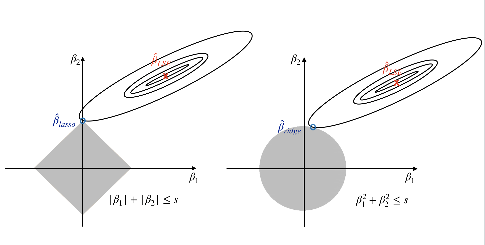

# Regularization Methods

The regularization method is also known as the shrinkage method. It is a technique that constrains or regularizes the coefficient estimates. By imposing a penalty on the size of coefficients, it shrinks the coefficient estimates towards zero. It also intrinsically conduct feature selection and is naturally resistant to non-informative predictors. It may not be obvious why this technique improves model performance, but it turns out to be a very effective modeling technique. In this chapter, we will introduce two best-known regularization methods: ridge regression and lasso.  The elastic net is a combination of ridge and lasso, or it is a general representation of the two. 

We talked about the variance bias trade-off in section \@ref(vbtradeoff). The variance of a learning model is the amount by which $\hat{f}$ would change if we estimated it using a different training data set.  In general, model variance increases as flexibility increases. The regularization technique decreases the model flexibility by shrinking the coefficient and hence significantly reduce the model variance.  

## Ridge Regression

Recall that the least square estimates minimize RSS:

$$RSS=\Sigma_{i=1}^{n}(y_{i}-\beta_{0}-\Sigma_{j=1}^{p}\beta_{j}x_{ij})^{2}$$

Ridge regression [@Hoerl1970] is similar but it finds $\hat{\beta}^{R}$ that optimizes a slightly different function:

\begin{equation}
\Sigma_{i=1}^{n}(y_{i}-\beta_{0}-\Sigma_{j=1}^{p}\beta_{j}x_{ij})^{2}+\lambda\Sigma_{j=1}^{p}\beta_{j}^{2}=RSS+\lambda\Sigma_{j=1}^{p}\beta_{j}^{2}
(\#eq:ridge)
\end{equation}

where  $\lambda >0$ is a tuning parameter. As with the least squares, ridge regression considers minimizing RSS. However, it adds a shrinkage penalty $\lambda\Sigma_{j=1}^{p}\beta_{j}^{2}$ that takes account of the number of parameters in the model. When $\lambda = 0$, it is identical to least squares. As $\lambda$ gets larger, the coefficients start shrinking towards 0. When $\lambda\rightarrow\infty$, the rest of the coefficients $\beta_{1},...,\beta_{p}$ are close to 0. Here, the penalty is not applied to $\beta_{0}$. The tuning parameter $\lambda$ is used to adjust the impact of the two parts in equation \@ref(eq:ridge). Every value of $\lambda$ corresponds to a set of parameter estimates. 

There are many R packages for ridge regression, such as lm.ridge() function from MASS, function enet() from, elasticnet. If you know the value of $\lambda$, you can use either of the function to fit ridge regression. A more convenient way is to use train() function from caret. Let's use the 10 survey questions to predict the total purchase amount (sum of online and store purchase).

```{r, message=FALSE,results="hide"}
# install packages from CRAN
p_needed <- c('caret', 'elasticnet', 'glmnet', 'devtools')
packages <- rownames(installed.packages())
p_to_install <- p_needed[!(p_needed %in% packages)]
if (length(p_to_install) > 0) {
    install.packages(p_to_install)
}

lapply(p_needed, require, character.only = TRUE)
```


```{r}
dat <- read.csv("http://bit.ly/2P5gTw4")
# data cleaning: delete wrong observations since expense can't be negative
dat <- subset(dat, store_exp > 0 & online_exp > 0)
# get predictors
trainx <- dat[ , grep("Q", names(dat))]
# get response
trainy <- dat$store_exp + dat$online_exp
```

Use `train()` function to tune parameter. Since ridge regression adds the penalty parameter $\lambda$ in front of the sum of squares of the parameters, the scale of the parameters matters. So here it is better to center and scale the predictors. This preprocessing is recommended for all techniques that put penalty to parameter estimates. In this example, the 10 survey questions are already with the same scale so data preprocessing doesn't make too much different. It is a good idea to set the preprocessing as a standard.

```{r}
# set cross validation
ctrl <- trainControl(method = "cv", number = 10)
# set the parameter range 
ridgeGrid <- data.frame(.lambda = seq(0, .1, length = 20))
set.seed(100)
ridgeRegTune <- train(trainx, trainy,
                      method = "ridge",
                      tuneGrid = ridgeGrid,
                      trControl = ctrl,
                      ## center and scale predictors
                      preProc = c("center", "scale"))
ridgeRegTune
```

The results show that the best value of $\lambda$ is 0.005 and the RMSE and $R^{2}$ are 1744 and 0.7954 correspondingly. You can see from the figure \@ref(fig:ridgeregtune), as the $\lambda$ increase, the RMSE  first slightly decreases and then increases.

```{r ridgeregtune, fig.cap='Test mean squared error for the ridge regression', out.width='80%', fig.asp=.75, fig.align='center'}

plot(ridgeRegTune)
```

Once you have the tuning parameter value, there are different functions to fit a ridge regression. Let's look at how to use `enet()` in `elasticnet` package.

```{r}
ridgefit = enet(x = as.matrix(trainx), y = trainy, lambda = 0.01,
                # center and scale predictors
                normalize = TRUE)
```

Note here `ridgefit` only assigns the value of the tuning parameter for ridge regression. Since the elastic net model include both ridge and lasso penalty, we need to use `predict()` function to get the model fit. You can get the fitted results by setting `s = 1` and `mode = "fraction"`. Here `s = 1` means we only use the ridge parameter. We will come back to this when we get to lasso regression.

```{r}
ridgePred <- predict(ridgefit, newx = as.matrix(trainx), 
                     s = 1, mode = "fraction", type = "fit")
```

By setting `type = "fit"`, the above returns a list object. The `fit` item has the predictions:

```{r}
names(ridgePred)
head(ridgePred$fit)
```

If you want to check the estimated coefficients, you can set `type="coefficients"`: 

```{r}
ridgeCoef<-predict(ridgefit,newx = as.matrix(trainx), 
                   s=1, mode="fraction", type="coefficients")
```

It also returns a list and the estimates are in the  `coefficients` item:

```{r}
# didn't show the results
RidgeCoef = ridgeCoef$coefficients
```

Comparing to the least square regression, ridge regression performs better because of the bias-variance-trade-off we mentioned in section \@ref(vbtradeoff). As the penalty parameter $\lambda$ increases, the flexibility of the ridge regression decreases. It decreases the variance of the model but increases the bias at the same time.

## LASSO

Even though the ridge regression shrinks the parameter estimates towards 0, it won't shink any estimates to be exactly 0 which means it includes all predictors in the final model. So it can't select variables. It may not be a problem for prediction but it is a huge disadvantage if you want to interpret the model especially when the number of variables is large. A popular alternative to the ridge penalty is the **Least Absolute Shrinkage and Selection Operator** (LASSO) [@Tibshirani1996].

Similar to ridge regression, lasso adds a penalty. The lasso coefficients $\hat{\beta}_{\lambda}^{L}$ minimize the following: 

\begin{equation}
\Sigma_{i=1}^{n}(y_{i}-\beta_{0}-\Sigma_{j=1}^{p}\beta_{j}x_{ij})^{2}+\lambda\Sigma_{j=1}^{p}|\beta_{j}|=RSS+\lambda\Sigma_{j=1}^{p}|\beta_{j}|
(\#eq:lasso)
\end{equation}

The only difference between lasso and ridge is the penalty. In statistical parlance, ridge uses $L_2$ penalty ($\beta_{j}^{2}$) and lasso uses $L_1$ penalty ($|\beta_{j}|$). $L_1$ penalty can shrink the estimates to 0 when $\lambda$ is big enough. So lasso can be used as a feature selection tool. It is a huge advantage because it leads to a more explainable model.

Similar to other models with tuning parameters,  lasso regression requires cross-validation to tune the parameter.  You can use `train()` in a similar way as we showed in the ridge regression section. To tune parameter, we need to set cross-validation and parameter range. Also, it is advised to standardize the predictors:

```{r}
ctrl <- trainControl(method = "cv", number = 10)
lassoGrid <- data.frame(fraction = seq(.8, 1, length = 20))
set.seed(100)
lassoTune <- train(trainx, trainy,
                      ## set the method to be lasso
                      method = "lars",
                      tuneGrid = lassoGrid,
                      trControl = ctrl,
                      ## standardize the predictors
                      preProc = c("center", "scale"))
lassoTune
```

The results show that the best value of the tuning parameter (`fraction` from the output) is 0.957 and the RMSE and $R^{2}$ are  1742 and 0.7954 correspondingly. The performance is nearly the same with ridge regression. You can see from the figure \@ref(fig:lassoregtune), as the $\lambda$ increase, the RMSE first decreases and then increases.

```{r lassoregtune, fig.cap='Test mean squared error for the lasso regression', out.width='80%', fig.asp=.75, fig.align='center'}
plot(lassoTune)
```

Once you select a value for tuning parameter, there are different functions to fit lasso regression, such as `lars()` in  `lars`, `enet()` in  `elasticnet`, `glmnet()` in  `glmnet`. They all have very similar syntax.

Here we continue using `enet()`.  The syntax is similar to ridge regression. The only difference is that you need to set `lambda = 0` because the argument `lambda` here is to control the ridge penalty. When it is 0, the function will return the lasso model object.

```{r}
lassoModel<- enet(x = as.matrix(trainx), y = trainy, lambda = 0, normalize = TRUE)
```

Set the fraction value to be 0.957 (the value we got above):

```{r}
lassoFit <- predict(lassoModel, newx = as.matrix(trainx), s = 0.957, mode = "fraction", type = "fit")
```

Again by setting `type = "fit"`, the above returns a list object. The `fit` item has the predictions:

```{r}
head(lassoFit$fit)
```

You need to set `type = "coefficients"` to get parameter estimates: 

```{r}
lassoCoef <- predict(lassoModel, newx = as.matrix(trainx), s = 0.95, mode = "fraction", type = "coefficients")
```

It also returns a list and the estimates are in the `coefficients` item:

```{r}
# didn't show the results
LassoCoef = lassoCoef$coefficients
```

Many researchers applied lasso to other learning methods, such as linear discriminant analysis [@Clem2011], partial least squares regression[@chun2010]. However, since the $L_1$ norm is not differentiable, optimization for lasso regression is more complicated. People come up with different algorithms to solve the computation problem. The biggest breakthrough is Least Angle Regression [LARS] from Bradley Efron etc. This algorithm works well for lasso regression especially when the dimension is high.

## Variable selection property of the lasso

You may ask why lasso ($L_1$ penalty) has the feature selection property but not the ridge ($L_2$ penalty). To answer that question, let's look at the alternative representations of the optimization problem for lasso and ridge.  For lasso regression, it is identical to optimize the following two functions:

\begin{equation}
\Sigma_{i=1}^{n}(y_{i}-\beta_{0}-\Sigma_{j=1}^{p}\beta_{j}x_{ij})^{2}+\lambda\Sigma_{j=1}^{p}|\beta_{j}|=RSS+\lambda\Sigma_{j=1}^{p}|\beta_{j}|
(\#eq:lasso1)
\end{equation}

\begin{equation}
\underset{\beta}{min}\left\{ \Sigma_{i=1}^{n}\left(y_{i}-\beta_{0}-\Sigma_{j=1}^{p}\beta_{j}x_{ij}\right)^{2}\right\} ,\ \Sigma_{j=1}^{p}|\beta_{j}|\leq s
(\#eq:lasso2)
\end{equation}

For any value of tuning parameter $\lambda$, there exists a $s$ such that the coefficient estimates optimize equation \@ref(eq:lasso1) also optimize equation \@ref(eq:lasso2). Similarly, for ridge regression, the two representations are identical: 

\begin{equation}
\Sigma_{i=1}^{n}(y_{i}-\beta_{0}-\Sigma_{j=1}^{p}\beta_{j}x_{ij})^{2}+\lambda\Sigma_{j=1}^{p}\beta_{j}^{2}=RSS+\lambda\Sigma_{j=1}^{p}\beta_{j}^{2}
(\#eq:ridge1)
\end{equation}

\begin{equation}
\underset{\beta}{min}\left\{ \Sigma_{i=1}^{n}\left(y_{i}-\beta_{0}-\Sigma_{j=1}^{p}\beta_{j}x_{ij}\right)^{2}\right\} ,\ \Sigma_{j=1}^{p}\beta_{j}^{2}\leq s
(\#eq:ridge2)
\end{equation}

When $p＝2$, lasso estimates ($\hat{\beta}_{lasso}$ in figure \@ref(fig:lassoridge)) have the smallest RSS among all points that satisfy $|\beta*{1}|+|\beta_{2}|\leq s$ (i.e. within the diamond in figure \@ref(fig:lassoridge)). Ridge estimates have the smallest RSS among all points that satisfy $\beta_{1}^{2}+\beta_{2}^{2}\leq s$ (i.e. within the circle in figure \@ref(fig:lassoridge)). As s increases, the diamond and circle regions expand and get less restrictive. If s is large enough, the restrictive region will cover the least squares estimate ($\hat{\beta}_{LSE}$). Then, equations \@ref(eq:lasso2) and \@ref(eq:ridge2) will simply yield the least squares estimate. In contrast, if s is small, the grey region in figure \@ref(fig:lassoridge) will be small and hence restrict the magnitude of $\beta$. With the alternative formulations, we can answer the question of feature selection property.

```{r lassoridge, fig.cap = "Contours of the RSS and constrain functions for the lasso (left) and ridge regression (right)", out.width="100%", fig.asp=.75, fig.align="center", echo = FALSE}

```

Figure \@ref(fig:lassoridge) illustrates the situations for lasso (left) and ridge (right). The least square estimate is marked as $\hat{\beta}$. The restrictive regions are in grey, the diamond region is for the lasso, the circle region is for the ridge. The least square estimates lie outside the grey region, so they are different from the lasso and ridge estimates. The ellipses centered around $\hat{\beta}$ represent contours of RSS. All the points on a given ellipse share an RSS. As the ellipses expand, the RSS increases. The lasso and ridge estimates are the first points at which an ellipse contracts the grey region. Since ridge regression has a circular restrictive region that doesn't have a sharp point, the intersecting point can't drop on the axis. But it is possible for lasso since it has corners at each of the axes.   When the intersecting point is on an axis, one of the parameter estimates is 0. If p > 2, the restrictive regions become sphere or hypersphere. In that case, when the intersecting point drops on an axis, multiple coefficient estimates can equal 0 simultaneously.

## Elastic Net

Elastic Net is a generalization of lasso and ridge regression[@zou2005]. It combines the two penalties. The estimates of coefficients optimize the following function:

\begin{equation}
\Sigma_{i=1}^{n}(y_{i}-\hat{y}_{i})^{2}+\lambda_{1}\Sigma_{j=1}^{p}\beta_{j}^{2}+\lambda_{2}\Sigma_{j=1}^{p}|\beta_{j}|
(\#eq:elasticnet)
\end{equation}

Ridge penalty shrinks the coefficients of correlated predictors towards each other while the lasso tends to pick one and discard the others. So lasso estimates have a higher variance. However, ridge regression doesn't have a variable selection property. The advantage of the elastic net is that it keeps the feature selection quality from the lasso penalty as well as the effectiveness of the ridge penalty.  [@zou2005] suggest that it deals with highly correlated variables more effectively.

We can still use train() function to tune the parameters in the elastic net. As before, set the cross-validation and parameter range. Standardize the predictors: 

```{r, results= FALSE}
enetGrid <- expand.grid(.lambda = seq(0,0.2,length=20), 
                        .fraction = seq(.8, 1, length = 20))
set.seed(100)
enetTune <- train(trainx, trainy,
                  method = "enet",
                  tuneGrid = enetGrid,
                  trControl = ctrl,
                  preProc = c("center", "scale"))
enetTune
```

```{r, echo=FALSE}
res = enetTune$results
res = res[which(res$RMSE == min(res$RMSE)), ]
```

```pre
Elasticnet 

999 samples
 10 predictor

Pre-processing: centered (10), scaled (10) 
Resampling: Cross-Validated (10 fold) 
Summary of sample sizes: 899, 899, 899, 899, 899, 900, ... 
Resampling results across tuning parameters:

  lambda   fraction  RMSE  Rsquared  MAE  
  0.00000  0.8000    1763  0.7921    787.5
  0.00000  0.8105    1760  0.7924    784.1
  .
  .
  .
  0.09474  0.9158    1760  0.7945    782.5
  0.09474  0.9263    1761  0.7947    782.5
  0.09474  0.9368    1761  0.7949    782.7
  0.09474  0.9474    1763  0.7950    783.3
  0.09474  0.9579    1764  0.7951    784.3
  0.09474  0.9684    1766  0.7953    785.7
  0.09474  0.9789    1768  0.7954    787.1
  0.09474  0.9895    1770  0.7954    788.8
  0.09474  1.0000    1772  0.7955    790.4
 [ reached getOption("max.print") -- omitted 200 rows ]

RMSE was used to select the optimal model using the smallest value.
The final values used for the model were fraction = 0.9579 and lambda = 0.
```

The results show that the best values of the tuning parameters are fraction is `r res$fraction` and lambda is `r res$lambda` It also indicates that the final model is lasso only (the ridge penalty parameter lambda is 0).  The RMSE and $R^{2}$ are `r res$RMSE` and `r res$Rsquared` correspondingly. 

## Penalized Generalized Linear Model

Adding penalties is a general technique that can be applied to many methods other than linear regression. In this section, we will introduce the penalized generalized linear model. It is to fit the generalized linear model by minimizing a penalized maximum likelihood. The penalty can be $L_1$, $L_2$ or a combination of the two. The estimates of coefficients minimize the following: 

$$\underset{\beta_{0},\mathbf{\beta}}{min}\frac{1}{N}\Sigma_{i=1}^{N}w_{i}l(y_{i},\beta_{0}+\mathbf{\beta^{T}x_{i}})+\lambda[(1-\alpha)\parallel\mathbf{\beta}\parallel_{2}^{2}/2+\alpha\parallel\mathbf{\beta}\parallel_{1}]$$

where

$$l(y_{i},\beta_{0}+\mathbf{\beta^{T}x_{i}})=-log[\mathcal{L}(y_{i},\beta_{0}+\mathbf{\beta^{T}x_{i}})]$$

It is the negative logarithm of the likelihood, $\mathcal{L}(y_{i},\beta_{0}+\mathbf{\beta^{T}x_{i}})$. Maximize likelihood is to minimize $l(y_{i},\beta_{0}+\mathbf{\beta^{T}x_{i}})$.

Parameter $\alpha$ decides the penalty, i.e, between $L_2$ ($\alpha=0$) and $L_1$ ($\alpha=1$).  $\lambda$ controls the weight of the whole penalty item. The higher $\lambda$ is, the more weight the penalty carries comparing to likelihood. As discussed above, the ridge penalty shrinks the coefficients towards 0 but can't be exactly 0. The lasso penalty can set 0 estimates so it has the property of feature selection. The elastic net combines both. Here we have two tuning parameters, $\alpha$ and $\lambda$. 

### Introduction to `glmnet` package

`glmnet` is a package that fits a penalized generalized linear model using *cyclical coordinate descent*. It successively optimizes the objective function over each parameter with others fixed, and cycles repeatedly until convergence. Since the linear model is a special case of the generalized linear model, `glmnet` can also fit a penalized linear model. Other than that, it can also fit penalized logistic regression, multinomial, Poisson, and Cox regression models.

The default family option in the function `glmnet()` is `gaussian`. It is the linear regression we discussed so far in this chapter. But the parameterization is a little different in the generalized linear model framework (we have $\alpha$ and $\lambda$). Let's start from our previous example, using the same training data but `glmnet()` to fit model:

```{r}
library(glmnet)
dat <- read.csv("http://bit.ly/2P5gTw4")
# data cleaning: delete wrong observations since expense can't be negative
dat <- subset(dat, store_exp > 0 & online_exp > 0)
# get predictors
trainx <- dat[, grep("Q", names(dat))]
# get response
trainy <- dat$store_exp + dat$online_exp
glmfit = glmnet(as.matrix(trainx), trainy)
```

The object `glmfit` returned by `glmnet()` has the information of the fitted model for the later operations. An easy way to extract the components is through various functions on `glmfit`, such as `plot()`, `print()`, `coef()` and `predict()` . For example, the following code visualizes the path of coefficients as penalty increases:

```{r}
plot(glmfit, label = T)
```

Each curve in the plot represents one predictor. The default setting is $\alpha=1$ which means there is only lasso penalty. From left to right, $L_I$ norm is increasing which means $\lambda$ is decreasing. The bottom x-axis is $L_1$ norm (i.e. $\parallel\mathbf{\beta}\parallel_{1}$). The upper x-axis is the effective degrees of freedom (df) for the lasso. You can check the detail for every step by:  

```r
print(glmfit)
```

```pre
Call:  glmnet(x = as.matrix(trainx), y = trainy) 

   Df  %Dev Lambda
1   0 0.000   3040
2   2 0.104   2770
3   2 0.192   2530
4   2 0.265   2300
5   3 0.326   2100
6   3 0.389   1910
7   3 0.442   1740
8   3 0.485   1590
9   3 0.521   1450
...
```

The first column `Df` is the degree of freedom (i.e. the number of non-zero coefficients),  `%Dev` is the percentage of deviance explained and `Lambda` is the value of tuning parameter $\lambda$. By default, the function will try 100 different values of $\lambda$. However, if as $\lambda$ changes, the `%Dev` doesn't change sufficiently, the algorithm will stop before it goes through all the values of $\lambda$. We didn't show the full output above. But it only uses 68 different values of $\lambda$. You can also set the value of $\lambda$ using `s=` :

```{r}
coef(glmfit, s = 1200)
```

When $\lambda=1200$, there are three coefficients with non-zero estimates(`Q1`, `Q2` and `Q3`). You can apply models with different values of tuning parameter to new data using `predict()`:

```{r}
newdat = matrix(sample(1:9, 30, replace = T), nrow = 3)
predict(glmfit, newdat, s = c(1741, 2000))
```

Each column corresponds to a value of $\lambda$. To tune the value of $\lambda$, we can easily use `cv.glmnet()` function to do cross-validation.`cv.glmnet()` returns the cross-validation results as a list object. We store the object in `cvfit` and use it for further operations.

```{r}
cvfit = cv.glmnet(as.matrix(trainx), trainy)
```

We can plot the object using `plot()`. The red dotted line is the cross-validation curve. Each red point is the cross-validation mean squared error for a value of $\lambda$. The grey bars around the red points indicate the upper and lower standard deviation. The two gray dotted vertical lines represent the two selected values of $\lambda$, one gives the minimum mean cross-validated error (`lambda.min`), the other gives the error that is within one standard error of the minimum (`lambda.1se`). 

```{r}
plot(cvfit)
```

You can check the two selected $\lambda$ values by: 

```{r}
# lambda with minimum mean cross-validated error
cvfit$lambda.min
# lambda with one standard error of the minimum
cvfit$lambda.1se
```

You can look at the coefficient estimates for different $\lambda$ by:

```{r}
# coefficient estimates for model with the error 
# that is within one standard error of the minimum
coef(cvfit, s = "lambda.1se")
```

### Penalized logistic regression

#### Multivariate logistic regression model

Logistic regression is a traditional statistical method for a two-category classification problem. It is simple yet useful.  Here we use the swine disease breakout data as an example to illustrate the learning method and code implementation. Refer to section \@ref(swinediseasedata) for more details about the dataset. The goal is to predict if a farm will have a swine disease outbreak (i.e build a risk scoring system). 

Consider risk scoring system construction using a sample of $n$ observations, with information collected for $G$ categorical predictors and one binary response variable for each observation. The predictors are 120 survey questions (i.e. G=120). There were three possible answers for each question (A, B and C). So each predictor is encoded to two dummy variables (we consider C as the baseline.). Let $\mathbf{x_{i,g}}$ be the vector of dummy variables associated with the $g^{th}$ categorical predictor for the $i^{th}$  observation, where $i=1,\cdots,n$, $g=1,\cdots,G$. For example, if the first farm chooses B for question 2, then the corresponding observation is $\mathbf{x_{12}}=(0,1)^{T}$. Each question has a degree of freedom of 2. 

We denote the degrees of freedom of the $g^{th}$ predictor by $df_g$, which is also the length of vector $\mathbf{x_{i,g}}$. Let $y_i$ (= 1, diseased; or 0, not diseased) be the binary response for the $i$th observation. Denote the probability
of disease for $i$th subject by $\theta_i$, the model can be formulated as:

$$y_{i}\sim Bounoulli(\theta_{i})$$

$$log\left(\frac{\theta_{i}}{1-\theta_{i}}\right)=\eta_{\mathbf{\beta}}(x_{i})=\beta_{0}+\sum_{g=1}^{G}\mathbf{x_{i,g}}^{T}\mathbf{\mathbf{\beta_{g}}}$$

where $\beta_{0}$ is the intercept and $\mathbf{\beta_{g}}$ is the parameter vector corresponding to the $g^{th}$ predictor. As we mentioned, here $\mathbf{\beta_{g}}$ has length 2.

Traditional estimation of logistic
parameters $\mathbf{\beta}=(\beta_{0}^{T},\mathbf{\beta_{1}}^{T},\mathbf{\beta_{2}}^{T},...,\mathbf{\beta_{G}}^{T})^{T}$ is done through maximizing the log-likelihood

\begin{eqnarray*}
l(\mathbf{\beta})&=&log[\prod_{i=1}^{n}\theta_{i}^{y_{i}}(1-\theta_{i})^{1-y_{i}}]\\
&=&\sum_{i=1}^{n}\{y_{i}log(\theta_{i})+(1-y_{i})log(1-\theta_{i})\}\\
&=&\sum_{i=1}^{n}\{\ y_{i}\eta_{\mathbf{\beta}}(\mathbf{x_{i}})-log[1+exp(\eta_{\mathbf{\beta}}(\mathbf{x_{i}}))]\ \}
(\#eq:logisticlikelihood)
\end{eqnarray*}

For logistic regression analysis with a large number of explanatory variables, complete- or quasi-complete-separation may result which makes
the maximum likelihood estimation unstable [@Wed1976], [@albert1984]. For example: 

```{r}
library(MASS)
dat <- read.csv("http://bit.ly/2KXb1Qi")
fit <- glm(y~., dat, family = "binomial")
```

There is an error saying "`algorithm did not converge`". It is because there is complete separation. Adding a penalty can solve this problem. 

#### Penalized logistic regression

Penalized logistic regression adds penalty to the likelihood function:

$$
\underset{\mathbf{\beta}\in \mathbb{R}^{p+1}}{min} -\sum_{i=1}^{n}\{\ y_{i}\eta_{\mathbf{\beta}}(\mathbf{x_{i}})-log[1+exp(\eta_{\mathbf{\beta}}(\mathbf{x_{i}}))]\ \}+\lambda [(1-\alpha) \parallel \mathbf{\beta}\parallel _{2}^{2}/2] + \alpha \parallel \mathbf{\beta}\parallel _{1} ]
$$

```{r}
dat <- read.csv("http://bit.ly/2KXb1Qi")
trainx = dplyr::select(dat, -y)
trainy = dat$y
fit <- glmnet(as.matrix(trainx), trainy, family = "binomial")
```

The error message is gone when we use penalized regression. We can visualize the shrinking path of coefficients as penalty increases. The use of `predict()` function is a little different. For the generalized linear model, you can return different results by setting the `type` argument. The choices are:

- `link`: return the link function value
- `response`: return the probability
- `class`: return the category (0/1)
- `coefficients`: return the coefficient estimates
- `nonzero`: return an indicator for non-zero estimates (i.e. which variables are selected)

The default setting is to predict the probability of the second level of the response variable. For example, the second level of the response variable for `trainy` here is: 

```{r}
levels(as.factor(trainy))
```

The first column of the above output is the predicted link function value when $\lambda=0.02833$. The second column of the output is the predicted link function when $\lambda=0.0311$. Similarly, you can change the setting for `type` to produce different outputs. You can use the `cv.glmnet()` function to tune parameters. The parameter setting is nearly the same as before, the only difference is the setting of `type.measure`. Since the response is categorical, not continuous, we have different performance measurements.  The most common settings of  `type.measure` for classification are:

- `class`: error rate
- `auc`: it is the area under the ROC for the dichotomous problem
So the model is to predict the probability of outcome "1".  Take a baby example of 3 observations and 2 values of $\lambda$ to show the usage of `predict()` function:

```{r}
newdat = as.matrix(trainx[1:3, ])
predict(fit, newdat, type = "link", s = c(2.833e-02, 3.110e-02))
```

For example:

```{r}
cvfit = cv.glmnet(as.matrix(trainx), trainy, family = "binomial", type.measure = "class")
plot(cvfit)
```

The above uses error rate as performance criteria and use 10-fold cross-validation. Similarly, you can get the $\lambda$ value for the minimum error rate and the error rate that is 1 standard error from the minimum: 

```{r}
cvfit$lambda.min
cvfit$lambda.1se
```

You can use the same way to get the parameter estimates and make prediction.

#### Group lasso logistic regression


