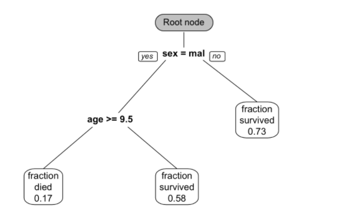

# Tree-Based Methods {#treemodel}

Tree-based models such as random forest and gradient boosted trees are frequent winners in data challenges and competitions which use standard numerical and categorical datasets. These methods, in general, provide a good baseline for model performance. This chapter describes the fundamentals of tree-based models and provides a set of standard modeling procedures.

Load R packages:

```{r, message = FALSE, warning=FALSE, results='hide'}
# install packages from CRAN
p_needed <- c('rpart', 'caret', 'partykit',
              'pROC', 'dplyr', 'ipred',
              'e1071', 'randomForest', 'gbm')

packages <- rownames(installed.packages())
p_to_install <- p_needed[!(p_needed %in% packages)]
if (length(p_to_install) > 0) {
    install.packages(p_to_install)
}

lapply(p_needed, require, character.only = TRUE)
```

## Tree Basics

The tree-based models can be used for regression and classification. The goal is to stratify or segment the predictor space into a number of sub-regions. For a given observation, use the mean (regression) or the mode (classification) of the training observations in the sub-region as the prediction. Tree-based methods are conceptually simple yet powerful. This type of model is often referred to as Classification And Regression Trees (CART). They are popular tools for many reasons: 

1. Do not require user to specify the form of the relationship between predictors and response
1. Do not require (or if they do, very limited) data preprocessing and can handle different types of predictors (sparse, skewed, continuous, categorical, etc.)
1. Robust to co-linearity
1. Can handle missing data
1. Many pre-built packages make implementation as easy as a button push

CART can refer to the tree model in general, but most of the time, it represents the algorithm initially proposed by Breiman [@Breiman1984]. After Breiman, there are many new algorithms, such as ID3, C4.5, and C5.0. C5.0 is an improved version of C4.5, but since C5.0 is not open source, the C4.5 algorithm is more popular. C4.5 was a major competitor of CART. But now, all those seem outdated. The most popular tree models are Random Forest (RF) and Gradient Boosting Machine (GBM). Despite being out of favor in application, it is important to understand the mechanism of the basic tree algorithm. Because the later models are based on the same foundation.  

The original CART algorithm targets binary classification, and the later algorithms can handle multi-category classification. A single tree is easy to explain but has poor accuracy. More complicated tree models, such as RF and GBM, can provide much better prediction at the cost of explainability. As the model becoming more complicated, it is more like a black-box which makes it very difficult to explain the relationship among predictors. There is always a trade-off between explainability and predictability.

```{r treeexample, fig.cap = "This is a classification tree trained from passenger survival data from the Titanic.  Survival probability is predicted using sex and age.", out.width="80%", fig.asp=.75, fig.align="center", echo = FALSE}

```

The reason why it is called "tree" is of course because the structure has similarities. But the direction of the decision tree is opposite of a real tree, the root is on the top, and the leaf is on the bottom (figure \@ref(fig:treeexample)). From the root node, a decision tree divides to different branches and generates more nodes. The new nodes are child nodes, and the previous node is the parent node. At each child node, the algorithm will decide whether to continue dividing. If it stops, the node is called a leaf node. If it continues, then the node becomes the new parent node and splits to produce the next layer of child nodes. At each non-leaf node, the algorithm needs to decide if it will split into branches. A leaf node contains the final "decision" on the sample's value. Here are the important definitions in the tree model:

- **Classification tree**: the outcome is discrete 
- **Regression tree**: the outcome is continuous (e.g. the price of a house)
- **Non-leaf node (or split node)**: the algorithm needs to decide a split at each non-leaf node  (eg:  age >= 9.5) 
- **Root node**: the beginning node where the tree starts
- **Leaf node (or Terminal node)**: the node stops splitting. It has the final decision of the model
- **Degree of the node**: the number of subtrees of a node 
- **Degree of the tree**: the maximum degree of a node in the tree
- **Pruning**: remove parts of the tree that do not provide power to classify instances
- **Branch (or Subtree)**: the whole part under a non-leaf node
- **Child node**: the node directly after and connected to another node 
- **Parent node**: the converse notion of a child

A single tree is easy to explain, but it can be very non-robust, which means a slight change in the data can significantly change the fitted tree. The predictive accuracy is not as good as other regression and classification approaches in this book since a series of rectangular decision regions defined by a single tree is often too naive to represent the relationship between the dependent variable and the predictors. Figure \@ref(fig:decisionregion) shows an example of decision regions based on the `iris` data in R where we use petal length (`Petal.Length`) and width (`Petal.Width`) to decide the type of flowers (`Species`). You can get the data frame using the following code:

```{r}
data("iris")
head(iris)
```

To overcome these shortcomings, researchers have proposed ensemble methods which combine many trees. Ensemble tree models typically have much better predictive performance than a single tree. We will introduce those models in later sections.

```{r decisionregion, fig.cap = "Example of decision regions for different types of flowers based on petal length and width. Three different types of flowers are classified using decisions about length and width.", out.width="80%", fig.asp=.75, fig.align="center", echo = FALSE}
knitr::include_graphics("images/decisionregion.png")
```

## Splitting Criteria 

The splitting criteria used by the regression tree and the classification tree are different. Like the regression tree, the goal of the classification tree is to divide the data into smaller, more homogeneous groups. Homogeneity means that most of the samples at each node are from one class. The original CART algorithm uses Gini impurity as the splitting criterion;  The later ID3, C4.5, and C5.0 use entropy. We will look at three most common splitting criteria.

### Gini impurity

Gini impurity [@Breiman1984] is a measure of non-homogeneity. It is widely used in classification tree. It is defined as:
$$Gini\ Index = \Sigma_i p_i(1-p_i)$$

where $p_i$ is the probability of class $i$ and the interval of Gini is $[0, 0.5]$. For a two-class problem, the Gini impurity for a given node is:

$$p_{1}(1-p_{1})+p_{2}(1-p_{2})$$

It is easy to see that when the sample set is pure, one of the probability is 0  and the Gini score is the smallest. Conversely, when $p_{1} = p_{2} = 0.5$, the Gini score is the largest, in which case the purity of the node is the smallest. Let's look at an example. Suppose we want to determine which students are computer science (CS) majors. Here is the simple hypothetical classification tree result obtained with the gender variable.

<center>

</center>

Let's calculate the Gini impurity for splitting node "Gender": 

1. Gini impurity for "Female" = $\frac{1}{6}\times\frac{5}{6}+\frac{5}{6}\times\frac{1}{6}=\frac{5}{18}$
2. Gini impurity for "Male" = $0\times1+1\times 0=0$

The Gini impurity for the node "Gender" is the following weighted average of the above two scores:

$$\frac{3}{5}\times\frac{5}{18}+\frac{2}{5}\times 0=\frac{1}{6}$$

The Gini impurity for the 50 samples in the parent node is $\frac{1}{2}$. It is easy to calculate the Gini impurity drop from $\frac{1}{2}$ to $\frac{1}{6}$ after splitting. The split using "gender" causes a Gini impurity decrease of $\frac{1}{3}$.  The algorithm will use different variables to split the data and choose the one that causes the most substantial Gini impurity decrease. 

### Information Gain (IG)

Looking at the samples in the following three nodes, which one is the easiest to describe? It is obviously C. Because all the samples in C are of the same type, so the description requires the least amount of information. On the contrary, B needs more information, and A needs the most information. In other words, C has the highest purity, B is the second, and A has the lowest purity. We need less information to describe nodes with higher purity. 

<center>

</center>

A measure of the degree of disorder is entropy which is defined as:

$$Entropy = - \Sigma_i p_i log_2(p_i)$$
where $p_i$ is the probability of class $i$ and the interval of entropy is $[0, 1]$. For a two-class problem:

$$Entropy=-plog_{2}p-(1-p)log_{2}(1-p)$$

where p is the percentage of one type of samples. If all the samples in one node are of one type (such as C), the entropy is 0. If the proportion of each type in a node is 50%, the entropy is 1. We can use entropy as splitting criteria. The goal is to decrease entropy as the tree grows. As an analogy, entropy in physics quantifies the level of disorder and the goal here is to have the least disorder.

Similarly, the entropy of a splitting node is the weighted average of the entropy of each child. In the above tree for the students, the entropy of the root node with all 50 students is  $-\frac{25}{50}log_{2}\frac{25}{50}-\frac{25}{50}log_{2}\frac{25}{50}=1$. Here an entropy of 1 indicates that the purity of the node is the lowest, that is, each type takes up half of the samples.

The entropy of the split using variable "gender" can be calculated  in three steps:

1. Entropy for "Female" = $-\frac{5}{30}log_{2}\frac{5}{30}-\frac{25}{30}log_{2}\frac{25}{30}=0.65$
2. Entropy for "Male" = $0\times1+1\times 0=0$
3. Entropy for the node "Gender" is the weighted average of the above two entropy numbers: $\frac{3}{5}\times 0.65+\frac{2}{5}\times 0=0.39$

So entropy decreases from 1 to 0.39 after the split and the IG for "Gender" is 0.61.

### Information Gain Ratio (IGR)

ID3 uses information gain as the splitting criterion to train the classification tree.  A drawback of information gain is that it is biased towards choosing attributes with many values, resulting in overfitting (selecting a feature that is non-optimal for prediction) [@HSSINA2014]. 

To understand why let's look at another hypothetical scenario. Assume that the training set has students' birth month as a feature. You might say that the birth month should not be considered in this case because it intuitively doesn't help tell the student's major. Yes, you're right. However, practically, we may have a much more complicated dataset, and we may not have such intuition for all the features. So, we may not always be able to determine whether a feature makes sense or not. If we use the birth month to split the data, the corresponding entropy of the node "Birth Month" is 0.24 (the sum of column "Weighted Entropy" in the table), and the information gain is 0.76, which is larger than the IG of "Gender" (0.61). So between the two features, IG would choose "Birth Month" to split the data. 

<center>

</center>

To overcome this problem, C4.5 uses the "information gain ratio" instead of "information gain." The gain ratio is defined as:

$$Gain\ Ratio = \frac{Information\ Gain}{Split\ Information}$$
where split information is:

$$Split\ Information = -\Sigma_{c = 1}^{C}p_clog(p_c)$$
$p_c$ is the proportion of samples in category $c$. For example, there are three students with the birth month in Jan, 6% of the total 50 students. So the $p_c$ for "Birth Month = Jan" is 0.06. The split information measures the intrinsic information that is independent of the sample distribution inside different categories. The gain ratio corrects the IG by taking the intrinsic information of a split into account. 

<center>

</center>

The split information for the birth month is 3.4, and the gain ratio is 0.22, which is smaller than that of gender (0.63). The gain ratio refers to use gender as the splitting feature rather than the birth month. Gain ratio favors attributes with fewer categories and leads to better generalization (less overfitting). 

### Sum of Squared Error (SSE)

The previous two metrics are for classification tree.  The SSE is the most widely used splitting metric for regression. Suppose you want to divide the data set $S$ into two groups of $S_{1}$ and $S_{2}$, where the selection of $S_{1}$ and $S_{2}$ needs to minimize the sum of squared errors:  

\begin{equation}
SSE=\Sigma_{i\in S_{1}}(y_{i}-\bar{y}_{1})^{2}+\Sigma_{i\in S_{2}}(y_{i}-\bar{y}_{2})^{2}
(\#eq:treesse)
\end{equation}

In equation \@ref(eq:treesse), $\bar{y}_{1}$ and $\bar{y}_{2}$  are the average of the sample in $S_{1}$ and $S_{2}$. The way regression tree grows is to automatically decide on the splitting variables and split points that can maximize **SSE reduction**.  Since this process  is essentially a recursive segmentation, this approach is also called recursive partitioning.


Take a look at this simple regression tree for the height of 10 students:

<center>

</center>

You can calculate the SSE using the following code: 

```{r, echo=FALSE}
y1 <- c(156, 167, 165, 163, 160, 170, 160)
y2 <- c(172, 180, 176)
y <- c(y1, y2)
sse1 <- sum((y1 - mean(y1))^2)
sse2 <- sum((y2 - mean(y2))^2)
sse <- sum((y - mean(y))^2)
```

1. SSE for "Female" is 136
2. SSE for "Male" is 32
3. SSE for splitting node "Gender" is the sum of the above two numbers which is 168

SSE for the 10 students in root node is 522.9.  After the split, SSE decreases from 522.9 to 168.

If there is another possible way of splitting, divide it by major, as follows:


<center>

</center>

```{r,echo=FALSE}
y1 = c(156, 167, 160, 170, 172)
y2 = c(180, 176, 165, 163, 160)
# y=c(y1,y2)
sse1 = sum((y1 - mean(y1))^2)
sse2 = sum((y2 - mean(y2))^2)
# sum((y-mean(y))^2)
```

In this situation: 

1. SSE for "Math" is 184
2. SSE for "English" is 302.8
3. SSE for splitting node "Major" is the sum of the above two numbers which is 486.8

Splitting data using variable "gender" reduced SSE from 522.9 to 168; using variable "major" reduced SSE from 522.9 to 486.8. Based on SSE reduction, you should use gender to split the data.

The three splitting criteria mentioned above are the basis for building a tree model.

## Tree Pruning

Pruning is the process that reduces the size of decision trees. It reduces the risk of overfitting by limiting the size of the tree or removing sections of the tree that provide little power.  

**Limit the size**

You can limit the tree size by setting some parameters.

- Minimum sample size at each node: Defining the minimum sample size at the node helps to prevent the leaf nodes having only one sample. The sample size can be a tuning parameter. If it is too large, the model tends to under-fit. If it is too small, the model tends to over-fit. In the case of severe class imbalance, the minimum sample size may need to be smaller because the number of samples in a particular class is small.

- Maximum depth of the tree: If the tree grows too deep, the model tends to over-fit. It can be a tuning parameter.

- Maximum number of terminal nodes: Limit on the terminal nodes works the same as the limit on the depth of the tree. They are proportional.

- The number of variables considered for each split: the algorithm randomly selects variables used in finding the optimal split point at each level. In general, the square root of the number of all variables works best, which is also the default setting for many functions. However, people often treat it as a tuning parameter.

**Remove branches**

Another way is to first let the tree grow as much as possible and then go back to remove insignificant branches. The process reduces the depth of the tree. The idea is to overfit the training set and then correct using cross-validation. There are different implementations.

- cost/complexity penalty

The idea is that the pruning minimizes the penalized error $SSE_{\lambda}$ with a certain value of tuning parameter $\lambda$.

$$SSE_{\lambda} = SSE+\lambda \times (complexity)$$

Here complexity is a function of the number of leaves. For every given $\lambda$, we want to find the tree that minimizes this penalized error. Breiman presents the algorithm to solve the optimization [@Breiman1984].

To find the optimal pruning tree, you need to iterate through a series of values of $\lambda$ and calculate the corresponding SSE. For the same $\lambda$, SSE changes over different samples. Breiman et al. suggested using cross-validation [@Breiman1984] to study the variation of SSE under each $\lambda$ value. They also proposed a standard deviation criterion to give the simplest tree: within one standard deviation, find the simplest tree that minimizes the absolute error. Another method is to choose the tree size that minimizes the numerical error [@Hastie2008].

- Error-based pruning

This method was first proposed by Quinlan [@Quinlan1999]. The idea behind is intuitive. All split nodes of the tree are included in the initial candidate pool. Pruning a split node means removing the entire subtree under the node and setting the node as a terminal node. The data is divided into 3 subsets for:

(1) training a complete tree

(2) pruning

(3) testing the final model

You train a complete tree using the subset (1) and apply the tree on the subset (2) to calculate the accuracy.  Then prune the tree based on a node and apply that on the subset (2) to calculate another accuracy. If the accuracy after pruning is higher or equal to that from the complete tree,  then we set the node as a terminal node. Otherwise, keep the subtree under the node. The advantage of this method is that it is easy to compute. However, when the size of the subset (2) is much smaller than that of the subset (1), there is a risk of over-pruning. Some researchers found that this method results in more accurate trees than pruning process based on tree size [@Espoito1997].

- Error-complexity pruning

This method is to search for a trade-off between error and complexity.  Assume we have a splitting node $t$, and the corresponding subtree $T$. The error cost of the node is defined as:

$$R(t)=r(t)\times p(t) = \frac{misclassified\ sample\ size\ of\ the\ node}{total\ sample\ size}$$

where $r(t)$ is the error rate associate with the node as if it is a terminal node: 

$$r(t)=\frac{misclassified\ sample\ size\ of\ the\ node}{sample\ size\ of\ the\ node}$$

$p(t)$ is the ratio of the sample of the node to the total sample：

$$p(t)=\frac{ sample\ size\ of\ the\ node}{total\ sample\ size}$$

The multiplication $r(t)\times p(t)$ cancels out the sample size of the node. If we keep node $t$, the error cost of the subtree $T$ is:

$$R(T)=\Sigma_{i = no.\ of\ leaves\ in\ subtree\ T} R(i)$$

The error-complexity measure of the node is:

$$a(t)=\frac{R(t)-R(T)_{t}}{no.\ of\ leaves - 1}$$

Based on the metrics above, the pruning process is [@Nikita2012]:

1. Calculate $a$ for every node $t$.
2. Prune the node with the lowest value.
3. Repeat 1 and 2. It produces a pruned tree each time and they form a forest. 
4. Select the tree with the best overall accuracy.

- Minimum error pruning

Niblett and Brotko introduced this pruning method in 1991 [@Cestnik1991]. The process is a bottom-up approach which seeks a single tree that minimizes the expected error rate on new samples. If we prune a splitting point $t$, all the samples under $t$ will be classified as from one category, say category $c$. If we prune the subtree, the expected error rate is:

$$E(t)=\frac{n_{t}-n_{t,c}+k-1}{n_{t}+k}$$

where: 

$$k=number\ of\ categories$$
$$n_{t}=sample\ size\ under\ node\ t$$
$$n_{t,c}= number\ of\ sample\ under\ t\ that\ belong\ to\ category\ c$$

Based on the above definition, the pruning process is [@Espoito1997]:  

- Calculate the expected error rate for each non-leave node if that subtree is pruned
- Calculate the expected error rate for each non-leave node if that subtree is not pruned
- If pruning the node leads to higher expected rate, then keep the subtree; otherwise, prune it.

## Regression and Decision Tree Basic

### Regression Tree

Let's look at the process of building a regression tree [@ISLR15]. There are two steps:

1. Divide predictors space — that is a set of possible values of $X_1,X_2,\dots,X_p$— into $J$ distinct and non-overlapping regions: $R_1,R_2,\dots,R_J$
2. For every observation that falls into the region $R_j$, the prediction is the mean of the response values for the training observations in $R_j$

Let's go back to the previous simple example. If we use the variable "Gender" to divide the observations, we obtain two regions $R_1$ (female) and $R_2$ (male).

<center>

</center>

```{r}
y1 <- c(156, 167, 165, 163, 160, 170, 160)
y2 <- c(172, 180, 176)
```

The sample average for region $R_1$ is `r mean(y1)`, for region $R_2$ is `r mean(y2)`. For a new observation, if it is female, the model predicts the height to be `r mean(y1)`,  if it is male, the predicted height is `r mean(y2)`. Calculating the mean is easy.  Let's look at the first step in more detail which is to divide the space into $R_1, R_2, \dots, R_J$.

In theory,  the region can be any shape. However, to simplify the problem, we divide the predictor space into high-dimensional rectangles. The goal is to divide the space in a way that minimize RSS. Practically, it is nearly impossible to consider all possible partitions of the feature space.  So we use an approach named recursive binary splitting, a top-down, greedy algorithm. The process starts from the top of the tree (root node) and then successively splits the predictor space. Each split produces two branches (hence binary). At each step of the process, it chooses the best split at that particular step, rather than looking ahead and picking a split that leads to a better tree in general (hence greedy).

$$R_{1}(j, s)=\{X|X_j<s\}\ and\ R_{2}(j, s)=\{X|X_j\geq s\}$$

Calculate the RSS decrease after the split. For different $(j,s)$, search for the combination that minimizes the RSS, that is to minimize the following: 

$$\Sigma_{i:x_i\in R_1(j,s)}(y_i-\hat{y}_{R_{1}})^2+\Sigma_{i:x_i\in R_2(j,s)}(y_i-\hat{y}_{R_{2}})^2$$

where $\hat{y}_{R_1}$ is the mean of all samples in $R_1$, $\hat{y}_{R_2}$ is the mean of samples in $R_2$. It can be quick to optimize the equation above. Especially when $p$ is not too large. 

Next, we continue to search for the split that optimize the RSS. Note that the optimization is limited in the sub-region. The process keeps going until a stopping criterion is reaches. For example, continue until no region contains more than 5 samples or the RSS decreases less than 1%. The process is like a tree growing.

<center>

</center>


There are multiple R packages for building regression tree, such as `ctree`, `rpart` and `tree`. `rpart` is widely used for building a single tree. The split is based on CART algorithm, using `rpart()` function from the package. There are some parameters that controls the model fitting, such as the minimum number of observations that must exist in a node in order for a split to be attempted,  the minimum number of observations in any leaf node etc. You can set those parameter using `rpart.control`. 

A more convenient way is to use `train()` function in `caret` package. The package can call `rpart()` function and train the model through cross-validation. In this case, the most common parameters are `cp` (complexity parameter) and `maxdepth` (the maximum depth of any node of the final tree). To  tune the complexity parameter, set `method = "rpart"`. To tune the maximum tree depth, set `method = "rpart2"`. Now let us use the customer expenditure regression example to illustrate: 

```{r}
dat <- read.csv("http://bit.ly/2P5gTw4")
# data cleaning: delete wrong observations
dat <- subset(dat, store_exp > 0 & online_exp > 0)
# use the 10 survey questions as predictors
trainx <- dat[, grep("Q", names(dat))]
# use the sum of store and online expenditure as response variable
# total expenditure = store expenditure + online expenditure
trainy <- dat$store_exp + dat$online_exp
set.seed(100)
rpartTune <- train(trainx, trainy, 
                   method = "rpart2", 
                   tuneLength = 10, 
    trControl = trainControl(method = "cv"))
plot(rpartTune)
```

RMSE doesn't change much when the maximum is larger than 2. So we set the maximum depth to be 2 and refit the model:

```{r}
rpartTree <- rpart(trainy ~ ., data = trainx, maxdepth = 2)
```

You can check the result using `print()`: 

```{r}
print(rpartTree)
```

You can see that the final model picks `Q3` and `Q5`  to predict total expenditure. To visualize the tree, you can convert `rpart` object to `party` object using `partykit` then use  `plot()` function:

```{r error=FALSE, warning=FALSE, message= FALSE}
rpartTree2 <- as.party(rpartTree)
plot(rpartTree2)
```

### Decision Tree

Similar to a regression tree, the goal of a classification tree is to stratifying the predictor space into a number of sub-regions that are more homogeneous. The difference is that a classification tree is used to predict a categorical response rather than a continuous one. For a classification tree, the prediction is the most commonly occurring class of training observations in the region to which an observation belongs. The splitting criteria for a classification tree are different. The most common criteria are entropy and Gini impurity.  CART uses Gini impurity and  C4.5 uses entropy. 

When the predictor is continuous, the splitting process is straightforward. When the predictor is categorical, the process can take different approaches:

1. Keep the variable as categorical and group some categories on either side of the split. In this way, the model can make more dynamic splits but must treat the categorical predictor as an ordered set of bits.
2. Use one-hot encoding (figure \@ref(fig:onehotencoding)). Encode the categorical variable as a set of dummy (binary) variables. The model considers these dummy variables separately and evaluates each of these on one split point (because there are only two possible values: 0/1). This way, the information in the categorical variable is decomposed into independent bits of information. 

```{r onehotencoding, fig.cap = "One-hot encoding", out.width="100%", fig.asp=.75, fig.align="center", echo = FALSE}
knitr::include_graphics("images/one_hot_encoding.png")
```


When fitting tree models, people need to choose the way to treat categorical predictors. If you know some of the categories have higher predictability, then the first approach may be better. In the rest of this section, we will build tree models using the above two approaches and compare them. 

Let's build a classification model to identify the gender of the customer:

```{r}
dat <- read.csv("http://bit.ly/2P5gTw4")
# use the 10 survey questions as predictors
trainx1 <- dat[, grep("Q", names(dat))]
# add a categorical predictor
# use two ways to treat categorical predictor
# trainx1: use approach 1, without encoding
trainx1$segment <- dat$segment

# trainx2: use approach 2, encode it to a set of dummy variables
dumMod <- dummyVars(
  ~.,
  data = trainx1,
  # Combine the previous variable and the level name
  # as the new dummy variable name
  levelsOnly = F
  )
trainx2 <- predict(dumMod, trainx1)
# the response variable is gender
trainy <- dat$gender

# check outcome balance
table(dat$gender) %>% prop.table()
```

The outcome is pretty balanced, with 55% female and 45% male. We use `train()` function in `caret` package to call `rpart` to build the model. We can compare the model results from the two approaches:

```{r, echo=FALSE, results=FALSE}
set.seed(100)
rpartTune1 <- caret::train(
  trainx1, trainy, method = "rpart",
  tuneLength = 30,
  metric = "ROC", 
  trControl = trainControl(method = "cv",
                           summaryFunction = twoClassSummary,
                           classProbs = TRUE,
                           savePredictions = TRUE))
rpartTune1
```

```pre
CART 

1000 samples
  11 predictor
   2 classes: 'Female', 'Male' 

No pre-processing
Resampling: Cross-Validated (10 fold) 
Summary of sample sizes: 901, 899, 900, 900, 901, 900, ... 
Resampling results across tuning parameters:

  cp       ROC     Sens    Spec  
  0.00000  0.6937  0.6517  0.6884
  0.00835  0.7026  0.6119  0.7355
  0.01670  0.6852  0.5324  0.8205
  0.02505  0.6803  0.5107  0.8498
  0.03340  0.6803  0.5107  0.8498
  
  ......

  0.23380  0.6341  0.5936  0.6745
  0.24215  0.5556  0.7873  0.3240

ROC was used to select the optimal model using the largest value.
The final value used for the model was cp = 0.00835.
```

The above keeps the variable as categorical without encoding. Here `cp` is the complexity parameter. It is used to decide when to stop growing the tree. `cp = 0.01` means the algorithm only keeps the split that improves the corresponding metric by more than 0.01. Next, let's encode the categorical variable to be a set of dummy variables and fit the model again:

```{r}
rpartTune2 <- caret::train(
  trainx2, trainy, method = "rpart",
  tuneLength = 30,
  metric = "ROC", 
  trControl = trainControl(method = "cv",
                           summaryFunction = twoClassSummary,
                           classProbs = TRUE,
                           savePredictions = TRUE)
  )
```

Compare the results of the two approaches.

```{r, message=FALSE}
rpartRoc <- pROC::roc(response = rpartTune1$pred$obs,
                predictor = rpartTune1$pred$Female,
                levels = rev(levels(rpartTune1$pred$obs)))

rpartFactorRoc <- pROC::roc(response = rpartTune2$pred$obs,
                      predictor = rpartTune2$pred$Female,
                      levels = rev(levels(rpartTune1$pred$obs)))

plot.roc(rpartRoc, 
     type = "s", 
     print.thres = c(.5),
     print.thres.pch = 3,
     print.thres.pattern = "",
     print.thres.cex = 1.2,
     col = "red", legacy.axes = TRUE,
     print.thres.col = "red")

plot.roc(rpartFactorRoc,
     type = "s",
     add = TRUE,
     print.thres = c(.5),
     print.thres.pch = 16, legacy.axes = TRUE,
     print.thres.pattern = "",
     print.thres.cex = 1.2)

legend(.75, .2,
       c("Grouped Categories", "Independent Categories"),
       lwd = c(1, 1),
       col = c("black", "red"),
       pch = c(16, 3))
```

In this case, the two approaches lead to similar model performance. 

Single tree is straightforward and easy to interpret but it has problems:

1. Low accuracy 
2. Unstable: little change in the training data leads to very different trees.

One way to overcome those is to use an ensemble of trees. In the rest of this chapter, we will introduce three ensemble methods (combine many models’ predictions): bagging tree, random forest, and gradient boosted machine. Those ensemble approaches have significant higher accuracy and stability. However, it comes with the cost of interpretability.

## Bagging Tree

As mentioned before, a single tree is unstable. If you randomly separate the sample to be two parts and fit tree model on each, you can get two very different trees. A stable model should give a similar result on different random samples. Some traditional statistical models have high stability, such as linear regression. *Ensemble methods* appeared in the 1990s which can effectively stabilize the model. *Bootstrapping* is a type of process where you repeated draw samples of the same size from a single original sample with replacement [@Efron1986].  *Bootstrap aggregation* (Bagged) is an ensemble technique proposed by Leo Breiman (Breiman 1996a). It uses bootstrapping in conjunction with any model to construct an ensemble.  The process is very straightforward:

\begin{algorithm}
\caption{Bagging tree}\label{baggingtreealgorithm} 
\begin{algorithmic}[1] 
\State Build a model on different bootstrap samples to form an ensemble, say $B$ samples
\State For a new sample, each model will give a prediction: $\hat{f}^1(x),\hat{f}^2(x)\dots,\hat{f}^B(x)$
\State The bagged model's prediction is the average of all the predictions: $$\hat{f}_{avg}(x)=\frac{1}{B}\Sigma^B_{b=1}\hat{f}^b(x)$$
\end{algorithmic}
\end{algorithm}

Assume that there are $n$ independent random variables $Z_1,\dots,Z_n$ with variance $\sigma^2$. Then the variance of the mean $\bar{Z}$ is $\frac{\sigma^2}{n}$. It is easy to see why bagged models have less variance. Since bootstrapping is to sample with replacement, it means some samples are selected multiple times and some not at all. Those left out samples are called out-of-bag. You can use the out-of-bag sample to access the model performance. For regression, the prediction is a simple average. For classification, the prediction is the category with the most "votes." Here, the number of trees, $B$ is a parameter you need to decide, i.e. tuning parameter. **Bagging is a general approach that can be applied to different learners. Here we only discuss in the context of decision trees.**

The advantages of bagging tree are:

- Bagging stabilizes the model predictions by averaging the results. If we have 10 bootstrap samples and fit a single tree on each of those, we may get 10 trees with very different structures and leading to different predictions for a new sample. But if we use the average of the 10 predictions as the final prediction, then the result is much more stable. It means if we have another 10 samples and do it all-over again, we will get very similar averaged prediction.

- Bagging provides more accurate predictions. If the goal is to predict rather than interpret, then the ensemble approach definitely has an advantage, especially for unstable models. However, for stable models (such as regression, MARS), bagging may bring marginal improvement for the model performance.

- Bagging can use out-of-bag samples to evaluate model performance. For each model in the ensemble, we can calculate the value of the model performance metric (you can decide what metric to use). You can use the average of all the out-of-bag performance values to gauge the predictive performance of the entire ensemble. This correlates well with either cross-validation estimates or test set estimates. On average, each tree uses about 2/3 of the samples, and the rest 1/3 is used as out-of-bag. When the number of bootstrap samples is large enough, the out-of-bag performance estimate approximates that from leave one out cross-validation.

You need to choose the number of bootstrap samples. The author of "Applied Predictive Modeling" [@APM] points out that often people see an exponential decrease in predictive improvement as the number of iterations increases. Most of the predictive power is from a small portion of the trees. Based on their experience, model performance can have small improvements up to 50 bagging iterations. If it is still not satisfying, they suggest trying other more powerfully predictive ensemble methods such as random forests and boosting which will be described in the following sections.

The disadvantages of bagging tree are:

- As the number of bootstrap samples increases, the computation and memory requirements increase as well. You can mitigate this disadvantage by parallel computing. Since each bootstrap sample and modeling is independent of any other sample and model, you can easily parallelize the bagging process by building those models separately and bring back the results in the end to generate the prediction.

- The bagged model is difficult to explain which is common for all ensemble approaches. However, you can still get variable importance by combining measures of importance across the ensemble. For example, we can calculate the RSS decrease for each variable across all trees and use the average as the measurement of the importance.

- Since the bagging tree uses all of the original predictors as everey split of every tree, those trees are related with each other.  The tree correlation prevents bagging from optimally reducing the variance of the predicted values. See [@Hastie2008] for a mathematical illustration of the tree correlation phenomenon.

Let's look at how to use R to build bagging tree using survey question to predict customer gender based on the customer dataset. Get the predictors and response variable first:

```{r}
dat <- read.csv("http://bit.ly/2P5gTw4")
# use the 10 survey questions as predictors
trainx <- dat[, grep("Q", names(dat))]
# add segment as a predictor 
# don't need to encode it to dummy variables
trainx$segment <- as.factor(dat$segment)
# use gender as the response variable
trainy <- as.factor(dat$gender)
```

Then fit the model using train function in caret package. Here we just set the number of trees to be 1000. You can tune that parameter. 

```r
set.seed(100)
bagTune <- caret::train(trainx, trainy, 
                           method = "treebag",
                           nbagg = 1000,
                           metric = "ROC",
                           trControl = trainControl(method = "cv",
                           summaryFunction = twoClassSummary,
                           classProbs = TRUE,
                           savePredictions = TRUE))
```

```{r, echo=FALSE}
load("../../../Dropbox/Book_DS/Data/bagTune.RData")
```

The model results are:

```{r}
bagTune
```

Since we only have a handful of variables in this example, the maximum AUC doesn't improve by using bagging tree. But it makes a difference when we have more predictors.

## Random Forest

Since the tree correlation prevents bagging from optimally reducing the variance of the predicted values, a natural way to improve the model performance is to reduce the correlation among trees. That is what random forest aims to do: improve the performance of bagging by de-correlating trees.

From a statistical perspective, you can de-correlate trees by introducing randomness when you build each tree. One approach [@Ho1998; @amit1997] is to randomly choose $m$ variables to use each time you build a tree. Dietterich [@Dietterich2000] came up with the idea of random split selection which is to randomly choose $m$ variables to use at each splitting node. Based on the different generalizations to the original bagging algorithm, Breiman [@Breiman2001] came up with a unified algorithm called *random forest.* 

When building a tree, the algorithm randomly chooses $m$ variables to use at each splitting node. Then choose the best one out of the $m$ to use at that node. In general, people use $m=\sqrt{p}$. For example, if we use 10 questions from the questionnaire as predictors, then at each node, the algorithm will randomly choose 4 candidate variables. Since those trees in the forest don't always use the same variables, tree correlation is less than that in bagging. It tends to work better when there are more predictors. Since we only have 10 predictors here, the improvement from the random forest is marginal. The number of randomly selected predictors is a tuning parameter in the random forest.  Since random forest is computationally intensive, we suggest starting with value around $m=\sqrt{p}$. Another tuning parameter is the number of trees in the forest. You can start with 1000 trees and then increase the number until performance levels off. The basic random forest is shown in Algorithm \@ref(randomforestalgorithm).
 
\begin{algorithm}
\caption{Random forest}\label{randomforestalgorithm} 
\begin{algorithmic}[1] 
\State Select the number of trees, B
    \For {i=1 to B}
        \State Generate a bootstrap sample of the original data
        \State Train a tree on this sample
            \For {each split}
                \State Randomly select m (< p) predictors
                \State Choose the best one out of the $m$ and partition the data
            \EndFor
        \State Use typical tree model stopping criteria to determine when a tree is complete without pruning
    \EndFor
\end{algorithmic}
\end{algorithm}


When $m=p$, random forest is equal to the bagging tree. When the predictors are highly correlated, then smaller $m$ tends to work better. Let's use the `caret` package to train a random forest:

```r
# tune across a list of numbers of predictors
mtryValues <- c(1:5)
set.seed(100)
rfTune <- train(x = trainx, 
               y = trainy,
               # set the model to be random forest
               method = "rf",
               ntree = 1000,
               tuneGrid = data.frame(.mtry = mtryValues),
               importance = TRUE,
               metric = "ROC",
               trControl = trainControl(method = "cv",
                           summaryFunction = twoClassSummary,
                           classProbs = TRUE,
                           savePredictions = TRUE))
```

```{r, echo=FALSE}
load("../../../Dropbox/Book_DS/Data/rfTune.RData")
```

```{r}
rfTune
```

In this example, since the number of predictors is small, the result of the model indicates that the optimal number of candidate variables at each node is 1.  The optimal AUC is not too much higher than that from bagging tree. 

If you have selected the values of tuning parameters, you can also use the randomForest package to fit a random forest. 

```{r}
rfit = randomForest(trainy ~ ., trainx, mtry = 1, ntree = 1000)
```

Since bagging tree is a special case of random forest, you can fit the bagging tree by setting $mtry=p$. Function `importance()` can return the importance of each predictor:

```{r}
importance(rfit)
```

You can use varImpPlot() function to visualize the predictor importance:

```{r}
varImpPlot(rfit)
```
It is easy to see from the plot that `segment` and `Q4` are the top two variables to classify gender.

## Gradient Boosted Machine

Boosting models were developed in the 1980s [@Valiant1984; @KV1989] and were originally for classification problems. Due to the excellent model performance, they were widely used for a variety of applications, such as gene expression [@dudoit2002; @bendor2000], chemical substructure classification [@Varmuza2003], music classification [@Bergstra2006], etc. The first effective implementation of boosting is Adaptive Boosting (AdaBoost) algorithm came up by Yoav Freund and Robert Schapire in 1996 [@Schapire1999]. After that, some researchers [@Friedman2000] started to connect the boosting algorithm with some statistical concepts, such as loss function, additive model, logistic regression. Friedman pointed out that boosting can be considered as a forward stagewise additive model that minimizes exponential loss. The new view of boosting in a statistical framework enabled the method to be extended to regression problems. 

The idea is to combine a group of weak learners (a classifier that is marginally better than random guess) to produce a strong learner.  Like bagging, boosting is a general approach that can be applied to different learners. Here we focus on the decision tree. Recall that both bagging and random forest create multiple copies of the original training data using the bootstrap, fitting a separate decision tree to each copy and combining all the results to create a single prediction. Boosting also creates different trees but the trees are grown sequentially and each tree is a weak learner. Any modeling technique with tuning parameters can produce a range of learners, from weak to strong. You can easily make a weak learner by restricting the depth of the tree. There are different types of boosting. Here we introduce two main types: adaptive boosting and stochastic gradient boosting.

### Adaptive Boosting

Yoav Freund and Robert Schapire [@Freund1997] came up the AdaBoost.M1 algorithm. Consider a binary classification problem where the response variable has two categories $Y \in \{-1, 1\}$. Given predictor matrix, $X$, construct a classifier $G(X)$ that predicts $1$ or $-1$. The corresponding error rate in the training set is:

$$\bar{err}=\frac{1}{N}\Sigma_{i=1}^NI(y_i\neq G(x_i))$$

The algorithm produces a series of classifiers $G_m(x),\ m=1,2,...,M$ from different iterations. In each iteration, it finds the best classifier based on the current weights. The misclassified samples in the $m^{th}$ iteration will have higher weights in the $(m+1)^{th}$ iteration and the correctly classified samples will have lower weights. As it moves on, the algorithm will put more effort into the "difficult" samples until it can correctly classify them. So it requires the algorithm to change focus at each iteration. At each iteration, the algorithm will calculate a stage weight based on the error rate. The final prediction is a weighted average of all those weak classifiers using stage weights from all the iterations:

$$G(x)=sign ( \Sigma_{m=1}^M \alpha_{m}G_m(x))$$
where $\alpha_1,\alpha_2,...,\alpha_M$ are the weights from different iterations.

\begin{algorithm}
\caption{AdaBoost.M1}\label{AdaBoostM1algorithm} 
\begin{algorithmic}[1] 
\State Response variables have two values: +1 and -1
\State Initialize the observation to have the same weights:  $w_i=\frac{1}{N},i=1,...,N$
\For {m = 1 to M}
    \State Fit a classifier $G_m(x)$ using weights $w_i$
    \State Compute the error rate: $err_m=\frac{\Sigma_{i=1}^Nw_i I(y_i\neq G_m(x_i))}{\Sigma_{i=1}^Nw_i}$
    \State Compute the stage weight: $\alpha_m=log\frac{1-err_m}{err_m}$
    \State Update $w_i = w_i\cdot exp[\alpha_m\cdot I(y_i \neq G_m(x_i))],\ i=1,2,\dots,N$
\EndFor
\State Calculate the prediction：$G(x)=sign[\Sigma_{m=1}^M\alpha_mG_m(x)]$, where $sign(\cdot)$ means if $\cdot$ is positive, then the sample is classified as +1, -1 otherwise.
\end{algorithmic}
\end{algorithm}

Since the classifier $G_m(x)$ returns discrete value, the AdaBoost.M1 algorithm is known as  “Discrete AdaBoost” [@Friedman2000]. You can revise the above algorithm if it returns continuousf value, for example, a probability [@Friedman2000].  As mentioned before, boosting is a general approach that can be applied to different learners. Since you can easily create weak learners by limiting the depth of the tree, the boosting tree is a common method. Since the classification tree is a low bias/high variance technique, ensemble decreases model variance and lead to low bias/low variance model. See Breinman [@Breiman1998] for more explanation about why the boosting tree performs well in general. However, boosting can not significantly improve the low variance model. So applying boosting to K-Nearest Neighbor (KNN) doesn't lead to as good improvement as applying boosting to statistical learning methods like naive Bayes [@Bauer1999]. 

### Stochastic Gradient Boosting

As mentioned before, Friedman [@Friedman2000] provided a statistical framework for the AdaBoost algorithm and pointed out that boosting can be considered as a forward stagewise additive model that minimizes exponential loss. The framework led to some generalized algorithms such as Real AdaBoost, Gentle AdaBoost, and LogitBoost. Those algorithms later were unified under a framework called gradient boosting machine. The last section of the chapter illustrates how boosting can be considered as an additive model. 

Consider a 2-class classification problem. You have the response $y \in \{-1, 1\}$ and the sample proportion of class 1 from the training set is $p$. $f(x)$ is the model prediction in the range of $[-\infty, +\infty]$ and the predicted event probability is $\hat{p}=\frac{1}{1+exp[-f(x)]}$. The gradient boosting for this problem is as follows:

\begin{algorithm}
\caption{Stochastic gradient boosting for 2-class classification}\label{gbmalgorithm} 
\begin{algorithmic}[1] 
\State Response variables have two values: +1 and -1
\State Initialize all  predictions to the sample log-odds: $f_{i} = log \frac{\hat{p}}{1- \hat{p}}$
\For {j=1 ... M}
    \State Compute predicted event probability:  $\hat{p}_i=\frac{1}{1+exp[-f_{i}(x)]}$
    \State Compute the residual (i.e. gradient): $z_i=y_i-\hat{p}_i$
    \State Randomly sample the training data
    \State Train a tree model on the random subset using the residuals as the outcome
    \State Compute the terminal node estimates of the Pearson residuals: $r_i=\frac{1/n\Sigma_i^n(y_i-\hat{p}_i)}{1/n\Sigma_i^n\hat{p}_i(1-\hat{p}_i)}$
    \State Update f：$f_i=f_i+\lambda f_i^{(j)}$
\EndFor
\end{algorithmic}
\end{algorithm}

When using the tree as the base learner, basic gradient boosting has two tuning parameters: tree depth and the number of iterations. You can further customize the algorithm by selecting a different loss function and gradient [@Hastie2008].  The final line of the loop includes a regularization strategy. Instead of adding $f_i^{(j)}$ to the previous iteration's $f_i$, only a fraction of the value is added. This fraction is called learning rate which is $\lambda$ in the algorithm. It can take values between 0 and 1 which is another tuning parameter of the model.

The way to calculate variable importance in boosting is similar to a bagging model. You get variable importance by combining measures of importance across the ensemble. For example, we can calculate the Gini index improvement for each variable across all trees and use the average as the measurement of the importance.

Boosting is a very popular method for classification. It is one of the methods that can be directly applied to the data without requiring a great deal of time-consuming data preprocessing. Applying boosting on tree models significantly improves predictive accuracy. Some advantages of trees that are sacrificed by boosting are speed and interpretability. 

Let's look at the R implementation. 

```r
gbmGrid <- expand.grid(interaction.depth = c(1, 3, 5, 7, 9),
                       n.trees = 1:5,
                       shrinkage = c(.01, .1),
                       n.minobsinnode = c(1:10))

set.seed(100)
gbmTune <- caret::train(x = trainx, 
                y = trainy,
                method = "gbm",
                tuneGrid = gbmGrid,
                metric = "ROC",
                verbose = FALSE,
                trControl = trainControl(method = "cv",
                           classProbs = TRUE,
                           savePredictions = TRUE))
```

```{r, echo=FALSE}
load("../../../Dropbox/Book_DS/Data/gbmTune.RData")
```

```{r, results=FALSE}
# only show part of the output
gbmTune
```

```html
Stochastic Gradient Boosting 

1000 samples
  11 predictor
   2 classes: 'Female', 'Male' 

No pre-processing
Resampling: Cross-Validated (10 fold) 
Summary of sample sizes: 899, 900, 900, 899, 899, 901, ... 
Resampling results across tuning parameters:

shrinkage interaction.depth n.minobsinnode n.trees ROC    Sens Spec    
0.01      1                 1              1       0.6821 1.00 0.00
0.01      1                 1              2       0.6882 1.00 0.00
  .
  .
  .
0.01      5                 8              4       0.7096 1.00 0.00
0.01      5                 8              5       0.7100 1.00 0.00
0.01      5                 9              1       0.7006 1.00 0.00
0.01      5                 9              2       0.7055 1.00 0.00
 [ reached getOption("max.print") -- omitted 358 rows ]

ROC was used to select the optimal model using the largest value.
The final values used for the model were n.trees = 4, 
interaction.depth = 3, shrinkage = 0.01 and n.minobsinnode = 6.
```

The results show that the tuning parameter settings that lead to the best ROC are `n.trees = 4` (number of trees), `interaction.depth = 3` (depth of tree),  `shrinkage = 0.01` (learning rate)  and `n.minobsinnode = 6` (minimum number of observations in each node).

Now, let's compare the results from the three tree models.

```{r, message=FALSE}
treebagRoc <- pROC::roc(response = bagTune$pred$obs,
                        predictor = bagTune$pred$Female,
                        levels = rev(levels(bagTune$pred$obs)))

rfRoc <- pROC::roc(response = rfTune$pred$obs,
             predictor = rfTune$pred$Female,
             levels = rev(levels(rfTune$pred$obs)))

gbmRoc <- pROC::roc(response = gbmTune$pred$obs,
              predictor = gbmTune$pred$Female,
              levels = rev(levels(gbmTune$pred$obs)))

plot.roc(rpartRoc, 
     type = "s", 
     print.thres = c(.5), print.thres.pch = 16,
     print.thres.pattern = "", print.thres.cex = 1.2,
     col = "black", legacy.axes = TRUE,
     print.thres.col = "black")

plot.roc(treebagRoc, 
     type = "s", 
     add = TRUE, 
     print.thres = c(.5), print.thres.pch = 3, 
     legacy.axes = TRUE, print.thres.pattern = "", 
     print.thres.cex = 1.2,
     col = "red", print.thres.col = "red")

plot.roc(rfRoc, 
     type = "s", 
     add = TRUE, 
     print.thres = c(.5), print.thres.pch = 1, 
     legacy.axes = TRUE, print.thres.pattern = "", 
     print.thres.cex = 1.2,
     col = "green", print.thres.col = "green")

plot.roc(gbmRoc, 
     type = "s", 
     add = TRUE, 
     print.thres = c(.5), print.thres.pch = 10, 
     legacy.axes = TRUE, print.thres.pattern = "", 
     print.thres.cex = 1.2,
     col = "blue", print.thres.col = "blue")

legend(0.2, 0.5, cex = 0.8,
       c("Single Tree", "Bagged Tree", 
         "Random Forest", "Boosted Tree"),
       lwd = c(1, 1, 1, 1),
       col = c("black", "red", "green", "blue"),
       pch = c(16, 3, 1, 10))
```

Since the data here doesn't have many variables, we don't see a significant difference among the models. But you can still see those ensemble methods are better than a single tree. In most of the real applications, ensemble methods perform much better.  Random forest and boosting trees can be a baseline model. Before exploring different models, you can quickly run a random forest to see the performance and then try to improve that performance. If the performance you got from the random forest is not too much better than guessing, you should consider collecting more data or reviewing the problem to frame it a different way instead of trying other models. Because it usually means the current data is not enough to solve the problem.

<!--
### Boosting as Additive Model

This section illustrates how boosting is a forward stagewise additive model that minimizes exponential loss [@Friedman2000]. Many seemingly different models can be represented as a **basis expansion model**. Recall the classifier  obtained by the AdaBoost.M1 algorithm:

$$G(x)=sign ( \Sigma_{m=1}^M \alpha_{m}G_m(x))$$

The above expression fits in the framework of basis expansion which is as following:

\begin{equation}
f(x)=\Sigma_{m=1}^M \beta_m b(x,\gamma_m)
(\#eq:basisexp)
\end{equation}

where $\beta_m,\ m=1,\dots,M$ is expansion coefficient and $b(x,\gamma)\in \mathbb{R}$ is basis function.  Many of the learning methods fit into this additive framework. Hastie et al discuss basis expansion in detail in Chapter 5 of @Hastie2008 and cover the additive expansion for different learning techniques, such as single-hidden-layer neural networks (Chapter 11) and MARS (Section 9.4). These models are fitted by minimizing a designated loss function averaged over the training data:

\begin{equation}
\underset{\{\beta_m,\gamma_m\}_i^M}{min}\Sigma_{i=1}^N L\left(y_i,\Sigma_{m=1}^M\beta_{m}b(x_i;\gamma_m)\right)
(\#eq:additiveloss)
\end{equation}

Different models have different basis function $b(x_i;\gamma_m)$. You can also customize loss function $L(\cdot)$, such as squared-error loss, or likelihood-based loss. Optimizing the loss function across the whole training set is usually computation costly no matter the choice of basis and loss. The good news is that the problem can be simplified as fitting a single basis function. 

$$\underset{\beta,\gamma}{min}=\Sigma_{i=1}^N L(y_i,\beta b(x_i;\gamma))$$

The forward stagewise algorithm approximates the optimal solution of equation \@ref(eq:additiveloss). It adds new basis functions to the expansion without adjusting the previous ones. The forward stagewise additive algorithm is as following (Section 10.2 of @Hastie2008):

\begin{algorithm}
\caption{Forward stagewise algorithm}\label{forwardstagewisealgorithm} 
\begin{algorithmic}[1] 
\State Initialize $f_0(x)=0$
\For {$m=1,\dots,M$}
    \State Compute
    $$(\beta_m,\gamma_m)=\underset{\beta,\gamma}{argmin}\Sigma_{i=1}^NL(y_i,f_{m-1}(x_i)+\beta b(x_i;\gamma))$$
    \State Set $f_m(x)=f_{m-1}(x)+\beta_m b(x;\gamma_m)$
\EndFor
\end{algorithmic}
\end{algorithm}

At iteration m, it will search for the optimal $b(x;\gamma_m)$ and $\beta_m$ based on the previous basis function $f_{m-1}(x)$. And then add the new basis $b(x;\gamma_m)\beta_m$ to the previous basis function to get a new basis function $f_m(x)$ without changing any parameters from previous steps. Assume we use squared-error loss:

$$L(y,f(x))=(y-f(x))^2$$

Then we have: 

$$L(y_i,f_{m-1}(x_i)+\beta b(x_i;\gamma))=(y_i-f_{m-1}(x_i)-\beta b(x_i;\gamma))^2$$

where $y_i-f_{m-1}(x_i)$ is the residual for sample i based on the previous model. That is to say, it is fitting the new basis using the residual of the previous step. 

However, the squared-error loss is generally not a good choice. For a regression problem, it is susceptible to outliers. It doesn't fit the classification problem since the response is categorical. Hence we often consider other loss functions.

Now let us go back to the AdaBoost.M1 algorithm. It is actually a special case of the above forward stagewise model when the loss function is: 

$$L(y,f(x))=exp(-yf(x))$$

In AdaBoost.M1, the basis function is the classifier from each iteration $G_m(x)\in \{-1,1\}$. If we use the exponential loss, the optimization problem is 

\begin{equation}
\begin{array}{ccc}
(\beta_m,G_m) & = & \underset{\beta,G}{argmin}\Sigma_{i=1}^N exp[-y_i(f_{m-1}(x_i)+\beta G(x_i))]\\
& = & \underset{\beta, G}{argmin}\Sigma_{i=1}^N exp[-y_i \beta G(x_i)]\cdot exp[-y_if_{m-1}(x_i)]\\
& = & \underset{\beta, G}{argmin}\Sigma_{i=1}^N w_i^m exp[-y_i\beta G(x_i)]
\end{array}
(\#eq:explossadaboost1)
\end{equation}


where  $w_i^m= exp[-y_if_{m-1}(x_i)]$. It does not depend on $\beta$ and $G(x)$. So we can consider it as the weight for each sample. Since the weight is related to $f_{m-1}(x_i)$, it changes each iteration. We can further decompose  equation \@ref(eq:explossadaboost1): 

\begin{equation}
\begin{array}{ccc}
 &  & \underset{\beta,G}{argmin}\Sigma_{i=1}^{N}w_{i}^{m}exp[-y_{i}\beta G(x_{i})]\\
 & = & \underset{\beta,G}{argmin}\Sigma_{i=1}^{N}\left\{ w_{i}^{m}e^{-\beta}I(y_{i}=G(x))+w_{i}^{m}e^{\beta}I(y_{i}\neq G(x))\right\} \\
 & = & \underset{\beta,G}{argmin}\Sigma_{i=1}^{N}\left\{ w_{i}^{m}e^{-\beta}[1-I(y_{i}\neq G(x))]+w_{i}^{m}e^{\beta}I(y_{i}\neq G(x))\right\} \\
 & = & \underset{\beta,G}{argmin}\left\{ (e^{\beta}-e^{-\beta})\cdot\Sigma_{i=1}^{N}w_{i}^{m}I(y_{i}\neq G(x_{i}))+e^{-\beta}\cdot\Sigma_{i=1}^{N}w_{i}^{m}\right\} 
\end{array}
(\#eq:explossadaboost2)
\end{equation}

when $\beta >0$, the solution for equation \@ref(eq:explossadaboost2) is:

$$G_{m} = \underset{G}{argmin}\Sigma_{i=1}^{N}w_{i}^{m}I(y_{i}\neq G(x))$$

It is the classifier that minimizes the weighted error.  Plug the above $G_m$ into equation \@ref(eq:explossadaboost2). Take the derivative with respect to $\beta$ and set it to be 0 to solve the optimal $\beta_m$: 

$$\beta_m =\frac{1}{2}ln\frac{1-err_m}{err_m}$$

where

$$err_m = \frac{\Sigma_{i=1}^N w_i^{m}I(y_i \neq G_m(x_i))}{\Sigma_{i=1}^N w_i^{m}}$$

According to the forward stagewise algorithm, the result is updated as:

$$f_m(x)=f_{m-1}(x)+\beta_m G_m(x)$$

We can go ahead and get the weight for the next iteration:

\begin{equation}
\begin{array}{ccc}
w_i^{m+1} & = & exp[-y_if_m (x_i)]\\
& = & exp[-y_if_{m-1}(x)-y_i \beta_m G_m(x)]\\
& = & w_{i}^{m}\cdot exp[-\beta_m y_i G_m(x_i)]
\end{array}
(\#eq:explossadaboost3)
\end{equation}

Since $-y_i G_m(x_i)=2\cdot I(y_i \neq G_m(x_i))-1$, equation \@ref(eq:explossadaboost3) can be written as:

$$w_i^{m+1}=w_i^m \cdot exp[\alpha_mI(y_i\neq G_m(x_i))] \cdot exp[-\beta_m]$$

where  $\alpha_m=2\beta_m=log\frac{1-err_m}{err_m}$ is the same with the $\alpha_m$ in AdaBoost.M1 algorithm we showed before. So AdaBoost.M1 is a special case of a forward stagewise additive model using exponential loss. For comparing and selecting different loss functions, you can refer to section 10.5 and 10.6 in [@Hastie2008].
-->
