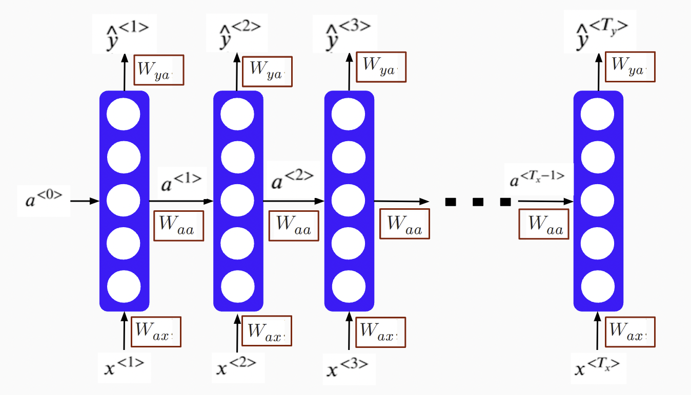

---
output:
  pdf_document: default
  html_document: default
---

# Deep Learning

With everyday applications in language, voice, image, and automatic driving cars, deep learning becomes a popular concept to the general public in the past few years. However, many of the concepts of deep learning started as early as the 1940s. For example, the binary perceptron classifier used a linear combination of input signals and a step activation function. It is the same as the single neuron in a modern deep learning framework that uses the same linear combination of input signals from neurons at the previous layer and a more efficient nonlinear activation function. The perceptron model was further defined by minimizing the classification error. It was trained by using one data point at a time to update the model parameters during the optimization process. There is a loss function in the modern neural network framework to be minimized based on the problem to solve, and the stochastic gradient descent and its variations are the major optimization algorithms.

Even though the theoretical foundation of deep learning has gradually developed in the past few decades, real-world applications of deep learning started in the past few years primarily due to the following constraints: data, network structure, algorithm, and computation power.

**Data**

We are all familiar with all sorts of data today: structured tabulated data in database tables or CSV files, free form text, images, and other unstructured datasets. However, historical data are relatively small in size, especially for data with accurately labeled ground truth. Statisticians have been working on datasets that only have a few thousand rows and a few dozen columns for decades to solve business problems. Even with modern computers, the size of the data is usually limited to the memory of a computer. Now we know, to enable deep learning applications, the algorithm needs a much larger dataset than traditional machine learning methods. It is usually at the order of millions of samples with high-quality ground truth labels for supervised deep learning models.

The first widely used large dataset with accurate labels is the ImageNet dataset which was first created in 2010. It now contains more than 14 million images with more than 20k synsets (i.e. meaningful categories). Every image in the dataset was human-annotated with quality control to ensure the ground truth labels are accurate. One of the direct results of ImageNet was the Large Scale Visual Recognition Challenge (ILSVRC) which evaluated different algorithms in image-related tasks. The ILSVRC competition provided a perfect stage for deep learning applications to debut to the general public. For 2010 and 2011, the best record of error from traditional image classifications methods was around 26%. In 2012, a method based on the convolutional neural network became the state of the art with an error rate of around 16%, a dramatic improvement from the traditional methods.

With the prevalence of consumer internet, users created much high-quality content and historical text, voice, image, and video were digitized. The quality and quantity of data for deep learning applications became available and it exceeded the threshold of the requirement for many deep learning applications such as image classification, voice recognition, and natural language understanding. Data is the fuel for deep learning engines. With more and more varieties of data created, captured, and saved, there will be more deep learning applications to create values across many business sectors.

**Network Structure**

Lacking high-quality high-volume data was not the only constraint for early deep learning years. For perceptron with just one single neural, it is just a linear classifier. Real applications are nearly always non-linear. To solve that problem, we have to grow one neural to multiple layers of neural network with multiple neurons per layer - the multiple layer perceptron (MLP) and it is called feedforward neural network. In the 1990s, the universal approximation theorem was proved and it assured us that a feedforward network with a single hidden layer containing a finite number of neurons can approximate continuous functions. Even though the one-layer neural network theoretically can solve a general non-linear problem, the reality is that we have grown the neural network to many layers of neural network. The number of layers in the network is the “depth” of a network. Loosely speaking, deep learning is a neural network with the many layers (i.e. the depth is deep).

The MLP is the basic structure for the modern deep learning applications. MLP can be used for classification problems or regression problems with response variables as the output and a collection of explanatory variables as the input (i.e. the traditionally structured datasets). Many of the problems that can be solved using classical classification methods such as random forest can be solved by MLP. However, MLP is not the best option for image and language-related tasks. For image-related tasks, pixels for a local neighbor region collectively provide useful information to solve a task. To take advantage of the 2D spatial relationship among pixels, the convolutional neural network (CNN) structure is a better choice. For language-related tasks, the sequence of the text provides additional information than just a collection of single words. The recurrent neural network (RNN) is a better structure for such sequence-related data. There are other more complicated neural network structures and it is still a fast-developing area. MLP, CNN, and RNN are just the starting point of deep learning methods.

**Algorithm**

In addition to data and neural network structure, there were a few key algorithm breakthroughs before deep learning became a household terminology. For an entry-level neural network structure, there are hundreds of thousands of parameters to be estimated from the data. With a large amount of training data, stochastic gradience decent and mini-batch gradience decent are efficient ways to utilize a subset of training data to update the model parameters. Within the process, one of the key steps is back-propagation which was introduced in the 1980s for efficient weight update. There is a non-linear activation for each neuron in deep learning models, and **sigmoid** or **hyperbolic tangent** functions were often used. However, it has the problem of gradient vanishing when the number of layers of the network grows large (i.e. deeper network). To solve this problem, the **rectified linear unit (ReLu)** was introduced to deep learning in the 2000s and it increases the convergence speed dramatically. ReLu is so simple (i.e. y = x when x >= 0 and y = 0 otherwise), but it indeed cleverly solved one of the big headaches in deep learning. With hundreds of thousands of parameters in the model, deep learning is easy to get overfitted. The dropout concept was introduced in 2012 to mitigate overfitting. It randomly drops out a certain percentage of neurons in the network during the optimization process to achieve more robust model performance. It is similar to the concept of random forest where features and training data are randomly chosen. There are many other algorithm improvements to get better models such as batch normalization and using residuals from previous layers. With backpropagation in stochastic gradience decent, ReLu activation function, dropout, and other technics, modern deep learning methods begin to outperform traditional machine learning methods.

**Computation Power**

With data, network structure and algorithms ready, it still requires certain computation power to train a deep learning model. The entire framework involves heavy linear algebra operations with large matrixes and tensors. The general CPU architecture is not the ideal platform and GPU is a much faster choice. With the vast potential application of deep learning, major tech companies contribute heavily to open-source deep learning frameworks. For example, Google has open-sourced its TensorFlow framework; Facebook has open-sourced its PyTorch framework, and Amazon has significantly contributed to the MXNet open-source framework. With thousands of well-trained software developers and scientists behind these deep learning frameworks, users can confidently pick one framework and start training their deep learning models right away in popular cloud environments. Much of the heavy lifting to train a deep learning model has been embedded in these open-source frameworks and there are also many pre-trained models available for users to adopt. Users can now enjoy the relatively easy access to software and hardware to develop their own deep learning applications. In this book, we will demo deep learning examples using Keras, a high-level abstraction of TensorFlow, using the Databricks Community Edition platform.

In summary, deep learning applications are not developed just in the past few years and it has been ongoing research in the past few decades. The accumulation of data, the advance of algorithm and the improvement of computation power finally enable every day deep learning applications. In the foreseeable future, deep learning will continue to revolutionize machine learning methods across more areas to provide significant improvement.


## Projection Pursuit Regression

Before moving onto neural networks, let us start with a broader framework, Projection Pursuit Regression (PPR). It has a form of **additive model** of the derived features rather than the inputs themselves. Another widely used algorithm, AdaBoost, also fits an additive model in a base learner.

Assume $\mathbf{X^{T}}=(X_1,X_2,\dots,X_p)$ is a vector with $p$ variables. $Y$ is the corresponding response variable. $\mathbf{\omega_{m}},m=1,2,\dots,M$ is parameter vector with $p$ elements. 

$$f(\mathbf{X})=\sum_{m=1}^{M}g_{m}(\mathbf{\omega_{m}^{T}X})$$

The new feature $\mathbf{V_{m}}=\mathbf{\omega_{m}^{T}X}$ is a linear combination of input variables $\mathbf{X}$. The additive model is based on the new features. Here $\mathbf{\omega_{m}}$ is a unit vector, and the new feature $\mathbf{v_m}$ is actually the projection of $\mathbf{X}$ on $\mathbf{\omega_{m}}$. It projects the p-dimensional independent variable space onto the new M-dimensional feature space. This is similar to the principal component analysis except that the principal component is orthogonal projection but it is not necessarily orthogonal here.

I know it is very abstract. Let's look at some examples. Assume $p=2$, i.e. there are two variables $x_1$ and $x_2$. If $M=1$, $\mathbf{\omega^{T}}=(\frac{1}{2},\frac{\sqrt{3}}{2})$, then the corresponding  $v=\frac{1}{2}x_{1}+\frac{\sqrt{3}}{2}x_{2}$. Let's try different setings and compare the results:

1. $\mathbf{\omega^{T}}=(\frac{1}{2},\frac{\sqrt{3}}{2})$, $v=\frac{1}{2}x_{1}+\frac{\sqrt{3}}{2}x_{2}$ , $g(v)=\frac{1}{1+e^{-v}}$

1. $\mathbf{\omega^{T}}=(1,0)$, $v = x_1$, $g(v)=(v+5)sin(\frac{1}{\frac{v}{3}+0.1})$

1. $\mathbf{\omega^{T}}=(0,1)$, $v = x_2$, $g(v)=e^{\frac{v^2}{5}}$

1. $\mathbf{\omega^{T}}=(1,0)$, $v = x_1$, $g(v)=(v+0.1)sin(\frac{1}{\frac{v}{3}+0.1})$


Here is how you can simulate the data and plot it using R:

```{r nnet_simulate_data}
# use plot3D package to generate 3D plot
library(plot3D)
# get x1 and x2 note here x1 and x2 need to be matrix if
# you check the two objects, you will find: columns in
# x1 are identical rows in x2 are identical mesh() is
# funciton from plot3D package you may need to think a
# little here
M <- mesh(seq(-13.2, 13.2, length.out = 50), seq(-37.4, 
    37.4, length.out = 50))
x1 <- M$x
x2 <- M$y
## setting 1 map X using w to get v
v <- (1/2) * x1 + (sqrt(3)/2) * x2
# apply g() on v
g1 <- 1/(1 + exp(-v))
par(mfrow = c(2, 2), mar = c(0, 0, 1, 0))
surf3D(x1, x2, g1, colvar = g1, border = "black", colkey = FALSE, 
    box = FALSE, main = "Setting 1")
## setting 2
v <- x1
g2 <- (v + 5) * sin(1/(v/3 + 0.1))
surf3D(x1, x2, g2, colvar = g2, border = "black", colkey = FALSE, 
    box = FALSE, main = "Setting 2")
## setting 3
v <- x2
g3 <- exp(v^2/5)
surf3D(x1, x2, g3, colvar = g3, border = "black", colkey = FALSE, 
    box = FALSE, main = "Setting 3")
## setting 4
v <- x1
g4 <- (v + 0.1) * sin(1/(v/3 + 0.1))
surf3D(x1, x2, g4, colvar = g4, border = "black", colkey = FALSE, 
    box = FALSE, main = "Setting 4")
```

You can see that this framework is very flexible. In essence, it is to do a non-linear transformation of the linear combination. You can use this way to capture varies of relationships. For example,$x_{1}x_{2}$ can be written as $\frac{(x_{1}+x_{2})^{2}-(x_{1}-x_{2})^{2}}{4}$, where $M=2$. All the higher order factors of $x_1$ and $x_2$ can be represented similarly. If $M$ is large enough, this framework can approximate any continuous function on $\mathbb{R}^{p}$. So the model family covers a board area, but with a price. That is the interpretability. Because the number of parameters increases with M and the mode is nested. 

PPR in 1981 was a new idea then which lead to the debut of the neural network model. The basic technical idea behind deep learning has been around for decades. However, why did they take off in recent years? Here are some main drivers behind the rise. 

First, thanks to the digitalization where lots of human activities are now in the digital realm and captured as data. So in the last 10 year, for many problems, we went from having a relatively small amount of data to accumulating a large amount of data. The traditional learning algorithms, like Logistic Regression, Support Vector Machine, Random Forest cannot effectively take advantage of such big data.  Second, the increasing computation power enables us to train a large neural network either on a CPU or GPU using big data. The scale of data and computation ability lead to much progress, but tremendous algorithmic innovation is also an important driver. Many of the innovations are about speeding up the optimization of neural network. One of the examples is to use ReLU as intermediate layer activation function instead of the previous sigmoid function. The change has made the optimization process much faster because the previous sigmoid function suffers from vanishing gradient. We will talk more about that in the following sections. Here we just want to show an example of the impact of algorithmic innovation.  

## Feedforward Neural Network

### Logistic Regression as Neural Network {#logistic_reg_as_neural_network}

Let's look at logistic regression from the lens of the neural network. For a binary classification problem, for example spam classifier, given $m$ samples $\{(x^{(1)}, y^{(1)}),(x^{(2)}, y^{(2)}),...,(x^{(m)}, y^{(m)})\}$, we need to use the input feature $x^{(i)}$ (they may be the frequency of various words such as "money", special characters like dollar signs, and the use of capital letters in the message etc.) to predict the output $y^{(i)}$ (if it is a spam email). Assume that for each sample $i$, there are $n_{x}$ input features. Then we have: 

\begin{equation}
X=\left[\begin{array}{cccc}
x_{1}^{(1)} & x_{1}^{(2)} & \dotsb & x_{1}^{(m)}\\
x_{2}^{(1)} & x_{2}^{(2)} & \dotsb & x_{2}^{(m)}\\
\vdots & \vdots & \vdots & \vdots\\
x_{n_{x}}^{(1)} & x_{n_{x}}^{(2)} & \dots & x_{n_{x}}^{(m)}
\end{array}\right]\in\mathbb{R}^{n_{x}\times m}
(\#eq:input)
\end{equation}

$$y=[y^{(1)},y^{(2)},\dots,y^{(m)}] \in \mathbb{R}^{1 \times m}$$

To predict if sample $i$ is a spam email, we first get the inactivated **neuro** $z^{(i)}$ by a linear transformation of the input $x^{(i)}$, which is $z^{(i)}=w^Tx^{(i)} + b$. Then we apply a function to "activate" the neuro  $z^{(i)}$ and we call it "activation function". In logistic regression, the activation function is sigmoid function and the "activated"  $z^{(i)}$ is the prediction:

$$\hat{y}^{(i)} = \sigma(w^Tx^{(i)} + b)$$

where $\sigma(z) = \frac{1}{1+e^{-z}}$. The following figure summarizes the process:


<center>
{width=30%}
</center>


There are two types of layers. The last layer connects directly to the output. All the rest are _intermediate layers_. Depending on your definition, we call it "0-layer neural network" where the layer count only considers _intermediate layers_. To train the model, you need a cost function which is defined as equation \@ref(eq:costlogistic).

\begin{equation}
J(w,b)=\frac{1}{m} \Sigma_{i=1}^m L(\hat{y}^{(i)}, y^{(i)})
(\#eq:costlogistic)
\end{equation}

where

$$L(\hat{y}^{(i)}, y^{(i)}) =  -y^{(i)}log(\hat{y}^{(i)})-(1-y^{(i)})log(1-\hat{y}^{(i)})$$

To fit the model is to minimize the cost function.

### Stochastic Gradient Descent

The general approach to minimize $J(w,b)$ is by gradient descent, also known as _back-propagation_.  The optimization process is a forward and backward sweep over the network.

<center>
{width=100%}
</center>

The forward propagation takes the current weights, calculates the prediction and cost. The backward propagation computes the gradient descent for the parameters by the chain rule for differentiation. In logistic regression, it is easy to calculate the gradient w.r.t the parameters $(w, b)$.

Let's look at the Stochastic Gradient Descent (SGD) for logistic regression across $m$ samples. SGD updates one sample each time. The detailed process is as follows.

<center>
{width=100%}
</center>

First initialize $w_1$, $w_2$, ... , $w_{n_x}$, and $b$. Then plug in the initialized value to the forward and backward propagation.  The forward propagation takes the current weights and calculates the prediction $\hat{h}^{(i)}$ and cost $J^{(i)}$. The backward propagation calculates the gradient descent for the parameters. After iterating through all $m$ samples, you can calculate gradient descent for the parameters. Then update the parameter by:
    $$w := w - \gamma \frac{\partial J}{\partial w}$$
    $$b := b - \gamma \frac{\partial J}{\partial b}$$

Repeat the forward and backward process using the updated parameter until the cost $J$ stabilizes. 

### Deep Neural Network

Before people coined the term _deep learning_, a neural network refers to _single hidden layer network_. Neural networks with more than one layers are called _deep learning_. Network with the structure in figure \@ref(fig:ffnn) is the **multiple layer perceptron (MLP)** or **feedforward neural network (FFNN)**.

```{r ffnn, fig.cap = "Feedforward Neural Network", out.width="80%", fig.asp=.75, fig.align="center", echo = FALSE}
knitr::include_graphics("images/dnn_str.png")
```

Let's look at a simple one-hidden-layer neural network (figure \@ref(fig:onelayernn)). First only consider one sample. From left to right, there is an input layer with 3 features ($x_1, x_2, x_3$), a hidden layer with four neurons and an output later to produce a prediction $\hat{y}$.

```{r onelayernn, fig.cap = "1-layer Neural Network", out.width="80%", fig.asp=.75, fig.align="center", echo = FALSE}
knitr::include_graphics("images/onelayerNN.png")
```

**From input to the first hidden layer**

Each inactivated neuron on the first layer is a linear transformation of the input vector $x$. For example, $z^{[1]}_1 = w^{[1]T}_1x^{(i)} + b_1^{[1]}$ is the first inactivated neuron for hidden layer one. **We use superscript `[l]` to denote a quantity associated with the $l^{th}$ layer and the subscript `i` to denote the $i^{th}$ entry of a vector (a neuron or feature).** Here $w^{[1]}$ and $b_1^{[1]}$ are the weight and bias parameters for layer 1. $w^{[1]}$ is a $4 \times 1$ vector and hence $w^{[1]T}_1x^{(i)}$ us a linear combination of the four input features. Then use a sigmoid function $\sigma(\cdot)$ to activate the neuron $z^{[1]}_1$ to get $a^{[1]}_1$. 

**From the first hidden layer to the output**

Next, do a linear combination of the activated neurons from the first layer to get inactivated output, $z^{[2]}_1$. And then activate the neuron to get the predicted output $\hat{y}$. The parameters to estimate in this step are $w^{[2]}$ and $b_1^{[2]}$.

If you fully write out the process, it is the bottom right of figure \@ref(fig:onelayernn). When you implement a neural network, you need to do similar calculation four times to get the activated neurons in the first hidden layer. Doing this with a `for` loop is inefficient. So people vectorize the four equations. Take an input and compute the corresponding $z$ and $a$ as a vector. You can vectorize each step and get the following representation:

$$\begin{array}{cc}
z^{[1]}=W^{[1]}x+b^{[1]} & \ \ \sigma^{[1]}(z^{[1]})=a^{[1]}\\
z^{[2]}=W^{[2]}a^{[1]}+b^{[2]} & \ \ \ \ \ \sigma^{[2]}(z^{[2]})=a^{[2]}=\hat{y}
\end{array}$$

$b^{[1]}$ is the column vector of the four bias parameters shown above. $z^{[1]}$ is a column vector of the four non-active neurons. When you apply an activation function to a matrix or vector, you apply it element-wise. $W^{[1]}$ is the matrix by stacking the four row-vectors:

$$W^{[1]}=\left[\begin{array}{c}
w_{1}^{[1]T}\\
w_{2}^{[1]T}\\
w_{3}^{[1]T}\\
w_{4}^{[1]T}
\end{array}\right]$$

So if you have one sample, you can go through the above forward propagation process to calculate the output $\hat{y}$ for that sample. If you have $m$ training samples, you need to repeat this process each of the $m$ samples. **We use superscript `(i)` to denote a quantity associated with $i^{th}$ sample.** You need to do the same calculation for all $m$ samples.

For i = 1 to m, do:

$$\begin{array}{cc}
z^{[1](i)}=W^{[1]}x^{(i)}+b^{[1]} & \ \ \sigma^{[1]}(z^{[1](i)})=a^{[1](i)}\\
z^{[2](i)}=W^{[2]}a^{[1](i)}+b^{[2]} & \ \ \ \ \ \sigma^{[2]}(z^{[2](i)})=a^{[2](i)}=\hat{y}^{(i)}
\end{array}$$

Recall that we defined the matrix X to be equal to our training samples stacked up as column vectors in equation \@ref(eq:input). We do a similar thing here to stack vectors with the superscript (i) together across $m$ samples. This way, the neural network computes the outputs on all the samples on at the same time:

$$\begin{array}{cc}
Z^{[1]}=W^{[1]}X+b^{[1]} & \ \ \sigma^{[1]}(Z^{[1]})=A^{[1]}\\
Z^{[2]}=W^{[2]}A^{[1]}+b^{[2]} & \ \ \ \ \ \sigma^{[2]}(Z^{[2]})=A^{[2]}=\hat{Y}
\end{array}$$

where 
$$X=\left[\begin{array}{cccc}
| & | &  & |\\
x^{(1)} & x^{(1)} & \cdots & x^{(m)}\\
| & | &  & |
\end{array}\right],$$

$$A^{[l]}=\left[\begin{array}{cccc}
| & | &  & |\\
a^{[l](1)} & a^{[l](1)} & \cdots & a^{[l](m)}\\
| & | &  & |
\end{array}\right]_{l=1\ or\ 2},$$

$$Z^{[l]}=\left[\begin{array}{cccc}
| & | &  & |\\
z^{[l](1)} & z^{[l](1)} & \cdots & z^{[l](m)}\\
| & | &  & |
\end{array}\right]_{l=1\ or\ 2}$$

You can add layers like this to get a deeper neural network as shown in the bottom right of figure \@ref(fig:ffnn). 

### Activation Function


- Sigmoid and Softmax Function

We have used the sigmoid (or logistic) activation function. The function is S-shape with an output value between 0 to 1. Therefore it is used as the output layer activation function to predict the probability **when the response $y$ is binary**. However, it is rarely used as an intermediate layer activation function. One of the main reasons is that when $z$ is away from 0, then the derivative of the function drops fast which slows down the optimization process through gradient descent. Even the fact that it is differentiable provides some convenience, the decreasing slope can cause a neural network to get stuck at the training time.

```{r activationsigmoid, fig.cap = "Sigmoid Function", out.width="80%", fig.asp=.75, fig.align="center", echo = FALSE}
z = seq(-8, 8, 0.1)
fz = 1/(1+exp(-z))
plot(z, fz, type = "l",
     col="blue",
     ylab= expression(paste (sigma, "(z)")))
#     main = expression(paste(sigma,"(z) = ",frac(1,1+e^{-z}),sep='') ) 
text(x = -5,y = 0.8,labels = expression(paste(sigma,"(z) = ",frac(1,1+e^{-z}),sep='') ))
```

When the output has more than 2 categories, people use softmax function as the output layer activation function. 

\begin{equation}
f_i(\mathbf{z}) = \frac{e^{z_i}}{\Sigma_{j=1}^{J} e^{z_j} }
(\#eq:softmax)
\end{equation}

where $\mathbf{z}$ is a vector.

- Hyperbolic Tangent Function (tanh)

Another activation function with a similar S-shape is the hyperbolic tangent function. It works better than the sigmoid function as the intermediate layer [^1].

[^1]: "The tanh function is almost always strictly superior." ---- by Andrew Ng from his coursera course "Neural Networks and Deep Learning" 

\begin{equation}
tanh(z) = \frac{e^{z} - e^{-z}}{e^{z} + e^{-z}}
(\#eq:tanh)
\end{equation}


```{r activationtanh, fig.cap = "Hyperbolic Tangent Function", out.width="80%", fig.asp=.75, fig.align="center", echo = FALSE}
z = seq(-8, 8, 0.1)
fz = 1/(1+exp(-z))
fz_tanh = (exp(z) - exp(-z))/(exp(z)+exp(-z))
plot(z, fz_tanh, type = "l",
     col="blue",
     ylab= "")
#     main = expression(paste(sigma,"(z) = ",frac(1,1+e^{-z}),sep='') ) 
text(x = -5, y = 0.5,labels = expression(paste("tanh(z) = ",frac(e^{z} - e^{-z},e^{z} + e^{-z}),sep='') ))
```

The tanh function crosses point (0, 0) and the value of the function is between 1 and -1 which makes the mean of the activated neurons closer to 0. The sigmoid function doesn't have that property. When you preprocess the training input data, you sometimes center the data so that the mean is 0. The tanh function is kind of doing that data processing for you which makes learning for the next layer a little easier. This activation function is used a lot in the recurrent neural networks where you want to polarize the results.

- Rectified Linear Unit (ReLU) Function

The most popular activation function is the Rectified Linear Unit (ReLU) function. It is a piecewise function, or a half rectified function:


\begin{equation}
R(z) = max(0, z)
(\#eq:relu)
\end{equation}

The derivative is 1 when z is positive and 0 when z is negative. You can define the derivative as either 0 or 1 when z is 0. When you implement this, it is unlikely that z equals to exactly 0 even it can be very close to 0.

```{r activationrelu, fig.cap = "Rectified Linear Unit Function", out.width="80%", fig.asp=.75, fig.align="center", echo = FALSE}
z = seq(-8, 8, 0.1)
relu = function(z){
  return (max(0, z))
}
rz = sapply(z, relu)
plot(z, rz, type = "l",
     col="blue",
     ylab= "")
text(x = -5, y = 6,labels = "R(z) = max(0, z)" )
```

The advantage of the ReLU is that when z is positive, the derivative doesn't vanish as z getting larger. So it leads to faster computation than sigmoid or tanh. It is non-linear with an unconstrained response. However, the disadvantage is that when z is negative, the derivative is 0. It may not map the negative values appropriately. In practice, this doesn't cause too much trouble but there is another version of ReLu called leaky ReLu that attempts to solve the dying ReLU problem. The leaky ReLu is

$$R(z)_{Leaky}=\begin{cases}
\begin{array}{c}
z\\
az
\end{array} & \begin{array}{c}
z\geq0\\
z<0
\end{array}\end{cases}$$

Instead of being 0 when z is negative, it adds a slight slope such as $a=0.01$ as shown in figure \@ref(fig:activationleakyrelu) (can you see the leaky part there? : ).

```{r activationleakyrelu, fig.cap = "Rectified Linear Unit Function", out.width="80%", fig.asp=.75, fig.align="center", echo = FALSE}
z = seq(-8, 8, 0.1)
leakyrelu = function(z){
  if (z>=0) {res = z}
  else {res = 0.01*z}
  return(res)
}
leakyrz = sapply(z, leakyrelu)
plot(z, leakyrz, type = "l",
     col="blue",
     ylab= "")
```

You may notice that all activation functions are non-linear. Since the composition of two linear functions is still linear, using a linear activation function doesn't help to capture more information.  That is why you don't see people use a linear activation function in the intermediate layer. One exception is when the output $y$ is continuous, you may use linear activation function at the output layer. To sum up, for intermediate layers:

- ReLU is usually a good choice. If you don't know what to choose, then start with ReLU. Leaky ReLu usually works better than the ReLU but it is not used as much in practice. Either one works fine. Also, people usually use a=0.01 as the slope for leaky ReLU. You can try different parameters but most of the people a = 0.01.
- tanh is used sometimes especially in recurrent neural network. But you nearly never see people use sigmoid function as intermediate layer activation function.

For the output layer:

- When it is binary classification, use sigmoid with binary cross-entropy as loss function
- When there are multiple classes, use softmax function with categorical cross-entropy as loss function
- When the response is continuous, use identity function (i.e. y = x)

### Deal with Overfitting

The biggest problem for deep learning is overfitting. It happens when the model learns too much from the data. We discussed this in more detail in section \@ref(vbtradeoff). A common way to diagnose the problem is to use cross-validation (section \@ref(datasplittingresampling)). You can recognize the problem when the model fits great on the training data but gives poor predictions on the testing data. One way to prevent the model from over learning the data is to limit model complexity. There are several approaches to that. 

#### Regularization

For logistic regression,

$$\underset{w,b}{min}J(w,b)= \frac{1}{m} \Sigma_{i=1}^{m}L(\hat{y}^{(i)}, y^{(i)}) + penalty$$

Common penalties are L1 or L2 as follows:

$$L_2\ penalty=\frac{\lambda}{2m}\parallel w \parallel_2^2 = \frac{\lambda}{2m}\Sigma_{i=1}^{n_x}w_i^2$$

$$L_1\ penalty = \frac{\lambda}{m}\Sigma_{i=1}^{n_x}|w|$$

For neural network,

$$J(w^{[1]},b^{[1]},\dots,w^{[L]},b^{[L]})=\frac{1}{m}\Sigma_{i=1}^{m}L(\hat{y}^{(i)},y^{(i)}) + \frac{\lambda}{2}\Sigma_{l=1}^{L} \parallel w^{[l]} \parallel^2_F$$

where

$$\parallel w^{[l]} \parallel^2_F = \Sigma_{i=1}^{n^{[l]}}\Sigma_{j=1}^{n^{[l-1]}} (w^{[l]}_{ij})^2$$

Many people call it "Frobenius Norm" instead of L2-norm.

#### Dropout

### Optimization 

#### Batch, Mini-batch, Stochastic Gradient Descent

$$\begin{array}{ccc} x= & [\underbrace{x^{(1)},x^{(2)},\cdots,x^{(1000)}}/ & \cdots/\cdots x^{(m)}]\\ (n_{x},m) & mini-batch\ 1 \end{array}$$

$$\begin{array}{ccc} y= & [\underbrace{y^{(1)},y^{(2)},\cdots,y^{(1000)}}/ & \cdots/\cdots y^{(m)}]\\ (1,m) & mini-batch\ 1 \end{array}$$

- Mini-batch size = m: batch gradient descent, too long per iteration
- Mini-batch size = 1: stochastic gradient descent, lose speed from vectorization
- Mini-batch size in between: mini-batch gradient descent, make progress without processing all training set, typical batch sizes are $2^6=64$, $2^7=128$, $2^7=256$, $2^8=512$

#### Optimization Algorithms

In the history of deep learning, researchers proposed different optimization algorithms and showed that they worked well in a specific scenario.  But the optimization algorithms didn't generalize well to a wide range of neural networks.  So you will need to try different optimizers in your application. We will introduce three commonly used optimizers here. 

**Exponentially Weighted Averages**

### Image Recognition Using FFNN {#ffnnexample}

In this section, we will walk through a toy example of image classification problem using **`keras`** package. We use R in the section to illustrate the process and also provide the python notebook on the book website. Please check the [`keras` R package website](https://keras.rstudio.com/) for the most recent development. We are using the Databrick community edition with the following consideration:

- Minimum language barrier in coding for most users
- Zero setup to save time using cloud environment
- Help you get familiar with current trend of cloud computing in corporate setup

Refer to section \@ref(CloudEnvironment) for how to set up an account, create a notebook (R or Python) and start a cluster.

What is an image as data? You can consider a digital image as a set of points on 2-d or 3-d space. Each each point has a value between 0 to 255 which is considered as a pixel. Figure \@ref(fig:grayscaleimage) shows an example of grayscale image. It is a set of pixels on 2-d space and each pixel has a value between 0 to 255. You can process the image as a 2-d array input if you use a Convolutional Neural Network(CNN). Or, you can vectorize the array as the input for FFNN as shown in the figure.

```{r grayscaleimage, fig.cap = "Grayscale image is a set of pixels on 2-d space. Each pixel has a value range from 0 to 255.", out.width="80%", fig.asp=.75, fig.align="center", echo = FALSE}
knitr::include_graphics("images/grayscaleimage.png")
```

A color image is a set of pixels on 3-d space and each pixel has a value between 0 to 255. There are three 2-d panels which represent the color red, blue and green accordingly. Similarly, You can process the image as a 3-d array. Or you can vectorize the array as shown in figure \@ref(fig:colorimage). 

```{r colorimage, fig.cap = "Color image is a set of pixels on 3-d space. Each pixel has a value range from 0 to 255.", out.width="80%", fig.asp=.75, fig.align="center", echo = FALSE}
knitr::include_graphics("images/colorimage.png")
```

Let's look at how to use the `keras` R package for a toy example in deep learning with the handwritten digits image dataset (i.e. MNIST).  `keras` has many dependent packages, so it takes a few minutes to install. Be patient! In a production cloud environment such as the paid version of Databricks, you can save what you have and resume from where you left. 

```r
install.packages("keras")
```

As `keras` is just an interface to popular deep learning frameworks, we have to install the deep learning backend. The default and recommended backend is TensorFlow. By calling `install_keras()`, it will install all the needed dependencies for TensorFlow. 

```r
library(keras)
install_keras()
```

Now we are all set to explore deep learning! As simple as three lines of R code, but there are quite a lot going on behind the scene. If you are using a cloud environment, you do not need to worry about these behind scene setup and maintenance.

We will use the widely used MNIST handwritten digit image dataset. More information about the dataset and benchmark results from various machine learning methods can be found at http://yann.lecun.com/exdb/mnist/ and https://en.wikipedia.org/wiki/MNIST_database.

This dataset is already included in the keras/TensorFlow installation and we can simply load the dataset as described in the following cell. It takes less than a minute to load the dataset.

```r
mnist <- dataset_mnist()
```

The data structure of the MNIST dataset is straight forward and well prepared for R, which has two pieces: 

(1) training set: x (i.e. features): 60000x28x28 tensor which corresponds to 60000 28x28 pixel greyscale images (i.e. all the values are integers between 0 and 255 in each 28x28 matrix), and y (i.e. responses): a length 60000 vector which contains the corresponding digits with integer values between 0 and 9. 

(2) testing set: same as the training set, but with only 10000 images and responses. The detailed structure for the dataset can be seen with `str(mnist)` below.

```r
str(mnist)
```

```html
List of 2
 $ train:List of 2
  ..$ x: int [1:60000, 1:28, 1:28] 0 0 0 0 0 0 0 0 0 0 ...
  ..$ y: int [1:60000(1d)] 5 0 4 1 9 2 1 3 1 4 ...
 $ test :List of 2
  ..$ x: int [1:10000, 1:28, 1:28] 0 0 0 0 0 0 0 0 0 0 ...
  ..$ y: int [1:10000(1d)] 7 2 1 0 4 1 4 9 5 9 ...
```

Now we prepare the features (x) and the response variable (y) for both the training and testing dataset, and we can check the structure of the `x_train` and `y_train` using `str()` function.

```r
x_train <- mnist$train$x
y_train <- mnist$train$y
x_test <- mnist$test$x
y_test <- mnist$test$y

str(x_train)
str(y_train)
```

```html
int [1:60000, 1:28, 1:28] 0 0 0 0 0 0 0 0 0 0 ...
int [1:60000(1d)] 5 0 4 1 9 2 1 3 1 4 ...
```

Now let's plot a chosen 28x28 matrix as an image using R's `image()` function. In R's `image()` function, the way of showing an image is rotated 90 degree from the matrix representation. So there is additional steps to rearrange the matrix such that we can use `image()` function to show it in the actual orientation.

```r
index_image = 28  ## change this index to see different image.
input_matrix <- x_train[index_image, 1:28, 1:28]
output_matrix <- apply(input_matrix, 2, rev)
output_matrix <- t(output_matrix)
image(1:28, 1:28, output_matrix, col = gray.colors(256), 
    xlab = paste("Image for digit of: ", y_train[index_image]), 
    ylab = "")
```

<center>
{width=70%}
</center>

Here is the original 28x28 matrix for the above image:

```r
input_matrix
```

```html
     [,1] [,2] [,3] [,4] [,5] [,6] [,7] [,8] [,9] [,10] [,11] [,12] [,13]
 [1,]    0    0    0    0    0    0    0    0    0     0     0     0     0
 [2,]    0    0    0    0    0    0    0    0    0     0     0     0     0
 [3,]    0    0    0    0    0    0    0    0    0     0     0     0     0
 [4,]    0    0    0    0    0    0    0    0    0     0     0     0     0
 [5,]    0    0    0    0    0    0    0    0    0     0     0     0     0
 [6,]    0    0    0    0    0    0    0    0    0     0     9    80   207
 [7,]    0    0    0    0    0    0   39  158  158   158   168   253   253
 [8,]    0    0    0    0    0    0  226  253  253   253   253   253   253
 [9,]    0    0    0    0    0    0  139  253  253   253   238   113   215
[10,]    0    0    0    0    0    0   39   34   34    34    30     0    31
[11,]    0    0    0    0    0    0   91    0    0     0     0     0     0
[12,]    0    0    0    0    0    0    0    0    0     0     0    11    33
[13,]    0    0    0    0    0    0    0    0    0     0    11   167   253
[14,]    0    0    0    0    0    0    0    0    0     0    27   253   253
[15,]    0    0    0    0    0    0    0    0    0     0    18   201   253
[16,]    0    0    0    0    0    0    0    0    0     0     0    36    87
...
```

There are multiple deep learning methods to solve the handwritten digits problem and we will start from the simple and generic one, feedforward neural network (FFNN). FFNN contains a few fully connected layers and information is flowing from a front layer to a back layer without any feedback loop from the back layer to the front layer. It is the most common deep learning models to start with.

#### Data preprocessing

In this section, we will walk through the needed steps of data preprocessing. For the MNIST dataset that we just loaded, some preprocessing is already done. So we have a relatively "clean" data, but before we feed the data into FFNN, we still need to do some additional preparations.

First, for each digits, we have a scalar response and a 28x28 integer matrix with value between 0 and 255. To use the out of box DNN functions, for each response, all the features are one row of all features. For an image in MNIST dataet, the input for one response y is a 28x28 matrix, not a single row of many columns and we need to convet the 28x28 matrix into a single row by appending every row of the matrix to the first row using `reshape()` function.

In addition, we also need to scale all features to be between (0, 1) or (-1, 1) or close to (-1, 1) range. Scale or normalize every feature will improve numerical stability in the optimization procedure as there are a lot of parameters to be optimized.

We first reshape the 28x28 image for each digit (i.e each row) into 784 columns (i.e. features), and then rescale the value to be between 0 and 1 by dividing the original pixel value by 255, as described in the cell below.

```R
# step 1: reshape
x_train <- array_reshape(x_train, c(nrow(x_train), 784))
x_test <- array_reshape(x_test, c(nrow(x_test), 784))

# step 2: rescale
x_train <- x_train / 255
x_test <- x_test / 255
```

And here is the structure of the reshaped and rescaled features for training and testing dataset. Now for each digit, there are 784 columns of features.

```r
str(x_train)
str(x_test)
```

```html
num [1:60000, 1:784] 0 0 0 0 0 0 0 0 0 0 ...
num [1:10000, 1:784] 0 0 0 0 0 0 0 0 0 0 ...
```

In this example, though the response variable is an integer (i.e. the corresponding digits for an image), there is no order or rank for these integers and they are just an indication of one of the 10 categories. So we also convert the response variable y to be categorical.

```r
y_train <- to_categorical(y_train, 10)
y_test <- to_categorical(y_test, 10)
str(y_train)
```

```html
num [1:60000, 1:10] 0 1 0 0 0 0 0 0 0 0 ...
```

#### Fit model

Now we are ready to fit the model. It is straight forward to build a deep neural network using keras. For this example, the number of input features is 784 (i.e. scaled value of each pixel in the 28x28 image) and the number of class for the output is 10 (i.e. one of the ten categories). So the input size for the first layer is 784 and the output size for the last layer is 10. And we can add any number of compatible layers in between.

In keras, it is easy to define a DNN model: (1) use `keras_model_sequential()` to initiate a model placeholder and all model structures are attached to this model object, (2) layers are added in sequence by calling the `layer_dense()` function, (3) add arbitrary layers to the model based on the sequence of calling `layer_dense()`. For a dense layer, all the nodes from the previous layer are connected with each and every node to the next layer. In `layer_dense()` function, we can define how many nodes in that layer through the `units` parameter. The activation function can be defined through the `activation` parameter. For the first layer, we also need to define the input features' dimension through `input_shape` parameter. For our preprocessed MNIST dataset, there are 784 columns in the input data. A common way to reduce overfitting is to use the dropout method, which randomly drops a proportion of the nodes in a layer. We can define the dropout proportion through `layer_dropout()` function immediately after the `layer_dense()` function.

```r
dnn_model <- keras_model_sequential() 
dnn_model %>% 
  layer_dense(units = 256, activation = 'relu', input_shape = c(784)) %>% 
  layer_dropout(rate = 0.4) %>% 
  layer_dense(units = 128, activation = 'relu') %>%
  layer_dropout(rate = 0.3) %>%
  layer_dense(units = 64, activation = 'relu') %>%
  layer_dropout(rate = 0.3) %>%
  layer_dense(units = 10, activation = 'softmax')
```

The above `dnn_model` has 4 layers with first layer 256 nodes, 2nd layer 128 nodes, 3rd layer 64 nodes, and last layer 10 nodes. The activation function for the first 3 layers is `relu` and the activation function for the last layer is `softmax` which is typical for classification problems. The model detail can be obtained through summary() function. The number of parameter of each layer can be calculated as: (number of input features +1) times (numbe of nodes in the layer). For example, the first layer has (784+1)x256=200960 parameters; the 2nd layer has (256+1)x128=32896 parameters. Please note, dropout only randomly drop certain proportion of parameters for each batch, it will not reduce the number of parameters in the model. The total number of parameters for the `dnn_model` we just defined has 242762 parameters to be estimated.

```r
summary(dnn_model)
```

```html
________________________________________________________________________________
Layer (type)                        Output Shape                    Param #     
================================================================================
dense_1 (Dense)                     (None, 256)                     200960      
________________________________________________________________________________
dropout_1 (Dropout)                 (None, 256)                     0           
________________________________________________________________________________
dense_2 (Dense)                     (None, 128)                     32896       
________________________________________________________________________________
dropout_2 (Dropout)                 (None, 128)                     0           
________________________________________________________________________________
dense_3 (Dense)                     (None, 64)                      8256        
________________________________________________________________________________
dropout_3 (Dropout)                 (None, 64)                      0           
________________________________________________________________________________
dense_4 (Dense)                     (None, 10)                      650         
================================================================================
Total params: 242,762
Trainable params: 242,762
Non-trainable params: 0
________________________________________________________________________________
```

Once a model is defined, we need to compile the model with a few other hyper-parameters including (1) loss function, (2) optimizer, and (3) performance metrics. For multi-class classification problems, people usually use the `categorical_crossentropy` loss function and `optimizer_rmsprop()`  as the optimizer which performs batch gradient descent.

```r
dnn_model %>% compile(
  loss = 'categorical_crossentropy',
  optimizer = optimizer_rmsprop(),
  metrics = c('accuracy')
)
```

Now we can feed data (x and y) into the neural network that we just built to estimate all the parameters in the model. Here we define three hyperparameters: `epochs`, `batch_size`, and `validation_split`, for this model. It just takes a couple of minutes to finish.

```r
dnn_history <- dnn_model %>% fit(
  x_train, y_train, 
  epochs = 15, batch_size = 128, 
  validation_split = 0.2
)
```

There is some useful information stored in the output object `dnn_history` and the details can be shown by using `str()`. We can plot the training and validation accuracy and loss as function of epoch by simply calling `plot(dnn_history)`.

```r
str(dnn_history)
```

```html
List of 2
 $ params :List of 8
  ..$ metrics           : chr [1:4] "loss" "acc" "val_loss" "val_acc"
  ..$ epochs            : int 15
  ..$ steps             : NULL
  ..$ do_validation     : logi TRUE
  ..$ samples           : int 48000
  ..$ batch_size        : int 128
  ..$ verbose           : int 1
  ..$ validation_samples: int 12000
 $ metrics:List of 4
  ..$ acc     : num [1:15] 0.83 0.929 0.945 0.954 0.959 ...
  ..$ loss    : num [1:15] 0.559 0.254 0.195 0.165 0.148 ...
  ..$ val_acc : num [1:15] 0.946 0.961 0.967 0.969 0.973 ...
  ..$ val_loss: num [1:15] 0.182 0.137 0.122 0.113 0.104 ...
 - attr(*, "class")= chr "keras_training_history"
```

```r
plot(dnn_history)
```

<center>
{width=70%}
</center>

#### Prediction

```r
dnn_model %>% evaluate(x_test, y_test)
```

```html
   32/10000 [..............................] - ETA: 3s
  416/10000 [>.............................] - ETA: 1s
  800/10000 [=>............................] - ETA: 1s
 1184/10000 [==>...........................] - ETA: 1s
 1472/10000 [===>..........................] - ETA: 1s
 1728/10000 [====>.........................] - ETA: 1s
 2016/10000 [=====>........................] - ETA: 1s
 2464/10000 [======>.......................] - ETA: 1s
 2912/10000 [=======>......................] - ETA: 1s
 3360/10000 [=========>....................] - ETA: 0s
 3744/10000 [==========>...................] - ETA: 0s
 4192/10000 [===========>..................] - ETA: 0s
 4704/10000 [=============>................] - ETA: 0s
 5088/10000 [==============>...............] - ETA: 0s
 5568/10000 [===============>..............] - ETA: 0s
 6080/10000 [=================>............] - ETA: 0s
 6592/10000 [==================>...........] - ETA: 0s
 7008/10000 [====================>.........] - ETA: 0s
 7488/10000 [=====================>........] - ETA: 0s
 7968/10000 [======================>.......] - ETA: 0s
 8288/10000 [=======================>......] - ETA: 0s
 8704/10000 [=========================>....] - ETA: 0s
 9120/10000 [==========================>...] - ETA: 0s
 9600/10000 [===========================>..] - ETA: 0s
10000/10000 [==============================] - 1s 128us/step
$loss
[1] 0.093325

$acc
[1] 0.981
```

```r
dnn_pred <- dnn_model %>% 
              predict_classes(x_test)
head(dnn_pred)
```

```html
 [1] 7 2 1 0 4 1
```

Let's check a few misclassified images. A number of misclassified images can be found using the following code. And we can plot these misclassified images to see whether a human can correctly read it out. 

```r
## total number of mis-classcified images
sum(dnn_pred != mnist$test$y)
```

```html
[1] 190
```

```r
missed_image = mnist$test$x[dnn_pred != mnist$test$y,,]
missed_digit = mnist$test$y[dnn_pred != mnist$test$y]
missed_pred = dnn_pred[dnn_pred != mnist$test$y]

index_image = 34 

## change this index to see different image.
input_matrix <- missed_image[index_image,1:28,1:28]
output_matrix <- apply(input_matrix, 2, rev)
output_matrix <- t(output_matrix)

image(1:28, 1:28, output_matrix, col = gray.colors(256), 
    xlab = paste("Image for digit ", missed_digit[index_image], 
        ", wrongly predicted as ", missed_pred[index_image]), 
    ylab = "")
```

<center>
{width=70%}
</center>

Now we finish this simple tutorial of using deep neural networks for handwritten digit recognition using the MNIST dataset. We illustrate how to reshape the original data into the right format and scaling; how to define a deep neural network with arbitrary number of layers; how to choose activation function, optimizer, and loss function; how to use dropout to limit overfitting; how to setup hyperparameters; and how to fit the model and using a fitted model to predict. Finally, we illustrate how to plot the accuracy/loss as functions of the epoch. It shows the end-to-end cycle of how to fit a deep neural network model.

On the other hand, the image can be better dealt with Convolutional Neural Network (CNN) and we are going to walk through the exact same problem using CNN in the next section. 

## Convolutional Neural Network

There are some challenges using a feedforward neural network to solve computer vision problems.  One of the challenges is that the inputs can get really big after you vectorize the image array. A 64 x 64 x 3 image gives you an input vector of 12288! And that is a very small image. So you can expect the number of parameters grows fast and it is difficult to get enough data to fit the model. Also as the input image size grows, the computational requirements to train a feedforward neural network will soon become infeasible. Also, after vectorization, you lose most of the spacial information of the image. To overcome these, people instead use the convolutional neural network for computer vision problems. 

This section introduces the Convolutional Neural Network (CNN), the deep learning model that is almost universally used in computer vision applications. Computer vision has been advancing rapidly which enables many new applications such as self-driving cars and unlocking a phone using face. The application is not limited to the tech industry but some traditional industries such as agriculture and healthcare. Precision agriculture utilizes advanced hardware and computer vision algorithms to increase efficiency and reduce costs for farmers. For example, analyze images from cameras in the greenhouse to track plant growth state. Use sensory data from drones, satellites, and tractors to track soil conditions, detect herbs and pests, automate irrigation, etc. In health care, computer vision helps clinicians to diagnose disease, identify cancer sites with high accuracy [@gloria2019]. Even if you don't work on computer vision, you may find some of the ideas inspiring and borrow them into your area.

Some popular computer vision problems are:

- Image classification (or image recognition): Recognize the object in the image. Is there a cat in the image? Who is this person?
- Object detection: Detect the position and boarder of a specific object. For example, if you are building a self-driving car, you need to know the positions of other cars around you.
- Neural Style Transfer (NST): Given a "content" image and a "style" image, generate an image that merges the two.

### Convolution Layer

A fundamental building block of the convolution neural network is, as the name indicates, the convolution operation. In this chapter, we illustrate the fundamentals of CNN using the example of image classification. 

How do you do convolution? For example, you have a 5 x 5 2-d image (figure \@ref(fig:convolution1). You apply a 3 x 3 filter and convolute over the image. The output of this convolution operator will be a 3 x 3 matrix, which you can consider as a 3 x 3 image and visualize it (top right of figure \@ref(fig:convolution1)).

```{r convolution1, fig.cap = "There are an input image (left), a filter (middel), and an output image (right).", out.width="80%", fig.asp=.75, fig.align="center", echo = FALSE}
knitr::include_graphics("images/convolution1.png")
```

You start from the top left corner of the image and put the filter on the top left 3 x3 sub-matrix of the input image and take the element-wise product. Then you add up the 9 numbers.  Move forward one step each time until it gets to the bottom right. The detailed process is shown in figure \@ref(fig:convolutionsbs).


```{r convolutionsbs, fig.cap = "Convolution step by step", out.width="80%", fig.asp=.75, fig.align="center", echo = FALSE}
knitr::include_graphics("images/convolutionsbs.png")
```

Let's use edge detection as an example to see how convolution operation works. Given a picture as the left of figure \@ref(fig:edgedetection), you want to detect the vertical lines. For example, there are vertical lines along with the hair and the edges of the bookcase. How do you do that? There are standard filters for operations like blurring, sharpening, and edge detection.  To get the edge, you can use the following 3 x 3 filter to convolute over the image. 

```{r}
kernel_vertical = matrix(c(1, 1, 1, 0, 0, 0, -1, -1, -1),
nrow = 3, ncol = 3)

kernel_vertical
```

The following code implements the convolution process. The result is shown as the middle of figure \@ref(fig:edgedetection).

```r
image = magick::image_read("http://bit.ly/2Nh5ANX")
kernel_vertical = matrix(c(1, 1, 1, 0, 0, 0, -1, -1, -1), 
                       nrow = 3, ncol = 3)

kernel_horizontal = matrix(c(1, 1, 1, 0, 0, 0, -1, -1, -1), 
                       nrow = 3, ncol = 3, byrow = T)

image_edge_vertical = magick::image_convolve(image, kernel_vertical)
image_edge_horizontal = magick::image_convolve(image, kernel_horizontal)

par(mfrow = c(1, 3))

plot(image)
plot(image_edge_vertical)
plot(image_edge_horizontal)
```

```{r edgedetection, fig.cap = "Edge Detection Example", out.width="100%", fig.asp=.75, fig.align="center", echo = F}
knitr::include_graphics("images/edgedet5.png")
```

Why can `kernel_vertical` detect vertical edge? Let's look at a simpler example. The following 8 x 8 matrix where half of the matrix is 10 and the other half is 0. The corresponding image is shown as the left of the figure \@ref(fig:simpleedge). 

```{r}
input_image = matrix(rep(c(200, 200, 200, 200, 0, 0, 0, 0), 8), 
                     nrow = 8, byrow = T)
input_image
```

If we use the above filter kernel_vertical , the output matrix is shown below and the corresponding image is shown as the right of the figure \@ref(fig:simpleedge).

```{r}
output_image = matrix(rep(c(0, 0, 200, 200, 0, 0), 6), 
                      nrow = 6, byrow = T)
output_image
```

```{r simpleedge, fig.cap = "Simple Edge Detection Example", out.width="80%", fig.asp=.75, fig.align="center", echo = F}
par(mfrow = c(1, 2))
image(t(input_image), 
      col = grey.colors(255, start = 0, end = 1))
image(t(output_image), 
      col = grey.colors(255, start = 0, end = 1))
```

So the output image has a lighter region in the middle that corresponds to the vertical edge of the input image. When the input image is large, such as the image in figure \@ref(fig:edgedetection) is 1020 x 711, the edge will not seem as thick as it is in this small example. To detect the horizontal edge, you only need to rotate the filter by 90 degrees. The right image in figure \@ref(fig:edgedetection) shows the horizontal edge detection result. You can see how convolution operator detects a specific feature from the image. 

The parameters for the convolution operation are the elements in the filter. For a 3x3 filter shown below, the parameters to estimate are $w_1$ to $w_9$. So far, we move the filter one step each time when we convolve. You can do more than 1 step as well. For example, you can hop 2 steps each time after the sum of the element-wise product. It is called strided-convolution. Use stride $s$ means the output is downsized by a factor of $s$. It is rarely used in practice but it is good to be familiar with the concept. 

```{r convolutionlayer, fig.cap = "Convolution Layer Parameters", out.width="100%", fig.asp=.75, fig.align="center", echo = F}
knitr::include_graphics("images/convlayer.png")
```

### Padding Layer

Assume the stride is $s$ and we have a $n \times n$ input image to convolve with a $f \times f$ filter, the output image is $(\frac{n-f}{s} + 1) \times (\frac{n-f}{s} + 1)$. After each convolution, the dimension of the output shrinks. Depending on the size of the input image, the output size may get too small after a few rounds. Also, the pixel at the corner is used less than the pixel in the middle. So it overlooks some information in the image. To overcome these problems, you can add a padding layer during the process. To keep the output the same size as the input image in figure \@ref(fig:convolutionlayer), you can pad two pixels on each side of the image with 0 (figure \@ref(fig:padding) ).

```{r padding, fig.cap = "Padding Layer", out.width="100%", fig.asp=.75, fig.align="center", echo = F}
knitr::include_graphics("images/padding.png")
```

If the stride is $s$ and we have a $n \times n$ input image to convolve with a $f \times f$ filter. This time we pad $p$ pixels in each side, then the output size becomes $(\frac{n + 2p -f}{s} + 1) \times (\frac{n + 2p -f}{s} + 1)$. You can specify the value for p and also the pixel value used. Or you can just use 0 to pad and make the output the same size with input. 

### Pooling Layer

People sometimes use the pooling layer to reduce the size of the representation and make some of the feature detection more robust. If you have a $4 \times 4$ input, the max and mean pooling operation are shown in the figure \@ref(fig:poolinglayer). The process is quite simple. In the example, the filter is $2 \times 2$ and stride is 2, so break the input into four $2 \times 2$  regions (shown in the figure with different shaded colors). For max pooling, each of the outputs is the maximum from the corresponding shaded sub-region. Mean pooling layer works in the same way except for getting the mean instead of maximum of the sub-region. The pooling layer has hyperparameters ($f$ and $s$) but it has no parameter for gradient descent to learn. 

```{r poolinglayer, fig.cap = "Pooling Layer", out.width="100%", fig.asp=.75, fig.align="center", echo = F}
knitr::include_graphics("images/poolinglayer.png")
```

Let's go through an example of pooling a 2D grayscale image. Hope it gives you some intuition behind what it does.  Read the image and convert the original color image (a 3D array) to grayscale (a 2D matrix).

```r
library(EBImage)
library(dplyr)

eggshell <- readImage("https://scientistcafe.com/images/eggshell.jpeg") %>%
  # make it smaller
  resize(560, 420) %>%
  # rotate image
  rotate(90)

# convert to 2D grayscale
gray_eggshell = apply(eggshell, c(1,2), mean)
```

The following function takes an image matrix or array, and apply pooling operation. 

```r
pooling <- function(type = "max", image, filter, stride) {
    f <- filter
    s <- stride
    
    if (length(dim(image)) == 3) {
        # get image dimensions
        col <- dim(image[, , 1])[2]
        row <- dim(image[, , 1])[1]
        # calculate new dimension size
        c <- (col - f)/s + 1
        r <- (row - f)/s + 1
        # create new image object
        newImage <- array(0, c(c, r, 3))
        # loops in RGB layers
        for (rgb in 1:3) {
            m <- image[, , rgb]
            m3 <- matrix(0, ncol = c, nrow = r)
            i <- 1
            if (type == "mean") 
                for (ii in 1:r) {
                  j <- 1
                  for (jj in 1:c) {
                    m3[ii, jj] <- mean(as.numeric(m[i:(i + 
                      (f - 1)), j:(j + (f - 1))]))
                    j <- j + s
                  }
                  i <- i + s
                } else for (ii in 1:r) {
                j = 1
                for (jj in 1:c) {
                  m3[ii, jj] <- max(as.numeric(m[i:(i + 
                    (f - 1)), j:(j + (f - 1))]))
                  j <- j + s
                }
                i <- i + s
            }
            newImage[, , rgb] <- m3
        }
    } else if (length(dim(image)) == 2) {
        # get image dimensions
        col <- dim(image)[2]
        row <- dim(image)[1]
        # calculate new dimension size
        c <- (col - f)/s + 1
        r <- (row - f)/s + 1
        m3 <- matrix(0, ncol = c, nrow = r)
        i <- 1
        if (type == "mean") 
            for (ii in 1:r) {
                j <- 1
                for (jj in 1:c) {
                  m3[ii, jj] <- mean(as.numeric(image[i:(i + 
                    (f - 1)), j:(j + (f - 1))]))
                  j <- j + s
                }
                i <- i + s
            } else for (ii in 1:r) {
            j = 1
            for (jj in 1:c) {
                m3[ii, jj] <- max(as.numeric(image[i:(i + 
                  (f - 1)), j:(j + (f - 1))]))
                j <- j + s
            }
            i <- i + s
        }
        newImage <- m3
    }
    return(newImage)
}
```

Let's apply both max and mean pooling with filter size 10 ($f = 10$) and stride 10 ($s = 10$).

```r
gray_eggshell_max = pooling(type = "max",
                            image = gray_eggshell,
                            filter = 10, stride = 10)

gray_eggshell_mean = pooling(type = "mean",
                             image = gray_eggshell,
                             filter = 10, stride = 10)
```

You can see the result by plotting the output image (figure \@ref(fig:eggshellconv)). The top left is the original color picture. The top right is the 2D grayscale picture. The bottom left is the result of max pooling. The bottom right is the result of mean pooling. The max-pooling gives you the value of the largest pixel and the mean-pooling gives the average of the patch. You can consider it as a representation of features, looking at the maximal or average presence of different features. In general, max-pooling works better. You can gain some intuition from the example (figure \@ref(fig:eggshellconv)). The max-pooling "picks" more distinct features and average-pooling blurs out features evenly.

```r
par(mfrow = c(2,2), oma = c(1, 1, 1, 1))
plot(eggshell)
plot(as.Image(gray_eggshell))
plot(as.Image(gray_eggshell_max))
plot(as.Image(gray_eggshell_mean))
```

```{r eggshellconv, fig.cap = "Example of max and mean pooling", out.width="70%", fig.asp=.75, fig.align="center", echo = F}
knitr::include_graphics("images/eggshellconv.png")
```

### Convolution Over Volume

So far, we have shown different types of layers on 2D inputs. If you have a 3D input (such as a color image), then the filters will have 3 channels too. For example, if you have a $6 \times 6$ color image, the input dimension is $6 \times 6 \times 3$. We call them the height, width, and the number of channels. The filter itself has 3 channels corresponding to the red, green, and blue channels of the input. You can consider it as a 3D cube with 27 parameters. Apply each channel of the filter to the corresponding channel of the input.  Multiply each of the 27 numbers with the corresponding numbers from the top left region of the color input image and add them up. Add a bias parameter and apply an activation function which gives you the first number of the output image. Then slide it over to calculate the next one. The final output is 2D $4 \times 4$. If you want to detect features in the red channel only, you can use a filter with the second and third channels to be all 0s. With different choices of the parameters, you can get different feature detectors. You can use more than one filter and each filter has multiple channels. For example, you can use one $3 \times 3 \times 3$ filter to detect the horizontal edge and another to detect the vertical edge. Figure \@ref(fig:eggshellconv) shows an example of one layer with two filters. Each filter has a dimension of $3 \times 3 \times 3$. The output dimension is $4 \times 4 \times 2$. The output has two channels because we have two filters on the layer. The total number of parameters is 58 (each filter has one bias parameter $b$). 

```{r ConvOverVolume, fig.cap = "Example of convolution over volume", out.width="70%", fig.asp=.75, fig.align="center", echo = F}
knitr::include_graphics("images/ConvOverVolume.png")
```

We use the following notations for layer $l$:

- Use $n_W^{[l]}$, $n_H^{[l]}$ and $n_C^{[l]}$ to denote the width, height and number of channels of the input
- $f^{[l]}$ is the filter size
- $p^{[l]}$ is the padding size
- $s^{[l]}$ is the stride

The number of filters for layer $l$ is the number of channels of the output of layer $l$. Since the output of layer $l$ is the input of layer $l+1$, the number of filters for layer $l$ is $n_C^{[l+1]}$. The number of channels of the filter of layer $l$ should be equal to the number of channels of the input of layer $l$ which is the output of layer $l-1$ (i.e. $n_C^{[l-1]}$). So the dimensions of some key elements of layer $l$ are:

- Each filter: $f^{[l]} \times f^{[l]} \times n^{[l-1]}_C$
- Activations: $a^{[l]} \rightarrow n_H^{[l]} \times n_W^{[l]} \times n_C^{[l]}$
- Weights: $f^{[l]} \times f^{[l]} \times n^{[l-1]}_C \times n^{[l]}_C$
- bias: $b^{[l]}_C$
- Input: $n^{[l-1]}_H \times n^{[l-1]}_W \times n^{[l-1]}_C$
- Output: $n^{[l]}_H \times n^{[l]}_W \times n^{[l]}_C$

After a series of 3D convolutional layers, we need to 'flatten' the 3D tensor to a 1D tensor, and add one or several dense layers to connect the output to the response variable.

Now you know the basic building blocks of CNN. Let's look at how to use the keras R package to solve the same handwritten digits image recognition problem as in section \@ref(ffnnexample). You will see the CNN is better at handling image recognition problem.

### Image Recognition Using CNN {#cnnexample}

CNN leverages the relationship among neighbor pixels in the 2D image for better performance. It also avoids generating thousands or millions of features for high resolution images with full color. Now let's import the MNIST dataset again as we have done some preprocessing specifically for FFNN before. CNN requires different preprocessing steps. Let's start with a few parameters to be used later.

```r
# Load the mnist data's training and testing dataset
mnist <- dataset_mnist()
x_train <- mnist$train$x
y_train <- mnist$train$y
x_test <- mnist$test$x
y_test <- mnist$test$y

# Define a few parameters to be used in the CNN model
batch_size <- 128
num_classes <- 10
epochs <- 10

# Input image dimensions
img_rows <- 28
img_cols <- 28
```

#### Data preprocessing

For CNN, the input is a $n_H \times n_W \times n_C$ 3D array with $n_C$ channels. For example, a greyscale $n_H \times n_W$ image has only one channel, and the input is $n_H \times n_W \times 1$   tensor. A $n_H \times n_W$ 8-bit per channel RGB image has three channels with 3 $n_H \times n_W$ array with values between 0 and 255, so the input is $n_H \times n_W \times 3$ tensor. For the problem that we have now, the image is greyscaled, but we need to specifically define there is one channel by reshaping the 2D array into 3D tensor using `array_reshape()`. The `input_shape` variable will be used in the CNN model later. For an RGB color image, the number of channels is 3 and we need to replace "1" with "3" for the code cell below if the input image is RGB format.

```r
x_train <- array_reshape(x_train, c(nrow(x_train), img_rows, img_cols, 1))
x_test <- array_reshape(x_test, c(nrow(x_test), img_rows, img_cols, 1))
input_shape <- c(img_rows, img_cols, 1)
```

Here is the structure of the reshaped image, the first dimension is the image index, the 2-4 dimension is a 3D tensor even though there is only one channel.

```r
str(x_train)
```

```html
int [1:60000, 1:28, 1:28, 1] 0 0 0 0 0 0 0 0 0 0 ...
```
Same as the FFNN model, we scale the input values to be between 0 and 1 for the same numerical stability consideration in the optimization process.

```r
x_train <- x_train / 255
x_test <- x_test / 255
```

Encode the response variable to binary vectors.

```r
# Convert class vectors to binary class matrices
y_train <- to_categorical(y_train, num_classes)
y_test <- to_categorical(y_test, num_classes)
```

#### Fit model

CNN model contains a series of 3D convolutional layers which contains a few parameters:   

(1) the kernal_size which is typically 3x3 or 5x5;   

(2) the number of filters, which is equal to the number of channels of the output;   

(3) activation function.   

For the first layer, there is also an input_shape parameter which is the input image size and channel. To prevent overfitting and speed up computation, a pooling layer is usually applied after one or a few convolutional layers. A maximum pooling layer with pool_size = 2x2 reduces the size to half. Dropout can be used as well in addition to pooling neighbor values. After a few 3D convolutional layers, we also need to 'flatten' the 3D tensor output into 1D tensor, and then add one or a couple of dense layers to connect the output to the target response classes.

Let's define the CNN model structure. Now we define a CNN model with two convolutional layers, two max-pooling layers, and two dropout layers to mediate overfitting. There are three dense layers after flattening the 3D tensor. The last layer is a dense layer that connects to the response. 

```r
# define model structure 
cnn_model <- keras_model_sequential() %>%
  layer_conv_2d(filters = 32, kernel_size = c(5,5), activation = 'relu', input_shape = input_shape) %>% 
  layer_max_pooling_2d(pool_size = c(2, 2)) %>% 
  layer_conv_2d(filters = 64, kernel_size = c(5,5), activation = 'relu') %>% 
  layer_max_pooling_2d(pool_size = c(2, 2)) %>% 
  layer_dropout(rate = 0.2) %>% 
  layer_flatten() %>% 
  layer_dense(units = 120, activation = 'relu') %>% 
  layer_dropout(rate = 0.5) %>% 
  layer_dense(units = 84, activation = 'relu') %>% 
  layer_dense(units = num_classes, activation = 'softmax')
```

```r
summary(cnn_model)
```

```html
Model: "sequential_5"
____________________________________________________________________________________________
Layer (type)                             Output Shape                         Param #       
============================================================================================
conv2d_11 (Conv2D)                       (None, 24, 24, 32)                   832           
____________________________________________________________________________________________
max_pooling2d_9 (MaxPooling2D)           (None, 12, 12, 32)                   0             
____________________________________________________________________________________________
conv2d_12 (Conv2D)                       (None, 8, 8, 64)                     51264         
____________________________________________________________________________________________
max_pooling2d_10 (MaxPooling2D)          (None, 4, 4, 64)                     0             
____________________________________________________________________________________________
dropout_6 (Dropout)                      (None, 4, 4, 64)                     0             
____________________________________________________________________________________________
flatten_5 (Flatten)                      (None, 1024)                         0             
____________________________________________________________________________________________
dense_15 (Dense)                         (None, 120)                          123000        
____________________________________________________________________________________________
dropout_7 (Dropout)                      (None, 120)                          0             
____________________________________________________________________________________________
dense_16 (Dense)                         (None, 84)                           10164         
____________________________________________________________________________________________
dense_17 (Dense)                         (None, 10)                           850           
============================================================================================
Total params: 186,110
Trainable params: 186,110
Non-trainable params: 0
____________________________________________________________________________________________
```

Similar to before, we need to compile the defined CNN model.

```r
cnn_model %>% compile(
  loss = loss_categorical_crossentropy,
  optimizer = optimizer_adadelta(),
  metrics = c('accuracy')
)
```

Train the model and save each epochs's history. Please note, as we are not using GPU, it takes a few minutes to finish. Please be patient while waiting for the results. The training time can be significantly reduced if running on GPU.

```r
cnn_history <- cnn_model %>% fit(
  x_train, y_train,
  batch_size = batch_size,
  epochs = epochs,
  validation_split = 0.2
)
```

<center>
{width=70%}
</center>

The trained model accuracy can be evaluated on the testing dataset which is pretty good.

```r
cnn_model %>% evaluate(x_test, y_test)
```

```html
...

 9248/10000 [==========================>...] - ETA: 0s
 9568/10000 [===========================>..] - ETA: 0s
 9888/10000 [============================>.] - ETA: 0s
10000/10000 [==============================] - 2s 189us/sample - loss: 0.0120 - accuracy: 0.9928
$loss
[1] 0.02399249

$accuracy
[1] 0.9928
```

#### Prediction

We can apply the trained model to predict new image.

```r
# model prediction
cnn_pred <- cnn_model %>% 
              predict_classes(x_test)
head(cnn_pred)
```

```html
[1] 7 2 1 0 4 1
```

Now let's check a few misclassified images to see whether a human can do a better job than this simple CNN model.

```r
## number of mis-classcified images
sum(cnn_pred != mnist$test$y)
```

```html
[1] 72
```

```r
index_image = 10 ## change this index to see different image.
input_matrix <- missed_image[index_image,1:28,1:28]
output_matrix <- apply(input_matrix, 2, rev)
output_matrix <- t(output_matrix)
image(1:28, 1:28, output_matrix, col=gray.colors(256), 
xlab=paste('Image for digit ', missed_digit[index_image], ', 
wrongly predicted as ', missed_pred[index_image]), ylab="")
```

<center>
{width=70%}
</center>

## Recurrent Neural Network

Traditional neural networks don't have a framework that can handle sequential events where the later events are based on the previous ones. For example, map an input audio clip to a text transcript where the input is voice over time, and the output is the corresponding sequence of words over time. Recurrent Neural Network is a deep-learning model that can process this type of sequential data.  

The recurrent neural network allows information to flow from one step to the next with a repetitive structure. Figure \@ref(fig:rnnunit) shows the basic chunk of an RNN network. You combine the activated neuro from the previous step with the current input $x^{<t>}$ to produce an output $\hat{y}^{<t>}$ and an updated activated neuro to support the next input at $t+1$. 

```{r rnnunit, fig.cap = "Recurrent Neural Network Unit", fig.align="center", echo = F}
knitr::include_graphics("images/rnnunit.png")
```

So the whole process repeats a similar pattern. If we unroll the loop:

```{r unrolledrnn, fig.cap = "An Unrolled Recurrent Neural Network",out.width="70%", fig.asp=.75, fig.align="center", echo = F}
knitr::include_graphics("images/rnnrollout.png")
```

The chain-like recurrent nature makes it the natural architecture for sequential data. There is incredible success applying RNNs to this type of problems:

- Machine translation
- Voice recognition
- Music generation
- Sentiment analysis

<center>
{width=70%}
</center>

A trained CNN accepts a fixed-sized vector as input (such as $28 \times 28$ image) and produces a fixed-sized vector as output (such as the probabilities of being one the ten digits). RNN has a much more flexible structure.  It can operate over sequences of vectors and produces sequences of outputs and they can vary in size. To understand what it means, let's look at some RNN structure examples. 

<center>
{width=100%}
</center>

The rectangle represents a vector and the arrow represents matrix multiplications. The input vector is in green and the output vector is in blue. The red rectangle holds the intermediate state. From left to right:

- one-to-one: model takes a fixed size input and produces a fixed size output, such as CNN. it is not sequential.
- one-to-many: model takes one input and generate a sequence of output, such as the music generation.
- many-to-one: model takes a sequence of input and produces a single output, such as sentiment analysis.
- many-to-many: model takes a sequence of input and produces a sequence of output. The input size can be the same with the output size (such as name entity recognition) or it can be different (such as machine translation).

### RNN Model

To further understand the RNN model, let's look at an entity recognition example. Assume you want to build a sequence model to recognize the company or computer language names in a sentence like this: "Use Netlify and Hugo". It is a name recognition problem which is used by the research company to index different company names in the articles. For tasks like this, we need a model that can learn and share the learning across different texts. The position of the word has important information about the word. For example, the word before "to" is more likely to be a verb than a noun. It is also used in material science to tag chemicals mentioned in the most recent journals to find any indication of the next research topic. 

Given input sentence x, you want a model to produce one output for each word in x that tells you if that word is the name for something. So in this example, the input is a sequence of 5 words including the period in the end. The output is a sequence of 0/1 with the same length that indicates whether the input word is a name (1) or not (0). We use superscript $<t>$ to denote the element position of input and output; use superscript $(i)$ to denote the $i^{th}$ sample (you will have different sentences in the training data); Use $T_x^{(i)}$ to denote the length of $i^{th}$ input, $T_y^{(i)}$ for output. In this case, $T_x^{(i)}$ is equal to $T_y^{(i)}$.

<center>
{width=50%}
</center>

Before we build a neural network, we need to decide a way to represent individual words in numbers. What should $x^{<1>}$ be?  In practice, people use word embedding which we will discuss in the later section. Here, for illustration, we use the one-hot encoding word representation. Assume we have a dictionary of 10,000 unique words. You can build the dictionary by finding the top  10,000 occurring words in your training set. Each word in your training set will have a position in the dictionary sequence. For example, "use" is the 8320th element of the dictionary sequence. So $x^{<1>}$ is a vector with all zeros except for a one on position 8320. Using this one-hot representation, each input $x^{<t>}$ is a vector with all zeros except for one element. 

<center>
{width=50%}
</center>

Given this representation of input words, the goal is to learn a sequence model that maps the input words to output y, indicating if the word is an entity (1) or not (0). Let us build a one-layer recurrent neural network. The model starts from the first word "use" ($x^{<1>}$) and build a neural network to predict the output. To start the process, we also need to initialize the activation at time 0, $a_0$. The most common choice is to use a vector of zeros. The common activation function for the intermediate layer is the Hyperbolic Tangent Function (tanh). RNN uses other methods to prevent the vanishing gradient problem discussed in section \@ref(lstm). Similar to FFNN, The output layer activation function depends on the output type. The current example is a binary classification, so we use the sigmoid function ($\sigma$). 

$$a^{<0>} = \mathbf{0};\ a^{<1>} = tanh(W_{aa}a^{<0>} + W_{ax}x^{<1>}+b_a)$$
$$\hat{y}^{<1>} = \sigma(W_{ya}a^{<1>}+b_y)$$
And when it takes the second word $x^{<2>}$, it also gets information from the previous step using the non-activated neurons. 

$$a^{<2>} = tanh(W_{aa}a^{<1>}+W_{ax}x^{<2>}+b_a)$$
$$\hat{y}^{<2>} = \sigma(W_{ya}a^{<2>}+b_y)$$

For the $t^{th}$ word:

$$a^{<t>} = tanh(W_{aa}a^{<t-1>}+W_{ax}x^{<t>}+b_a)$$
$$\hat{y}^{<t>} = \sigma(W_{ya}a^{<t>}+b_y)$$

The information flows from one step to the next with a repetitive structure until the last time step input $x^{<T_x>}$  and then it outputs $\hat{y}^{<T_y>}$. In this example, $T_x = T_y$. The architecture changes when $T_x$ and $T_y$ are not the same. The model shares parameters, $W_{ya}, W_{aa}, W_{ax},b_a, b_y$, for all time steps of the input. 

<center>
{width=80%}
</center>

Calculate the loss function:

$$L^{<t>}(\hat{y}^{<t>}) = -y^{<t>}log(\hat{y}^{<t>})-(1-y^{<t>})log(1-\hat{y}^{<t>})$$
$$L(\hat{y},y)=\Sigma_{t=1}^{T_y}L^{<t>}(\hat{y},y)$$
The above defines the forward process. Same as before, the backward propagation computes the gradient descent for the parameters by the chain rule for differentiation.

In this RNN structure, the information only flows from the left to the right. So at any position, it only uses data from earlier in the sequence to make a prediction. It does not work when predicting the current word needs information from later words. For example, consider the following two sentences:

1. Do you like April Kepner in Grey's Anatomy?
2. Do you like April in Los Angeles? It is not too hot. 

Given just the first three words is not enough to know if the word "April" is part of a person's name. It is a person's name in 1 but not 2. The two sentences have the same first three words. In this case, we need a model that allows the information to flow in both directions. A bidirectional RNN takes data from both earlier and later in the sequence. The disadvantage is that it needs the entire word sequence to predict at any position. For a speech recognition application that requires capturing the speech in real-time, we need a more complex method called the attention model. We will not get into those models here. Deep Learning with R [@deeplearningr18] provides a high-level introduction of bidirectional RNN with applicable codes. It teaches both intuition and practical, computational usage of deep learning models. For python users, refer to Deep Learning with Python [@deeplearningpy17]. A standard text with heavy mathematics is Deep Learning [@Goodfellow-et-al-2016]. 

### Word Embedding {#embedding}

### Long Short Term Memory {#lstm}

The sequence in RNN can be very long, which leads to the vanishing gradient problem even when the RNN network is not deep.  Think about the following examples:

1. The **girl** walked away, sat down in the shade of a tree, and began to read a new book which  **she** bought the day before.
2. The **boy** walked away, sat down in the shade of a tree, and began to read a new book which **he** bought the day before.

For sentence 1, you need to use "she" in the adjective clause after "which" because it is a girl. For sentence 2, you need to use "he" because it is a boy. This is a long-term dependency example where the information at the beginning can affect what needs to come much later in the sentence. RNN needs to forward propagate information from left to right and then backpropagate from right to left. It can be difficult for the error associated with the later sequence to affect the optimization earlier. So in practice, it means the model might fail to do the task mentioned above.  People came up with different methods to mitigate this issue, such as the Greater Recurrent Units (GRU) [@chung2014empirical] and  Long Short Term Memory Units (LSTM) [@lstm1997]. The goal is to help the model memorize information in the earlier sequence. We are going to walk through LSTM step by step.

The first step of LSTM is to decide what information to **forget**.  This decision is made by "forget gate", a sigmoid function ($\Gamma_{f}$).  It looks at $a^{<t-1>}$ and $x^{t}$ and outputs a number between 0 and 1 for each number in the cell state $c^{t-1}$. A value 1 means "completely remember the state", while 0 means "completely forget the state". 

<center>
{width=80%}
</center>

The next step is to decide what new information we're going to add to the cell state. This step includes two parts:

1. input gate ($\Gamma_{u}$): a sigmoid function that decides how much we want to update
2. a vector of new candidate value ($\tilde{c}^{<t>}$)

<center>
{width=80%}
</center>

The multiplication of the above two parts $\Gamma_{u}*\tilde{c}^{<t>}$ is the new candidate scaled by the input gate. We then combine the results we get so far to get new cell state $c^{<t>}$.


<center>
{width=80%}
</center>

Finally, we need to decide what we are going to output. The output is a filtered version of the new cell state $c^{<t>}$. 

<center>
{width=80%}
</center>

### Sentiment Analysis Using RNN {#rnnexample}

In this section, we will walk through an example of text sentiment analysis using RNN. Refer to section \@ref(CloudEnvironment) to set up an account, create a notebook (R or Python) and start a cluster. Refer to section \@ref(ffnnexample) for package installation. 

We will use the IMDB movie review data. It is one of the most used datasets for text-related machine learning methods. The datasets' inputs are movie reviews published at IMDB in its raw text format, and the output is a binary sentiment indicator( "1" for positive and "0" for negative) created through human evaluation. The training and testing data have 25,000 records each. Each review varies in length.

#### Data preprocessing

Machine learning algorithms can not deal with raw text, and we have to convert text into numbers before feeding it into an algorithm. Tokenization is one way to convert text data into a numerical representation. For example, suppose we have 500 unique words for all reviews in the training dataset. We can label each word by the rank (i.e., from 1 to 500) of their frequency in the training data. Then each word is replaced by an integer between 1 to 500. This way, we can map each movie review from its raw text format to a sequence of integers.

As reviews can have different lengths, sequences of integers will have different sizes too. So another important step is to make sure each input has the same length by padding or truncating. For example, we can set a length of 50 words, and for any reviews less than 50 words, we can pad 0 to make it 50 in length; and for reviews with more than 50 words, we can truncate the sequence to 50 by keeping only the first 50 words. After padding and truncating, we have a typical data frame, each row is an observation, and each column is a feature. The number of features is the number of words designed for each review (i.e., 50 in this example).

After tokenization, the numerical input is just a naive mapping to the original words, and the integers do not have their usual numerical meanings. We need to use embedding to convert these categorical integers to more meaningful representations. The word embedding captures the inherited relationship of words and dramatically reduces the input dimension (see section  \@ref(embedding)). The dimension is a vector space representing the entire vocabulary. It can be 128 or 256, and the vector space dimension is the same when the vocabulary changes. It has a lower dimension, and each vector is filled with real numbers. The embedding vectors can be learned from the training data, or we can use pre-trained embedding models. There are many pre-trained embeddings for us to use, such as Word2Vec, BIRD.

{width=80%}
<center>

#### R code for IMDB dataset

The IMDB dataset is preloaded for `keras` and we can call `dataset_imdb()` to load a partially pre-processed dataset into a data frame. We can define a few parameters in that function. `num_words` is the number of words in each review to be used. All the unique words are ranked by their frequency counts in the training dataset. The `dataset_imdb()` function keeps the top `num_words` words and replaces other words with a default value of 2, and using integers to represent text (i.e., top frequency word will be replaced by 3 and 0, 1, 2 are reserved for "padding," "start of the sequence," and "unknown." ).

```r
# Load `keras` package
library(keras)

# consider only the top 10,000 words in the dataset
max_unique_word <- 2500
# cut off reviews after 100 words
max_review_len <- 100
```

Now we load the IMDB dataset, and we can check the structure of the loaded object by using `str()` command.

```r
my_imdb <- dataset_imdb(num_words = max_unique_word)
str(my_imdb)
```

```html
Downloading data from https://storage.googleapis.com/tensorflow/tf-keras-datasets/imdb.npz

    8192/17464789 [..............................] - ETA: 0s
  811008/17464789 [>.............................] - ETA: 1s
 4202496/17464789 [======>.......................] - ETA: 0s
11476992/17464789 [==================>...........] - ETA: 0s
17465344/17464789 [==============================] - 0s 0us/step
List of 2
 $ train:List of 2
  ..$ x:List of 25000
  .. ..$ : int [1:218] 1 14 22 16 43 530 973 1622 1385 65 ...
  .. ..$ : int [1:189] 1 194 1153 194 2 78 228 5 6 1463 ...
  
*** skipped some output ***
```

```r
x_train <- my_imdb$train$x
y_train <- my_imdb$train$y
x_test  <- my_imdb$test$x
y_test  <- my_imdb$test$y
```

Next, we do the padding and truncating process.

```r
x_train <- pad_sequences(x_train, maxlen = max_review_len)
x_test <- pad_sequences(x_test, maxlen = max_review_len)
```

The `x_train` and `x_test` are numerical data frames ready to be used for recurrent neural network models.

**Simple Recurrent Neurel Network**

Like DNN and CNN models we trained in the past, RNN models are relatively easy to train using `keras` after the pre-processing stage. In the following example, we use `layer_embedding()` to fit an embedding layer based on the training dataset, which has two parameters: `input_dim` (the number of unique words) and `output_dim` (the length of dense vectors). Then, we add a simple RNN layer by calling `layer_simple_rnn()` and followed by a dense layer `layer_dense()` to connect to the response binary variable.

```r
rnn_model <- keras_model_sequential()
rnn_model %>%
  layer_embedding(input_dim = max_unique_word, output_dim = 128) %>% 
  layer_simple_rnn(units = 64, dropout = 0.2, recurrent_dropout = 0.2) %>% 
  layer_dense(units = 1, activation = 'sigmoid')
```

We compile the RNN model by defining the loss function, optimizer to use, and metrics to track the same way as DNN and CNN models.

```r
rnn_model %>% compile(
  loss = 'binary_crossentropy',
  optimizer = 'adam',
  metrics = c('accuracy')
)
```

Let us define a few more variables before fitting the model: `batch_size`, `epochs`, and `validation_split`. These variables have the same meaning as DNN and CNN models we see in the past.

```r
batch_size = 128
epochs = 5
validation_split = 0.2

rnn_history <- rnn_model %>% fit(
  x_train, y_train,
  batch_size = batch_size,
  epochs = epochs,
  validation_split = validation_split
)
```

```html
Epoch 1/5

  1/157 [...............] - ETA: 0s - loss: 0.7348 - accuracy: 0.4766
  2/157 [...............] - ETA: 7s - loss: 0.7279 - accuracy: 0.4961
  3/157 [...............] - ETA: 10s - loss: 0.7290 - accuracy: 0.4896

*** skipped some output ***

154/157 [=============>.] - ETA: 0s - loss: 0.4456 - accuracy: 0.7991
155/157 [=============>.] - ETA: 0s - loss: 0.4460 - accuracy: 0.7991
156/157 [=============>.] - ETA: 0s - loss: 0.4457 - accuracy: 0.7995
157/157 [===============] - 17s 109ms/step 
loss: 0.4457 - accuracy: 0.7995 - val_loss: 0.4444 - val_accuracy: 0.7908

```

```r
plot(rnn_history)
```

<center>
{width=60%}
</center>

```r
rnn_model %>% 
   evaluate(x_test, y_test)
```

```html
  1/782 [...............] - ETA: 0s - loss: 0.3019 - accuracy: 0.8438
  8/782 [...............] - ETA: 5s - loss: 0.4328 - accuracy: 0.8008
 15/782 [...............] - ETA: 5s - loss: 0.4415 - accuracy: 0.7937
 23/782 [...............] - ETA: 5s - loss: 0.4247 - accuracy: 0.8043

*** skipped some output ***

775/782 [=============>.] - ETA: 0s - loss: 0.4371 - accuracy: 0.8007
782/782 [===============] - ETA: 0s - loss: 0.4365 - accuracy: 0.8010
782/782 [===============] - 6s 8ms/step - loss: 0.4365 - accuracy: 0.8010
     loss  accuracy 
0.4365373 0.8010000 
```

**LSTM RNN Model**

A simple RNN layer is a good starting point for learning RNN, but the performance is usually not that good because these long-term dependencies are impossible to learn due to vanishing gradient. Long Short Term Memory RNN model (LSTM) can carry useful information from the earlier words to later words. In `keras`, it is easy to replace a simple RNN layer with an LSTM layer by using `layer_lstm()`.

```r
lstm_model <- keras_model_sequential()

lstm_model %>%
  layer_embedding(input_dim = max_unique_word, output_dim = 128) %>% 
  layer_lstm(units = 64, dropout = 0.2, recurrent_dropout = 0.2) %>% 
  layer_dense(units = 1, activation = 'sigmoid')

lstm_model %>% compile(
  loss = 'binary_crossentropy',
  optimizer = 'adam',
  metrics = c('accuracy')
)

batch_size = 128
epochs = 5
validation_split = 0.2

lstm_history <- lstm_model %>% fit(
  x_train, y_train,
  batch_size = batch_size,
  epochs = epochs,
  validation_split = validation_split
)
```

```html
Epoch 1/5

  1/157 [................] - ETA: 0s - loss: 0.6939 - accuracy: 0.4766
  2/157 [................] - ETA: 31s - loss: 0.6940 - accuracy: 0.4766
  3/157 [................] - ETA: 43s - loss: 0.6937 - accuracy: 0.4896

*** skipped some output ***

155/157 [===============>.] - ETA: 0s - loss: 0.2610 - accuracy: 0.8918
156/157 [===============>.] - ETA: 0s - loss: 0.2607 - accuracy: 0.8920
157/157 [=================] - ETA: 0s - loss: 0.2609 - accuracy: 0.8917
157/157 [=================] - 67s 424ms/step 
loss: 0.2609 - accuracy: 0.8917 - val_loss: 0.3754 - val_accuracy: 0.8328
```

```r
plot(lstm_history)
```

<center>
{width=60%}
</center>

```r
lstm_model %>% 
   evaluate(x_test, y_test)
```

```html
  1/782 [................] - ETA: 0s - loss: 0.2332 - accuracy: 0.9062
  4/782 [................] - ETA: 12s - loss: 0.3536 - accuracy: 0.8750
  7/782 [................] - ETA: 14s - loss: 0.3409 - accuracy: 0.8705
 10/782 [................] - ETA: 14s - loss: 0.3508 - accuracy: 0.8625

*** skipped some output ***

775/782 [=============>.] - ETA: 0s - loss: 0.3640 - accuracy: 0.8415
778/782 [==============>.] - ETA: 0s - loss: 0.3637 - accuracy: 0.8417
780/782 [==============>.] - ETA: 0s - loss: 0.3632 - accuracy: 0.8419
782/782 [================] - ETA: 0s - loss: 0.3631 - accuracy: 0.8420
782/782 [================] - 18s 22ms/step - loss: 0.3631 - accuracy: 0.8420
     loss  accuracy 
0.3631141 0.8420000 
```

This simple example shows that LSTM's performance has improved dramatically from the simple RNN model. The computation time for LSTM is roughly doubled when compared with the simple RNN model for this small dataset.
