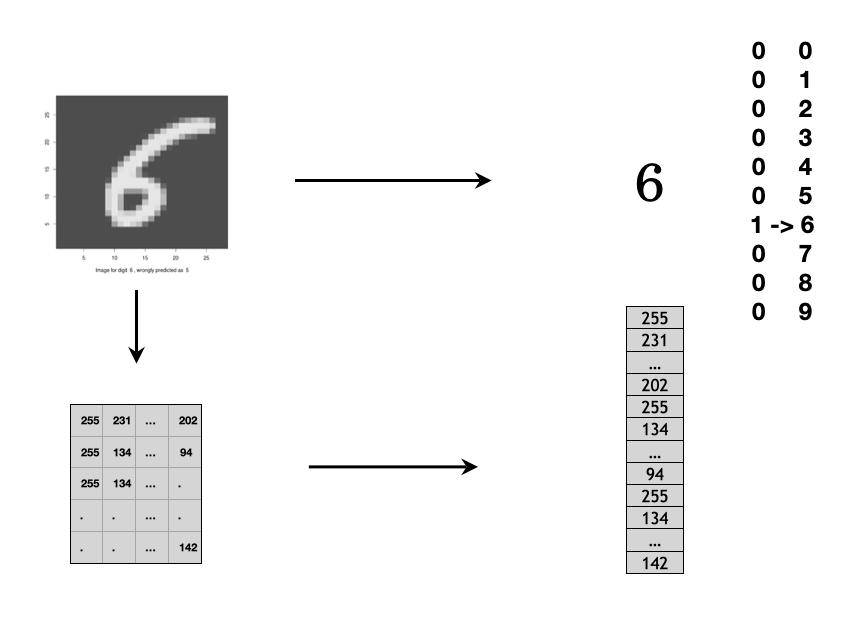

---
output:
  pdf_document: default
  html_document: default
---

# Deep Learning

## Deep Learning Introduction and History

With everyday applications in language, voice, image and automatic driving cars, deep learning becomes a popular concept to the general public in the past few years. However, many of the concepts of deep learning started as early as the 1940s. For example, the concept of binary classifier of perceptron used a linear combination of input signals and a step activation function. It is basically the same as the single neuron in a modern deep learning framework that uses the exact same linear combination of input signals from neurons at previously layer and a more efficient non-linear activation function. The perceptron model was further defined by minimizing the classification error and it was trained by using one data point at a time to update the model parameters during the optimization process. In the modern neural network framework, there is a loss function to be minimized based on the problem to solve and the stochastics gradience descent and its variations are the major optimization algorithms.

Even though the theoretical foundation of deep learning has gradually developed in the past few decades, real-world applications of deep learning started in the past few years primarily due to the following constraints: data, network structure, algorithm, and computation power.

**Data**

We are all familiar with all sorts of data today: structured tabulated data in database tables or CSV files, free form text, images, and other unstructured datasets. However, historical data are relatively small in size, especially for data with accurately labeled ground truth. Statisticians have been working on datasets that only have a few thousand rows and a few dozen columns for decades to solve business problems. Even with modern computers, the size of the data is usually limited to the memory of a computer. Now we know, to enable deep learning applications, the algorithm needs a much larger dataset than traditional machine learning methods. It is usually at the order of millions of samples with high-quality ground truth labels for supervised deep learning models.

The first widely used large dataset with accurate labels is the ImageNet dataset which was first created in 2010. It now contains more than 14 million images with more than 20k synsets (i.e. meaningful categories). Every image in the dataset was human-annotated with quality control to ensure the ground truth labels are accurate. One of the direct results of ImageNet was the Large Scale Visual Recognition Challenge (ILSVRC) which evaluated different algorithms in image-related tasks. The ILSVRC competition provided a perfect stage for deep learning applications to debut to the general public. For 2010 and 2011, the best record of error from traditional image classifications methods was around 26%. In 2012, a method based on the convolutional neural network became the state of the art with an error rate of around 16%, a dramatic improvement from the traditional methods.

With the prevalence of consumer internet, users created much high-quality content and historical text, voice, image, and video were digitized. The quality and quantity of data for deep learning applications became available and it exceeded the threshold of the requirement for many deep learning applications such as image classification, voice recognition, and natural language understanding. Data is the fuel for deep learning engines. With more and more varieties of data created, captured, and saved, there will be more deep learning applications to create values across many business sectors.

**Network Structure**

Lacking high-quality high-volume data was not the only constraint for early deep learning years. For perceptron with just one single neural, it is just a linear classifier. Real applications are nearly always non-linear. To solve that problem, we have to grow one neural to multiple layers of neural network with multiple neurons per layer - the multiple layer perceptron (MLP) and it is called feedforward neural network. In the 1990s, the universal approximation theorem was proved and it assured us that a feedforward network with a single hidden layer containing a finite number of neurons can approximate continuous functions. Even though the one-layer neural network theoretically can solve a general non-linear problem, the reality is that we have grown the neural network to many layers of neural network. The number of layers in the network is the “depth” of a network. Loosely speaking, deep learning is a neural network with the many layers (i.e. the depth is deep).

The MLP is the basic structure for the modern deep learning applications. MLP can be used for classification problems or regression problems with response variables as the output and a collection of explanatory variables as the input (i.e. the traditionally structured datasets). Many of the problems that can be solved using classical classification methods such as random forest can be solved by MLP. However, MLP is not the best option for image and language-related tasks. For image-related tasks, pixels for a local neighbor region collectively provide useful information to solve a task. To take advantage of the 2D spatial relationship among pixels, the convolutional neural network (CNN) structure is a better choice. For language-related tasks, the sequence of the text provides additional information than just a collection of single words. The recurrent neural network (RNN) is a better structure for such sequence-related data. There are other more complicated neural network structures and it is still a fast-developing area. MLP, CNN, and RNN are just the starting point of deep learning methods.

**Algorithm**

In addition to data and neural network structure, there were a few key algorithm breakthroughs before deep learning became a household terminology. For an entry-level neural network structure, there are hundreds of thousands of parameters to be estimated from the data. With a large amount of training data, stochastic gradience decent and mini-batch gradience decent are efficient ways to utilize a subset of training data to update the model parameters. Within the process, one of the key steps is back-propagation which was introduced in the 1980s for efficient weight update. There is a non-linear activation for each neuron in deep learning models, and **sigmoid** or **hyperbolic tangent** functions were often used. However, it has the problem of gradient vanishing when the number of layers of the network grows large (i.e. deeper network). To solve this problem, the **rectified linear unit (ReLu)** was introduced to deep learning in the 2000s and it increases the convergence speed dramatically. ReLu is so simple (i.e. y = x when x >= 0 and y = 0 otherwise), but it indeed cleverly solved one of the big headaches in deep learning. With hundreds of thousands of parameters in the model, deep learning is easy to get overfitted. The dropout concept was introduced in 2012 to mitigate overfitting. It randomly drops out a certain percentage of neurons in the network during the optimization process to achieve more robust model performance. It is similar to the concept of random forest where features and training data are randomly chosen. There are many other algorithm improvements to get better models such as batch normalization and using residuals from previous layers. With backpropagation in stochastic gradience decent, ReLu activation function, dropout, and other technics, modern deep learning methods begin to outperform traditional machine learning methods.

**Computation Power**

With data, network structure and algorithms ready, it still requires certain computation power to train a deep learning model. The entire framework involves heavy linear algebra operations with large matrixes and tensors. The general CPU architecture is not the ideal platform and GPU is a much faster choice. With the vast potential application of deep learning, major tech companies contribute heavily to open-source deep learning frameworks. For example, Google has open-sourced its TensorFlow framework; Facebook has open-sourced its PyTorch framework, and Amazon has significantly contributed to the MXNet open-source framework. With thousands of well-trained software developers and scientists behind these deep learning frameworks, users can confidently pick one framework and start training their deep learning models right away in popular cloud environments. Much of the heavy lifting to train a deep learning model has been embedded in these open-source frameworks and there are also many pre-trained models available for users to adopt. Users can now enjoy the relatively easy access to software and hardware to develop their own deep learning applications. In this book, we will demo deep learning examples using Keras, a high-level abstraction of TensorFlow, using the Databricks Community Edition platform.

In summary, deep learning applications are not developed just in the past few years and it has been ongoing research in the past few decades. The accumulation of data, the advance of algorithm and the improvement of computation power finally enable every day deep learning applications. In the foreseeable future, deep learning will continue to revolutionize machine learning methods across more areas to provide significant improvement.


## Projection Pursuit Regression

Before moving onto neural networks, let us start with a broader framework, Projection Pursuit Regression (PPR). It has a form of **additive model** of the derived features rather than the inputs themselves. Another widely used algorithm, AdaBoost, also fits an additive model in a base learner.

Assume $\mathbf{X^{T}}=(X_1,X_2,\dots,X_p)$ is a vector with $p$ variables. $Y$ is the corresponding response variable. $\mathbf{\omega_{m}},m=1,2,\dots,M$ is parameter vector with $p$ elements. 

$$f(\mathbf{X})=\sum_{m=1}^{M}g_{m}(\mathbf{\omega_{m}^{T}X})$$

The new feature $\mathbf{V_{m}}=\mathbf{\omega_{m}^{T}X}$ is a linear combination of input variables $\mathbf{X}$. The additive model is based on the new features. Here $\mathbf{\omega_{m}}$ is a unit vector, and the new feature $\mathbf{v_m}$ is actually the projection of $\mathbf{X}$ on $\mathbf{\omega_{m}}$. It projects the p-dimensional independent variable space onto the new M-dimensional feature space. This is similar to the principal component analysis except that the principal component is orthogonal projection but it is not necessarily orthogonal here.

I know it is very abstract. Let's look at some examples. Assume $p=2$, i.e. there are two variables $x_1$ and $x_2$. If $M=1$, $\mathbf{\omega^{T}}=(\frac{1}{2},\frac{\sqrt{3}}{2})$, then the corresponding  $v=\frac{1}{2}x_{1}+\frac{\sqrt{3}}{2}x_{2}$. Let's try different setings and compare the results:

1. $\mathbf{\omega^{T}}=(\frac{1}{2},\frac{\sqrt{3}}{2})$, $v=\frac{1}{2}x_{1}+\frac{\sqrt{3}}{2}x_{2}$ , $g(v)=\frac{1}{1+e^{-v}}$

1. $\mathbf{\omega^{T}}=(1,0)$, $v = x_1$, $g(v)=(v+5)sin(\frac{1}{\frac{v}{3}+0.1})$

1. $\mathbf{\omega^{T}}=(0,1)$, $v = x_2$, $g(v)=e^{\frac{v^2}{5}}$

1. $\mathbf{\omega^{T}}=(1,0)$, $v = x_1$, $g(v)=(v+0.1)sin(\frac{1}{\frac{v}{3}+0.1})$


Here is how you can simulate the data and plot it using R:

```{r nnet_simulate_data}
# use plot3D package to generate 3D plot
library(plot3D)
# get x1 and x2 note here x1 and x2 need to be matrix if
# you check the two objects, you will find: columns in
# x1 are identical rows in x2 are identical mesh() is
# funciton from plot3D package you may need to think a
# little here
M <- mesh(seq(-13.2, 13.2, length.out = 50), seq(-37.4, 
    37.4, length.out = 50))
x1 <- M$x
x2 <- M$y
## setting 1 map X using w to get v
v <- (1/2) * x1 + (sqrt(3)/2) * x2
# apply g() on v
g1 <- 1/(1 + exp(-v))
par(mfrow = c(2, 2), mar = c(0, 0, 1, 0))
surf3D(x1, x2, g1, colvar = g1, border = "black", colkey = FALSE, 
    box = FALSE, main = "Setting 1")
## setting 2
v <- x1
g2 <- (v + 5) * sin(1/(v/3 + 0.1))
surf3D(x1, x2, g2, colvar = g2, border = "black", colkey = FALSE, 
    box = FALSE, main = "Setting 2")
## setting 3
v <- x2
g3 <- exp(v^2/5)
surf3D(x1, x2, g3, colvar = g3, border = "black", colkey = FALSE, 
    box = FALSE, main = "Setting 3")
## setting 4
v <- x1
g4 <- (v + 0.1) * sin(1/(v/3 + 0.1))
surf3D(x1, x2, g4, colvar = g4, border = "black", colkey = FALSE, 
    box = FALSE, main = "Setting 4")
```

You can see that this framework is very flexible. In essence, it is to do a non-linear transformation of the linear combination. You can use this way to capture varies of relationships. For example,$x_{1}x_{2}$ can be written as $\frac{(x_{1}+x_{2})^{2}-(x_{1}-x_{2})^{2}}{4}$, where $M=2$. All the higher order factors of $x_1$ and $x_2$ can be represented similarly. If $M$ is large enough, this framework can approximate any continuous function on $\mathbb{R}^{p}$. So the model family covers a board area, but with a price. That is the interpretability. Because the number of parameters increases with M and the mode is nested. 

PPR in 1981 was a new idea then which lead to the debut of the neural network model. The basic technical idea behind deep learning has been around for decades. However, why did they take off in recent years? Here are some main drivers behind the rise. 

First, thanks to the digitalization where lots of human activities are now in the digital realm and captured as data. So in the last 10 year, for many problems, we went from having a relatively small amount of data to accumulating a large amount of data. The traditional learning algorithms, like Logistic Regression, Support Vector Machine, Random Forest cannot effectively take advantage of such big data.  Second, the increasing computation power enables us to train a large neural network either on a CPU or GPU using big data. The scale of data and computation ability lead to much progress, but tremendous algorithmic innovation is also an important driver. Many of the innovations are about speeding up the optimization of neural network. One of the examples is to use ReLU as intermediate layer activation function instead of the previous sigmoid function. The change has made the optimization process much faster because the previous sigmoid function suffers from vanishing gradient. We will talk more about that in the following sections. Here we just want to show an example of the impact of algorithmic innovation.  

## Feedforward Neural Network

### Logistic Regression as Neural Network {#logistic_reg_as_neural_network}

Let's look at logistic regression from the lens of neural network. For a binary classification problem, for example spam classifier, given $m$ samples $\{(x^{(1)}, y^{(1)}),(x^{(2)}, y^{(2)}),...,(x^{(m)}, y^{(m)})\}$, we need to use the input feature $x^{(i)}$ (they may be the frequency of various words such as "money", special characters like dollar signs, and the use of capital letters in the message etc.) to predict the output $y^{(i)}$ (if it is a spam email). Assume that for each sample $i$, there are $n_{x}$ input features. Then we have: 

\begin{equation}
X=\left[\begin{array}{cccc}
x_{1}^{(1)} & x_{1}^{(2)} & \dotsb & x_{1}^{(m)}\\
x_{2}^{(1)} & x_{2}^{(2)} & \dotsb & x_{2}^{(m)}\\
\vdots & \vdots & \vdots & \vdots\\
x_{n_{x}}^{(1)} & x_{n_{x}}^{(2)} & \dots & x_{n_{x}}^{(m)}
\end{array}\right]\in\mathbb{R}^{n_{x}\times m}
(\#eq:input)
\end{equation}

$$y=[y^{(1)},y^{(2)},\dots,y^{(m)}] \in \mathbb{R}^{1 \times m}$$

To predict if sample $i$ is a spam email, we first get the inactivated **neuro** $z^{(i)}$ by a linear transformation of the input $x^{(i)}$, which is $z^{(i)}=w^Tx^{(i)} + b$. Then we apply a function to "activate" the neuro  $z^{(i)}$ and we call it "activation function". In logistic regression, the activation function is sigmoid function and the "activated"  $z^{(i)}$ is the prediction:

$$\hat{y}^{(i)} = \sigma(w^Tx^{(i)} + b)$$

where $\sigma(z) = \frac{1}{1+e^{-z}}$. The following figure summarizes the process:


<center>
{width=30%}
</center>


There are two types of layers. The last layer connects directly to the output. All the rest are _intermediate layers_. Depending on your definition, we call it "0-layer neural network" where the layer count only considers _intermediate layers_. To train the model, you need a cost function which is defined as equation \@ref(eq:costlogistic).

\begin{equation}
J(w,b)=\frac{1}{m} \Sigma_{i=1}^m L(\hat{y}^{(i)}, y^{(i)})
(\#eq:costlogistic)
\end{equation}

where

$$L(\hat{y}^{(i)}, y^{(i)}) =  -y^{(i)}log(\hat{y}^{(i)})-(1-y^{(i)})log(1-\hat{y}^{(i)})$$

To fit the model is to minimize the cost function.

### Gradient Descent

The general approach to minimize $J(w,b)$ is by gradient descent, also known as _back-propagation_.  In logistic regression, it is easy to calculate the gradient w.r.t the parameters $(w, b)$ using the chain rule for differentiation. The optimization process is a forward and backward sweep over the network. Let's look at the gradient descent for logistic regression across m sample. The non-vectorized process is as follows.

<center>
{width=100%}
</center>

First initialize $w_1$, $w_2$, ... , $w_{n_x}$, and $b$. Then plug in the initialized value to the forward and backward propagation.  The forward propagation takes the current weights and calculates the prediction $\hat{h}^{(i)}$ and cost $J^{(i)}$. The backward propagation calculates the gradient descent for the parameters. After iterating through all $m$ samples, you can calculate gradient descent for the parameters. Then update the parameter by:
    $$w := w - \gamma \frac{\partial J}{\partial w}$$
    $$b := b - \gamma \frac{\partial J}{\partial b}$$

Repeat the progapation process using the updated parameter until the cost $J$ stabilizes. 

### Deep Neural Network

Before people coined the term _deep learning_, a neural network refers to _single hidden layer network_. Neural networks with more than one layers are called _deep learning_. Network with the structure in figure \@ref(fig:ffnn) is the **multiple layer perceptron (MLP)** or **feedforward neural network (FFNN)**.

```{r ffnn, fig.cap = "Feedforward Neural Network", out.width="80%", fig.asp=.75, fig.align="center", echo = FALSE}
knitr::include_graphics("images/dnn_str.png")
```

Let's look at a simple one-hidden-layer neural network (figure \@ref(fig:onelayernn)). First only consider one sample. From left to right, there is an input layer with 3 features ($x_1, x_2, x_3$), a hidden layer with four neurons and an output later to produce a prediction $\hat{y}$.

```{r onelayernn, fig.cap = "1-layer Neural Network", out.width="80%", fig.asp=.75, fig.align="center", echo = FALSE}
knitr::include_graphics("images/onelayerNN.png")
```

**From input to the first hidden layer**

Each inactivated neuron on the first layer is a linear transformation of the input vector $x$. For example, $z^{[1]}_1 = w^{[1]T}_1x^{(i)} + b_1^{[1]}$ is the first inactivated neuron for hidden layer one. **We use superscript `[l]` to denote a quantity associated with the $l^{th}$ layer and the subscript `i` to denote the $i^{th}$ entry of a vector (a neuron or feature).** Here $w^{[1]}$ and $b_1^{[1]}$ are the weight and bias parameters for layer 1. $w^{[1]}$ is a $4 \times 1$ vector and hence $w^{[1]T}_1x^{(i)}$ us a linear combination of the four input features. Then use a sigmoid function $\sigma(\cdot)$ to activate the neuron $z^{[1]}_1$ to get $a^{[1]}_1$.

**From the first hidden layer to the output**

Next, do a linear combination of the activated neurons from the first layer to get inactivated output, $z^{[2]}_1$. And then activate the neuron to get the predicted output $\hat{y}$. The parameters to estimate in this step are $w^{[2]}$ and $b_1^{[2]}$.

If you fully write out the process, it is the bottom right of figure \@ref(fig:onelayernn). When you implement a neural network, you need to do similar calculation four times to get the activated neurons in the first hidden layer. Doing this with a `for` loop is inefficient. So people vectorize the four equations. Take an input and compute the corresponding $z$ and $a$ as a vector. You can vectorize each step and get the following representation:

$$\begin{array}{cc}
z^{[1]}=W^{[1]}x+b^{[1]} & \ \ \sigma^{[1]}(z^{[1]})=a^{[1]}\\
z^{[2]}=W^{[2]}a^{[1]}+b^{[2]} & \ \ \ \ \ \sigma^{[2]}(z^{[2]})=a^{[2]}=\hat{y}
\end{array}$$

$b^{[1]}$ is the column vector of the four bias parameters shown above. $z^{[1]}$ is a column vector of the four non-active neurons. When you apply an activation function to a matrix or vector, you apply it element-wise. $W^{[1]}$ is the matrix by stacking the four row-vectors:

$$W^{[1]}=\left[\begin{array}{c}
w_{1}^{[1]T}\\
w_{2}^{[1]T}\\
w_{3}^{[1]T}\\
w_{4}^{[1]T}
\end{array}\right]$$

So if you have one sample, you can go through the above forward propagation process to calculate the output $\hat{y}$ for that sample. If you have $m$ training samples, you need to repeat this process each of the $m$ samples. **We use superscript `(i)` to denote a quantity associated with $i^{th}$ sample.** You need to do the same calculation for all $m$ samples.

For i = 1 to m, do:

$$\begin{array}{cc}
z^{[1](i)}=W^{[1]}x^{(i)}+b^{[1]} & \ \ \sigma^{[1]}(z^{[1](i)})=a^{[1](i)}\\
z^{[2](i)}=W^{[2]}a^{[1](i)}+b^{[2]} & \ \ \ \ \ \sigma^{[2]}(z^{[2](i)})=a^{[2](i)}=\hat{y}^{(i)}
\end{array}$$

Recall that we defined the matrix X to be equal to our training samples stacked up as column vectors in equation \@ref(eq:input). We do a similar thing here to stack vectors with the superscript (i) together across $m$ samples. This way, the neural network computes the outputs on all the samples on at the same time:

$$\begin{array}{cc}
Z^{[1]}=W^{[1]}X+b^{[1]} & \ \ \sigma^{[1]}(Z^{[1]})=A^{[1]}\\
Z^{[2]}=W^{[2]}A^{[1]}+b^{[2]} & \ \ \ \ \ \sigma^{[2]}(Z^{[2]})=A^{[2]}=\hat{Y}
\end{array}$$

where 
$$X=\left[\begin{array}{cccc}
| & | &  & |\\
x^{(1)} & x^{(1)} & \cdots & x^{(m)}\\
| & | &  & |
\end{array}\right],$$

$$A^{[l]}=\left[\begin{array}{cccc}
| & | &  & |\\
a^{[l](1)} & a^{[l](1)} & \cdots & a^{[l](m)}\\
| & | &  & |
\end{array}\right]_{l=1\ or\ 2},$$

$$Z^{[l]}=\left[\begin{array}{cccc}
| & | &  & |\\
z^{[l](1)} & z^{[l](1)} & \cdots & z^{[l](m)}\\
| & | &  & |
\end{array}\right]_{l=1\ or\ 2}$$

You can add layers like this to get a deeper neural network as shown in the bottom right of figure \@ref(fig:ffnn). 

When build a neural network with many layers, one of the choices you get to make is the activation function to use in the hidden layers and the output layer. So far, we only see sigmoid activation function. But there are other choices. Intermediate layers usually use different activation function than the output layer. Let's look at some of the common options in the next section.

### Activation Function

- Sigmoid and Softmax Function

We have used the sigmoid (or logistic) activation function. The function is S-shape with an output value between 0 to 1. Therefore it is used as the output layer activation function to predict the probability **when the response $y$ is binary**. However, it is rarely used as an intermediate layer activation function. One of the main reasons is that when $z$ is away from 0, then the derivative of the function drops fast which slows down the optimization process through gradient descent. Even the fact that it is differentiable provides some convenience, the decreasing slope can cause a neural network to get stuck at the training time.

```{r activationsigmoid, fig.cap = "Sigmoid Function", out.width="80%", fig.asp=.75, fig.align="center", echo = FALSE}
z = seq(-8, 8, 0.1)
fz = 1/(1+exp(-z))
plot(z, fz, type = "l",
     col="blue",
     ylab= expression(paste (sigma, "(z)")))
#     main = expression(paste(sigma,"(z) = ",frac(1,1+e^{-z}),sep='') ) 
text(x = -5,y = 0.8,labels = expression(paste(sigma,"(z) = ",frac(1,1+e^{-z}),sep='') ))
```

When the output has more than 2 categories, people use softmax function as the output layer activation function. 


\begin{equation}
f_i(\mathbf{z}) = \frac{e^{z_i}}{\Sigma_{j=1}^{J} e^{z_j} }
(\#eq:softmax)
\end{equation}

where $\mathbf{z}$ is a vector.

- Hyperbolic Tangent Function (tanh)

Another activation function with a similar S-shape is the hyperbolic tangent function. It works better than the sigmoid function as the intermediate layer [^1].

[^1]: "The tanh function is almost always strictly superior." ---- by Andrew Ng from his coursera course "Neural Networks and Deep Learning" 

\begin{equation}
tanh(z) = \frac{e^{z} - e^{-z}}{e^{z} + e^{-z}}
(\#eq:tanh)
\end{equation}


```{r activationtanh, fig.cap = "Hyperbolic Tangent Function", out.width="80%", fig.asp=.75, fig.align="center", echo = FALSE}
z = seq(-8, 8, 0.1)
fz = 1/(1+exp(-z))
fz_tanh = (exp(z) - exp(-z))/(exp(z)+exp(-z))
plot(z, fz_tanh, type = "l",
     col="blue",
     ylab= "")
#     main = expression(paste(sigma,"(z) = ",frac(1,1+e^{-z}),sep='') ) 
text(x = -5, y = 0.5,labels = expression(paste("tanh(z) = ",frac(e^{z} - e^{-z},e^{z} + e^{-z}),sep='') ))
```

The tanh function crosses point (0, 0) and the value of the function is between 1 and -1 which makes the mean of the activated neurons closer to 0. The sigmoid function doesn't have that property. When you preprocess the training input data, you sometimes center the data so that the mean is 0. The tanh function is kind of doing that data processing for you which makes learning for the next layer a little easier. This activation function is used a lot in the recurrent neural networks where you want to polarize the results.

- Rectified Linear Unit (ReLU) Function

The most popular activation function is the Rectified Linear Unit (ReLU) function. It is a piecewise function, or a half rectified function:


\begin{equation}
R(z) = max(0, z)
(\#eq:relu)
\end{equation}

The derivative is 1 when z is positive and 0 when z is negative. You can define the derivative as either 0 or 1 when z is 0. When you implement this, it is unlikely that z equals to exactly 0 even it can be very close to 0.

```{r activationrelu, fig.cap = "Rectified Linear Unit Function", out.width="80%", fig.asp=.75, fig.align="center", echo = FALSE}
z = seq(-8, 8, 0.1)
relu = function(z){
  return (max(0, z))
}
rz = sapply(z, relu)
plot(z, rz, type = "l",
     col="blue",
     ylab= "")
text(x = -5, y = 6,labels = "R(z) = max(0, z)" )
```

The advantage of the ReLU is that when z is positive, the derivative doesn't vanish as z getting larger. So it leads to faster computation than sigmoid or tanh. It is non-linear with an unconstrained response. However, the disadvantage is that when z is negative, the derivative is 0. It may not map the negative values appropriately. In practice, this doesn't cause too much trouble but there is another version of ReLu called leaky ReLu that attempts to solve the dying ReLU problem. The leaky ReLu is

$$R(z)_{Leaky}=\begin{cases}
\begin{array}{c}
z\\
az
\end{array} & \begin{array}{c}
z\geq0\\
z<0
\end{array}\end{cases}$$

Instead of being 0 when z is negative, it adds a slight slope such as $a=0.01$ as shown in figure \@ref(fig:activationleakyrelu) (can you see the leaky part there? : ).

```{r activationleakyrelu, fig.cap = "Rectified Linear Unit Function", out.width="80%", fig.asp=.75, fig.align="center", echo = FALSE}
z = seq(-8, 8, 0.1)
leakyrelu = function(z){
  if (z>=0) {res = z}
  else {res = 0.01*z}
  return(res)
}
leakyrz = sapply(z, leakyrelu)
plot(z, leakyrz, type = "l",
     col="blue",
     ylab= "")
```

You may notice that all activation functions are non-linear. Since the composition of two linear functions is still linear, using a linear activation function doesn't help to capture more information.  That is why you don't see people use a linear activation function in the intermediate layer. One exception is when the output $y$ is continuous, you may use linear activation function at the output layer. To sum up, for intermediate layers:

- ReLU is usually a good choice. If you don't know what to choose, then start with ReLU. Leaky ReLu usually works better than the ReLU but it is not used as much in practice. Either one works fine. Also, people usually use a=0.01 as the slope for leaky ReLU. You can try different parameters but most of the people a = 0.01.
- tanh is used sometimes especially in recurrent neural network. But you nearly never see people use sigmoid function as intermediate layer activation function.

For the output layer:

- When it is binary classification, use sigmoid with binary cross-entropy as loss function
- When there are multiple classes, use softmax function with categorical cross-entropy as loss function
- When the response is continuous, use identity function (i.e. y = x)


### Deal with Overfitting

The biggest problem for deep learning is overfitting.

#### Regularization

For logistic regression,

$$\underset{w,b}{min}J(w,b)= \frac{1}{m} \Sigma_{i=1}^{m}L(\hat{y}^{(i)}, y^{(i)}) + penalty$$

Common penalties are L1 or L2 as follows:

$$L_2\ penalty=\frac{\lambda}{2m}\parallel w \parallel_2^2 = \frac{\lambda}{2m}\Sigma_{i=1}^{n_x}w_i^2$$

$$L_1\ penalty = \frac{\lambda}{m}\Sigma_{i=1}^{n_x}|w|$$

For neural network,

$$J(w^{[1]},b^{[1]},\dots,w^{[L]},b^{[L]})=\frac{1}{m}\Sigma_{i=1}^{m}L(\hat{y}^{(i)},y^{(i)}) + \frac{\lambda}{2m}\Sigma_{l=1}^{L} \parallel w^{[l]} \parallel^2_F$$

where

$$\parallel w^{[l]} \parallel^2_F = \Sigma_{i=1}^{l}\Sigma_{j=1}^{l-1} (w^{[l]}_{ij})^2$$

Many people call it "Frobenius Norm" instead of L2-norm.

#### Dropout

### Optimization 

#### Batch, Mini-batch, Stochastic Gradient Descent

$$\begin{array}{ccc} x= & [\underbrace{x^{(1)},x^{(2)},\cdots,x^{(1000)}}/ & \cdots/\cdots x^{(m)}]\\ (n_{x},m) & mini-batch\ 1 \end{array}$$

$$\begin{array}{ccc} y= & [\underbrace{y^{(1)},y^{(2)},\cdots,y^{(1000)}}/ & \cdots/\cdots y^{(m)}]\\ (1,m) & mini-batch\ 1 \end{array}$$

- Mini-batch size = m: batch gradient descent, too long per iteration
- Mini-batch size = 1: stochastic gradient descent, lose speed from vectorization
- Mini-batch size in between: mini-batch gradient descent, make progress without processing all training set, typical batch sizes are $2^6=64$, $2^7=128$, $2^7=256$, $2^8=512$

#### Optimization Algorithms

In the history of deep learning, researchers proposed different optimization algorithms and showed that they worked well in a specific scenario.  But the optimization algorithms didn't generalize well to a wide range of neural networks.  So you will need to try different optimizers in your application. We will introduce three commonly used optimizers here. 

**Exponentially Weighted Averages**

### Image Recognition Using FFNN

In this section, we will walk through a toy example of image classification problem using **`keras`** package. We use R in the section to illustrate the process and also provide the python notebook on the book website. Please check the [`keras` R package website](https://keras.rstudio.com/) for the most recent development. We are using the Databrick community edition with the following consideration:

- Minimum language barrier in coding for most users
- Zero setup to save time using cloud environment
- Help you get familiar with current trend of cloud computing in corporate setup

Refer to section \@ref(CloudEnvironment) for how to set up an account, create a notebook (R or Python) and start a cluster.

What is an image as data? You can consider a digital image as a set of points on 2-d or 3-d space. Each each point has a value between 0 to 255 which is considered as a pixel. Figure \@ref(fig:grayscaleimage) shows an example of grayscale image. It is a set of pixels on 2-d space and each pixel has a value between 0 to 255. You can process the image as a 2-d array input if you use a Convolutional Neural Network(CNN). Or, you can vectorize the array as the input for FFNN as shown in the figure.

```{r grayscaleimage, fig.cap = "Grayscale image is a set of pixels on 2-d space. Each pixel has a value range from 0 to 255.", out.width="80%", fig.asp=.75, fig.align="center", echo = FALSE}

```

A color image is a set of pixels on 3-d space and each pixel has a value between 0 to 255. There are three 2-d panels which represent the color red, blue and green accordingly. Similarly, You can process the image as a 3-d array. Or you can vectorize the array as shown in figure \@ref(fig:colorimage). 

```{r colorimage, fig.cap = "Color image is a set of pixels on 3-d space. Each pixel has a value range from 0 to 255.", out.width="80%", fig.asp=.75, fig.align="center", echo = FALSE}
knitr::include_graphics("images/colorimage.png")
```

## Convolutional Neural Network

There are some challenges using a feedforward neural network to solve computer vision problems.  One of the challenges is that the inputs can get really big after you vectorize the image array. A 64 x 64 x 3 image gives you an input vector of 12288! And that is a very small image. So you can expect the number of parameters grows fast and it is difficult to get enough data to fit the model. Also as the input image size grows, the computational requirements to train a feedforward neural network will soon become infeasible. Also, after vectorization, you lose most of the spacial information of the image. To overcome these, people instead use the convolutional neural network for computer vision problems. 

This section introduces the Convolutional Neural Network (CNN), the deep learning model that is almost universally used in computer vision applications. Computer vision has been advancing rapidly which enables many new applications such as self-driving cars and unlocking a phone using face. The application is not limited to the tech industry but some traditional industries such as agriculture and healthcare. Precision agriculture utilizes advanced hardware and computer vision algorithms to increase efficiency and reduce costs for farmers. For example, analyze images from cameras in the greenhouse to track plant growth state. Use sensory data from drones, satellites, and tractors to track soil conditions, detect herbs and pests, automate irrigation, etc. In health care, computer vision helps clinicians to diagnose disease, identify cancer sites with high accuracy [@gloria2019]. Even if you don't work on computer vision, you may find some of the ideas inspiring and borrow them into your area.

Some popular computer vision problems are:

- Image classification (or image recognition): Recognize the object in the image. Is there a cat in the image? Who is this person?
- Object detection: Detect the position and boarder of a specific object. For example, if you are building a self-driving car, you need to know the positions of other cars around you.
- Neural Style Transfer (NST): Given a "content" image and a "style" image, generate an image that merges the two.

A fundamental building block of the convolution neural network is, as the name indicates, the convolution operation. In this chapter, we illustrate the fundamentals of CNN using the example of image classification. 

How do you do convolution? For example, you have a 5 x 5 2-d image (figure \@ref(fig:convolution1). You apply a 3 x 3 filter and convolute over the image. The output of this convolution operator will be a 3 x 3 matrix, which you can consider as a 3 x 3 image and visualize it (top right of figure \@ref(fig:convolution1)).

```{r convolution1, fig.cap = "There are an input image (left), a filter (middel), and an output image (right).", out.width="80%", fig.asp=.75, fig.align="center", echo = FALSE}
knitr::include_graphics("images/convolution1.png")
```

You start from the top left corner of the image and put the filter on the top left 3 x3 sub-matrix of the input image and take the element-wise product. Then you add up the 9 numbers.  Move forward one step each time until it gets to the bottom right. The detailed process is shown in figure \@ref(fig:convolutionsbs).


```{r convolutionsbs, fig.cap = "Convolution step by step", out.width="80%", fig.asp=.75, fig.align="center", echo = FALSE}
knitr::include_graphics("images/convolutionsbs.png")
```


## Recurrent Neural Network


