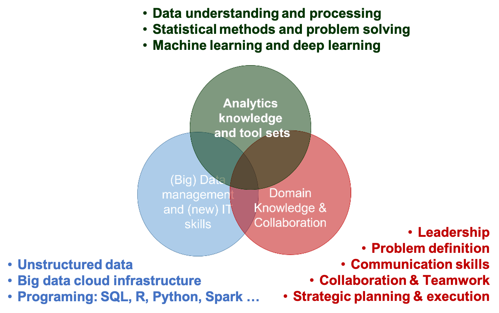

--- 
title: "Introduction to Data Science "
author: "Hui Lin and Ming Li"
date: "`r Sys.Date()`"
knit: "bookdown::render_book"
documentclass: krantz
bibliography: [bibliography.bib]
biblio-style: apalike
link-citations: yes
colorlinks: yes
lot: yes
lof: yes
fontsize: 12pt
monofont: "Source Code Pro"
monofontoptions: "Scale=0.7"
site: http://scientistcafe.com/IDS/
description: "Introduction to Data Science"
url: 'http\://scientistcafe.com/IDS/'
github-repo: happyrabbit/IntroDataScience
---

```{r include=FALSE, echo = FALSE}
# Sys.setenv(TZ="UTC")
options(formatR.indent = 2, width = 55)
#bookdown::render_book("index.Rmd", "bookdown::gitbook")
#bookdown::render_book("index.Rmd", "bookdown::pdf_book")
```

# Preface{-}

During the first couple years of our career as data scientists, we were bewildered by all kinds of data science hype. There is a lack of definition of many basic terminologies such as "Big Data" and "Data Science."  How big is big?  If someone ran into you asked what data science was all about, what would you tell them?  What is the difference between the sexy role "Data Scientist" and the traditional "Data Analyst"? How suddenly came all kinds of machine algorithms? All those struck us as confusing and vague as real-world data scientists!  But we always felt that there was something real there. After applying data science for many years, we explored it more and had a much better idea about data science. And this book is our endeavor to make data science to a more legitimate field. 

## Goal of the Book {-}

This is an introductory book to data science with a specific focus on the application. Data Science is a cross-disciplinary subject involving hands-on experience and business problem-solving exposures. The majority of existing introduction books on data science are about the modeling techniques and the implementation of models using R or Python. However, they fail to introduce data science in a context of the industrial environment. Moreover, a crucial part, the art of data science in practice, is often missing. This book intends to fill the gap. 

Some key features of this book are as follows:

- It is comprehensive. It covers not only technical skills but also soft skills and big data environment in the industry.

- It is hands-on. We provide the data and repeatable R and Python code. You can repeat the analysis in the book using the data and code provided. We also suggest you perform the analyses with your data whenever possible. You can only learn data science by doing it!

- It is based on context. We put methods in the context of industrial data science questions. 

- Where appropriate, we point you to more advanced materials on models to dive deeper

## Who This Book Is For {-}

Non-mathematical readers will appreciate the emphasis on problem-solving with real data across a wide variety of applications and the reproducibility of the companion R and python code.

Readers should know basic statistical ideas, such as correlation and linear regression analysis. While the text is biased against complex equations, a mathematical background is needed for advanced topics.

## What This Book Covers {-}

Based on industry experience, this book outlines the real world scenario and points out pitfalls data science practitioners should avoid. It also covers big data cloud platform and the art of data science such as soft skills. We use R as the main tool and provide code for both R and Python.

## Conventions {-}

## Acknowledgements  {-}

<!--chapter:end:index.rmd-->

\mainmatter

# Introduction

Interest in data science is at an all-time high and has exploded in popularity in the last couple of years. Data scientists today are from various backgrounds. If someone ran into you asked what data science was all about, what would you tell them? It is not easy to answer. Data science is one of the areas where if you ask ten people you get ten different answers. It is not well-defined as an academic subject but broadly used in the industry.  Media has been hyping about "Data Science" "Big Data" and "Artificial Intelligence" over the fast few years. With the data science hype picking up stream, many professionals changed their titles to "Data Scientist" without any of the necessary qualifications. Your first reaction to all of this might be some combination of skepticism and confusion. We want to address this up front that: we had that exact reaction. To make things clear, let's start with the fundamental question. 

## What is data science?

David Donoho  [@data50] summarizes in “50 Years of Data Science” the main recurring “Memes” about data sciences:
 
1. The ‘Big Data’ Meme
1. The ‘Skills’ Meme
1. The ‘Jobs’ Meme

Everyone should have heard about big data. Data science trainees now need the skills to cope with such big data sets. What are those skills? You may hear about: Hadoop, a system using Map/Reduce to process large data sets distributed across a cluster of computers. The new skills are for dealing with organizational artifacts of large-scale cluster computing but not for better solving the real problem. A lot of data on its own is worthless. It isn’t the size of the data that’s important. It’s what you do with it. The big data skills that so many are touting today are not skills for better solving the real problem of inference from data. 

We are transiting to universal connectivity with a deluge of data filling telecom servers. But these facts don’t immediately create a science. The statisticians and computer scientists have been laying the groundwork for data science for at least 50 years. Today’s data science is an enlargement and combination of statistics and computer science rather than a brand new discipline.

Data Science doesn't come out of the blue. Its predecessor is data analysis. Back in 1962, John Tukey wrote in “The Future of Data Analysis”:

> For a long time I have thought I was a statistician, interested in inferences from the particular to the general. But as I have watched mathematical statistics evolve, I have had cause to wonder and to doubt. ...All in all, I have come to feel that my central interest is in data analysis, which I take to include, among other things: procedures for analyzing data, techniques for interpreting the results of such procedures, ways of planning the gathering of data to make its analysis easier, more precise or more accurate, and all the machinery and results of (mathematical) statistics which apply to analyzing data.

It deeply shocked his academic readers. Aren’t you supposed to present something mathematically precise, such as definitions, theorems, and proofs? If we use one sentence to summarize what John said, it is:

> data analysis is more than mathematics.

In September 2015, the University of Michigan made plans to invest $100 million over the next five years in a new Data Science Initiative (DSI) that will enhance opportunities for student and faculty researchers across the university to tap into the enormous potential of big data.  How does DSI define Data science? Their website gives us an idea:

> “This coupling of scientific discovery and practice involves the collection, management, processing, analysis, visualization, and interpretation of vast amounts of heterogeneous data associated with a diverse array of scientific, translational, and interdisciplinary applications.”

How about data scientist? Here is a list of somewhat whimsical definitions for a “data scientist”:

- “A data scientist is a data analyst who lives in California”
- “A data scientist is someone who is better at statistics than any software engineer and better at software engineering than any statistician.”
- “A data scientist is a statistician who lives in San Francisco.”
- “Data Science is statistics on a Mac.”

There is lots of confusion between Data Scientist, Statistician, Business/Financial/Risk(etc.) Analyst and BI professional due to the apparent intersections among skillsets. We see data science as a discipline to make sense of data. The techniques and methodologies of data science stem from the fields of computer science and statistics. One of the most well-cited diagrams describing the area comes from Drew Conway where he suggested data science is the intersection of hacking skills, math and stats knowledge, and substantial expertise. This diagram might be a bit of an oversimplification, but it's a great start. 

There are almost as many definitions of data science as there are data scientists. Instead of listing some of these definitions, it might be more informative to let the subject matter define the field. 

<!--In the obscenity case of Jacobellis v. Ohio (1964), Potter Stewart wrote in his short concurrence that “hard-core pornography” was hard to define, but that “I know it when I see it.” This applies to many things including data science. It is hard to define, but you know it when you see it.-->

Let's start from a brief history of data science. If you hit up the Google Trends website which shows search keyword information over time and check the term “data science,” you will find the history of data science goes back a little further than 2004. From the way media describes it, you may feel machine learning algorithms were just invented last month, and there was never "big" data before Google. That is not true. There are new and exciting developments of data science, but many of the techniques we are using are based on decades of work by statisticians, computer scientists, mathematicians and scientists of all types. 


In the early 19th century when Legendre and Gauss came up the least squares method for linear regression, only physicists would use it to fit linear regression. Now, even non-technical people can fit linear regressions using excel. In 1936 Fisher came up with linear discriminant analysis. In the 1940s, we had another widely used model – logistic regression. In the 1970s, Nelder and Wedderburn formulated “generalized linear model (GLM)” which: 

> "generalized linear regression by allowing the linear model to be related to the response variable via a link function and by allowing the magnitude of the variance of each measurement to be a function of its predicted value." [from Wikipedia] 

By the end of the 1970s, there was a range of analytical models and most of them were linear because computers were not powerful enough to fit non-linear model until the 1980s.

In 1984 Breiman et al. introduced classification and regression tree (CART) which is one of the oldest and most utilized classification and regression techniques. After that Ross Quinlan came up with more tree algorithms such as ID3, C4.5, and C5.0. In the 1990s, ensemble techniques (methods that combine many models’ predictions) began to appear. Bagging is a general approach that uses bootstrapping in conjunction with any regression or classification model to construct an ensemble. Based on the ensemble idea, Breiman came up with random forest in 2001. Later, Yoav Freund and Robert Schapire came up with the AdaBoost.M1 algorithm. Benefiting from the increasing availability of digitized information, and the possibility to distribute that via the internet, the toolbox has been expanding fast. The applications include business, health, biology, social science, politics, etc.

John Tukey identified four forces driving data analysis (there was no “data science” then):

1. The formal theories of math and statistics 
1. Acceleration of developments in computers and display devices 
1. The challenge, in many fields, of more and ever larger bodies of data 
1. The emphasis on quantification in an ever wider variety of disciplines 

Tukey’s 1962 list is surprisingly modern. Let's inspect those points in today's context. There is always a time gap between a theory and its application. We had the theories much earlier than application. Fortunately, for the past 50 years, statisticians have been laying the theoretical groundwork for constructing "data science" today. The development of computers enables us to calculate much faster and deliver results in a friendly and intuitive way. The striking transition to the internet of things generates vast amounts of commercial data. Industries have also sensed the value of exploiting that data. Data science seems certain to be a major preoccupation of commercial life in coming decades. All the four forces John identified exist today and have been driving data science.   

## What kind of questions can data science solve?

### Prerequisites

Data science is not a panacea, and data scientists are not magicians. There are problems data science can't help. It is best to make a judgment as early in the analytical cycle as possible. Tell your clients honestly and clearly when you figure data analytics can't give the answer they want. What kind of questions can data science solve? What are the requirements for our question?

1. Your question needs to be specific enough

Look at two examples:

- Question 1:  How can I increase product sales?
- Question 2:  Is the new promotional tool introduced at the beginning of this year boosting the annual sales of P1197 in Iowa and Wisconsin? (P1197 is an impressive corn seed product from DuPont Pioneer)

It is easy to see the difference between the two questions. Question 1 is a grammatically correct question, but it is proper for data analysis to answer. Why? It is too general. What is the response variable here? Product sales? Which product? Is it annual sales or monthly sales? What are the candidate predictors? You nearly can't get any useful information from the questions. In contrast, question 2 is much more specific. From the analysis point of view, the response variable is clearly "annual sales of P1197 in Iowa and Wisconsin". Even we don't know all the predictors, but the variable of interest is "the new promotional tool introduced early this year." We want to study the impact of the promotion of the sales. You can start from there and move on to figure out other variables need to include in the model by further communication. 

As a data scientist, you may start with something general and unspecific like question 1 and eventually get to question 2.  Effective communication and in-depth domain knowledge about the business problem are essential to convert a general business question into a solvable analytical problem. Domain knowledge helps data scientist communicate with the language the other people can understand and obtain the required information. 

However, defining the question and variables involved don't guarantee that you can answer it.  I have encountered a well-defined supply chain problem. My client asked about the stock needed for a product in a particular area. Why can not this question be answered? I did fit a Multivariate Adaptive Regression Spline (MARS) model and thought I found a reasonable solution. But it turned out later that the data they gave me was inaccurate. In some areas, only estimates of past supply figures were available.  The lesson lends itself to the next point.

2.  You need to have sound and relevant data

One cannot make a silk purse out of a sow's ear. Data scientists need data, sound and relevant data. The supply problem is a case in point. There was relevant data, but not sound. All the later analytics based on that data was a building on sand. Of course, data nearly almost have noise, but it has to be in a certain range.  Generally speaking, the accuracy requirement for the independent variables of interest and response variable is higher than others. In question 2, it is data related to the "new promotion" and "sales of P1197".

The data has to be helpful for the question. If you want to predict which product consumers are most likely to buy in the next three months,  you need to have historical purchasing data: the last buying time, the amount of invoice, coupons and so on. Information about customers' credit card number, ID number, the email address is not going to help.

Often the quality of the data is more important than the quantity, but the quantity cannot be overlooked. In the premise of guaranteeing quality, usually the more data, the better.  If you have a specific and reasonable question, also sound and relevant data, then congratulations, you can start playing data science!

### Problem type

Many of the data science books classify the various models from a technical point of view. Such as supervised vs. unsupervised models, linear vs. nonlinear models, parametric models vs. non-parametric models, and so on. Here we will continue on "problem-oriented" track. We first introduce different groups of real problems and then present which models can be used to answer the corresponding category of questions. 


1. Comparison

The first common problem is to compare different groups. Such as: Is A better in some way than B? Or more comparisons: Is there any difference among A, B, C in a certain aspect? Here are some examples:

- Are the purchasing amounts different between consumers receiving coupons and those without coupons?
- Are males more inclined to buy our products than females?
- Are there any differences in customer satisfaction in different business districts?
- Do the mice receiving a drug have a faster weight gain than the control group?
- Do soybeans carrying a particular gene contain more oil than the control group?

For those problems, it is usually to start exploring from the summary statistics and visualization by groups. After a preliminary visualization, you can test the differences between treatment and control group statistically. The commonly used statistical tests are chi-square test, t-test, and ANOVA. There are also methods using Bayesian methods. In biology industry, such as new drug development, crop breeding, mixed effect models are the dominant technique.

2. Description

In the problem such as customer segmentation, after you cluster the sample, the next step is to figure out the profile of each class by comparing the descriptive statistics of the various variables. Questions of this kind are:

- Is the income of the family's annual observations unbiased?
- What is the mean/variance of the monthly sales volume of a product in different regions?
- What is the difference in the magnitude of the variable? (Decide whether the data needs to be standardized)
- What is the prediction variable in the model?
- What is the age distribution of the respondents?

Data description is often used to check data, find the appropriate data preprocessing method, and demonstrate the model results.

3. Clustering

Clustering is a widespread problem, which is usually related to classification. Clustering answers questions like:

- Which consumers have similar product preferences? (Marketing)
- Which printer performs similar pattern to the broken ones? (Quality Control)
- How many different kinds of employees are there in the company? (Human Resources)
- How many different themes are there in the corpus? (Natural Language Processing)

Note that clustering is unsupervised learning. The most common clustering algorithms include K-Means and Hierarchical Clustering. 

4. Classification

Usually, a labeled sample set is used as a training set to train the classifier. Then the classifier is used to predict the category of a future sample.  Here are some example questions:

- Is this customer going to buy our product? (yes/no)
- Is there a risk that a lender does not repay?
- Who is the author of this book?
- Is this spam email?

There are hundreds of classifiers. In practice, we do not have to try all the models as long as we fit in several of the best models in most cases. 

5. Regression

In general, regression deals with the problem of "how much is it?" and return a numerical answer.  In some cases, it is necessary to coerce the model results to be 0, or round the result to the nearest integer. It is the most common problem. 

- What will be the temperature tomorrow?
- What will be the company's sales in the fourth quarter of this year?
- How long will the engine work?
- How much beer should we prepare for this event?

## Data Scientist Skill Set

We talked about the bewildering definitions of data scientist. What are the required skills for a data scientist?

- Educational Background

Most of the data scientists today have undergraduate or higher degree from one of the following areas: computer science, electronic engineering, mathematics or statistics. According to a 2017 survey, 25% of US data scientists have a Ph.D. degree, 64% have a Master’s degree, and 11% are Bachelors. 

- Database Skills

Data scientists in the industry need to use SQL to pull data from the database. So it is necessary to be familiar with how data is structured and how to do basic data manipulation using SQL. Many statistics/mathematics students do not have experience with SQL in school. Don't worry. If you are proficient in one programming language, it is easy to pick up SQL. The main purpose of graduate school should be to develop the ability to learn and analytical thinking rather than the technical skills. Even the technical skills are necessary to enter the professional area. Most of the skills needed at work are not taught in school. 

- Programming Skills

Programming skills are critical for data scientists. According to a 2017 survey from [Burtch Works](http://www.burtchworks.com/2017/06/19/2017-sas-r-python-flash-survey-results/), 97% of the data scientists today using R or Python. We will focus on R in this book, but both are great tools for data science. There is not one "have-to-use" tool. The goal is to solve the problem not which tool to choose. However, a good tool needs to be flexible and scalable.

- Modeling Skills

Data scientists need to know statistical and machine learning models. There is no clear line separating these two. Many statistical models are also machine learning models, vice versa. Generally speaking, a data scientist is familiar with basic statistical tests such as t-test, chi-square test, and analysis of variance. They can explain the difference between Spearman rank correlation and Pearson correlation, be aware of basic sampling schemes, such as Simple Random Sampling, Stratified Random Sampling, and Multi-Stage Sampling. Know commonly used probability distributions such as Normal distribution, Binomial distribution, Poisson distribution, F distribution, T distribution, and Chi-square distribution. Experimental design plays a significant role in the biological study.  Understanding the main tenants of Bayesian methods is necessary (at least be able to write the Bayes theorem on the whiteboard and know what does it mean).  Know the difference between supervised and unsupervised learning. Understand commonly used cluster algorithms, classifiers, and regression models. Some powerful tools in predictive analytics are tree models (such as random forest and AdaBoost) and penalized model (such as lasso and SVM).  Data scientist working on social science (such as consumer awareness surveys), also needs to know the latent variable model, such as exploratory factor analysis, confirmatory factor analysis, structural equation model. 

Is the list getting a little scary? It can get even longer. Don't worry if you don't know all of them now. You will learn as you go. Standard mathematics, statistics or computer science training in graduate school can get you started. But you have to learn lots of new skills after school.  Learning is happening increasingly outside of formal educational settings and in unsupervised environments. An excellent data scientist must be a lifetime learner. Fortunately, technological advantages provide new tools and opportunities for lifetime learners, MOOC, online data science workshops and various online tutorials.  So above all, **self-learning ability** is the most critical skill. 

- Soft Skills

In addition to technical knowledge, there are some critical soft skills.  These include the ability to translate practical problems into data problems, excellent communication skill, attention to detail,  storytelling and so on. We will discuss it in a later chapter in more detail. 


## Types of Learning

There are three broad groups of styles: supervised learning, reinforcement learning, and unsupervised learning. 

In supervised learning, each observation of the predictor measurement(s) corresponds to a response measurement. There are two flavors of supervised learning: regression and classification. In regression, the response is a real number such as the total net sales in 2017, or the yield of corn next year. The goal is to approximate the response measurement as much as possible. In classification, the response is a class label, such as dichotomous response such as yes/no. The response can also have more than two categories, such as four segments of customers. A supervised learning model is a function that maps some input variables with corresponding parameters to a response y.  Modeling tuning is to adjust the value of parameters to make the mapping fit the given response.  In other words, it is to minimize the discrepancy between given response and the model output. When the response y is a real value, it is intuitive to define discrepancy as the squared difference between model output and given the response. When y is categorical,  there are other ways to measure the difference, such as AUC or information gain. 

In reinforcement learning, the correct input/output pairs are not present. The model will learn from a sequence of actions and select the action maximizing the expected sum of the future rewards.  There is a discount factor that makes future rewards less valuable than current rewards. Reinforcement learning is difficult for the following reasons: 

(1) The rewards are not instant. If the action sequence is long, it is hard to know which action was wrong. 

(2) The rewards are occasional. Each reward does not supply much information, so its impact of parameter change is limited.  Typically, it is not likely to learn a large number of parameters using reinforcement learning.   However, it is possible for supervised and unsupervised learning. The number of parameters in reinforcement learning usually range from dozens to maybe 1,000, but not millions. 
 
In unsupervised learning, there is no response variable. For a long time, the machine learning community overlooked unsupervised learning except for one called clustering. Moreover, many researchers thought that clustering was the only form of unsupervised learning. One reason is that it is hard to define the goal of unsupervised learning explicitly. Unsupervised learning can be used to do the following:

(1) Identify a good internal representation or pattern of the input that is useful for subsequent supervised or reinforcement learning, such as finding clusters.

(2) It is a dimension reduction tool that is to provide compact, low dimensional representations of the input, such as factor analysis. 
 
(3) Provide a reduced number of uncorrelated learned features from original variables, such as principal component regression. 


## Types of Algorithm 

The categorization here is based on the structure (such as tree model, Regularization Methods) or type of question to answer (such as regression).[^1] It is far less than perfect but will help to show a bigger map of different algorithms. Some can be legitimately classified into multiple categories, such as support vector machine (SVM) can be a classifier, and can also be used for regression. So you may see other ways of grouping. Also, the following summary does not list all the existing algorithms (there are just too many). 

[^1]:The summary of various algorithms for data science in this section is based on Jason Brownlee's blog "(A Tour of Machine Learning Algorithms)[http://machinelearningmastery.com/a-tour-of-machine-learning-algorithms/]." We added and subtracted some algorithms in each category and gave additional comments.

1. Regression

Regression can refer to the algorithm or a particular type of problem. It is supervised learning. Regression is one of the oldest and most widely used statistical models. It is often called the statistical machine learning method. Standard regression models are:

- Ordinary Least Squares Regression
- Logistic Regression
- Multivariate Adaptive Regression Splines (MARS)
- Locally Estimated Scatterplot Smoothing (LOESS)

The least squares regression and logistic regression are traditional statistical models. Both of them are highly interpretable. MARS is similar to neural networks and partial least squares (PLS) in the respect that they all use surrogate features instead of original predictors.  

They differ in how to create the surrogate features. PLS and neural networks use linear combinations of the original predictors as surrogate features ^[To be clear on neural networks, the linear combinations of predictors are put through non-linear activation functions, deeper neural networks have many layers of non-linear transformation]. MARS creates two contrasted versions of a predictor by a truncation point. And LOESS is a non-parametric model, usually only used in visualization.

2. Similarity-based Algorithms

This type of model is based on a similarity measure. There are three main steps: (1) compare the new sample with the existing ones; (2) search for the closest sample; (3) and let the response of the nearest sample be used as the prediction. 

-   K-Nearest Neighbour [KNN]
-   Learning Vector Quantization [LVQ]
-   Self-Organizing Map [SOM]

The biggest advantage of this type of model is that they are intuitive.  K-Nearest Neighbour is generally the most popular algorithm in this set.  The other two are less common.   The key to similarity-based algorithms is to find an appropriate distance metric for your data.

3. Feature Selection Algorithms

The primary purpose of feature selection is to exclude non-information or redundant variables and also reduce dimension. Although it is possible that all the independent variables are significant for explaining the response. But more often, the response is only related to a portion of the predictors. We will expand the feature selection in detail later. 

- Filter method
- Wrapper method
- Embedded method

Filter method focuses on the relationship between a single feature and a target variable. It evaluates each feature (or an independent variable) before modeling and selects "important" variables. 

Wrapper method removes the variable according to particular law and finds the feature combination that optimizes the model fitting by evaluating a set of feature combinations. In essence, it is a searching algorithm.

Embedding method is part of the machine learning model.  Some model has built-in variable selection function such as lasso, and decision tree. 

4. Regularization Method

This method itself is not a complete model, but rather an add-on to other models (such as regression models). It appends a penalty function on the criteria used by the original model to estimate the variables (such as likelihood function or the sum of squared error). In this way, it penalizes model complexity and contracts the model parameters. That is why people call them "shrinkage method." This approach is advantageous in practice. 

-  Ridge Regression
-  Least Absolute Shrinkage and Selection Operator (LASSO)
-  Elastic Net

5. Decision Tree

Decision trees are no doubt one of the most popular machine learning algorithms. Thanks to all kinds of software, implementation is a no-brainer which requires nearly zero understanding of the mechanism. The followings are some of the common trees: 

-  Classification and Regression Tree (CART)
-  Iterative Dichotomiser 3 (ID3)
-  C4.5
-  Random Forest
-  Gradient Boosting Machines (GBM)

6. Bayesian Models

People usually confuse Bayes theorem with Bayesian models. Bayes theorem is an implication of probability theory which gives Bayesian data analysis its name. 

$$Pr(\theta|y)=\frac{Pr(y|\theta)Pr(\theta)}{Pr(y)}$$

The actual Bayesian model is not identical to Bayes theorem. Given a likelihood, parameters to estimate, and a prior for each parameter, a Bayesian model treats the estimates as a purely logical consequence of those assumptions. The resulting estimates are the posterior distribution which is the relative plausibility of different parameter values, conditional on the observations.
The Bayesian model here is not strictly in the sense of Bayesian but rather model using Bayes theorem. 

- Naïve Bayes
- Averaged One-Dependence Estimators (AODE)
- Bayesian Belief Network (BBN)

7.  Kernel Methods    

The most common kernel method is the support vector machine (SVM). This type of algorithm maps the input data to a higher order vector space where classification or regression problems are easier to solve.

- Support Vector Machine (SVM)
- Radial Basis Function (RBF)
- Linear Discriminate Analysis  (LDA)

8. Clustering Methods

Like regression, when people mention clustering,  sometimes they mean a class of problems, sometimes a class of algorithms. The clustering algorithm usually clusters similar samples to categories in a centroidal or hierarchical manner. The two are the most common clustering methods:

- K-Means
- Hierarchical Clustering

9. Association Rule

The basic idea of an association rule is: when events occur together more often than one would expect from their rates of occurrence, such co-occurrence is an interesting pattern.  The most used algorithms are: 

-  Apriori algorithm
-  Eclat algorithm

10. Artificial Neural Network

The term neural network has evolved to encompass a repertoire of models and learning methods. There has been lots of hype around the model family making them seem magical and mysterious.  A neural network is a two-stage regression or classification model.  The basic idea is that it uses linear combinations of the original predictors as surrogate features, and then the new features are put through non-linear activation functions to get hidden units in the 2nd stage. When there are multiple hidden layers, it is called deep learning, another over hyped term. Among varieties of neural network models, the most widely used "vanilla" net is the single hidden layer back-propagation network. 

- Perceptron Neural Network
- Back Propagation
- Hopield Network
- Self-Organizing Map (SOM)
- Learning Vector Quantization (LVQ)

11. Deep Learning

The name is a little misleading. As mentioned before, it is multilayer neural network. It is hyped tremendously especially after AlphaGO defeated Li Shishi at the board game Go. We don't have too much experience with the application of deep learning and are not in the right position to talk more about it. Here are some of the common algorithms:

<!--Many of the deep learning algorithms are semi-supervised learning algorithms that deal with large datasets with a few unlabeled samples. -->

<!-- Alex's comments:
There are many different types of deep learning applications, some are supervised (computer vision image classification), some are reinforcement learning (I think I read that a lot of game AIs use this, such as bots to beat games like Super Mario), and can also be used to build features in an unsupervised way (autoencoders).  There is a lot of hype in this topic but I think deep learning differentiates itself from earlier ANN because of many recent advancements that make it possible to have very large and very deep networks: backprop, new ways to initialize weights, dropout etc.-->

- Restricted Boltzmann Machine (RBN)
- Deep Belief Networks (DBN)
- Convolutional Network
- Stacked Autoencoders
- Long short-term memory (LSTM)

12. Dimensionality Reduction

Its purpose is to construct new features that have significant physical or statistical characteristics, such as capturing as much of the variance as possible.

- Principle Component Analysis (PCA)
- Partial Least Square Regression (PLS)
- Multi-Dimensional Scaling (MDS)
- Exploratory Factor Analysis (EFA)

PCA attempts to find uncorrelated linear combinations of original variables that can explain the variance to the greatest extent possible. EFA also tries to explain as much variance as possible in a lower dimension. MDS maps the observed similarity to a low dimension, such as a two-dimensional plane.  Instead of extracting underlying components or latent factors, MDS attempts to find a lower-dimensional map that best preserves all the observed similarities between items. So it needs to define a similarity measure as in clustering methods. 

13. Ensemble Methods

Ensemble method made its debut in the 1990s. The idea is to build a prediction model by combining the strengths of a collection of simpler base models.  Bagging, originally proposed by Leo Breiman, is one of the earliest ensemble methods. After that, people developed Random Forest [@Ho1998; @amit1997] and Boosting method [@Valiant1984; @KV1989]. This is a class of powerful and effective algorithms.

- Bootstrapped Aggregation (Bagging)
- Random Forest
- Gradient Boosting Machine (GBM)


<!--chapter:end:01-Introduction.Rmd-->

# Soft Skills for Data Scientists

## Comparison between Statistician and Data Scientist

Statistics as a scientific area can be traced back to 1749 and statistician as a career has been around for hundreds of years with well-established theory and application. Data Scientist becomes an attractive career for only a few years along with the fact that data size and variety beyond the traditional statistician’s toolbox and the fast-growing of computation power. Statistician and data scientist have a lot of common backgrounds, but there are also some significant differences. 

<center>

</center>

Both statistician and data scientist work closely with data. For the traditional statistician, the data is usually well-formatted text files with numbers and labels. The size of the data usually can be fitted in a PC’s memory. Comparing to statisticians, data scientists need to deal with more varieties of data: well-formatted data stored in a database system with size much larger than a PC’s memory or hard-disk; huge amount of verbatim text, voice, image, and video; real-time streaming data and other types of records. One particular power of statistics is that statistician can fit model and make an inference based on limited data. It is quite common that once the data is given and cleaned, the majority of the work is developed different models around the data. Today, data is relatively abundant, and modeling is just part of the overall effort. The focus is to deliver actionable results. Different from statisticians, data scientists, sometimes need to fit model on the cloud instead of reading data in since the data size is too large. From the entire problem-solving cycle, statisticians are usually not well integrated with the production system where data is obtained in real time; while data scientists are more embedded in the production system and closer to the data generation procedures. 

## Where Data Science Team Fits?

During the past decade, a huge amount of data has become available and readily accessible for analysis in many companies across different business sectors. The size, complexity, and speed of increment of data suddenly beyond the traditional scope of statistical analysis or BI reporting as mentioned above. To leverage the big data, many companies have established new data science organizations. Companies have gone through different paths to create their data science and machine learning organizations. There are three major formats of data science teams: 

(1) independent of any current organizations and the team report directly to senior leadership;   
(2) within each business unit and the team report to business unit leaders;    
(3) within in the traditional IT organizations and the team report to IT leaders.

Companies are different in many aspects, but in general, the most efficient option to mine big data is a team of data scientist independent of business units and IT organizations. The independence enables the data science team to collaborate across business units and IT organizations more efficiently and the independence also provides flexibility and potential to solve corporate level strategic big data problems. For each business units, there are many business unit specific data science related problems and embedding data scientist within each business units is also an efficient way to solve business unit specific data science problems. The full cycle of data science projects from data to decision (i.e. Data -> Information -> Knowledge -> Insight -> Decision) is relatively difficult to achieve if the data science team is part of traditional IT organizations. 

## Beyond Data and Analytics

Data scientists usually have a good sense of data and analytics, but data scientist project is more than just data and analytics. A data science project may involve people with many different roles:  

- a business owner or leader to identify opportunities in business value; program managers to ensure each data science project fit into the overall technical program development; 
- data owners and computation resource and infrastructure owners from IT department; 
- dedicated team to make sure the data and model are under model governance and privacy guidelines; 
- a team to implement, maintain and refresh the model;
- project managers to coordinate all parties to set periodical tasks so that the project meets the preset milestones and delivery results; 
- multiple rounds of discussion of resource allocation (i.e. who will pay for the data science project). 

Effective communication and in-depth domain knowledge about the business problem are essential requirements for a successful data scientist. A data scientist will interact with people at various levels ranging from senior leaders who are setting the corporate strategies to front-line employees who are doing the daily work. A data scientist needs to have the capability to view the problem from 10,000 feet above ground, as well as down to the detail to the very bottom. To convert a business question into a data problem, a data scientist needs to communicate using the language the other people can understand and obtain the required information. 

## Data Scientist as a Leader

During the entire process of data science project defining, planning, executing and implementation, the data scientist lead needs to be involved in every step to ensure the business problem is defined correctly and the business value and success metric are evaluated reasonably. Corporates are investing heavily in data science and machine learning with a very high expectation of big return. There are too many opportunities to introduce unrealistic goal and business impact for a particular data science project. The leading data scientist need to be the leader in these discussions to define the goal backed by data and analytics. Many data science projects over promise in deliverables and too optimistic on the timeline and these projects eventually fail by not delivering the preset business impact within the timeline. As the data scientist in the team, we need to identify these issues early in the stage and communicate to the entire team to make sure the project has a realistic deliverable and timeline. The data scientist team also need to work closely with data owners to identify relevant internal and external data source and evaluate the quality of the data; as well as working closely with the computation infrastructure team to understand the computation resources (i.e. hardware and software) available for the data science project.

## Three Pillars of Knowledge

The following picture summarizes the needed three pillars of knowledge to be a successful data scientist. 

(1) A successful data scientist needs to have a strong technical background in data mining, statistics and machine learning. The in-depth understanding of modeling with the insight about data enable a data scientist to convert a business problem to a data science problem. 

(2) A successful data scientist needs some domain knowledge to understand business problem. For any data science project, the data scientist need to collaborate with other team members and effective communication and leadership skills are critical, especially when you are the only data person in the room and you need to decide with uncertainty. 

(3) The last pillar is about computation environment and model implementation in big data platform. This used to be the most difficult one for a data scientist with statistics background (i.e. lack computer science or programming skills). The good news is that with the rise of cloud computation big data platform, this barrier is getting easier for a statistician to overcome and we will discuss in more detail in next chapter.

<center>

</center>

## Common Pitfalls of Data Science Projects

Data science projects are usually complicated, and many of these data science projects eventually fail due to various reasons. We will briefly discuss a few common pitfalls in data science projects and how to avoid them.

- **Solve the wrong problem:** data science project usually starts with a very vague description and a few rounds of detailed discussion with all stakeholders involved are needed to define the busses problem. There will be lots of opportunities to introduce misalignment when mapping the business problem into specific data science methods. Especially when the quality and availability of the data are not as good as what is expected at the first place. If not well-communicated during the project, the final data science solution may not be the right one to solve the business problem. As the data scientist (sometimes the only data scientist) in the room, we must understand the business problem thoroughly and communicate regularly to business partners especially there is a change of status to make sure everyone is aligned with the progress and final deliverables.

- **Over promise on business value:** business leaders usually have high expectation on data science projects and the goal of business value and deliverables sometimes are set unrealistic and eventually beyond the scope of available data and computation resource.  As the data scientist (sometimes the only data scientist) in the room, we must have our voice heard based on fact (i.e. data, analytics, and resources) instead of wishful thinking. Backed with fact-based evidence, it is easier to communicate what is a realistic goal for the entire team. 

- **Too optimistic about the timeline:** there are lots of uncertainties in data science projects such as the data source availability and data quality, computation hardware and software, resource availability in the business team, implementation team and IT department, as well as project direction change which may delay the final delivery date. To have a better-estimated timeline, get as much detail as possible for all the needed tasks and estimated each task individually and reach out to each team member to confirm their availability. Most importantly, communicate with the entire team if there are blocking factors for the project in a prompt way such that everyone aware of the situation and potential impact on the timeline.

- **Too optimistic about data availability and quality:** the most important asset in data science project is data. Even though we are at the big data age, often there is not enough relevant data for the data science projects. The data quality is also a general problem for data science projects. A thorough data availability and quality check are needed at the beginning of the data science project to estimate the needed effort to obtain data as well as data cleaning. 

- **Model cannot be scaled:**  be careful if you use a subset of data to fit the model and then scale it to the entire dataset. When developing the model using a smaller dataset, we must keep in mind how much computation resources needed for the whole dataset. With limited computation resource, it is important to maximize the computation time in production to a reasonable level based on the business application when fits the model with a sample dataset. 

- **Take too long to fail:** data science projects usually are trying to push the boundary of current applications to new territory, people do not expect all data science projects to be successful. Fail fast is good practice such that we can quickly find a better way to solve the problem. A data scientist needs to have an open mindset to not stuck with one idea or one approach for a long time to avoid taking too long to fail.


<!--chapter:end:02-SoftSkills.Rmd-->

# Introduction to the data

Before tackling analytics problem, we start by introducing data to be analyzed in later chapters. 

## Customer Data for Clothing Company

Our first data set represents customers of a clothing company who sells products
in stores and online. This data is typical of what one might get from a company's marketing data base (the data base will have more data than the one we show here). This data includes 1000 customers for whom we have 3 types of data:


1. Demography
    - `age`: age of the respondent
    - `gender`: male/female
    - `house`: 0/1 variable indicating if the customer owns a house or not

1. Sales in the past year
    - `store_exp`: expense in store
    - `online_exp`: expense online
    - `store_trans`: times of store purchase
    - `online_trans`: times of online purchase

1. Survey on product preference

It is common for companies to survey their customers and draw insights to guide future marketing activities. The survey is as below:

How strongly do you agree or disagree with the following statements:

1. Strong disagree
1. Disagree
1. Neither agree nor disagree
1. Agree
1. Strongly agree

- Q1. I like to buy clothes from different brands
- Q2. I buy almost all my clothes from some of my favorite brands
- Q3. I like to buy premium brands
- Q4. Quality is the most important factor in my purchasing decision
- Q5. Style is the most important factor in my purchasing decision
- Q6. I prefer to buy clothes in store
- Q7. I prefer to buy clothes online
- Q8. Price is important 
- Q9. I like to try different styles
- Q10. I like to make a choice by myself and don't need too much of others' suggestions 

There are 4 segments of customers: 

1. Price
1. Conspicuous
1. Quality
1. Style

Let's check it:

```{r, echo=FALSE}
library(readr)
sim.dat <- read.csv("https://raw.githubusercontent.com/happyrabbit/DataScientistR/master/Data/SegData.csv")
```

```{r}
str(sim.dat,vec.len=3)
```


<!--
The simulation is not very straightforward and we will break it into three parts: 

1. Define data structure: variable names, variable distribution, customer segment names, segment size
1. Variable distribution parameters: mean and variance
1. Iterate across segments and variables. Simulate data according to specific parameters assigned

By organizing code this way, it makes easy for us to change specific parts of the simulation. For example, if we want to change the distribution of one variable, we can just change the corresponding part of the code.

Here is code to define data structure:

```r
# set a random number seed to make the process repeatable
set.seed(12345)
# define the number of observations
ncust<-1000
# create a data frmae for simulated data
seg_dat<-data.frame(id=as.factor(c(1:ncust)))
# assign the variable names
vars<-c("age","gender","income","house","store_exp","online_exp","store_trans","online_trans")
# assign distribution for each variable
vartype<-c("norm","binom","norm","binom","norm","norm","pois","pois")
# names of 4 segments
group_name<-c("Price","Conspicuous","Quality","Style")
# size of each segments
group_size<-c(250,200,200,350)
```

The next step is to define variable distribution parameters. There are 4 segments of customers and 8 parameters. Different segments correspond to different parameters. Let's store the parameters in a 4×8 matrix:


```r
# matrix for mean
mus <- matrix( c(
  # Price
  60, 0.5, 120000,0.9, 500,200,5,2,
  # Conspicuous
  40, 0.7, 200000,0.9, 5000,5000,10,10,
  # Quality
  36, 0.5, 70000, 0.4, 300, 2000,2,15,
  # Style
  25, 0.2, 90000, 0.2, 200, 2000,2,20), ncol=length(vars), byrow=TRUE)
```

```r
# matrix for variance
sds<- matrix( c(
  # Price
  3,NA,8000,NA,100,50,NA,NA,
  # Conspicuous
  5,NA,50000,NA,1000,1500,NA,NA,
  # Quality
  7,NA,10000,NA,50,200,NA,NA,
  # Style
  2,NA,5000,NA,10,500,NA,NA), ncol=length(vars), byrow=TRUE)
```

Now we are ready to simulate data using the parameters defined above:

```r
# simulate non-survey data
sim.dat<-NULL
set.seed(2016)
# loop on customer segment (i)
 for (i in seq_along(group_name)){
 
   # add this line in order to moniter the process
   cat (i, group_name[i],"\n")
 
  # create an empty matrix to store relevent data
  seg<-data.frame(matrix(NA,nrow=group_size[i], ncol=length(vars)))  
 
  # Simulate data within segment i
  for (j in seq_along(vars)){
 
    # loop on every variable (j)
    if (vartype[j]=="norm"){
      # simulate normal distribution
      seg[,j]<-rnorm(group_size[i], mean=mus[i,j], sd=sds[i,j])
    } else if (vartype[j]=="pois") {
      # simulate poisson distribution
      seg[,j]<-rpois(group_size[i], lambda=mus[i,j])
    } else if (vartype[j]=="binom"){
      # simulate binomial distribution
      seg[,j]<-rbinom(group_size[i],size=1,prob=mus[i,j])
    } else{
      # if the distribution name is not one of the above, stop and return a message
      stop ("Don't have type:",vartype[j])
    }        
  }
  sim.dat<-rbind(sim.dat,seg)
 }
```

Now let's edit the data we just simulated a little by adding tags to 0/1 binomial variables:

```r
# assign variable names
names(sim.dat)<-vars
# assign factor levels to segment variable
sim.dat$segment<-factor(rep(group_name,times=group_size))
# recode gender and house variable
sim.dat$gender<-factor(sim.dat$gender, labels=c("Female","Male"))
sim.dat$house<-factor(sim.dat$house, labels=c("No","Yes"))
# store_trans and online_trans are at least 1
sim.dat$store_trans<-sim.dat$store_trans+1
sim.dat$online_trans<-sim.dat$online_trans+1
# age is integer
sim.dat$age<-floor(sim.dat$age)
```

In the real world, the data always includes some noise such as missing, wrong imputation. So we will add some noise to the data:

```r
# add missing values
idxm <- as.logical(rbinom(ncust, size=1, prob=sim.dat$age/200))
sim.dat$income[idxm]<-NA
# add wrong imputations and outliers
set.seed(123)
idx<-sample(1:ncust,5)
sim.dat$age[idx[1]]<-300
sim.dat$store_exp[idx[2]]<- -500
sim.dat$store_exp[idx[3:5]]<-c(50000,30000,30000)
```

So far we have created part of the data. You can check it using `summary(sim.dat).' Next, we will move on to simulate survey data.

```r
# number of survey questions
nq<-10
# mean matrix for different segments 
mus2 <- matrix( c(
  # Price
 5,2,1,3,1,4,1,4,2,4,
  # Conspicuous
 1,4,5,4,4,4,4,1,4,2,
  # Quality
 5,2,3,4,3,2,4,2,3,3,
  # Style
 3,1,1,2,4,1,5,3,4,2), ncol=nq, byrow=TRUE)

# assume the variance is 0.2 for all
sd2<-0.2
sim.dat2<-NULL
set.seed(1000)
# loop for customer segment (i)
for (i in seq_along(group_name)){
  # the following line is used for checking the progress
  # cat (i, group_name[i],"\n")
  # create an empty data frame to store data
  seg<-data.frame(matrix(NA,nrow=group_size[i], ncol=nq))  
  # simulate data within segment
  for (j in 1:nq){
    # simulate normal distribution
    res<-rnorm(group_size[i], mean=mus2[i,j], sd=sd2)
    # set upper and lower limit
    res[res>5]<-5
    res[res<1]<-1
    # convert continuous values to discrete integers
    seg[,j]<-floor(res)
  }
  sim.dat2<-rbind(sim.dat2,seg)
}

names(sim.dat2)<-paste("Q",1:10,sep="")
sim.dat<-cbind(sim.dat,sim.dat2)
sim.dat$segment<-factor(rep(group_name,times=group_size))
```

So far we have gotten all the data. 
-->

## Customer Satisfaction Survey Data from Airline Company

This data set is from a customer satisfaction survey for three airline companies. There are `N=1000` respondents and 15 questions. The market researcher asked respondents to recall the experience with different airline companies and assign a score (1-9) to each airline company for all the 15 questions. The higher the score, the more satisfied the customer to the specific item. The 15 questions are of 4 types (the variable names are in the  parentheses):


- How satisfied are you with your______?

1. Ticketing
    - Ease of making reservation（Easy_Reservation）
    - Availability of preferred seats（Preferred_Seats）
    - Variety of flight options（Flight_Options）
    - Ticket prices（Ticket_Prices）
1. Aircraft
    - Seat comfort（Seat_Comfort）
    - Roominess of seat area（Seat_Roominess）
    - Availability of Overhead（Overhead_Storage）
    - Cleanliness of aircraft（Clean_Aircraft）
1. Service
    - Courtesy of flight attendant（Courtesy）
    - Friendliness（Friendliness）
    - Helpfulness（Helpfulness）
    - Food and drinks（Service）
1. General
    - Overall satisfaction（Satisfaction）
    - Purchase again（Fly_Again）
    - Willingness to recommend（Recommend）

Now check the data frame we have:

```{r, echo=FALSE}
rating<-read_csv("https://raw.githubusercontent.com/happyrabbit/DataScientistR/master/Data/AirlineRating.csv")
```

```{r}
str(rating,vec.len=3)
```

<!--

```r
# Create a matrix of factor loadings
# This pattern is called bifactor because it has a general factor for separate components.
# For example, "Ease of making reservation" has general factor loading 0.33, specific factor loading 0.58
# The outcome variables are formed as combinations of these general and specific factors

loadings <- matrix(c (
  # Ticketing
  .33, .58, .00, .00,  # Ease of making reservation 
  .35, .55, .00, .00,  # Availability of preferred seats
  .30, .52, .00, .00,  # Variety of flight options
  .40, .50, .00, .00,  # Ticket prices
  # Aircraft
  .50, .00, .55, .00,  # Seat comfort
  .41, .00, .51, .00,  # Roominess of seat area
  .45, .00, .57, .00,  # Availability of Overhead
  .32, .00, .54, .00,  # Cleanliness of aircraft
  # Service
  .35, .00, .00, .50,  # Courtesy of flight attendant
  .38, .00, .00, .57,  # Friendliness
  .60, .00, .00, .50,  # Helpfulness
  .52, .00, .00, .58,  # Food and drinks
  # General   
  .43, .10, .30, .30,  # Overall satisfaction
  .35, .50, .40, .20,  # Purchase again
  .25, .50, .50, .20), # Willingness to recommend
  nrow=15,ncol=4, byrow=TRUE)
  
# Matrix multiplication produces the correlation matrix except for the diagonal
cor_matrix<-loadings %*% t(loadings)
# Diagonal set to ones
diag(cor_matrix)<-1

# use the mvtnorm package to randomly generate a data set with a given correlation pattern

library(mvtnorm)
# mean vectors of the 3 airline companies
mu1=c(5,6,5,6, 7,8,6,7, 5,5,5,5, 6,6,6)
mu2=c(3,3,2,3, 5,4,5,6, 8,8,8,8, 3,3,3)
mu3=c(2,2,2,2, 8,8,8,8, 8,8,8,8, 8,8,8)

# set random seed
set.seed(123456) 
# respondent ID
resp.id <- 1:1000 

library(MASS) 
rating1 <- mvrnorm(length(resp.id),
                     mu=mu1,
                     Sigma=cor_matrix)
rating2 <- mvrnorm(length(resp.id),
                   mu=mu2,
                   Sigma=cor_matrix)
rating3 <- mvrnorm(length(resp.id),
                   mu=mu3,
                   Sigma=cor_matrix)


# truncates scale to be between 1 and 9
rating1[rating1>9]<-9
rating1[rating1<1]<-1
rating2[rating2>9]<-9
rating2[rating2<1]<-1
rating3[rating3>9]<-9
rating3[rating3<1]<-1

# Round to single digit
rating1<-data.frame(round(rating1,0))
rating2<-data.frame(round(rating2,0))
rating3<-data.frame(round(rating3,0))
rating1$ID<-resp.id
rating2$ID<-resp.id
rating3$ID<-resp.id
rating1$Airline<-rep("AirlineCo.1",length(resp.id))
rating2$Airline<-rep("AirlineCo.2",length(resp.id))
rating3$Airline<-rep("AirlineCo.3",length(resp.id))
rating<-rbind(rating1,rating2,rating3)

# assign names to the variables in the data frame
names(rating)<-c(
  "Easy_Reservation",
  "Preferred_Seats",
  "Flight_Options",
  "Ticket_Prices",
  "Seat_Comfort",
  "Seat_Roominess",
  "Overhead_Storage",
  "Clean_Aircraft",
  "Courtesy",
  "Friendliness",
  "Helpfulness",
  "Service",
  "Satisfaction",
  "Fly_Again",
  "Recommend",
  "ID",
  "Airline")
```
-->


<!--chapter:end:03-Dataset.Rmd-->

# Data Pre-processing

Many data analysis related books focus on models, algorithms and statistical inferences. However, in practice, raw data is usually not directly used for modeling. Data preprocessing is the process of converting raw data into clean data that is proper for modeling. A model fails for various reasons. One is that the modeler doesn't correctly preprocess data before modeling. Data preprocessing can significantly impact model results, such as imputing missing value and handling with outliers. So data preprocessing is a very critical part. 

{width=90%}

In real life, depending on the stage of data cleanup, data has the following types:

1. Raw data
2. Technically correct data
3. Data that is proper for the model
4. Summarized data
5. Data with fixed format

The raw data is the first-hand data that analysts pull from the database, market survey responds from your clients,  the experimental results collected by the R & D department, and so on. These data may be very rough, and R sometimes can't read them directly. The table title could be multi-line, or the format does not meet the requirements:

- Use 50% to represent the percentage rather than 0.5, so R will read it as a character;
- The missing value of the sales is represented by "-" instead of space so that R will treat the variable as character or factor type;
-  The data is in a slideshow document, or the spreadsheet is not ".csv" but ".xlsx"
- ...

Most of the time, you need to clean the data so that R can import them. Some data format requires a specific package. Technically correct data is the data, after preliminary cleaning or format conversion, that R (or another tool you use) can successfully import it.   

Assume we have loaded the data into R with reasonable column names, variable format and so on. That does not mean the data is entirely correct. There may be some observations that do not make sense, such as age is negative, the discount percentage is greater than 1, or data is missing. Depending on the situation, there may be a variety of problems with the data. It is necessary to clean the data before modeling. Moreover, different models have different requirements on the data. For example, some model may require the variables are of consistent scale; some may be susceptible to outliers or collinearity, some may not be able to handle categorical variables and so on. The modeler has to preprocess the data to make it proper for the specific model.

Sometimes we need to aggregate the data.  For example, add up the daily sales to get annual sales of a product at different locations.  In customer segmentation, it is common practice to build a profile for each segment. It requires calculating some statistics such as average age, average income, age standard deviation, etc. Data aggregation is also necessary for presentation, or for data visualization.

The final table results for clients need to be in a nicer format than what used in the analysis.  Usually, data analysts will take the results from data scientists and adjust the format, such as labels, cell color, highlight. It is important for a data scientist to make sure the results look consistent which makes the next step easier for data analysts. 

It is highly recommended to store each step of the data and the R code, making the whole process as repeatable as possible. The R markdown reproducible report will be extremely helpful for that. If the data changes, it is easy to rerun the process. In the remainder of this chapter, we will show the most common data preprocessing methods.

Load the R packages first:

```{r, message=FALSE}
source("https://raw.githubusercontent.com/happyrabbit/CE_JSM2017/master/Rcode/00-course-setup.R")
```

## Data Cleaning

After you load the data, the first thing is to check how many variables are there, the type of variables, the distributions, and data errors. Let's read and check the data:

```{r}
sim.dat <- read.csv("https://raw.githubusercontent.com/happyrabbit/DataScientistR/master/Data/SegData.csv ")
summary(sim.dat)
```

Are there any problems? Questionnaire response Q1-Q10 seem reasonable, the minimum is 1 and maximum is 5. Recall that the questionnaire score is 1-5. The number of store transactions (store_trans) and online transactions (store_trans) make sense too. Things need to pay attention are: 

- There are some missing values. 
- There are outliers for store expenses (`store_exp`). The maximum value is 50000. Who would spend $50000 a year buying clothes? Is it an imputation error? 
- There is a negative value ( -500) in `store_exp ` which is not logical. 
- Someone is 300 years old. 

How to deal with that? Depending on the real situation, if the sample size is large enough, it will not hurt to delete those problematic samples. Here we have 1000 observations. Since marketing survey is usually expensive,  it is better to set these values as missing and impute them instead of deleting the rows. 


```{r}
# set problematic values as missings
sim.dat$age[which(sim.dat$age>100)]<-NA
sim.dat$store_exp[which(sim.dat$store_exp<0)]<-NA
# see the results
summary(subset(sim.dat,select=c("age","income")))
```

Now we will deal with the missing values in the data.

## Missing Values

You can write a whole book about missing value. This section will only show some of the most commonly used methods without getting too deep into the topic. Chapter 7 of the book by De Waal, Pannekoek and Scholtus [@Ton2011] makes a concise overview of some of the existing imputation methods. The choice of specific method depends on the actual situation. There is no best way.

One question to ask before imputation:  Is there any auxiliary information? Being aware of any auxiliary information is critical.  For example, if the system set customer who did not purchase as missing, then the real purchasing amount should be 0.  Is missing a random occurrence? If so, it may be reasonable to impute with mean or median. If not, is there a potential mechanism for the missing data? For example, older people are more reluctant to disclose their ages in the questionnaire, so that the absence of age is not completely random. In this case, the missing values need to be estimated using the relationship between age and other independent variables. For example, use variables such as whether they have children, income, and other survey questions to build a model to predict age.

Also, the purpose of modeling is important for selecting imputation methods. If the goal is to interpret the parameter estimate or statistical inference, then it is important to study the missing mechanism carefully and to estimate the missing values using non-missing information as much as possible. If the goal is to predict,  people usually will not study the absence mechanism rigorously (but sometimes the mechanism is obvious). If the absence mechanism is not clear, treat it as missing at random and use mean, median, or k-nearest neighbor to impute. Since statistical inference is sensitive to missing values, researchers from survey statistics have conducted in-depth studies of various imputation schemes which focus on valid statistical inference. The problem of missing values in the prediction model is different from that in the traditional survey.  Therefore, there are not many papers on missing value imputation in the prediction model. Those who want to study further can refer to Saar-Tsechansky and Provost's comparison of different imputation methods [@missing1] and De Waal, Pannekoek and Scholtus' book [@Ton2011].

### Impute missing values with median/mode

In the case of missing at random, a common method is to impute with the mean (continuous variable) or median (categorical variables). You can use `impute()` function in `imputeMissings` package.

```{r}
# save the result as another object
demo_imp<-impute(sim.dat,method="median/mode")
# check the first 5 columns, there is no missing values in other columns
summary(demo_imp[,1:5])
```

After imputation, `demo_imp` has no missing value. This method is straightforward and widely used. The disadvantage is that it does not take into account the relationship between the variables. When there is a significant proportion of missing, it will distort the data. In this case, it is better to consider the relationship between variables and study the missing mechanism. In the example here, the missing variables are numeric. If the missing variable is a categorical/factor variable, the `impute()` function will impute with the mode.

You can also use `preProcess()` function, but it is only for numeric variables, and can not impute categorical variables. Since missing values here are numeric, we can use the `preProcess()` function. The result is the same as the `impute()` function. `PreProcess()`  is a powerful function that can link to a variety of data preprocessing methods.  We will use the function later for other data preprocessing.

```{r}
imp<-preProcess(sim.dat,method="medianImpute")
demo_imp2<-predict(imp,sim.dat)
summary(demo_imp2[,1:5])
```

### K-nearest neighbors

K-nearest neighbor (KNN) will find the k closest samples (Euclidian distance) in the training set and impute the mean of those "neighbors." 

Use `preProcess()` to conduct KNN:

```r
imp<-preProcess(sim.dat,method="knnImpute",k=5)
# need to use predict() to get KNN result
demo_imp<-predict(imp,sim.dat)
```
```pre
Error in `[.data.frame`(old, , non_missing_cols, drop = FALSE) : 
  undefined columns selected
```

Now we get an error saying “undefined columns selected.”  It is because `sim.dat` has non-numeric variables. The `preProcess()` in the first line will automatically ignore non-numeric columns, so there is no error. However, there is a problem when using `predict()` to get the result. Removing those variable will solve the problem.

```{r}
# find factor columns
imp<-preProcess(sim.dat,method="knnImpute",k=5)
idx<-which(lapply(sim.dat,class)=="factor")
demo_imp<-predict(imp,sim.dat[,-idx])
summary(demo_imp[,1:3])
```

`lapply(data,class)` can return a list of column class. Here the data frame is `sim.dat`, and the following code will give the list of column class:

```{r}
# only show the first three elements
lapply(sim.dat,class)[1:3]
```

Comparing the KNN result with the previous median imputation, the two are very different. This is because when you tell the `preProcess()` function to use KNN (the option `method =" knnImpute"`), it will automatically standardize the data. Another way is to use Bagging tree (in the next section). Note that KNN can not impute samples with the entire row missing. The reason is straightforward. Since the algorithm uses the average of its neighbors if none of them has a value, what does it apply to calculate the mean?
Let's append a new row with all values missing to the original data frame to get a new object called `temp`. Then apply KNN to `temp` and see what happens:

```{r}
temp<-rbind(sim.dat,rep(NA,ncol(sim.dat)))
imp<-preProcess(sim.dat,method="knnImpute",k=5)
idx<-which(lapply(temp,class)=="factor")
```

```r
demo_imp<-predict(imp,temp[,-idx])
```
```pre
Error in FUN(newX[, i], ...) : 
  cannot impute when all predictors are missing in the new data point
```

There is an error saying “cannot impute when all predictors are missing in the new data point”. It is easy to fix by finding and removing the problematic row:

```{r}
idx<-apply(temp,1,function(x) sum(is.na(x)) )
as.vector(which(idx==ncol(temp)))
```

It shows that row 1001 is problematic. You can go ahead to delete it.

### Bagging Tree

Bagging (Bootstrap aggregating) was originally proposed by Leo Breiman. It is one of the earliest ensemble methods [@bag1]. When used in missing value imputation,  it will use the remaining variables as predictors to train a bagging tree and then use the tree to predict the missing values. Although theoretically, the method is powerful,  the computation is much more intense than KNN. In practice, there is a trade-off between computation time and the effect.  If a median or mean meet the modeling needs, even bagging tree may improve the accuracy a little, but the upgrade is so marginal that it does not deserve the extra time. The bagging tree itself is a model for regression and classification. Here we use `preProcess()` to impute `sim.dat`:

```r
imp<-preProcess(sim.dat,method="bagImpute")
demo_imp<-predict(imp,sim.dat)
summary(demo_imp[,1:5])
```

```pre
      age           gender        income       house       store_exp      
 Min.   :16.00   Female:554   Min.   : 41776   No :432   Min.   :  155.8  
 1st Qu.:25.00   Male  :446   1st Qu.: 86762   Yes:568   1st Qu.:  205.1  
 Median :36.00                Median : 94739             Median :  329.0  
 Mean   :38.58                Mean   :114665             Mean   : 1357.7  
 3rd Qu.:53.00                3rd Qu.:123726             3rd Qu.:  597.3  
 Max.   :69.00                Max.   :319704             Max.   :50000.0  
```

## Centering and Scaling

It is the most straightforward data transformation. It centers and scales a variable to mean 0 and standard deviation 1. It ensures that the criterion for finding linear combinations of the predictors is based on how much variation they explain and therefore improves the numerical stability. Models involving finding linear combinations of the predictors to explain response/predictors variation need data centering and scaling, such as PCA [@pca1], PLS [@PLS1] and EFA [@EFA1]. You can quickly write code yourself to conduct this transformation.  

Let's standardize the variable `income` from `sim.dat`:

```{r}
income<-sim.dat$income
# calculate the mean of income
mux<-mean(income,na.rm=T)
# calculate the standard deviation of income
sdx<-sd(income,na.rm=T)
# centering
tr1<-income-mux
# scaling
tr2<-tr1/sdx
```

Or the function `preProcess()` in package `caret` can apply this transformation to a set of predictors. 

```{r}
sdat<-subset(sim.dat,select=c("age","income"))
# set the "method" option
trans<-preProcess(sdat,method=c("center","scale"))
# use predict() function to get the final result
transformed<-predict(trans,sdat)
```

Now the two variables are in the same scale: 

```{r}
summary(transformed)
```

Sometimes you only need to scale the variable. For example, if the model adds a penalty to the parameter estimates (such as $L_2$ penalty is ridge regression and $L_1$ penalty in LASSO), the variables need to have a similar scale to ensure a fair variable selection. I am a heavy user of this kind of penalty-based model in my work, and I used the following quantile transformation:

$$
x_{ij}^{*}=\frac{x_{ij}-quantile(x_{.j},0.01)}{quantile(x_{.j}-0.99)-quantile(x_{-j},0.01)}
$$

The reason to use 99% and 1% quantile instead of maximum and minimum values is to resist the impact of outliers.

It is easy to write a function to do it:

```{r,message=FALSE}
qscale<-function(dat){
  for (i in 1:ncol(dat)){
    up<-quantile(dat[,i],0.99)
    low<-quantile(dat[,i],0.01)
    diff<-up-low
    dat[,i]<-(dat[,i]-low)/diff
  }
  return(dat)
}
```

In order to illustrate, let's apply it to some variables from `demo_imp2:

```{r}
demo_imp3<-qscale(subset(demo_imp2,select=c("income","store_exp","online_exp")))
summary(demo_imp3)
```

After transformation, most of the variables are between 0-1.

## Resolve Skewness

[Skewness](https://en.wikipedia.org/wiki/Skewness)  is defined to be the third standardized central moment. The formula for the sample skewness statistics is:
$$ skewness=\frac{\sum(x_{i}-\bar{x})^{3}}{(n-1)v^{3/2}}$$
$$v=\frac{\sum(x_{i}-\bar{x})^{2}}{(n-1)}$$
Skewness=0 means that the destribution is symmetric, i.e. the probability of falling on either side of the distribution's  mean is equal. 


```{r skew, fig.cap='Shewed Distribution', out.width='80%', fig.asp=.75, fig.align='center'}
# need skewness() function from e1071 package
set.seed(1000)
par(mfrow=c(1,2),oma=c(2,2,2,2))
# random sample 1000 chi-square distribution with df=2
# right skew
x1<-rchisq(1000,2, ncp = 0)
# get left skew variable x2 from x1
x2<-max(x1)-x1
plot(density(x2),main=paste("left skew, skewnwss =",round(skewness(x2),2)), xlab="X2")
plot(density(x1),main=paste("right skew, skewness =",round(skewness(x1),2)), xlab="X1")
```

You can easily tell if a distribution is skewed by simple visualization(Figure\@ref(fig:skew)). There are different ways may help to remove skewness such as log, square root or inverse. However, it is often difficult to determine from plots which transformation is most appropriate for correcting skewness. The Box-Cox procedure automatically identified a transformation from the family of power transformations that are indexed by a parameter $\lambda$[@BOXCOX1]. 

$$
x^{*}=\begin{cases}
\begin{array}{c}
\frac{x^{\lambda}-1}{\lambda}\\
log(x)
\end{array} & \begin{array}{c}
if\ \lambda\neq0\\
if\ \lambda=0
\end{array}\end{cases}
$$

It is easy to see that this family includes log transformation ($\lambda=0$), square transformation ($\lambda=2$), square root ($\lambda=0.5$), inverse ($\lambda=-1$) and others in-between. We can still use function `preProcess()` in package `caret` to apply this transformation by chaning the `method` argument. 

```{r}
describe(sim.dat)
```

It is easy to see the skewed variables.  If `mean` and `trimmed` differ a lot, there is very likely outliers. By default, `trimmed` reports mean by dropping the top and bottom 10%. It can be adjusted by setting argument `trim= `. It is clear that `store_exp` has outliers.

As an example, we will apply Box-Cox transformation on `store_trans` and `online_trans`:

```{r}
# select the two columns and save them as dat_bc
dat_bc<-subset(sim.dat,select=c("store_trans","online_trans"))
(trans<-preProcess(dat_bc,method=c("BoxCox")))
```

The last line of the output shows the estimates of $\lambda$ for each variable.  As before, use `predict()` to get the transformed result:

```{r bc, fig.cap='Box-Cox Transformation', out.width='80%', fig.asp=.75, fig.align='center'}
transformed<-predict(trans,dat_bc)
par(mfrow=c(1,2),oma=c(2,2,2,2))
hist(dat_bc$store_trans,main="Before Transformation",xlab="store_trans")
hist(transformed$store_trans,main="After Transformation",xlab="store_trans")
```

Before the transformation, the `stroe_trans` is skewed right. The situation is significantly improved after (figure\@ref(fig:bc)). `BoxCoxTrans ()` can also conduct Box-Cox transform. But note that `BoxCoxTrans ()` can only be applied to a single variable, and it is not possible to transform difference columns in a data frame at the same time.

```{r}
(trans<-BoxCoxTrans(dat_bc$store_trans))
```

```{r}
transformed<-predict(trans,dat_bc$store_trans)
skewness(transformed)
```

The estimate of $\lambda$ is the same as before (0.1). The skewness of the original observation is 1.1, and -0.2 after transformation. Although it is not strictly 0, it is greatly improved. 

## Resolve Outliers

Even under certain assumptions we can statistically define outliers, it can be hard to define in some situations.  Box plot, histogram and some other basic visualizations can be used to initially check whether there are outliers. For example, we can visualize numerical non-survey variables in `sim.dat`:

```{r scm, fig.cap='Use basic visualization to check outliers', out.width='80%', fig.asp=.75, fig.align='center'}
# select numerical non-survey data
sdat<-subset(sim.dat,select=c("age","income","store_exp","online_exp","store_trans","online_trans" ))
# use scatterplotMatrix() function from car package
par(oma=c(2,2,1,2))
scatterplotMatrix(sdat,diagonal="boxplot",smoother=FALSE)
```

As figure \@ref(fig:scm) shows, `store_exp` has outliers. It is also easy to observe the pair relationship from the plot. `age` is negatively correlated with `online_trans` but positively correlated with `store_trans`.  It seems that older people tend to purchase from the local store. The amount of expense is positively correlated with income. Scatterplot matrix like this can reveal lots of information before modeling.

In addition to visualization, there are some statistical methods to define outliers, such as the commonly used Z-score. The Z-score for variable $\mathbf{Y}$ is defined as:

$$Z_{i}=\frac{Y_{i}-\bar{Y}}{s}$$

where $\bar{Y}$ and $s$ are mean and standard deviation for $Y$. Z-score is a measurement of the distance between each observation and the mean. This method may be misleading, especially when the sample size is small. Iglewicz and Hoaglin proposed to use the modified Z-score to determine the outlier[@mad1]：

$$M_{i}=\frac{0.6745(Y_{i}-\bar{Y})}{MAD}$$

Where MAD is the median of a series of $|Y_ {i} - \bar{Y}|$, called the median of the absolute dispersion. Iglewicz and Hoaglin suggest that the points with the Z-score greater than 3.5 corrected above are possible outliers. Let's apply it to `income`:

```{r}
# calculate median of the absolute dispersion for income
ymad<-mad(na.omit(sdat$income))
# calculate z-score
zs<-(sdat$income-mean(na.omit(sdat$income)))/ymad
# count the number of outliers
sum(na.omit(zs>3.5))
```

According to modified Z-score, variable income has `r sum(na.omit(zs>3.5))` outliers. Refer to [@mad1] for other ways of detecting outliers.

The impact of outliers depends on the model. Some models are sensitive to outliers, such as linear regression, logistic regression. Some are pretty robust to outliers, such as tree models, support vector machine. Also, the outlier is not wrong data. It is real observation so cannot be deleted at will. If a model is sensitive to outliers, we can use _spatial sign transformation_ [@ssp] to minimize the problem. It projects the original sample points to the surface of a sphere by: 

$$x_{ij}^{*}=\frac{x_{ij}}{\sqrt{\sum_{j=1}^{p}x_{ij}^{2}}}$$

where $x_{ij}$ represents the $i^{th}$ observation and $j^{th}$ variable.  As shown in the equation, every observation for sample $i$ is divided by its square mode. The denominator is the Euclidean distance to the center of the p-dimensional predictor space. Three things to pay attention here:

1.  It is important to center and scale the predictor data before using this transformation
1.  Unlike centering or scaling, this manipulation of the predictors transforms them as a group
1.  If there are some variables to remove (for example, highly correlated variables), do it before the transformation

Function `spatialSign()` `caret` package can conduct the transformation. Take `income` and `age` as an example:

```{r sst, fig.cap='spatial sign transformation', out.width='80%', fig.asp=.75, fig.align='center'}
# KNN imputation
sdat<-sim.dat[,c("income","age")]
imp<-preProcess(sdat,method=c("knnImpute"),k=5)
sdat<-predict(imp,sdat)
transformed <- spatialSign(sdat)
transformed <- as.data.frame(transformed)
par(mfrow=c(1,2),oma=c(2,2,2,2))
plot(income ~ age,data = sdat,col="blue",main="Before")
plot(income ~ age,data = transformed,col="blue",main="After")
```

Some readers may have found that the above code does not seem to standardize the data before transformation. Recall the introduction of KNN, `preProcess()`  with `method="knnImpute"` by default will standardize data.

## Collinearity

It is probably the technical term known by the most un-technical people. When two predictors are very strongly correlated, including both in a model may lead to confusion or problem with a singular matrix. There is an excellent function in `corrplot` package with the same name `corrplot()` that can visualize correlation structure of a set of predictors. The function has the option to reorder the variables in a way that reveals clusters of highly correlated ones. 

```{r corp, fig.cap='Correlation Matrix', out.width='80%', fig.asp=.75, fig.align='center'}
# select non-survey numerical variables
sdat<-subset(sim.dat,select=c("age","income","store_exp","online_exp","store_trans","online_trans" ))
# use bagging imputation here
imp<-preProcess(sdat,method="bagImpute")
sdat<-predict(imp,sdat)
# get the correlation matrix
correlation<-cor(sdat)
# plot 
par(oma=c(2,2,2,2))
corrplot.mixed(correlation,order="hclust",tl.pos="lt",upper="ellipse")
```

Here use `corrplot.mixed()` function to visualize the correlation matrix (figure \@ref(fig:corp)).  The closer the correlation is to 0, the lighter the color is and the closer the shape is to a circle. The elliptical means the correlation is not equal to 0 (because we set the `upper = "ellipse"`), the greater the correlation, the narrower the ellipse. Blue represents a positive correlation; red represents a negative correlation. The direction of the ellipse also changes with the correlation. The correlation coefficient is shown in the lower triangle of the matrix. The variables relationship from previous scatter matrix (figure \@ref(fig: scm)) are clear here: the negative correlation between age and online shopping, the positive correlation between income and amount of purchasing. Some correlation is very strong ( such as the correlation between `online_trans` and` age` is -0.85) which means the two variables contain duplicate information. 

Section 3.5 of “Applied Predictive Modeling” [@APM] presents a heuristic algorithm to remove a minimum number of predictors to ensure all pairwise correlations are below a certain threshold:

> 
(1) Calculate the correlation matrix of the predictors.
(2) Determine the two predictors associated with the largest absolute pairwise correlation (call them predictors A and B).
(3) Determine the average correlation between A and the other variables. Do the same for predictor B.
(4) If A has a larger average correlation, remove it; otherwise, remove predictor B.
(5) Repeat Step 2-4 until no absolute correlations are above the threshold.

The `findCorrelation()` function in package `caret` will apply the above algorithm.

```{r}
(highCorr<-findCorrelation(cor(sdat),cutoff=.75))
```
It returns the index of columns need to be deleted. It tells us that we need to remove the first column to make sure the correlations are all below 0.75.

```{r}
# delete highly correlated columns
sdat<-sdat[-highCorr]
# check the new correlation matrix
cor(sdat)
```
The absolute value of the elements in the correlation matrix after removal are all below 0.75. How strong does a correlation have to get, before you should start worrying about multicollinearity? There is no easy answer to that question. You can treat the threshold as a tuning parameter and pick one that gives you best prediction accuracy. 

## Sparse Variables

Other than the highly related predictors, predictors with degenerate distributions can cause the problem too.  Removing those variables can significantly improve some models’ performance and stability (such as linear regression and logistic regression but the tree based model is impervious to this type of predictors). One extreme example is a variable with a single value which is called zero-variance variable. Variables with very low frequency of unique values are near-zero variance predictors. In general, detecting those variables follows two rules: 

- The fraction of unique values over the sample size 
- The ratio of the frequency of the most prevalent value to the frequency of the second most prevalent value. 

`nearZeroVar()` function in the `caret` package can filter near-zero variance predictors according to the above rules. In order to show the useage of the function, let's arbitaryly add some problematic variables to the origional data `sim.dat`:

```{r}
# make a copy
zero_demo<-sim.dat
# add two sparse variable
# zero1 only has one unique value
# zero2 is a vector with the first element 1 and the rest are 0s
zero_demo$zero1<-rep(1,nrow(zero_demo))
zero_demo$zero2<-c(1,rep(0,nrow(zero_demo)-1))
```

The function will return a vector of integers indicating which columns to remove:

```r
nearZeroVar(zero_demo,freqCut = 95/5, uniqueCut = 10)
```

As expected, it returns the two columns we generated. You can go ahead to remove them. Note the two arguments in the function `freqCut =` and `uniqueCut =` are corresponding to the previous two rules.

- `freqCut`: the cutoff for the ratio of the most common value to the second most common value
- `uniqueCut`: the cutoff for the percentage of distinct values out of the number of total samples

## Re-encode Dummy Variables

A dummy variable is a binary variable (0/1) to represent subgroups of the sample.  Sometimes we need to recode categories to smaller bits of information named “dummy variables.”  For example, some questionnaires have five options for each question, A, B, C, D, and E. After you get the data, you will usually convert the corresponding categorical variables for each question into five nominal variables, and then use one of the options as the baseline. 

Let's encode `gender` and `house` from `sim.dat` to dummy variables. There are two ways to implement this. The first is to use `class.ind()` from `nnet` package. However, it only works on one variable at a time.

```{r}
dumVar<-nnet::class.ind(sim.dat$gender)
head(dumVar)
```

Since it is redundant to keep both, we need to remove one of them when modeling. Another more powerful function is `dummyVars()` from `caret`:

```{r}
dumMod<-dummyVars(~gender+house+income,
                  data=sim.dat,
                  # use "origional variable name + level" as new name
                  levelsOnly=F)
head(predict(dumMod,sim.dat))
```

`dummyVars()` can also use formula format. The variable on the right-hand side can be both categorical and numeric. For a numerical variable, the function will keep the variable unchanged. The advantage is that you can apply the function to a data frame without removing numerical variables. Other than that, the function can create interaction term:

```{r}
dumMod<-dummyVars(~gender+house+income+income:gender,
                  data=sim.dat,
                  levelsOnly=F)
head(predict(dumMod,sim.dat))
```

If you think the impact income levels on purchasing behavior is different for male and female, then you may add the interaction term between `income` and `gender`. You can do this by adding `income: gender` in the formula. 

## Python Computing

**Environmental Setup**

```python
from IPython.core.interactiveshell import InteractiveShell
InteractiveShell.ast_node_interactivity = "all"

import numpy as np
import scipy as sp
import pandas as pd
import math

from sklearn.preprocessing import Imputer
from sklearn.preprocessing import StandardScaler

from pandas.plotting import scatter_matrix
import matplotlib.pyplot as plt
```

### Data Cleaning

<!--chapter:end:04-DataPreprocessing.Rmd-->

# References

<!--chapter:end:20-Reference.Rmd-->

