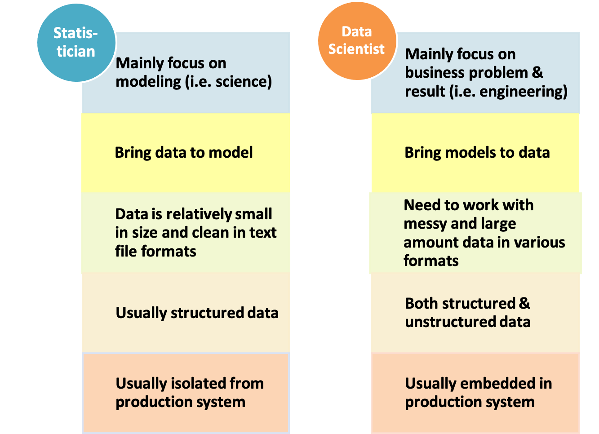

--- 
title: "Introduction to Data Science "
author: "Hui Lin and Ming Li"
date: "`r Sys.Date()`"
knit: "bookdown::render_book"
documentclass: krantz
bibliography: [bibliography.bib]
biblio-style: apalike
link-citations: yes
colorlinks: yes
lot: yes
lof: yes
fontsize: 12pt
monofont: "Source Code Pro"
monofontoptions: "Scale=0.7"
site: bookdown::bookdown_site
description: "Introduction to Data Science"
url: 'http\://scientistcafe.com/IDS/'
github-repo: happyrabbit/IntroDataScience
---

```{r include=FALSE, echo = FALSE}
# Sys.setenv(TZ="UTC")
options(
  htmltools.dir.version = FALSE, formatR.indent = 2,
  width = 55, digits = 4, warnPartialMatchAttr = FALSE, warnPartialMatchDollar = FALSE
)
ids_url = function(file) {
  paste0('https://github.com/',
         'happyrabbit/DataScientistR/',
         'raw/master/', file)
}
#bookdown::render_book("index.Rmd", "bookdown::gitbook")
#bookdown::render_book("index.Rmd", "bookdown::pdf_book")
```

# Preface{-}

During the first couple years of our career as data scientists, we were bewildered by all kinds of data science hype. There is a lack of definition of many basic terminologies such as "Big Data" and "Data Science."  How big is big?  If someone ran into you asked what data science was all about, what would you tell them?  What is the difference between the sexy role "Data Scientist" and the traditional "Data Analyst"? How suddenly came all kinds of machine algorithms? All those struck us as confusing and vague as real-world data scientists!  But we always felt that there was something real there. After applying data science for many years, we explored it more and had a much better idea about data science. And this book is our endeavor to make data science to a more legitimate field. 

## Goal of the Book {-}

This is an introductory book to data science with a specific focus on the application. Data Science is a cross-disciplinary subject involving hands-on experience and business problem-solving exposures. The majority of existing introduction books on data science are about the modeling techniques and the implementation of models using R or Python. However, they fail to introduce data science in a context of the industrial environment. Moreover, a crucial part, the art of data science in practice, is often missing. This book intends to fill the gap. 

Some key features of this book are as follows:

- It is comprehensive. It covers not only technical skills but also soft skills and big data environment in the industry.

- It is hands-on. We provide the data and repeatable R and Python code. You can repeat the analysis in the book using the data and code provided. We also suggest you perform the analyses with your data whenever possible. You can only learn data science by doing it!

- It is based on context. We put methods in the context of industrial data science questions. 

- Where appropriate, we point you to more advanced materials on models to dive deeper

## Who This Book Is For {-}

Non-mathematical readers will appreciate the emphasis on problem-solving with real data across a wide variety of applications and the reproducibility of the companion R and python code.

Readers should know basic statistical ideas, such as correlation and linear regression analysis. While the text is biased against complex equations, a mathematical background is needed for advanced topics.

## What This Book Covers {-}

Based on industry experience, this book outlines the real world scenario and points out pitfalls data science practitioners should avoid. It also covers big data cloud platform and the art of data science such as soft skills. We use R as the main tool and provide code for both R and Python.

## Conventions {-}

## Acknowledgements  {-}

# About the Authors {-}

**Hui Lin** is leading and building data science department at Netlify. Before Netlify, she was a Data Scientist at DuPont. She was a leader in the company of applying advanced data science to enhance Marketing and Sales Effectiveness. She provided data science leadership for a broad range of predictive analytics and market research analysis from 2013 to 2018. She is the co-founder of Central Iowa R User Group, blogger of scientistcafe.com and 2018 Program Chair of ASA Statistics in Marketing Section. She enjoys making analytics accessible to a broad audience and teaches tutorials and workshops for practitioners on data science (https://course2019.netlify.com/). She holds MS and Ph.D in statistics from Iowa State University.

**Ming Li** is currently a Senior Data Scientist at Amazon and an Adjunct Faculty of Department of Marketing and Business Analytics in Texas A&M University - Commerce. He is the Chair of Quality & Productivity Section of ASA for 2017. He was a Data Scientist at Walmart and a Statistical Leader at General Electric Global Research Center. He obtained his Ph.D. in Statistics from Iowa State University at 2010. With deep statistics background and a few years’ experience in data science, he has trained and mentored numerous junior data scientist with different background such as statistician, programmer, software developer, database administrator and business analyst. He is also an Instructor of Amazon’s internal Machine Learning University and was one of the key founding member of Walmart’s Analytics Rotational Program which bridges the skill gaps between new hires and productive data scientists.

<!--chapter:end:index.rmd-->

\mainmatter

# Introduction

Interest in data science is at an all-time high and has exploded in popularity in the last couple of years. Data scientists today are from various backgrounds. If someone ran into you ask what data science is all about, what would you tell them? It is not an easy question to answer. Data science is one of the areas that everyone is talking about, but no one can define. 

Media has been hyping about “Data Science” “Big Data” and “Artificial Intelligence” over the past few years. I like this amusing  statement from the internet:

> “When you’re fundraising, it’s AI. When you’re hiring, it’s ML. When you’re implementing, it’s logistic regression.”

For outsiders, data science is whatever magic that can get useful information out of data. Everyone should have heard about big data. Data science trainees now need the skills to cope with such big data sets. What are those skills? You may hear about: Hadoop, a system using Map/Reduce to process large data sets distributed across a cluster of computers or about Spark, a system build atop Hadoop for speeding up the same by loading huge datasets into shared memory(RAM) across clusters. The new skills are for dealing with organizational artifacts of large-scale cluster computing but not for better solving the real problem. A lot of data means more tinkering with computers. After all, it isn’t the size of the data that’s important. It’s what you do with it. Your first reaction to all of this might be some combination of skepticism and confusion. We want to address this up front that: we had that exact reaction.

To declutter, let’s start from a brief history of data science. If you hit up the Google Trends website which shows search keyword information over time and check the term “data science,” you will find the history of data science goes back a little further than 2004. From the way media describes it, you may feel machine learning algorithms were just invented last month, and there was never "big" data before Google. That is not true. There are new and exciting developments of data science, but many of the techniques we are using are based on decades of work by statisticians, computer scientists, mathematicians and scientists of all types. 

In the early 19th century when Legendre and Gauss came up the least squares method for linear regression, only physicists would use it to fit linear regression. Now, non-technical people can fit linear regressions using excel. In 1936 Fisher came up with linear discriminant analysis. In the 1940s, we had another widely used model – logistic regression. In the 1970s, Nelder and Wedderburn formulated “generalized linear model (GLM)” which: 

> "generalized linear regression by allowing the linear model to be related to the response variable via a link function and by allowing the magnitude of the variance of each measurement to be a function of its predicted value." [from Wikipedia] 

By the end of the 1970s, there was a range of analytical models and most of them were linear because computers were not powerful enough to fit non-linear model until the 1980s.

In 1984 Breiman et al[@Breiman1984]. introduced the classification and regression tree (CART) which is one of the oldest and most utilized classification and regression techniques. After that Ross Quinlan came up with more tree algorithms such as ID3, C4.5, and C5.0. In the 1990s, ensemble techniques (methods that combine many models’ predictions) began to appear. Bagging is a general approach that uses bootstrapping in conjunction with regression or classification model to construct an ensemble. Based on the ensemble idea, Breiman came up with random forest in 2001[@Breiman2001]. In the same year, Leo Breiman published a paper “[Statistical Modeling: The Two Cultures](http://www2.math.uu.se/~thulin/mm/breiman.pdf)” [@Breiman2001TwoCulture] where he pointed out two cultures in the use of statistical modeling to get information from data:

(1)  Data is from a given stochastic data model  
(2)  Data mechanism is unknown and people approach the data using algorithmic model

Most of the classic statistical models are the first type. Black box models, such as random forest, GMB, and today's buzz work deep learning are algorithmic modeling. As Breiman pointed out, those models can be used both on large complex data as a more accurate and informative alternative to data modeling on smaller data sets. Those algorithms have developed rapidly, however, in fields outside statistics. That is one of the most important reasons that statisticians are not the mainstream of today's data science, both in theory and practice. Hence Python is catching up R as the most commonly used language in data science. It is due to the data scientists background rather than the language itself. Since 2000, the approaches to get information out of data have been shifting from traditional statistical models to a more diverse toolbox named machine learning. 

What is the driving force behind the shifting trend? John Tukey identified four forces driving data analysis (there was no “data science”  back to 1962):

1. The formal theories of math and statistics 
1. Acceleration of developments in computers and display devices 
1. The challenge, in many fields, of more and ever larger bodies of data 
1. The emphasis on quantification in an ever wider variety of disciplines 

Tukey’s 1962 list is surprisingly modern. Let's inspect those points in today's context. People usually develop theories way before they find the applications. In the past 50 years, statisticians, mathematician, and computer scientists have been laying the theoretical groundwork for constructing "data science" today. The development of computers enables us to apply the algorithmic models (they can be very computationally expensive) and deliver results in a friendly and intuitive way. The striking transition to the internet of things generates vast amounts of commercial data. Industries have also sensed the value of exploiting that data. Data science seems certain to be a major preoccupation of commercial life in coming decades. All the four forces John identified exist today and have been driving data science.   

Benefiting from the increasing availability of digitized information, and the possibility to distribute that through the internet, the toolbox and application have been expanding fast. Today, people apply data science in a plethora of areas including business, health, biology, social science, politics, etc. 
Now data science is everywhere. But what is today's data science? 

## Blind men and an elephant

There is a widely diffused Chinese parable (depending on where you are from, you may think it is a Japanese parable) which is about a group of blind men conceptualizing what the elephant is like by touching it:

>  "...In the case of the first person, whose hand landed on the trunk, said: 'This being is like a thick snake'. For another one whose hand reached its ear, it seemed like a kind of fan. As for another person, whose hand was upon its leg, said, the elephant is a pillar like a tree-trunk. The blind man who placed his hand upon its side said, 'elephant is a wall'. Another who felt its tail described it as a rope. The last felt its tusk, stating the elephant is that which is hard, smooth and like a spear."  [wikipedia](https://en.wikipedia.org/wiki/Blind_men_and_an_elephant)

Data science is the elephant. With the data science hype picking up stream, many professionals changed their titles to be “Data Scientist” without any of the necessary qualifications. Today's data scientists have vastly different backgrounds, yet each one conceptualizes what the elephant is based on his/her own professional training and application area. And to make matters worse, most of us are not even fully aware of our own conceptualizations, much less the uniqueness of the experience from which they are derived. Here is a list of somewhat whimsical definitions for a “data scientist”:

- “A data scientist is a data analyst who lives in California”
- “A data scientist is someone who is better at statistics than any software engineer and better at software engineering than any statistician.”
- “A data scientist is a statistician who lives in San Francisco.”
- “Data Science is statistics on a Mac.”

> "We don’t see things as they are, we see them as we are. [by Anais Nin]"

It is annoying but true. So the answer to the question "what is data science?" depends on who you are talking to. Who you may be talking to then? Data science has three main skill tracks: engineering, analysis, and modeling (and yes, the order matters!). 

Here are some representative skills in each track. Different tracks and combinations of tracks will define different roles in data science. [^1] 

[^1]: This is based on [Industry recommendations for academic data science programs: https://github.com/brohrer/academic_advisory](https://github.com/brohrer/academic_advisory) with modifications. It is a collection of thoughts of different data scientist across industries about what a data scientist does, and what differentiates an exceptional data scientist.

### Data science role/skill tracks


When people talk about all the machine learning and AI algorithms, they often over look the critical data engineering part that makes everything else possible. Data engineering is the unseen iceberg under the water surface.  Think your company need a data scientist? You are wrong if you haven't hired a data engineer yet. You need to have the ability to get data before making sense of it. If you only deal with small datasets, you may be able to get by with entering some numbers into a spreadsheet. As the data increasing in size, data engineering becomes a sophisticated discipline in its own right. 

- **Engineering: the process of making everything else possible**

Data engineering mainly involves in building the data pipeline infrastructure. In the (not that) old day, when data is stored on local servers, computers or other devices, building the data infrastructure can be a humongous IT project which involves not only the software but also the hardware that used to store the data and perform ETL process. As the development of cloud service, data storage and computing on the cloud becomes the new norm. Data engineering today at its core is software engineering. Ensuring maintainability through modular, well-commented code and version control is fundamental.

(1) Data environment

Design and set up the environment to support data science workflow.  It may include setting up data storage in the cloud, Kafka platform, Hadoop and Spark cluster etc. Each company has its unique data condition and needs. So the environment will be different depending on size of the data,  update frequency, complexity of analytics,  compatibility with the backend infrastructure and (of course)  budget. 

(2) Data management  

Automated data collection is a common task which includes parsing the logs (depending on the stage of the company and the type of industry you are in), web scraping, API queries, and interrogating data streams. Determine and construct data schema to support analytical and modeling need. Use tools, processes, guidelines to ensure data is correct, standardized and documented.

(3) Production

If you want to integrate the model or analysis into the production system, then you have to automate all data handling steps. It involves the whole pipeline from data access to preprocessing, modeling and final deployment. It is necessary to make the system work smoothly with all existing stacks. So it requires to monitor the system through some sort of robust measures, such as rigorous error handling, fault tolerance, and graceful degradation to make sure the system is running smoothly and the users are happy.
    
- **Analysis – the process of turning raw information into insights in a fast way**

(1) Domain knowledge

Domain knowledge is the understanding of the organization or industry where you apply data science. You can't make sense of data without context, such as what are the important metric for this kind of business, what are the business questions, what type of data they have and what the data represents, how to translate a business need to a data problem, what has been tried before and with what results, what are the accuracy-cost-time trade-offs, how can things fail, what other factors are not accounted, what are the reasonable assumptions and what are faulty. In the end, domain knowledge helps you to deliver the results in an audience-friendly way.

(2) Exploratory analysis

This type of analysis is about exploration and discovery. Rigor conclusion is not a concern which means the goal is to get insights driven by correlation not causation.  The later one requires statistical skills and hence more expensive. Instead this role will help your team look at as much data as possible so that the decision-makers can get a sense of what's worth further pursuing. It often involves different ways to slice and aggregate data. An important thing to note here is that you should be careful not to get conclusion beyond the data. You don't need to write gorgeous, robust code to perform well in this role. 

(3) Story telling

Storytelling with data is key to deliver the insights and drive better decision making. It is the art of telling people what the numbers actually signify. It usually requires data summarization, aggregation and visualization. It is important to answer the following questions before you begin down the path of creating a data story:
  * Who are your audience?
  * What do you want your audience to know or do?
  * How can you use data to help make your point?    

- **Modeling – the process of diving deeper into the data to discover the pattern we don't easily see**

Even fancy machine learning model is the first thing comes to mind when people think about data science, unfortunately, in industry, it occupies the smallest part of data scientist's time. Nevertheless, it is a powerful set of tools.

(1) Supervised learning

In supervised learning, each observation of the predictor measurement(s) corresponds to a response measurement. There are two flavors of supervised learning: regression and classification. In regression, the response is a real number such as the total net sales in 2017, or the yield of corn next year. The goal is to approximate the response measurement as much as possible. In classification, the response is a class label, such as dichotomous response such as yes/no. The response can also have more than two categories, such as four segments of customers. A supervised learning model is a function that maps some input variables with corresponding parameters to a response y.  Modeling tuning is to adjust the value of parameters to make the mapping fit the given response.  In other words, it is to minimize the discrepancy between given responses and the model output. When the response y is a real value, it is intuitive to define discrepancy as the squared difference between model output and given the response. When y is categorical,  there are other ways to measure the difference, such as AUC or information gain. 

(2) Unsupervised learning

In unsupervised learning, there is no response variable. For a long time, the machine learning community overlooked unsupervised learning except for one called clustering. Moreover, many researchers thought that clustering was the only form of unsupervised learning. One reason is that it is hard to define the goal of unsupervised learning explicitly. Unsupervised learning can be used to do the following:
    * Identify a good internal representation or pattern of the input that is useful for subsequent supervised or reinforcement learning, such as finding clusters.
    * It is a dimension reduction tool that is to provide compact, low dimensional representations of the input, such as factor analysis. 
    *  Provide a reduced number of uncorrelated learned features from original variables, such as principal component regression. 

(3) Customized model development

In most of the cases, you just need to use the out of the box algorithms to solve the problem. But in some situations, there isn't enough data to use machine learning model, or  the question doesn't fit neatly in the specifications of existing tools, or the model needs to incorporate some prior domain knowledge . You may need to develop new models to accommodate the subtleties of the problem at hand. For example, people use bayesian models to include domain knowledge as prior distribution.

**What others?**

There are some common skills to have regardless the role people have in data science. 

- **Data Preprocessing: the process nobody wants to go through yet nobody can avoid**

No matter what role you hold in data science team, you will have to do some data cleaning which tend not to be the favorite part of anyone's job. Data preprocessing is the process of converting raw data into clean data that is proper for use.  

(1) Data preprocessing for data engineer

Getting data together from different sources and dumping them to a Data Lake, a dumping ground of amorphous data,  is far from the data schema analyst and scientist would use. A data lake is a storage repository that stores a vast amount of raw data in its native format, including XML, JSON, CSV, Parquet, etc.  It is a data cesspool rather than data lake.  It is data engineer's job to get a clean schema out of the data lake by transforming and formatting the data. Some common problems to resolve are:

* Enforce new tables' schema to be the desired one
* Repair broken records in newly inserted data
* Aggregate the data to form the tables with a proper granularity

(2) Data preprocessing for data analyst and scientist

Not just for data engineer,  it also occupies a large fraction of  data analyst and scientist's working hours too.  A facility and a willingness to do these tasks are a prerequisite for a strong data scientist. If you are lucky as a data scientist,  you may end up spending 50% of your time doing this. If you are like most of us, you will spend over 80% of your working hours wrangling data.

The data you get can still be very rough even it is from a nice and clean database that engineers set up. Dates and times are notorious for having many representations and time zone ambiguity.  You may also get market survey responds from your clients in an excel file where the table title could be multi-line, or the format does not meet the requirements, such as using 50% to represent the percentage rather than 0.5.  So in many cases, you need to set the data to be the right format before moving on to analysis. 

Even the data is in the right format, there are other issues to solve before or during analysis. For example, variables can have missing values. Knowledge about the data collection process and what it will be used for is necessary to decide a way to handle the missing. Also, different models have different requirements on the data. For example, some model may require the variables are of consistent scale; some may be susceptible to outliers or collinearity, some may not be able to handle categorical variables and so on. The modeler has to preprocess the data to make it proper for the specific model.

Most of the people in data science today focus on one of the tracks. A small number of people are experts of two tracks. People that are proficient in all three? They are unicorns! 

<!--
## Data Pipeline Infrastructure

Data pipeline infrastructure is the ecosystem data science lives in. As someone with math/statistics background, it can be challenging to understand and get used to the infrastructure. 
-->

## What should data science do? 

### Let's dream big

Here is my two points for the question:

* Make human better human by alleviating bounded rationality and minimize politics/emotion (rather than make machine more like human)
* Strive for the “democratization” of data as legally possible: empower everyone in the organization to acquire, process, and leverage data in a timely and efficient fashion

I know it is vague. Behold, I am going to explain more.  

It’s easy to pretend that you are data driven. But if you get into the mindset to collect and measure everything you can, and think about what the data you’ve collected means, you’ll be ahead of most of the organizations that claim to be data driven. If you know the difference between "data driven" and "data confirmed", you'll be sailing at the right direction. What on earth is the difference?

Imagine that you are buying something online and you need to decide whether or not to trust the product without seeing it physically. You see the  average rating is 4.1 out of 5.0. Is this a good score? It depends on your subconscious decision. If you really need the thing, you may happily cheer "It is more than 4.0!". If you are still not sure whether you need it, you can't help to check the few low rating reviews and tell yourself "look at those 1-star reviews". Sounds familiar? Psychologists call it confirmation bias.

> Confirmation bias is the tendency to search for, interpret, favor, and recall information in a way that confirms one's preexisting beliefs or hypotheses [Wikipedia]

So if you use data to feel better (confirm) decisions/assumptions that are already made before you analyze the data, that is "data confirmed". A clear sign of confirmation bias is when you go back to tinker the definition of your metic because the current result is not impressive. However, this bias is not always easy to see. It is not only misleading but also expensive. Because it could take data science team days of toil to boil everything down to that magic number and put the result on the report.  Data scientists are not totally immune to the bias either. Good news is that there is antidote to confirmation bias.

Antidote 1: Do the brainstorming of data definition and set the goal in advance and resist temptation to move them later. In other words, the decision makers have to set decision criteria and the boundary up front in your data science project.  

Antidote 2: Data democratization. Keep in mind that data isn’t just for the professionals or a small group of people in the organization that are "key decision makers". Everyone should be able to get access to and look at the data (as much as legally possible). In that way, there will be more eyes on the decision.

The way data science can help is to provide a sound data framework and necessary training for the organization to access data with least amount of pain. Also be clear about the data definition and documentation. Data science holds the responsibility for data stewardship in the organization with high integrity. (there is data science for social good which is data science's responsibility for outside the organization but we are not going to discuss that here)

That is still very abstract, I hear you. Now, Let's be more specific...

### What kind of questions can data science solve?

#### Prerequisites

Data science is not a panacea and there are problems data science can't help. It is best to make a judgment as early in the analytical cycle as possible. Tell your clients honestly and clearly when you think data analytics can't give the answer they want. What kind of questions can data science solve? 

1. Your question needs to be specific enough

Look at two examples:

* Question 1:  How can I increase product sales?
* Question 2:  Is the new promotional tool introduced at the beginning of this year boosting the annual sales of P1197 in Iowa and Wisconsin? (P1197 is an impressive corn seed product from DuPont Pioneer)

It is easy to see the difference between the two questions. Question 1 is a grammatically correct question, but it is proper for data analysis to answer. Why? It is too general. What is the response variable here? Product sales? Which product? Is it annual sales or monthly sales? What are the candidate predictors? You nearly can't get any useful information from the questions. In contrast, question 2 is much more specific. From the analysis point of view, the response variable is clearly "annual sales of P1197 in Iowa and Wisconsin". Even we don't know all the predictors, but the variable of interest is "the new promotional tool introduced early this year." We want to study the impact of the promotion of sales. You can start from there and move on to figure out other variables need to include in the model by further communication. 

As a data scientist, you may start with something general and unspecific like question 1 and eventually get to question 2. Effective communication and in-depth domain knowledge about the business problem are essential to convert a general business question into a solvable analytical problem. Domain knowledge helps data scientist communicate with the language the other people can understand and obtain the required information. 

However, defining the question and variables involved won't guarantee that you can answer it. For example, I encountered this situation with a well-defined supply chain problem. My client asked me to estimate the stock needed for a product in a particular area. Why can't this question be answered? I tried fitting a Multivariate Adaptive Regression Spline (MARS) model and thought I found a reasonable solution. But it turned out later that the data my client gave me was inaccurate. In this case, only estimates rather than actual values of past supply figures were available and there was no way to get accurate data. The lesson lends itself to the next point.

2.  You need to have sound and relevant data

One cannot make a silk purse out of a sow's ear. Data scientists need data, sound and relevant data. The supply problem is a case in point. There was relevant data, but not sound. All the later analytics based on that data was a building on sand. Of course, data nearly almost have noise, but it has to be in a certain range.  Generally speaking, the accuracy requirement for the independent variables of interest and response variable is higher than others. In question 2, it is data related to the "new promotion" and "sales of P1197".

The data has to be helpful for the question. If you want to predict which product consumers are most likely to buy in the next three months,  you need to have historical purchasing data: the last buying time, the amount of invoice, coupons and so on. Information about customers' credit card number, ID number, the email address is not going to help.

Often the quality of the data is more important than the quantity, but the quantity cannot be overlooked. In the premise of guaranteeing quality, usually the more data, the better.  If you have a specific and reasonable question, also sound and relevant data, then congratulations, you can start playing data science!

#### Problem type

Many of the data science books classify the various models from a technical point of view. Such as supervised vs. unsupervised models, linear vs. nonlinear models, parametric models vs. non-parametric models, and so on. Here we will continue on "problem-oriented" track. We first introduce different groups of real problems and then present which models can be used to answer the corresponding category of questions. 

1. Description

The basic analytic problem is to summarize and explore a data set with descriptive statistics (mean, standard deviation, and so forth) and visualization methods. It is the simplest problem and yet the most crucial and common one. You will need to describe and explore the dataset before moving on to more complex analysis. In the problem such as customer segmentation, after you cluster the sample, the next step is to figure out the profile of each class by comparing the descriptive statistics of the various variables. Questions of this kind are:

* How does the annual income distribute?
* Are there outliers?
* What are the mean active days of different accounts?

Data description is often used to check data, find the appropriate data preprocessing method, and demonstrate the model results.

2. Comparison

The first common problem is to compare different groups. Such as: Is A better in some way than B? Or more comparisons: Is there any difference among A, B, and C in a particular aspect? Here are some examples:

* Are males more inclined to buy our products than females?
* Are there any differences in customer satisfaction in different business districts?
* Do soybean carrying a particular gene have higher oil content?

For those problems, it is usually to start exploring from the summary statistics and visualization by groups. After a preliminary visualization, you can test the differences between treatment and control group statistically. The commonly used statistical tests are chi-square test, t-test, and ANOVA. There are also methods using Bayesian methods. In biology industry, such as new drug development, crop breeding, mixed effect models are the dominant technique.

3. Clustering

Clustering is a widespread problem, which is usually related to classification. Clustering answers questions like:

* Which customers have similar product preference? 
* Which printer performs a similar pattern to the broken ones?
* How many different themes are there in the corpus?

Note that clustering is unsupervised learning. The most common clustering algorithms include K-Means and Hierarchical Clustering. 

4. Classification

Usually, a labeled sample set is used as a training set to train the classifier. Then the classifier is used to predict the category of a future sample.  Here are some example questions:

* Who is more likely to buy our product?
* Is the borrower going to pay back?
* Is it spam?

There are hundreds of classifiers. In practice, we do not need to try all the models but several models that perform well generally. 

5. Regression

In general, regression deals with the problem of "how much is it?" and return a numerical answer.  In some cases, it is necessary to coerce the model results to be 0, or round the result to the nearest integer. It is the most common problem. 

* What will be the temperature tomorrow?
* What is the projected net income for the next season?
* How much inventory should we have? 

## Structure data science team

During the past decade, a huge amount of data has become available and readily accessible for analysis in many companies across different business sectors. The size, complexity, and speed of increment of data suddenly beyond the traditional scope of statistical analysis or BI reporting. To leverage the big data, do you need an internal data science team to be a core competency, or can you outsource it?  The answer depends on the problems you want to solve using data. If the problems are critical to the business, you can't afford to outsource it. Also, each company has its own business context and hence needs new kinds of data or or use the results in novel ways. Being a data driven organization requires cross organization commitments to identify what data each department needs to collect, establish the infrastructure and process for collecting and maintaining that data, and the way to deliver analytical results. Unfortunately, it is unlikely that an off-the-shelf solution will be flexible enough to adapt to the specific business context. So most of the companies establish their own data science team. 

Where should data science team fit? Much has been written about different ways data science function fit in the organization. In general, data science team is organized in three ways.

(1) A standalone team

Data science is an autonomous unit that is parallel to the other organizations (such as engineering, product etc.) and the head of data science reports directly to senior leadership, ideally to the CEO or at least to someone who understands data strategy and is willing to invest to give it what it needs. The advantages of this type of data organization are:

- Data science team has autonomy and is well positioned to tackle whatever problems it deems important to the whole company.
- It is advantageous for people in data science team to share knowledge and grow professionally.
- It provides a clear career path for data science professionals and shows the company treats data as a first-class asset. So it tends to attract and retain top talent people.

The biggest concern of this type of organization is the risk of marginalization. Data science only has value if data drives action which requires collaboration among data scientists, engineers, product managers and other business stakeholders across the organization. If you have a standalone data science team, it is critical to choose a data science leader who is knowledgable about the applications of data science in different areas and also has strong inter-discipline communication skills. The head of data science needs to build strong collaboration with other departments.

Also, as companies grow, each department prefers to be self-sufficient and tries to hire data own analytical personal under different titles even when they can get support from the data science team. This is why it is unlikely for an already mature company to have a standalone data science team. If you start your data science team in the early stage as a startup, it is important that the CEO sets a clear vision from the beginning and sends out strong message to the whole company about accessing data support. 

(2) An embedded model

There is still a head of data science but his/her role is mostly a hiring manager and coach and  he/she may report to a senior manager in IT department. The data science team brings in talented people and farms them out to the rest of the company. In other words, it gives up autonomy to ensure utility. The advantages are:

- Data science is closer to its applications.
- There is still a data science group so it is easy to share knowledge.
- It has high flexibility to allocate data science resource to the rest of the company.

However, there are also concerns.

- It brings difficulty to the management since the lead of the designated team is not responsible for data science professionals' growth and happiness while the data science managers are not directly vested in their work.
- Data scientists are second-class citizens everywhere and it is hard to attract and retain top talent.

(3) Integrated team

There is no data science team. Each team hires its own data science people. For example, there may be a marketing analytics group consisting of data engineer, data analyst and data scientists. The team leader is a marketing manager who has an analytical mind and deep business knowledge. The advantages are obvious.

- Data science resource aligns with the organization very well
- Data science professionals are first-class members and valued in their own team.  The manager is responsible for data science professionals' growth and happiness.
- The insights from data are easily put into actions.

It works well in the short term for both the company and the data science hires. However, there are also many concerns.

- It sacrifices the professional growth of data science hires since they work in silos and specialize in specific application. It is also difficult to share knowledge across different applied areas.
- It is harder to move people around since they are highly associated with a specific function in the organization.
- There is no career path for data science people and so it is difficult to retain talent.

There is not an universal answer for the best way to organize data science team. It depends on the answer of many other questions. How important do you think the data science team is for your company? What is the stage of your company when you start to build data science team? Are you a startup or a relatively mature company? Data science has its own skillset, workflow, tooling, integration process and culture. If it is critical to your organization, it is the best not to bury it under any part of the organization. Otherwise data science will inevitably only serve the need for specific branch of the organization and it  also impedes data democratization across the organization. How valuable it is to use data to tell the truth, how dangerous it is to use data to affirm existing opinions. No matter which way you choose, be aware of both sides of the coin. If you are looking for a data science position, it is important to know where the data science team fits in the company.

<!--chapter:end:01-Introduction.Rmd-->

# Soft Skills for Data Scientists

## Comparison between Statistician and Data Scientist

Statistics as a scientific area can be traced back to 1749 and statistician as a career has been around for hundreds of years with well-established theory and application. Data Scientist becomes an attractive career for only a few years along with the fact that data size and variety beyond the traditional statistician’s toolbox and the fast-growing of computation power. Statistician and data scientist have a lot of in common, but there are also significant differences.

<center>

</center>

Both statistician and data scientist work closely with data. For the traditional statistician, the data is usually well-formatted text files with numbers and labels. The size of the data usually can be fitted in a PC’s memory. Comparing to statisticians, data scientists need to deal with more varieties of data: 

- well-formatted data stored in a database system with size much larger than a PC’s memory or hard-disk;
- huge amount of verbatim text, voice, image, and video;
- real-time streaming data and other types of records. 

One unique power of statistics is to make statistical inference based on a small set of data. Statisticians spend most of their time developing models and don't need to put too much effort on data cleaning. Today, data is relatively abundant, and modeling is only part of the overall effort, often a small part. Due to the active development of some open source communities, fitting models is not too far from button pushing. Data scientists instead spend lot of time preprocessing and wrangling the data before feeding them to the model. 

Different from statisticians, data scientists often focus on delivering actionable results and sometimes need to fit model on the cloud. The data can be too large to read in laptop.  From the entire problem-solving cycle, statisticians are usually not well integrated with the production system where data is obtained in real time; while data scientists are more embedded in the production system and closer to the data generation procedures.

## Beyond Data and Analytics

Data scientists usually have a good sense of data and analytics, but data scientist project is more than that. A data science project may involve people with different roles, especially in a big company:

- a business owner or leader to identify business value;
- program manager to ensure the data science project fits into the overall technical program development and coordinate all parties to set periodical tasks so that the project meets the preset milestones and results;
- data owner and computation resource and infrastructure owner from the IT department;
- dedicated team to make sure the data and model are under model governance and privacy guidelines;
- a team to implement, maintain and refresh the model;
- multiple rounds of discussion of resource allocation among groups (i.e., who pay for the data science project).

Effective communication and in-depth domain knowledge about the business problem are essential requirements for a successful data scientist. A data scientist may interact with people at various levels from senior leaders who set the corporate strategies to front-line employees who do the daily work. A data scientist needs to have the capability to view the problem from 10,000 feet above the ground, as well as down to the detail to the very bottom. To convert a business question into a data problem, a data scientist needs to communicate using the language the other people can understand and obtain the required information.

In the entire process of data science project defining, planning, executing and implementing, every step involves the data scientist to ensure people correctly define the business problem  and reasonably evaluate the business value and success. Corporates are investing heavily in data science and machine learning with a very high expectation of return. 

However, it is easy to set unrealistic goal and wrongly estimate the business impact. The data scientist lead should navigate the discussions to make sure the goal can be backed by data and analytics. Many data science projects over promise and are too optimistic on the timeline. These projects eventually fail by not delivering the preset business impact within the timeline. As data scientists, we need to identify these issues early in the stage and communicate with the entire team to make sure the project has a realistic deliverable and timeline. The data scientist team also need to work closely with data owners to identify relevant internal and external data source and evaluate the quality of the data; as well as working closely with the infrastructure team to understand the computation resources (i.e. hardware and software) available for the data science project.

## Three Pillars of Knowledge

(1) Analytics knowledge and tool sets

A successful data scientist needs to have a strong technical background in data mining, statistics and machine learning. The in-depth understanding of modeling with the insight about data enable a data scientist to convert a business problem to a data science problem.

(2) Domain knowledge and collaboration

A successful data scientist needs some domain knowledge to understand the business problem. For any data science project, the data scientist need to collaborate with other team members and effective communication and leadership skills are critical, especially when you are the only data person in the room and you need to decide with uncertainty.

(3) (Big) data management and (new) IT skills

The last pillar is about computation environment and model implementation in a big data platform. This used to be the most difficult one for a data scientist with statistics background (i.e. lack computer science or programming skills). The good news is that with the rise of cloud computation big data platform, it is easier for a statistician to overcome this barrier.
<center>

</center>

## Data Science Project Cycle

A data science project has various stages. Many textbooks and blogs focus on one or two specific stages and it is rare to see the end-to-end life cycle of data science projects. In fact, to get a good grasp of the end-to-end cycle requires many years of experience of doing real-world data science. We will share our opinions on that in this section. Seeing a holistic picture of the whole cycle helps you to better prepare for real-world applications.

### Types of Data Science Projects

People often use data science project to describe any project that uses data to solve a business problem, including traditional business analytics or data visualization. Here we limit our discussion of data science projects that involve data and some statistical or machine learning models. The business problem itself gives us the flavor of the project, data is the raw ingredient to start with, and the model makes the dish. Different types of data science projects can be determined by the types of data used and the final model development and implementation.

#### Offline and online Data

There are offline and online data. Offline data are historical archived data stored in databases or data warehouses. With the development of data storage, the cost to store a large amount of data is cheap and offline data are very rich in general (for example website may track and store each individual user's mouse position, click and typing information while the user is visiting the website). Offline data is usually stored in a distributed system and it can be extracted in batch as raw materials to create features that can be used in model training. Online data are real-time information that can be feed to models to make automatic actions. Real-time information can changes frequently such as the keywords a customer is searching for. Capturing and using real-time online data requires the integration of machine learning to the production infrastructure. It used to be a steep learning curve for data scientists, but the cloud infrastructure makes it much easier.

#### Offline training and offline application

This type of data science project is for a specific business problem which needs to be solved once or multiple times. But the dynamic nature of the business problem requires substantial work every time. One example of such a project is "whether a new workflow is going to improve efficiency." In this situation, we often use offline internal and external data, build models, and deliver the final results as a report to answer the specific business question. It is similar to the traditional business intelligence project but with more focus on data and model. Sometimes the data size and model complexity are beyond the capacity of a single computer. So you need to use distributed storage and computation. Since the model is based on the historical data and the output is a report, there is no need for real-time execution. Usually, there is no run-time constraint on the machine learning model unless the model is running beyond a reasonable time frame such as a few hours or a few days. We can call this type of data science project "offline training, offline application" project.

#### Offline training and online application

Another type of data science project is to use offline data for training and apply the trained model to real-time online data in the production environment. One example of such a project is "using historical data to train a personalized advertisement model, and then provides real-time ad recommendation when customers visit the website." The model is trained based on offline data, and then use a customer's online real-time data as features to run the model in real time to provide an automatic action. The model training is very similar to the "offline training, offline application" project, but as the trained model will be put to production, there are specific requirements such as features used in the offline training have to be available online in real time, and the online run-time of the model has to be short enough without impacting user experience. In most cases, data science projects in this category create continuous and scalable business value. We will use this type of data science project to describe the project cycle.

#### Online training and online application

For some business problems, it is so dynamic that even yesterday's data is out of date. For such cases, we can use online data to train the model and then applying it in real time. We call this type of data science project "online training, online application." This type of data science project requires high automation and low latency.

### At the Planning Stage

To ensure a successful data science project, a data-driven and fact-based planning stage is essential. With the recent big data and data science hype, there is a high demand for data science projects to create business value across different business sectors. Often times, these data science project proposals are initiated by the leaders of an organization. This top-down style data science projects usually have high visibility with certain human and computation resources pre-allocated. However, it is crucial to understand the business problem first and align the goal across different teams including 

(1) the business team which may include members from the business operation team, business analyst, insight and reporting team; 

(2) technology team which may include members from database and data warehouse team, data engineering team, infrastructure team, core machine learning team, and software development team; (3) project management team which may include program management team and product management team depending on the scope of the data science project.

To start the conversation, we can ask the following questions to everyone in the team:

- What are the pain points in current business operation?
- What data are available and how is the quality and quantity of the data?
- What might be the most significant impacts of a data science project?
- Are there any negative impact to other teams?
- What computation resources are available for model training and model execution?
- Can we define key metrics to compare and quantity business value?
- Are there any data security, privacy and legal concerns?
- What are the desired milestones, check points and timeline?
- Is the final application online or offline?
- Are the data online or offline?

It is likely to have a series of intense meetings and heated discussions to frame the project to a reasonable scope. After the planning stage, we should be able to define a set of key metrics related to the project, identify some offline and online data sources, request needed computation resources, draft tentative timeline and milestones, and form a team of data scientist, data engineer, software developer, project manager and members from business operation.  Data scientists should play a major role in these discussions. If data scientist is not leading the data science project formulation, it is very likely the entire project will not reach the timeline and milestones.

### At the Modeling Stage

Even though at the planning stage we already set some strategy, milestone, and timeline, data science projects are dynamic in nature and there could be uncertainties along the road. As a data scientist, clearly communicate any newly encountered difficulties during the modeling stage to the entire team is essential to keep the data science project progress. With the available data source identified at the planning stage, data clearing, data wrangling, and exploratory data analysis are great starting points toward modeling. Meanwhile, abstracting the business problem to be a set of statistical and machine learning problems is an iterative process. It is rare that business problems can be solved by using just one statistical or machine learning model. The ability to use a sequence of methods to decompose the business problem is one of the key responsibility for a senior data scientist. The process requires iterative rounds of discussions with the business team and data engineering team based on the new learning from each iteration. Each iteration includes both data related and model related part.

#### Data related

Data cleaning, data preprocessing and feature engineering are closely related procedures. The goal of these data-related procedures is to create usable variables or features for statistical and machine learning models. One important aspect of data related procedures is to make sure the data source we are using is a good representation of the situation where the final trained model will be applied. The exact same representation is rarely possible, and reasonable approximation is totally fine to start with. A data scientist has to be clear on the assumptions and communicate with the entire team the limitations of biased data and quantify its impact on the application. In data related part, sometimes the available data is not that relevant to the business problem we want to solve, and we have to collect more data.

#### Model related

There are different types of statistical and machine learning models, such as supervised learning, unsupervised learning, and causal inference. For each type, there are various algorithms, libraries, or packages readily available. To solve a business problem, you sometimes need to piece together a few methods at the model exploring and developing stage. This stage also includes model training, validation, and testing to make sure the model works well in the production environment; i.e., it is not overfitting and can be generalized. The model selection follows Occam’s razor, which is to choose the simplest among a set of compatible models. Before you try complicated models, it is a good practice to get some benchmark by additional business rules, common sense decision, or standard models (such as random forest for classification). 

### At the Production Stage

For offline application data science projects, the end product is often a detailed report with model result and output. However, for online application projects, a trained model is just halfway from the finish line. The offline data is stored and processed in a totally different environment from the online production environment. Building the online data pipeline and implementing machine learning models in a production environment requires lots of additional work. Even though recent advance in cloud infrastructure lowers the barrier dramatically, it still takes effort to implement an offline model in the online production system. Before you promote the model to production, there are two more steps to go: 

1. shadow mode
2. A/B testing

A **shadow mode** is like an observation period when the data pipeline and machine learning models run as it is fully functional, but we only record the model output without any actions. Some people call it proof of concept (POC).  During POC, people frequently check the data pipeline and model and detect bugs such as a timeout or missing features, version conflict (for example python 2 v.s. python 3), data type mismatch, etc.

Once the online model passes the shadow mode, **A/B testing** is the next stage. During A/B testing, all the incoming observations are randomly separated into two groups: control and treatment. The control group is going to skip the machine learning model, while the treatment group is going through the machine learning model. After that, people monitor a list of pre-defined key metrics during a specific time period to compare the control and treatment groups. The differences in these key metrics determine whether the machine learning model provides business value or not. Real applications can be complicated. For example, there can be multiple treatment groups, or hundreds, even thousands of A/B testing running by different teams at any given time.

Once the A/B testing shows that the model provides significant business value, then you can put it into full production. It is ideal that the model runs as expected and continues to provide scalable values. However, the business can change and a machine learning model works now can break tomorrow, and features available now may not be available tomorrow. You need a monitoring system to automatically notify us when one or multiple features change. When the model performance degrades below a pre-defined a level, you need to fine-tune the parameters and thresholds, re-train the model with more recent data, add or remove features to improve model performance. Eventually, any model will fail or retire at some time.

### Summary

Data science end-to-end project cycle is a complicated process which requires close collaboration among many teams. Data scientist, maybe the only scientist in the team, has to lead the planning discussion and model development based on data available and clearly communicate key assumptions and uncertainties with the entire team. A data science project may fail at any stage, and a clear end-to-end cycle view of the project helps avoid some mistakes.

## Common Mistakes in Data Science

Data science project can go wrong at different stages in many ways. Most textbooks and online blogs focus on technical mistakes about machine learning model, algorithm or theory, such as including outliers and overfitting. It is important to avoid these technical mistakes. However, there are common systematic mistakes across data science projects that are rarely discussed in textbooks. To summarize these mistakes, people need to do real-world data science projects. In this section, we describe these common mistakes in detail so that readers can proactively identify and avoid these systematic mistakes in their own data science projects.

###  Problem Formulation Stage

The most challenging part of a data science project is problem formulation. Data science project stems from pain points of the business. The draft version of the goal of the project is relatively vague without much quantification or is the gut feeling of the leadership team. Often there are multiple teams involved in the initial project formulation stage and they have different views. It is easy to have malalignment across different teams such as resource allocation, milestone deliverable, and timeline. At the problem formulation stage, data science team members with technical background sometimes are not even invited to the initial discussion. It sounds ridiculous, but sadly true that a lot of resources are spent on **solving the wrong problem,** the number one systematic common mistake in data science. Formulating a business problem into the right data science project requires an in-depth understanding of the business context, data availability and quality, computation infrastructure, and methodology to leverage the data to quantify business value.

We have seen people over promise about business value all the time, another common mistake that is going to fail the project at the beginning. With the hype of big data and machine learning, leaders across industries often have unrealistic high expectation on data science. It is especially true during enterprise transformation when there is a strong push to adopt new technology to get value out of the data. The unrealistic expectations are based on assumptions that are way off chart without checking the data availability, data quality, computation resource, and current best practices in the field. Even there is some exploratory analysis by the data science team at the problem formulation stage, project leaders sometimes ignore their data-driven voice. 

These two systematic mistakes undermine the organization's data science strategy. The higher the expectation, the bigger the disappointment when the project cannot deliver business value. Data and business context are essential to formulate the business problem and set reachable business value. It helps to avoid the mistakes by having a strong data science leader with a broad technical background and let data scientist coordinate and drive the problem formulation and set realistic goals based data and business context.

### Problem Planning Stage

Now suppose the data science project is formulated correctly with a reasonable expectation on the business value. The next step is to plan the project such as allocating resources, setting up milestones and timeline, and defining deliverable. In most cases, there are project managers to coordinate different teams that are involved in the project and use agile project management tools similar to those in software development. Unfortunately, the project management team may not have experience with data science projects and hence fail to account for the uncertainties at the planning stage. The fundamental difference between data science projects and other projects lead to another common mistake: **too optimistic about the timeline**. For example, data exploratory and preparation may take 60% to 80% of the total time for a given data science project, but people often don't realize that.

When there are lots of data already collected across the organization, people assume you have enough data for everything. It leads to the mistake: t**oo optimistic about data availability and quality**. What you need is not "big data", but data that can help you solve the problem. The data available may be low quality and you need to put substantial efforts to clean the data before you can use it. There are "unexpected" efforts to bring the right and relevant data for a specific data science project. To ensure smooth delivery of data science projects, you need to account for the "unexpected" work at the planning stage. We all know data pre-processing and feature engineering is usually the most time-consuming part of a data science project. However, people outside data science are not aware of it and we need to educate other team members and the leadership team.

### Modeling Stage

Finally, you start to look at the data and fit some models. One common mistake at this stage is unrepresentative data. The model trained using historical data may not generalize to the future. There is always a problem of biased or unrepresentative data. As a data scientist, we need to use data that are closer to the situation where the model is going to apply and quantify the impact of model output in production. Another mistake at this stage is overfitting and obsession for complicated models. Now we can easily get hundreds or even thousands of features and the machine learning models are getting more complicated. People can use open source libraries to try all kinds of models. People are sometimes obsessed with complicated models instead of using the simplest among a set of compatible models. 

The data used to build the models is always biased or unrepresentative to some extent, simpler models are better to generalize and it has a higher chance to provide consistent business value once the model passes the test and is finally implemented in the production environment. It is possible that you can not use the existing data and methods to solve the business problem. You can try to collect more data, do feature engineering, or create your own models. However, if there is a fundamental gap between data and the business problem, the data scientist has to make the tough decision to unplug the project. On the other hand, data science projects usually have high visibility and may be initiated by senior leadership. Even the data science team provide enough evidence that they can't deliver the expected business value, people may not want to stop the project which leads another common mistake at modeling stage: **take too long to fail**. The earlier we can stop a failing project, the better. Because we can put valuable resources to other promising projects. It damages the data science strategy and everyone will be hurt by a long data science project that is doomed to fail.

###  Production Stage

Now suppose you have found a model that works great for the training and testing data. If it is an online application,  you are halfway. The next is to put the model in production, which sounds like alien work for a data scientist. It is true that the data engineering team can help with model production. However, as a data scientist, you need to know the potential mistakes at this stage.  One big mistake is **missing A/B testing** and assuming that the model performance at model training/testing stays the same in the production environment. Unfortunately, the model trained and evaluated using historical data nearly never performs the same in the production environment. The data used in the offline training maybe significant different from online data and the business context may have changed.  If possible, machine learning models in production should always go through A/B testing to evaluate performance.

In the model training stage, people usually focus on model performance, such as accuracy without paying too much attention to the model execution time. When a model runs online in real time, the total run time for each instance (i.e., model latency) should not impact the customer's user experience. Nobody wants to wait for even one second to see the results after click the "Search" button. In the production stage, feature availability is crucial to run a real-time model. Engineering resources are essential for model production. However, in traditional companies, it is common that a data science project  **fail to scale in real time applications** due to lack of computation capacity, engineering resources, or non-tech culture and environment.

As the business problem evolve rapidly, the data and model in the production environment need to change accordingly or the performance of the model deteriorates over time. The online production environment is more complicated than model training and testing, for example, you pull online features from different resources, and some features may be missing at a specific time; the model may run into time out zone, and there are tons of different software and data exceptions that may happen. We need regular checkup during the entire life of the model cycle from implementation to retirement. Unfortunately, people often don't set the monitoring system for data science projects, and it is another common mistake: **missing necessary online checkup**. It is essential to set a monitoring dashboard and automatic alarms,  create model tuning, re-training, and retirement plans.

### Summary

The data science project is a combination of art and engineering. A data science project may fail in different ways. However, if we put data and business context at the center of the project, get familiar with the data science project cycle and proactively identify and avoid these potential mistakes, the data science project can provide significant business value. Here is the summary of the mistakes:

- Solving the wrong problem
- Over promise on business value
- Too optimistic about the timeline
- Too optimistic about data availability and quality
- Unrepresentative data
- Overfitting and obsession for complicated models
- Take too long to fail
- Missing A/B testing
- Fail to scale in real-time applications
- Missing necessary online checkup

<!--chapter:end:02-SoftSkills.Rmd-->

# Introduction to the data

Before tackling analytics problem, we start by introducing data to be analyzed in later chapters. 

## Customer Data for Clothing Company

Our first data set represents customers of a clothing company who sells products in physical stores and online. This data is typical of what one might get from a company's marketing data base (the data base will have more data than the one we show here). This data includes 1000 customers: 

1. Demography
    - `age`: age of the respondent
    - `gender`: male/female
    - `house`: 0/1 variable indicating if the customer owns a house or not

1. Sales in the past year
    - `store_exp`: expense in store
    - `online_exp`: expense online
    - `store_trans`: times of store purchase
    - `online_trans`: times of online purchase

1. Survey on product preference

It is common for companies to survey their customers and draw insights to guide future marketing activities. The survey is as below:

How strongly do you agree or disagree with the following statements:

1. Strong disagree
1. Disagree
1. Neither agree nor disagree
1. Agree
1. Strongly agree

- Q1. I like to buy clothes from different brands
- Q2. I buy almost all my clothes from some of my favorite brands
- Q3. I like to buy premium brands
- Q4. Quality is the most important factor in my purchasing decision
- Q5. Style is the most important factor in my purchasing decision
- Q6. I prefer to buy clothes in store
- Q7. I prefer to buy clothes online
- Q8. Price is important 
- Q9. I like to try different styles
- Q10. I like to make decision myself and don't need too much of others' suggestions 

There are 4 segments of customers: 

1. Price
1. Conspicuous
1. Quality
1. Style

Let's check it:

```{r, echo=FALSE}
sim.dat <- read.csv("http://bit.ly/2P5gTw4")
```

```{r}
str(sim.dat,vec.len=3)
```

Refer to Appendix for the simulation code.

## Customer Satisfaction Survey Data from Airline Company

This data set is from a customer satisfaction survey for three airline companies. There are `N=1000` respondents and 15 questions. The market researcher asked respondents to recall the experience with different airline companies and assign a score (1-9) to each airline company for all the 15 questions. The higher the score, the more satisfied the customer to the specific item. The 15 questions are of 4 types (the variable names are in the  parentheses):


- How satisfied are you with our______?

1. Ticketing
    - Ease of making reservation（Easy_Reservation）
    - Availability of preferred seats（Preferred_Seats）
    - Variety of flight options（Flight_Options）
    - Ticket prices（Ticket_Prices）
1. Aircraft
    - Seat comfort（Seat_Comfort）
    - Roominess of seat area（Seat_Roominess）
    - Availability of Overhead（Overhead_Storage）
    - Cleanliness of aircraft（Clean_Aircraft）
1. Service
    - Courtesy of flight attendant（Courtesy）
    - Friendliness（Friendliness）
    - Helpfulness（Helpfulness）
    - Food and drinks（Service）
1. General
    - Overall satisfaction（Satisfaction）
    - Purchase again（Fly_Again）
    - Willingness to recommend（Recommend）

Now check the data frame we have:

```{r, echo=FALSE}
rating<-read.csv("http://bit.ly/2TNQ6TK")
```

```{r}
str(rating,vec.len=3)
```

Refer to Appendix for the simulation code.

## Swine Disease Breakout Data

The swine disease data includes simulated 120 survey questions from 800 farms. There are three choices for each question. The outbreak status for the $i^{th}$ farm is generated from a $Bernoulli(1, p_i)$ distribution with $p_i$ being a function of the question answers: 

$$ln(\frac{p_i}{1-p_i})=\beta_0 + \Sigma_{g=1}^G\mathbf{x_{i,g}^T\beta_{g}}$$

where $\beta_0$ is the intercept, $\mathbf{x_{i,g}}$ is a three-dimensional indication vector for question answer and $\mathbf(\beta_g)$ is the parameter vector corresponding to the $g^{th}$ predictor. Three types of questions are considered regarding their effects on the outcome. The first forty survey questions are important questions such that the coefficients of the three answers to these
questions are all different:

$$\mathbf{\beta_g}=(1,0,-1)\times \gamma,\ g=1,\dots,40$$

The second forty survey questions are also important questions but only one answer has a coefficient that is different from the other two answers:

$$\mathbf{\beta_g}=(1,0,0)\times \gamma,\ g=41,\dots,80$$

The last forty survey questions are also unimportant questions such that all three answers have the same coefficients:

$$\mathbf{\beta_g}=(0,0,0)\times \gamma,\ g=81,\dots,120$$

The baseline coefficient $\beta_0$ is set to be $-\frac{40}{3}\gamma$ so that on average a farm have 50% of chance to have an outbreak. The parameter $\gamma$ in the above simulation is set to control the strength of the questions' effect on the outcome. In this simulation study, we consider the situations where $\gamma = 0.1, 0.25, 0.5, 1, 2$. So the parameter settings are:

$$\mathbf{\beta^{T}}=\left(\underset{question\ 1}{\frac{40}{3},\underbrace{1,0,-1}},...,\underset{question\ 40}{\underbrace{1,0,-1}},\underset{question\ 41}{\underbrace{1,0,0}},...,\underset{question\ 80}{\underbrace{1,0,0}},\underset{question\ 81}{\underbrace{0,0,0}},...,\underset{question\ 120}{\underbrace{0,0,0}}\right)*\gamma$$

For each value of $\gamma$, 20 data sets are simulated. The bigger $\gamma$ is, the larger the corresponding parameter. We provided the data sets with $\gamma = 2$. Let's check the data:

```{r}
disease_dat<-read.csv("http://bit.ly/2KXb1Qi")
# only show the last 7 columns here
head(subset(disease_dat,select=c("Q118.A","Q118.B","Q119.A",
                                 "Q119.B","Q120.A","Q120.B","y"))) 
```

Here `y` indicates the outbreak situation of the farms. `y=1` means there is an outbreak in 5 years after the survey. The rest columns indicate survey responses. For example `Q120.A = 1` means the respondent chose `A` in Q120. We consider `C` as the baseline. 

Refer to Appendix for the simulation code.

## MNIST Dataset

The MNIST dataset is a popular dataset for image classification machine learning model tutorials. It is conveniently included in the Keras library and ready to be loaded with build-in functions for analysis. The WIKI page of MNIST provides a detailed description of the dataset: https://en.wikipedia.org/wiki/MNIST_database. It contains 70,000 images of handwritten digits from American Census Bureau employees and American high school students. There are 60,000 training images and 10,000 testing images. Each image has a resolution of 28x28, and the numerical pixel values are in greyscale. Each image is represented by a 28x28 matrix with each element of the matrix an integer between 0 and 255. The label of each image is the intended digit of the handwritten image between 0 and 9. We cover the detailed steps to explore the MNIST dataset in the R and Python notebooks. A sample of the dataset is illustrated in the Figure below:

{width=70%}


## IMDB Dataset

The IMDB dataset (http://ai.stanford.edu/~amaas/data/sentiment/) is a popular dataset for text and language-related machine learning tutorials. It is also conveniently included in the Keras library, and there are a few build-in functions in Keras for data loading and pre-processing. It contains 50,000 movie reviews (25,000 in training and 25,000 in testing) from IMDB, as well as each movie review’s binary sentiment: positive or negative. The raw data contains the text of each movie review, and it has to be pre-processed before being fitted with any machine learning models. By using Keras’s built-in functions, we can easily get the processed dataset (i.e., a numerical data frame) for machine learning algorithms. Keras’ build-in functions perform the following tasks to convert the raw review text into a data frame:

1. Convert text data into numerical data. Machine learning models cannot work with raw text data directly, and we have to convert text into numbers. There are many different ways for the conversion and Keras’ build-in function uses each word’s rank of frequency in the entire training dataset to replace the raw text in both the training and testing dataset. For example, the 10th most frequent word is replaced by integer 10. There are a few additional setups for this process, including:   
    a.Skip top frequent words. We usually skip a few top frequent words as they are mainly stopwords like “the” “and” or “a,” which usually do not provide much information. There is a parameter in the build-in function to specify how many top words to skip.  
    b. Set the maximum number of unique words. The entire vocabulary of the unique words in the training dataset may be large, and many of them have very low frequencies such as just appearing once in the entire training dataset. To keep the size of the vocabulary, we can also set up the maximum number of the unique words using Keras’ built-in function such that any words with least frequencies will be replaced with a special index such as “2”. 

2. Padding or truncation to keep all the reviews to be the same length. For most machine learning models, the algorithms expect to see the same number of features (i.e., same number of input columns in the data frame). There is a parameter in the Keras build-in function to set the maximum number of words in each review (i.e., max_length). For reviews that have less than max_legth words, we pad them with “0”. For reviews that have more than max_length words, we truncate them. 

After the above pre-processing, each review is represented by one row in the data frame. There is one column for the binary positive/negative sentiment, and max_length columns input features converted from the raw review text. In the corresponding R and Python notebooks, we will go over the details of the data pre-processing using Keras’ built-in functions.

<!--chapter:end:03-Dataset.Rmd-->

# Data Pre-processing

Many data analysis related books focus on models, algorithms and statistical inferences. However, in practice, raw data is usually not directly used for modeling. Data preprocessing is the process of converting raw data into clean data that is proper for modeling. A model fails for various reasons. One is that the modeler doesn't correctly preprocess data before modeling. Data preprocessing can significantly impact model results, such as imputing missing value and handling with outliers. So data preprocessing is a very critical part. 

{width=90%}

In real life, depending on the stage of data cleanup, data has the following types:

1. Raw data
2. Technically correct data
3. Data that is proper for the model
4. Summarized data
5. Data with fixed format

The raw data is the first-hand data that analysts pull from the database, market survey responds from your clients,  the experimental results collected by the R & D department, and so on. These data may be very rough, and R sometimes can't read them directly. The table title could be multi-line, or the format does not meet the requirements:

- Use 50% to represent the percentage rather than 0.5, so R will read it as a character;
- The missing value of the sales is represented by "-" instead of space so that R will treat the variable as character or factor type;
-  The data is in a slideshow document, or the spreadsheet is not ".csv" but ".xlsx"
- ...

Most of the time, you need to clean the data so that R can import them. Some data format requires a specific package. Technically correct data is the data, after preliminary cleaning or format conversion, that R (or another tool you use) can successfully import it.   

Assume we have loaded the data into R with reasonable column names, variable format and so on. That does not mean the data is entirely correct. There may be some observations that do not make sense, such as age is negative, the discount percentage is greater than 1, or data is missing. Depending on the situation, there may be a variety of problems with the data. It is necessary to clean the data before modeling. Moreover, different models have different requirements on the data. For example, some model may require the variables are of consistent scale; some may be susceptible to outliers or collinearity, some may not be able to handle categorical variables and so on. The modeler has to preprocess the data to make it proper for the specific model.

Sometimes we need to aggregate the data.  For example, add up the daily sales to get annual sales of a product at different locations.  In customer segmentation, it is common practice to build a profile for each segment. It requires calculating some statistics such as average age, average income, age standard deviation, etc. Data aggregation is also necessary for presentation, or for data visualization.

The final table results for clients need to be in a nicer format than what used in the analysis.  Usually, data analysts will take the results from data scientists and adjust the format, such as labels, cell color, highlight. It is important for a data scientist to make sure the results look consistent which makes the next step easier for data analysts. 

It is highly recommended to store each step of the data and the R code, making the whole process as repeatable as possible. The R markdown reproducible report will be extremely helpful for that. If the data changes, it is easy to rerun the process. In the remainder of this chapter, we will show the most common data preprocessing methods.

Load the R packages first:

<!--
```r
source("https://raw.githubusercontent.com/happyrabbit/CE_JSM2017/master/Rcode/00-course-setup.R")
```
-->

```{r, message=FALSE,results="hide"}
# install packages from CRAN
p_needed <- c('imputeMissings','caret','e1071','psych','car','corrplot')
packages <- rownames(installed.packages())
p_to_install <- p_needed[!(p_needed %in% packages)]
if (length(p_to_install) > 0) {
    install.packages(p_to_install)
}

lapply(p_needed, require, character.only = TRUE)
```

## Data Cleaning

After you load the data, the first thing is to check how many variables are there, the type of variables, the distributions, and data errors. Let's read and check the data:

```{r,  results="hide"}
sim.dat <- read.csv("http://bit.ly/2P5gTw4")
summary(sim.dat)
```

```pre
      age           gender        income       house       store_exp    
 Min.   : 16.0   Female:554   Min.   : 41776   No :432   Min.   : -500  
 1st Qu.: 25.0   Male  :446   1st Qu.: 85832   Yes:568   1st Qu.:  205  
 Median : 36.0                Median : 93869             Median :  329  
 Mean   : 38.8                Mean   :113543             Mean   : 1357  
 3rd Qu.: 53.0                3rd Qu.:124572             3rd Qu.:  597  
 Max.   :300.0                Max.   :319704             Max.   :50000  
                              NA's   :184                               
   online_exp    store_trans     online_trans        Q1            Q2      
 Min.   :  69   Min.   : 1.00   Min.   : 1.0   Min.   :1.0   Min.   :1.00  
 1st Qu.: 420   1st Qu.: 3.00   1st Qu.: 6.0   1st Qu.:2.0   1st Qu.:1.00  
 Median :1942   Median : 4.00   Median :14.0   Median :3.0   Median :1.00  
 Mean   :2120   Mean   : 5.35   Mean   :13.6   Mean   :3.1   Mean   :1.82  
 3rd Qu.:2441   3rd Qu.: 7.00   3rd Qu.:20.0   3rd Qu.:4.0   3rd Qu.:2.00  
 Max.   :9479   Max.   :20.00   Max.   :36.0   Max.   :5.0   Max.   :5.00  
                                                                           
       Q3             Q4             Q5             Q6             Q7      
 Min.   :1.00   Min.   :1.00   Min.   :1.00   Min.   :1.00   Min.   :1.00  
 1st Qu.:1.00   1st Qu.:2.00   1st Qu.:1.75   1st Qu.:1.00   1st Qu.:2.50  
 Median :1.00   Median :3.00   Median :4.00   Median :2.00   Median :4.00  
 Mean   :1.99   Mean   :2.76   Mean   :2.94   Mean   :2.45   Mean   :3.43  
 3rd Qu.:3.00   3rd Qu.:4.00   3rd Qu.:4.00   3rd Qu.:4.00   3rd Qu.:4.00  
 Max.   :5.00   Max.   :5.00   Max.   :5.00   Max.   :5.00   Max.   :5.00  
                                                                           
       Q8            Q9            Q10              segment   
 Min.   :1.0   Min.   :1.00   Min.   :1.00   Conspicuous:200  
 1st Qu.:1.0   1st Qu.:2.00   1st Qu.:1.00   Price      :250  
 Median :2.0   Median :4.00   Median :2.00   Quality    :200  
 Mean   :2.4   Mean   :3.08   Mean   :2.32   Style      :350  
 3rd Qu.:3.0   3rd Qu.:4.00   3rd Qu.:3.00                    
 Max.   :5.0   Max.   :5.00   Max.   :5.00                    
```

Are there any problems? Questionnaire response Q1-Q10 seem reasonable, the minimum is 1 and maximum is 5. Recall that the questionnaire score is 1-5. The number of store transactions (`store_trans`) and online transactions (`online_trans`) make sense too. Things to pay attention are: 

- There are some missing values. 
- There are outliers for store expenses (`store_exp`). The maximum value is 50000. Who would spend $50000 a year buying clothes? Is it an imputation error? 
- There is a negative value ( -500) in `store_exp ` which is not logical. 
- Someone is 300 years old. 

How to deal with that? Depending on the real situation, if the sample size is large enough, it does not hurt to delete those problematic samples. Here we have 1000 observations. Since marketing survey is usually expensive, it is better to set these values as missing and impute them instead of deleting the rows. 


```r
# set problematic values as missings
sim.dat$age[which(sim.dat$age > 100)] <- NA
sim.dat$store_exp[which(sim.dat$store_exp < 0)] <- NA
# see the results
summary(subset(sim.dat, select = c("age", "store_exp")))
```

```pre
      age          store_exp      
 Min.   :16.00   Min.   :  155.8  
 1st Qu.:25.00   1st Qu.:  205.1  
 Median :36.00   Median :  329.8  
 Mean   :38.58   Mean   : 1358.7  
 3rd Qu.:53.00   3rd Qu.:  597.4  
 Max.   :69.00   Max.   :50000.0  
 NA's   :1       NA's   :1        
```

Now let's deal with the missing values in the data.

## Missing Values

You can write a whole book about missing value. This section will only show some of the most commonly used methods without getting too deep into the topic. Chapter 7 of the book by De Waal, Pannekoek and Scholtus [@Ton2011] makes a concise overview of some of the existing imputation methods. The choice of specific method depends on the actual situation. There is no best way.

One question to ask before imputation:  Is there any auxiliary information? Being aware of any auxiliary information is critical.  For example, if the system set customer who did not purchase as missing, then the real purchasing amount should be 0.  Is missing a random occurrence? If so, it may be reasonable to impute with mean or median. If not, is there a potential mechanism for the missing data? For example, older people are more reluctant to disclose their ages in the questionnaire, so that the absence of age is not completely random. In this case, the missing values need to be estimated using the relationship between age and other independent variables. For example, use variables such as whether they have children, income, and other survey questions to build a model to predict age.

Also, the purpose of modeling is important for selecting imputation methods. If the goal is to interpret the parameter estimate or statistical inference, then it is important to study the missing mechanism carefully and to estimate the missing values using non-missing information as much as possible. If the goal is to predict,  people usually will not study the absence mechanism rigorously (but sometimes the mechanism is obvious). If the absence mechanism is not clear, treat it as missing at random and use mean, median, or k-nearest neighbor to impute. Since statistical inference is sensitive to missing values, researchers from survey statistics have conducted in-depth studies of various imputation schemes which focus on valid statistical inference. The problem of missing values in the prediction model is different from that in the traditional survey.  Therefore, there are not many papers on missing value imputation in the prediction model. Those who want to study further can refer to Saar-Tsechansky and Provost's comparison of different imputation methods [@missing1] and De Waal, Pannekoek and Scholtus' book [@Ton2011].

### Impute missing values with median/mode

In the case of missing at random, a common method is to impute with the mean (continuous variable) or median (categorical variables). You can use `impute()` function in `imputeMissings` package.

```r
# save the result as another object
demo_imp <- impute(sim.dat, method = "median/mode")
# check the first 5 columns, there is no missing values in other columns
summary(demo_imp[, 1:5])
```

```pre
      age           gender        income       house       store_exp      
 Min.   :16.00   Female:554   Min.   : 41776   No :432   Min.   :  155.8  
 1st Qu.:25.00   Male  :446   1st Qu.: 87896   Yes:568   1st Qu.:  205.1  
 Median :36.00                Median : 93869             Median :  329.8  
 Mean   :38.58                Mean   :109923             Mean   : 1357.7  
 3rd Qu.:53.00                3rd Qu.:119456             3rd Qu.:  597.3  
 Max.   :69.00                Max.   :319704             Max.   :50000.0
```

After imputation, `demo_imp` has no missing value. This method is straightforward and widely used. The disadvantage is that it does not take into account the relationship between the variables. When there is a significant proportion of missing, it will distort the data. In this case, it is better to consider the relationship between variables and study the missing mechanism. In the example here, the missing variables are numeric. If the missing variable is a categorical/factor variable, the `impute()` function will impute with the mode.

You can also use `preProcess()` in package `caret`, but it is only for numeric variables, and can not impute categorical variables. Since missing values here are numeric, we can use the `preProcess()` function. The result is the same as the `impute()` function. `PreProcess()`  is a powerful function that can link to a variety of data preprocessing methods.  We will use the function later for other data preprocessing.

```r
imp <- preProcess(sim.dat, method = "medianImpute")
demo_imp2 <- predict(imp, sim.dat)
summary(demo_imp2[, 1:5])
```

```pre
      age           gender        income       house       store_exp      
 Min.   :16.00   Female:554   Min.   : 41776   No :432   Min.   :  155.8  
 1st Qu.:25.00   Male  :446   1st Qu.: 87896   Yes:568   1st Qu.:  205.1  
 Median :36.00                Median : 93869             Median :  329.8  
 Mean   :38.58                Mean   :109923             Mean   : 1357.7  
 3rd Qu.:53.00                3rd Qu.:119456             3rd Qu.:  597.3  
 Max.   :69.00                Max.   :319704             Max.   :50000.0  
```

### K-nearest neighbors

K-nearest neighbor (KNN) will find the k closest samples (Euclidian distance) in the training set and impute the mean of those "neighbors." 

Use `preProcess()` to conduct KNN:

```r
imp <- preProcess(sim.dat, method = "knnImpute", k = 5)
# need to use predict() to get KNN result
demo_imp <- predict(imp, sim.dat)
# only show the first three elements
lapply(sim.dat, class)[1:3]
```

```pre
      age                gender        income        
 Min.   :-1.5910972   Female:554   Min.   :-1.43989  
 1st Qu.:-0.9568733   Male  :446   1st Qu.:-0.53732  
 Median :-0.1817107                Median :-0.37606  
 Mean   : 0.0000156                Mean   : 0.02389  
 3rd Qu.: 1.0162678                3rd Qu.: 0.21540  
 Max.   : 2.1437770                Max.   : 4.13627 
```

The `preProcess()` in the first line will automatically ignore non-numeric columns.

Comparing the KNN result with the previous median imputation, the two are very different. This is because when you tell the `preProcess()` function to use KNN (the option `method =" knnImpute"`), it will automatically standardize the data.
Another way is to use Bagging tree (in the next section). Note that KNN can not impute samples with the entire row missing. The reason is straightforward. Since the algorithm uses the average of its neighbors if none of them has a value, what does it apply to calculate the mean?

Let's append a new row with all values missing to the original data frame to get a new object called `temp`. Then apply KNN to `temp` and see what happens:

```r
temp <- rbind(sim.dat, rep(NA, ncol(sim.dat)))
imp <- preProcess(sim.dat, method = "knnImpute", k = 5)
demo_imp <- predict(imp, temp)
```

```pre
Error in FUN(newX[, i], ...) : 
  cannot impute when all predictors are missing in the new data point
```

There is an error saying “`cannot impute when all predictors are missing in the new data point`”. It is easy to fix by finding and removing the problematic row(s):

```r
idx <- apply(temp, 1, function(x) sum(is.na(x)))
as.vector(which(idx == ncol(temp)))
```

It shows that row 1001 is problematic. You can go ahead to delete it.

### Bagging Tree

Bagging (Bootstrap aggregating) was originally proposed by Leo Breiman. It is one of the earliest ensemble methods [@bag1]. When used in missing value imputation,  it will use the remaining variables as predictors to train a bagging tree and then use the tree to predict the missing values. Although theoretically, the method is powerful,  the computation is much more intense than KNN. In practice, there is a trade-off between computation time and the effect.  If a median or mean meet the modeling needs, even bagging tree may improve the accuracy a little, but the upgrade is so marginal that it does not deserve the extra time. The bagging tree itself is a model for regression and classification. Here we use `preProcess()` to impute `sim.dat`:

```r
imp <- preProcess(sim.dat, method = "bagImpute")
demo_imp <- predict(imp, sim.dat)
summary(demo_imp[, 1:5])
```

```pre
      age           gender        income       house       store_exp      
 Min.   :16.00   Female:554   Min.   : 41776   No :432   Min.   :  155.8  
 1st Qu.:25.00   Male  :446   1st Qu.: 86762   Yes:568   1st Qu.:  205.1  
 Median :36.00                Median : 94739             Median :  329.0  
 Mean   :38.58                Mean   :114665             Mean   : 1357.7  
 3rd Qu.:53.00                3rd Qu.:123726             3rd Qu.:  597.3  
 Max.   :69.00                Max.   :319704             Max.   :50000.0  
```

## Centering and Scaling

It is the most straightforward data transformation. It centers and scales a variable to mean 0 and standard deviation 1. It ensures that the criterion for finding linear combinations of the predictors is based on how much variation they explain and therefore improves the numerical stability. Models involving finding linear combinations of the predictors to explain response/predictors variation need data centering and scaling, such as PCA [@pca1], PLS [@PLS1] and EFA [@EFA1]. You can quickly write code yourself to conduct this transformation.  

Let's standardize the variable `income` from `sim.dat`:

```r
income <- sim.dat$income
# calculate the mean of income
mux <- mean(income, na.rm = T)
# calculate the standard deviation of income
sdx <- sd(income, na.rm = T)
# centering
tr1 <- income - mux
# scaling
tr2 <- tr1/sdx
```

Or the function `preProcess()` can apply this transformation to a set of predictors. 

```r
sdat <- subset(sim.dat, select = c("age", "income"))
# set the 'method' option
trans <- preProcess(sdat, method = c("center", "scale"))
# use predict() function to get the final result
transformed <- predict(trans, sdat)
```

Now the two variables are in the same scale. You can check the result using `summary(transformed)`. Note that there are missing values.

## Resolve Skewness

[Skewness](https://en.wikipedia.org/wiki/Skewness)  is defined to be the third standardized central moment. The formula for the sample skewness statistics is:
$$ skewness=\frac{\sum(x_{i}-\bar{x})^{3}}{(n-1)v^{3/2}}$$
$$v=\frac{\sum(x_{i}-\bar{x})^{2}}{(n-1)}$$
Skewness=0 means that the destribution is symmetric, i.e. the probability of falling on either side of the distribution's  mean is equal. 


```{r} 
# need skewness() function from e1071 package
set.seed(1000)
par(mfrow = c(1, 2), oma = c(2, 2, 2, 2))
# random sample 1000 chi-square distribution with df=2 right skew
x1 <- rchisq(1000, 2, ncp = 0)
# get left skew variable x2 from x1
x2 <- max(x1) - x1
plot(density(x2), main = paste("left skew, skewnwss =", round(skewness(x2), 
    2)), xlab = "X2")
plot(density(x1), main = paste("right skew, skewness =", round(skewness(x1), 
    2)), xlab = "X1")
```

<!--You can easily tell if a distribution is skewed by simple visualization(Figure\@ref(fig:skew)). -->

There are different ways may help to remove skewness such as log, square root or inverse. However, it is often difficult to determine from plots which transformation is most appropriate for correcting skewness. The Box-Cox procedure automatically identified a transformation from the family of power transformations that are indexed by a parameter $\lambda$[@BOXCOX1]. 

$$
x^{*}=\begin{cases}
\begin{array}{c}
\frac{x^{\lambda}-1}{\lambda}\\
log(x)
\end{array} & \begin{array}{c}
if\ \lambda\neq0\\
if\ \lambda=0
\end{array}\end{cases}
$$

It is easy to see that this family includes log transformation ($\lambda=0$), square transformation ($\lambda=2$), square root ($\lambda=0.5$), inverse ($\lambda=-1$) and others in-between. We can still use function `preProcess()` in package `caret` to apply this transformation by chaning the `method` argument. 

```r
describe(sim.dat)
```

```pre
             vars    n      mean       sd median   trimmed      mad ...
age             1 1000     38.84    16.42     36     37.69    16.31
gender*         2 1000      1.45     0.50      1      1.43     0.00
income          3  816 113543.07 49842.29  93869 104841.94 28989.47
house*          4 1000      1.57     0.50      2      1.58     0.00
store_exp       5 1000   1356.85  2774.40    329    839.92   196.45
online_exp      6 1000   2120.18  1731.22   1942   1874.51  1015.21
store_trans     7 1000      5.35     3.70      4      4.89     2.97
online_trans    8 1000     13.55     7.96     14     13.42    10.38
...
```

It is easy to see the skewed variables.  If `mean` and `trimmed` differ a lot, there is very likely outliers. By default, `trimmed` reports mean by dropping the top and bottom 10%. It can be adjusted by setting argument `trim= `. It is clear that `store_exp` has outliers.

As an example, we will apply Box-Cox transformation on `store_trans` and `online_trans`:

```{r}
# select the two columns and save them as dat_bc
dat_bc <- subset(sim.dat, select = c("store_trans", "online_trans"))
(trans <- preProcess(dat_bc, method = c("BoxCox")))
```

The last line of the output shows the estimates of $\lambda$ for each variable.  As before, use `predict()` to get the transformed result:

```{r}
transformed <- predict(trans, dat_bc)
par(mfrow = c(1, 2), oma = c(2, 2, 2, 2))
hist(dat_bc$store_trans, main = "Before Transformation", xlab = "store_trans")
hist(transformed$store_trans, main = "After Transformation", xlab = "store_trans")
```

Before the transformation, the `stroe_trans` is skewed right. 
<!--The situation is significantly improved after (figure\@ref(fig:bc)). -->
`BoxCoxTrans ()` can also conduct Box-Cox transform. But note that `BoxCoxTrans ()` can only be applied to a single variable, and it is not possible to transform difference columns in a data frame at the same time.

```{r}
(trans <- BoxCoxTrans(dat_bc$store_trans))
```

```{r}
transformed <- predict(trans, dat_bc$store_trans)
skewness(transformed)
```

The estimate of $\lambda$ is the same as before (0.1). The skewness of the original observation is 1.1, and -0.2 after transformation. Although it is not strictly 0, it is greatly improved. 

## Resolve Outliers

Even under certain assumptions we can statistically define outliers, it can be hard to define in some situations.  Box plot, histogram and some other basic visualizations can be used to initially check whether there are outliers. For example, we can visualize numerical non-survey variables in `sim.dat`:

```{r}
# select numerical non-survey data
sdat<-subset(sim.dat,select=c("age","income","store_exp","online_exp","store_trans","online_trans" ))
# use scatterplotMatrix() function from car package
par(oma=c(2,2,1,2))
scatterplotMatrix(sdat,diagonal="boxplot",smoother=FALSE)
```

<!--As figure \@ref(fig:scm) shows, `store_exp` has outliers. -->
It is also easy to observe the pair relationship from the plot. `age` is negatively correlated with `online_trans` but positively correlated with `store_trans`.  It seems that older people tend to purchase from the local store. The amount of expense is positively correlated with income. Scatterplot matrix like this can reveal lots of information before modeling.

In addition to visualization, there are some statistical methods to define outliers, such as the commonly used Z-score. The Z-score for variable $\mathbf{Y}$ is defined as:

$$Z_{i}=\frac{Y_{i}-\bar{Y}}{s}$$

where $\bar{Y}$ and $s$ are mean and standard deviation for $Y$. Z-score is a measurement of the distance between each observation and the mean. This method may be misleading, especially when the sample size is small. Iglewicz and Hoaglin proposed to use the modified Z-score to determine the outlier[@mad1]：

$$M_{i}=\frac{0.6745(Y_{i}-\bar{Y})}{MAD}$$

Where MAD is the median of a series of $|Y_ {i} - \bar{Y}|$, called the median of the absolute dispersion. Iglewicz and Hoaglin suggest that the points with the Z-score greater than 3.5 corrected above are possible outliers. Let's apply it to `income`:

```{r}
# calculate median of the absolute dispersion for income
ymad <- mad(na.omit(sdat$income))
# calculate z-score
zs <- (sdat$income - mean(na.omit(sdat$income)))/ymad
# count the number of outliers
sum(na.omit(zs > 3.5))
```

According to modified Z-score, variable income has `r sum(na.omit(zs>3.5))` outliers. Refer to [@mad1] for other ways of detecting outliers.

The impact of outliers depends on the model. Some models are sensitive to outliers, such as linear regression, logistic regression. Some are pretty robust to outliers, such as tree models, support vector machine. Also, the outlier is not wrong data. It is real observation so cannot be deleted at will. If a model is sensitive to outliers, we can use _spatial sign transformation_ [@ssp] to minimize the problem. It projects the original sample points to the surface of a sphere by: 

$$x_{ij}^{*}=\frac{x_{ij}}{\sqrt{\sum_{j=1}^{p}x_{ij}^{2}}}$$

where $x_{ij}$ represents the $i^{th}$ observation and $j^{th}$ variable.  As shown in the equation, every observation for sample $i$ is divided by its square mode. The denominator is the Euclidean distance to the center of the p-dimensional predictor space. Three things to pay attention here:

1.  It is important to center and scale the predictor data before using this transformation
1.  Unlike centering or scaling, this manipulation of the predictors transforms them as a group
1.  If there are some variables to remove (for example, highly correlated variables), do it before the transformation

Function `spatialSign()` `caret` package can conduct the transformation. Take `income` and `age` as an example:

```{r} 
# KNN imputation
sdat <- sim.dat[, c("income", "age")]
imp <- preProcess(sdat, method = c("knnImpute"), k = 5)
sdat <- predict(imp, sdat)
transformed <- spatialSign(sdat)
transformed <- as.data.frame(transformed)
par(mfrow = c(1, 2), oma = c(2, 2, 2, 2))
plot(income ~ age, data = sdat, col = "blue", main = "Before")
plot(income ~ age, data = transformed, col = "blue", main = "After")
```

Some readers may have found that the above code does not seem to standardize the data before transformation. Recall the introduction of KNN, `preProcess()`  with `method="knnImpute"` by default will standardize data.

## Collinearity

It is probably the technical term known by the most un-technical people. When two predictors are very strongly correlated, including both in a model may lead to confusion or problem with a singular matrix. There is an excellent function in `corrplot` package with the same name `corrplot()` that can visualize correlation structure of a set of predictors. The function has the option to reorder the variables in a way that reveals clusters of highly correlated ones. 

```{r, warning=FALSE}
# select non-survey numerical variables
sdat <- subset(sim.dat, select = c("age", "income", "store_exp", "online_exp", 
    "store_trans", "online_trans"))
# use bagging imputation here
imp <- preProcess(sdat, method = "bagImpute")
sdat <- predict(imp, sdat)
# get the correlation matrix
correlation <- cor(sdat)
# plot
par(oma = c(2, 2, 2, 2))
corrplot.mixed(correlation, order = "hclust", tl.pos = "lt", upper = "ellipse")
```

<!--Here use `corrplot.mixed()` function to visualize the correlation matrix (figure \@ref(fig:corp)).-->
The closer the correlation is to 0, the lighter the color is and the closer the shape is to a circle. The elliptical means the correlation is not equal to 0 (because we set the `upper = "ellipse"`), the greater the correlation, the narrower the ellipse. Blue represents a positive correlation; red represents a negative correlation. The direction of the ellipse also changes with the correlation. The correlation coefficient is shown in the lower triangle of the matrix. 

The variables relationship from previous scatter matrix are clear here: the negative correlation between age and online shopping, the positive correlation between income and amount of purchasing. Some correlation is very strong ( such as the correlation between `online_trans` and`age` is `r correlation['online_trans','age']`) which means the two variables contain duplicate information. 

Section 3.5 of “Applied Predictive Modeling” [@APM] presents a heuristic algorithm to remove a minimum number of predictors to ensure all pairwise correlations are below a certain threshold:

> 
(1) Calculate the correlation matrix of the predictors.
(2) Determine the two predictors associated with the largest absolute pairwise correlation (call them predictors A and B).
(3) Determine the average correlation between A and the other variables. Do the same for predictor B.
(4) If A has a larger average correlation, remove it; otherwise, remove predictor B.
(5) Repeat Step 2-4 until no absolute correlations are above the threshold.

The `findCorrelation()` function in package `caret` will apply the above algorithm.

```{r}
(highCorr <- findCorrelation(cor(sdat), cutoff = 0.7))
```

It returns the index of columns need to be deleted. It tells us that we need to remove the first column to make sure the correlations are all below 0.7.

```r
# delete highly correlated columns
sdat <- sdat[-highCorr]
# check the new correlation matrix
(cor(sdat))
```

The absolute value of the elements in the correlation matrix after removal are all below 0.7. How strong does a correlation have to get, before you should start worrying about multicollinearity? There is no easy answer to that question. You can treat the threshold as a tuning parameter and pick one that gives you best prediction accuracy. 

## Sparse Variables

Other than the highly related predictors, predictors with degenerate distributions can cause the problem too.  Removing those variables can significantly improve some models’ performance and stability (such as linear regression and logistic regression but the tree based model is impervious to this type of predictors). One extreme example is a variable with a single value which is called zero-variance variable. Variables with very low frequency of unique values are near-zero variance predictors. In general, detecting those variables follows two rules: 

- The fraction of unique values over the sample size 
- The ratio of the frequency of the most prevalent value to the frequency of the second most prevalent value. 

`nearZeroVar()` function in the `caret` package can filter near-zero variance predictors according to the above rules. In order to show the useage of the function, let's arbitaryly add some problematic variables to the origional data `sim.dat`:

```{r}
# make a copy
zero_demo <- sim.dat
# add two sparse variable zero1 only has one unique value zero2 is a
# vector with the first element 1 and the rest are 0s
zero_demo$zero1 <- rep(1, nrow(zero_demo))
zero_demo$zero2 <- c(1, rep(0, nrow(zero_demo) - 1))
```

The function will return a vector of integers indicating which columns to remove:

```{r}
nearZeroVar(zero_demo,freqCut = 95/5, uniqueCut = 10)
```

As expected, it returns the two columns we generated. You can go ahead to remove them. Note the two arguments in the function `freqCut =` and `uniqueCut =` are corresponding to the previous two rules.

- `freqCut`: the cutoff for the ratio of the most common value to the second most common value
- `uniqueCut`: the cutoff for the percentage of distinct values out of the number of total samples

## Re-encode Dummy Variables

A dummy variable is a binary variable (0/1) to represent subgroups of the sample.  Sometimes we need to recode categories to smaller bits of information named “dummy variables.”  For example, some questionnaires have five options for each question, A, B, C, D, and E. After you get the data, you will usually convert the corresponding categorical variables for each question into five nominal variables, and then use one of the options as the baseline. 

Let's encode `gender` and `house` from `sim.dat` to dummy variables. There are two ways to implement this. The first is to use `class.ind()` from `nnet` package. However, it only works on one variable at a time.

```{r}
dumVar <- nnet::class.ind(sim.dat$gender)
head(dumVar)
```

Since it is redundant to keep both, we need to remove one of them when modeling. Another more powerful function is `dummyVars()` from `caret`:

```{r}
# use "origional variable name + level" as new name
dumMod <- dummyVars(~gender + house + income, 
                    data = sim.dat, 
                    levelsOnly = F)
head(predict(dumMod, sim.dat))
```

`dummyVars()` can also use formula format. The variable on the right-hand side can be both categorical and numeric. For a numerical variable, the function will keep the variable unchanged. The advantage is that you can apply the function to a data frame without removing numerical variables. Other than that, the function can create interaction term:

```{r}
dumMod <- dummyVars(~gender + house + income + income:gender, 
                    data = sim.dat, 
                    levelsOnly = F)
head(predict(dumMod, sim.dat))
```

If you think the impact income levels on purchasing behavior is different for male and female, then you may add the interaction term between `income` and `gender`. You can do this by adding `income: gender` in the formula. 

<!--chapter:end:04-DataPreprocessing.Rmd-->

# Data Wrangling

This chapter focuses on some of the most frequently used data manipulations and shows how to implement them in R and Python. It is critical to explore the data with descriptive statistics (mean, standard deviation, etc.) and data visualization before analysis. Transform data so that the data structure is in line with the requirements of the model. You also need to summarize the results after analysis. 

Load the R packages first:

```{r, message=FALSE,results="hide"}
# install packages from CRAN
p_needed <- c('readr','dplyr','data.table','reshape2','tidyr')
packages <- rownames(installed.packages())
p_to_install <- p_needed[!(p_needed %in% packages)]
if (length(p_to_install) > 0) {
    install.packages(p_to_install)
}

lapply(p_needed, require, character.only = TRUE)
```

## Read and write data

### `readr`

You must be familiar with `read.csv()`, `read.table()` and `write.csv()` in base R. Here we will introduce a more efficient package from RStudio in 2015 for reading and writing data: `readr` package. The corresponding functions are `read_csv()`, `read_table()` and `write_csv()`. The commands look quite similar, but `readr` is different in the following respects:

1. It is 10x faster. The trick is that `readr` uses C++ to process the data quickly. 

1. It doesn't change the column names. The names can start with a number and "`.`"  will not be substituted to "`_`". For example:  

```{r}
read_csv("2015,2016,2017
1,2,3
4,5,6")
```

1. `readr` functions do not convert strings to factors by default, are able to parse dates and times and can automatically determine the data types in each column. 

1. The killing character, in my opinion, is that `readr` provides **progress bar**. What makes you feel worse than waiting is not knowing how long you have to wait. 


The major functions of readr is to turn flat files into data frames:

- `read_csv()`: reads comma delimited files
- `read_csv2()`: reads semicolon separated files (common in countries where  `,`  is used as the decimal place)
- `read_tsv()`: reads tab delimited files
- `read_delim()`: reads in files with any delimiter
- `read_fwf()`: reads fixed width files. You can specify fields either by their widths with `fwf_widths()`  or their position with  `fwf_positions()`  
- `read_table()`: reads a common variation of fixed width files where columns are separated by white space 
- `read_log()`: reads Apache style log files

The good thing is that those functions have similar syntax. Once you learn one, the others become easy. Here we will focus on `read_csv()`.

The most important information for `read_csv()` is the path to your data:

```r
sim.dat <- read_csv("http://bit.ly/2P5gTw4")
head(sim.dat)
```

```pre
# A tibble: 6 x 19
    age gender income house store_exp online_exp store_trans online_trans    Q1
  <int> <chr>   <dbl> <chr>     <dbl>      <dbl>       <int>        <int> <int>
1    57 Female 1.21e5 Yes        529.       304.           2            2     4
2    63 Female 1.22e5 Yes        478.       110.           4            2     4
3    59 Male   1.14e5 Yes        491.       279.           7            2     5
4    60 Male   1.14e5 Yes        348.       142.          10            2     5
5    51 Male   1.24e5 Yes        380.       112.           4            4     4
6    59 Male   1.08e5 Yes        338.       196.           4            5     4
# ... with 10 more variables: Q2 <int>, Q3 <int>, Q4 <int>, Q5 <int>, Q6 <int>,
#   Q7 <int>, Q8 <int>, Q9 <int>, Q10 <int>, segment <chr>
```

The function reads the file to R as a `tibble`. You can consider `tibble` as next iteration of the data frame. They are different with data frame for the following aspects:

- It never changes an input’s type (i.e., no more `stringsAsFactors = FALSE`!)
- It never adjusts the names of variables
- It has a refined print method that shows only the first 10 rows and all the columns that fit on the screen. You can also control the default print behavior by setting options.

Refer to http://r4ds.had.co.nz/tibbles.html for more information about ‘tibble’.

When you run `read_csv()`  it prints out a column specification that gives the name and type of each column. To better understanding how `readr` works, it is helpful to type in some baby data set and check the results:

```{r}
dat <- read_csv("2015,2016,2017
100,200,300
canola,soybean,corn")
print(dat)
```

You can also add comments on the top and tell R to skip those lines:

```{r}
dat <- read_csv("# I will never let you know that
          # my favorite food is carrot
          Date,Food,Mood
          Monday,carrot,happy
          Tuesday,carrot,happy
          Wednesday,carrot,happy
          Thursday,carrot,happy
          Friday,carrot,happy
          Saturday,carrot,extremely happy
          Sunday,carrot,extremely happy", 
          skip = 2)
print(dat)
```

If you don't have column names, set `col_names = FALSE` then R will assign names "`X1`","`X2`"... to the columns:

```{r}
dat <- read_csv("Saturday,carrot,extremely happy
          Sunday,carrot,extremely happy", col_names = FALSE)
print(dat)
```

You can also pass `col_names`  a character vector which will be used as the column names. Try to replace `col_names=FALSE` with `col_names=c("Date","Food","Mood")` and see what happen.

As mentioned before, you can use `read_csv2()` to read semicolon separated files:

```{r}
dat <- read_csv2("Saturday; carrot; extremely happy \n Sunday; carrot; extremely happy", col_names = FALSE)
print(dat)
```

Here "`\n`" is a convenient shortcut for adding a new line. 

You can use `read_tsv()` to read tab delimited files：

```{r}
dat <- read_tsv("every\tman\tis\ta\tpoet\twhen\the\tis\tin\tlove\n", 
    col_names = FALSE)
print(dat)
```

Or more generally, you can use `read_delim()` and assign separating character：

```{r}
dat <- read_delim("THE|UNBEARABLE|RANDOMNESS|OF|LIFE\n", 
    delim = "|", col_names = FALSE)
print(dat)
```

Another situation you will often run into is the missing value. In marketing survey, people like to use "99" to represent missing. You can tell R to set all observation with value "99" as missing when you read the data:

```{r}
dat <- read_csv("Q1,Q2,Q3
               5, 4,99", 
               na = "99")
print(dat)
```

For writing data back to disk, you can use `write_csv()` and `write_tsv()`. The following two characters of the two functions increase the chances of the output file being read back in correctly:

- Encode strings in UTF-8
- Save dates and date-times in ISO8601 format so they are easily parsed elsewhere

For example:

```r
write_csv(sim.dat, "sim_dat.csv")
```

For other data types, you can use the following packages: 

- `Haven`: SPSS, Stata and SAS data
- `Readxl` and `xlsx`: excel data(.xls and .xlsx)
- `DBI`: given data base, such as RMySQL, RSQLite and RPostgreSQL, read data directly from the database using SQL

Some other useful materials:

- For getting data from the internet, you can refer to the book “XML and Web Technologies for Data Sciences with R”.  
- [R data import/export manual](https://cran.r-project.org/doc/manuals/r-release/R-data.html#Acknowledgements)
- `rio` package：https://github.com/leeper/rio

### `data.table`--- enhanced `data.frame`

What is `data.table`? It is an R package that provides an enhanced version of `data.frame`.  The most used object in R is `data frame`.  Before we move on, let's briefly review some basic characters and manipulations of data.frame:

- It is a set of rows and columns.
- Each row is of the same length and data type
- Every column is of the same length but can be of differing data types
- It has characteristics of both a matrix and a list
- It uses `[]` to subset data

We will use the clothes customer data to illustrate. There are two dimensions in `[]`. The first one indicates the row and second one indicates column. It uses a comma to separate them.


```{r, results="hide"}
# read data
sim.dat <- readr::read_csv("http://bit.ly/2P5gTw4")
# subset the first two rows
sim.dat[1:2, ]
# subset the first two rows and column 3 and 5
sim.dat[1:2, c(3, 5)]
# get all rows with age>70
sim.dat[sim.dat$age > 70, ]
# get rows with age> 60 and gender is Male select column 3 and 4
sim.dat[sim.dat$age > 68 & sim.dat$gender == "Male", 3:4]
```

Remember that there are usually different ways to conduct the same manipulation. For example, the following code presents three ways to calculate an average number of online transactions for male and female:

```r
tapply(sim.dat$online_trans, sim.dat$gender, mean)

aggregate(online_trans ~ gender, data = sim.dat, mean)

sim.dat %>% 
  group_by(gender) %>% 
  summarise(Avg_online_trans = mean(online_trans))
```

There is no gold standard to choose a specific function to manipulate data. The goal is to solve the real problem, not the tool itself. So just use whatever tool that is convenient for you.  

The way to use `[]` is straightforward. But the manipulations are limited. If you need more complicated data reshaping or aggregation, there are other packages to use such as `dplyr`, `reshape2`, `tidyr` etc. But the usage of those packages are not as straightforward as `[]`. You often need to change functions.  Keeping related operations together, such as subset, group, update, join etc,  will allow for:

- concise, consistent and readable syntax irrespective of the set of operations you would like to perform to achieve your end goal 
- performing data manipulation fluidly without the cognitive burden of having to change among different functions 
- by knowing precisely the data required for each operation, you can automatically optimize operations effectively 

`data.table` is the package for that. If you are not familiar with other data manipulating packages and are interested in reducing programming time tremendously, then this package is for you. 


Other than extending the function of `[]`, `data.table` has the following advantages:

- Offers fast import, subset, grouping, update, and joins for large data files
- It is easy to turn data frame to data table
- Can behave just like a data frame

You need to install and load the package:

Use `data.table()` to convert the existing data frame `sim.dat` to data table:

```{r}
dt <- data.table(sim.dat)
class(dt)
```

Calculate mean for counts of online transactions:

```{r}
dt[, mean(online_trans)]
```

You can't do the same thing using data frame:

```r
sim.dat[,mean(online_trans)]
```

```html
Error in mean(online_trans) : object 'online_trans' not found
```

If you want to calculate mean by group as before, set “`by = `” argument:

```{r}
dt[ , mean(online_trans), by = gender]
```

You can group by more than one variables. For example, group by “`gender`” and “`house`”:

```{r}
dt[ , mean(online_trans), by = .(gender, house)]
```

Assign column names for aggregated variables:

```{r}
dt[ , .(avg = mean(online_trans)), by = .(gender, house)]
```

`data.table` can accomplish all operations that `aggregate()` and `tapply()`can do for data frame.

-  General setting of `data.table`

Different from data frame, there are three arguments for data table:

<center>

</center>

It is analogous to SQL. You don't have to know SQL to learn data table. But experience with SQL will help you understand data table.  In SQL, you select column `j` (use command `SELECT`) for row `i` (using command `WHERE`).  `GROUP BY` in SQL will assign the variable to group the observations. 

<center>

</center>

Let's review our previous code:

```r
dt[ , mean(online_trans), by = gender]
```

The code above is equal to the following SQL：

```sql
SELECT  gender, avg(online_trans) FROM sim.dat GROUP BY gender
```

R code:
 
```r
dt[ , .(avg = mean(online_trans)), by = .(gender, house)]
```

is equal to SQL：

```sql 
SELECT gender, house, avg(online_trans) AS avg FROM sim.dat GROUP BY gender, house
```

R code：

```r
dt[ age < 40, .(avg = mean(online_trans)), by = .(gender, house)]
```

is equal to SQL：

```sql
SELECT gender, house, avg(online_trans) AS avg FROM sim.dat WHERE age < 40 GROUP BY gender, house
```

You can see the analogy between `data.table` and `SQL`.  Now let's focus on operations in data table. 

- select row

```{r}
# select rows with age<20 and income > 80000
dt[age < 20 & income > 80000]
# select the first two rows
dt[1:2]
```

- select column

Selecting columns in  `data.table` don't need `$`:

```{r}
# select column “age” but return it as a vector
# the argument for row is empty so the result will return all observations
ans <- dt[, age]
head(ans)
```

To return `data.table` object, put column names in `list()`:

```r
# Select age and online_exp columns and return as a data.table instead
ans <- dt[, list(age, online_exp)]
head(ans)
```

Or you can also put column names in `.()`:

```r
ans <- dt[, .(age, online_exp)]
# head(ans)
```

To select all columns from “`age`” to “`income`”:

```{r}
ans <- dt[, age:income, with = FALSE]
head(ans,2)
```

Delete columns using `-` or `!`:

```r
# delete columns from  age to online_exp
ans <- dt[, -(age:online_exp), with = FALSE]
ans <- dt[, !(age:online_exp), with = FALSE]
```

- tabulation

In data table. `.N` means to count。

```{r}
# row count
dt[, .N] 
```

If you assign the group variable, then it will count by groups:

```{r}
# counts by gender
dt[, .N, by= gender]  
# for those younger than 30, count by gender
 dt[age < 30, .(count=.N), by= gender] 
```

Order table:

```r
# get records with the highest 5 online expense:
head(dt[order(-online_exp)],5) 
```

```pre
   age gender   income house store_exp online_exp store_trans ...
1:  40 Female 217599.7    No  7023.684   9479.442          10
2:  41 Female       NA   Yes  3786.740   8638.239          14
3:  36   Male 228550.1   Yes  3279.621   8220.555           8
4:  31 Female 159508.1   Yes  5177.081   8005.932          11
5:  43 Female 190407.4   Yes  4694.922   7875.562           6
...
```

Since data table keep some characters of data frame, they share some operations:
 
```r
dt[order(-online_exp)][1:5]
```

You can also order the table by more than one variable. The following code will order the table by `gender`, then order within `gender` by `online_exp`:

```r 
dt[order(gender, -online_exp)][1:5]
```

-  Use `fread()` to import dat

Other than `read.csv` in base R, we have introduced 'read_csv' in 'readr'.  `read_csv` is much faster and will provide progress bar which makes user feel much better (at least make me feel better). `fread()` in `data.table` further increase the efficiency of reading data. The following are three examples of reading the same data file `topic.csv`. The file includes text data scraped from an agriculture forum with 209670 rows and 6 columns:

```r
system.time(topic<-read.csv("http://bit.ly/2zam5ny"))
```

```html
   user  system elapsed 
  3.561   0.051   4.888 
```

```r
system.time(topic<-readr::read_csv("http://bit.ly/2zam5ny"))
```

```html
   user  system elapsed 
  0.409   0.032   2.233 
```

```r
system.time(topic<-data.table::fread("http://bit.ly/2zam5ny"))
```

```html
   user  system elapsed 
  0.276   0.096   1.117 
```

It is clear that `read_csv()` is much faster than `read.csv()`. `fread()` is a little faster than `read_csv()`. As the size increasing, the difference will become for significant. Note that `fread()` will read file as `data.table` by default. 


## Summarize data 

### `apply()`, `lapply()` and `sapply()` in base R

There are some powerful functions to summarize data in base R, such as `apply()`, `lapply()` and `sapply()`. They do the same basic things and are all from "apply" family: apply functions over parts of data. They differ in two important respects:

1. the type of object they apply to
1. the type of result they will return

When do we use `apply()`? When we want to apply a function to margins of an array or matrix. That means our data need to be structured. The operations can be very flexible. It returns a vector or array or list of values obtained by applying a function to margins of an array or matrix.

For example you can compute row and column sums for a matrix:

```{r}
## simulate a matrix
x <- cbind(x1 =1:8, x2 = c(4:1, 2:5))
dimnames(x)[[1]] <- letters[1:8]
apply(x, 2, mean)
col.sums <- apply(x, 2, sum)
row.sums <- apply(x, 1, sum)
```

You can also apply other functions:

```{r}
ma <- matrix(c(1:4, 1, 6:8), nrow = 2)
ma
apply(ma, 1, table)  #--> a list of length 2
apply(ma, 1, stats::quantile) # 5 x n matrix with rownames
```

Results can have different lengths for each call. This is a trickier example. What will you get? 

```r
## Example with different lengths for each call
z <- array(1:24, dim = 2:4)
zseq <- apply(z, 1:2, function(x) seq_len(max(x)))
zseq         ## a 2 x 3 matrix
typeof(zseq) ## list
dim(zseq) ## 2 3
zseq[1,]
apply(z, 3, function(x) seq_len(max(x)))
```

- `lapply()` applies a function over a list, data.frame or vector and returns a list of the same length.
- `sapply()` is a user-friendly version and wrapper of `lapply()`. By default it returns a vector, matrix or if  `simplify = "array"`, an array if appropriate. `apply(x, f, simplify = FALSE, USE.NAMES = FALSE)` is the same as `lapply(x, f)`. If `simplify=TRUE`, then it will return a `data.frame` instead of `list`. 

Let's use some data with context to help you better understand the functions.

- Get the mean and standard deviation of all numerical variables in the dataset.

```{r}
# Read data
sim.dat <- read.csv("http://bit.ly/2P5gTw4")
# Get numerical variables
sdat <- sim.dat[, !lapply(sim.dat, class) == "factor"]
## Try the following code with apply() function apply(sim.dat,2,class)
## What is the problem?
```

The data frame `sdat` only includes numeric columns. Now we can go head and use `apply()` to get mean and standard deviation for each column:

```{r}
apply(sdat, MARGIN=2,function(x) mean(na.omit(x)))
```

Here we defined a function using ` function(x) mean(na.omit(x))`. It is a very simple function. It tells R to ignore the missing value when calculating the mean. ` MARGIN=2` tells R to apply the function to each column. It is not hard to guess what ` MARGIN=1` mean. The result show that the average online expense is much higher than store expense. You can also compare the average scores across different questions. The command to calculate standard deviation is very similar. The only difference is to change `mean()` to `sd()`:

```{r}
apply(sdat, MARGIN=2,function(x) sd(na.omit(x)))
```

Even the average online expense is higher than store expense, the standard deviation for store expense is much higher than online expense which indicates there is very likely some big/small purchase in store. We can check it quickly:

```{r}
summary(sdat$store_exp)
summary(sdat$online_exp)
```

There are some odd values in store expense. The minimum value is -500 which indicates that you should preprocess data before analyzing it. Checking those simple statistics will help you better understand your data. It then gives you some idea how to preprocess and analyze them. How about using `lapply()` and `sapply()`?

Run the following code and compare the results:

```r
lapply(sdat, function(x) sd(na.omit(x)))
sapply(sdat, function(x) sd(na.omit(x)))
sapply(sdat, function(x) sd(na.omit(x)), simplify = FALSE)
```

### `dplyr` package

`dplyr` provides a flexible grammar of data manipulation focusing on tools for working with data frames (hence the `d` in the name). It is faster and more friendly:

- It identifies the most important data manipulations and make they easy to use from R
- It performs faster for in-memory data by writing key pieces in C++ using `Rcpp`
- The interface is the same for data frame, data table or database.

We will illustrate the following functions in order: 

1. Display
1. Subset
1. Summarize
1. Create new variable
1. Merge

**Display**

- `tbl_df()`: Convert the data to `tibble` which offers better checking and printing capabilities than traditional data frames. It will adjust output width according to fit the current window.


```r
tbl_df(sim.dat)
```

- `glimpse()`: This is like a transposed version of `tbl_df()`

```r
glimpse(sim.dat)
```

**Subset**

Get rows with `income` more than 300000:

```r
filter(sim.dat, income >300000) %>%
  tbl_df()
```

Here we meet a new operator `%>%`. It is called "Pipe operator" which pipes a value forward into an expression or function call. What you get in the left operation will be the first argument or the only argument in the right operation.

```r
x %>% f(y) = f(x, y)
y %>% f(x, ., z) = f(x, y, z )
```

It is an operator from `magrittr` which can be really beneficial. Look at the following code. Can you tell me what it does?

```r
ave_exp <- filter( 
  summarise(
    group_by( 
      filter(
        sim.dat, 
        !is.na(income)
      ), 
      segment
    ), 
    ave_online_exp = mean(online_exp), 
    n = n()
  ), 
  n > 200
) 
```

Now look at the identical code using "`%>%`":

```r
ave_exp <- sim.dat %>% 
 filter(!is.na(income)) %>% 
 group_by(segment) %>% 
 summarise( 
   ave_online_exp = mean(online_exp), 
   n = n() ) %>% 
  filter(n > 200)
```

Isn't it much more straightforward now? Let's read it:

1.    Delete observations from `sim.dat` with missing income values 
2.    Group the data from step 1 by variable `segment`
3.    Calculate mean of online expense for each segment and save the result as a new variable named `ave_online_exp`
4.    Calculate the size of each segment and saved it as a new variable named `n`
5.    Get segments with size larger than 200

You can use `distinct()` to delete duplicated rows. 

```r
dplyr::distinct(sim.dat)
```

`sample_frac()` will randomly select some rows with a specified percentage. `sample_n()` can randomly select rows with a specified number.

```r
dplyr::sample_frac(sim.dat, 0.5, replace = TRUE) 
dplyr::sample_n(sim.dat, 10, replace = TRUE) 
```

`slice()` will select rows by position:

```r
dplyr::slice(sim.dat, 10:15) 
```

It is equivalent to `sim.dat[10:15,]`. 

`top_n()` will select the order top n entries:

```r
dplyr::top_n(sim.dat,2,income)
```

If you want to select columns instead of rows, you can use `select()`. The following are some sample codes:

```r
# select by column name
dplyr::select(sim.dat,income,age,store_exp)

# select columns whose name contains a character string
dplyr::select(sim.dat, contains("_"))

# select columns whose name ends with a character string
# similar there is "starts_with"
dplyr::select(sim.dat, ends_with("e"))

# select columns Q1,Q2,Q3,Q4 and Q5
select(sim.dat, num_range("Q", 1:5)) 

# select columns whose names are in a group of names
dplyr::select(sim.dat, one_of(c("age", "income")))

# select columns between age and online_exp
dplyr::select(sim.dat, age:online_exp)

# select all columns except for age
dplyr::select(sim.dat, -age)
```

**Summarize**

A standard marketing problem is customer segmentation. It usually starts with designing survey and collecting data. Then run a cluster analysis on the data to get customer segments. Once we have different segments, the next is to understand how each group of customer look like by summarizing some key metrics. For example, we can do the following data aggregation for different segments of clothes customers.   

```{r}
sim.dat %>% 
  group_by(segment) %>% 
  summarise(Age = round(mean(na.omit(age)), 0), 
            FemalePct = round(mean(gender == "Female"), 2), 
            HouseYes = round(mean(house == "Yes"), 2), 
            store_exp = round(mean(na.omit(store_exp), trim = 0.1), 0),
            online_exp = round(mean(online_exp), 0), 
            store_trans = round(mean(store_trans), 1), 
            online_trans = round(mean(online_trans), 1))
```

Now, let's peel the onion.

The first line `sim.dat` is easy. It is the data you want to work on.  The second line `group_by(segment)` tells R that in the following steps you want to summarise by variable `segment`. Here we only summarize data by one categorical variable, but you can group by multiple variables, such as `group_by(segment, house)`.  The third argument `summarise` tells R the manipulation(s) to do. Then list the exact actions inside `summarise()` . For example,  ` Age=round(mean(na.omit(age)),0)` tell R the following things:

1.    Calculate the mean of column `age` ignoring missing value for each customer segment
2.    Round the result to the specified number of decimal places 
3.    Store the result in a new variable named `Age`

The rest of the command above is similar. In the end, we calculate the following for each segment:

1.    `Age`: average age for each segment
2.    `FemalePct`: percentage for each segment
1.    `HouseYes`: percentage of people who own a house
2.    `stroe_exp`: average expense in store
3.    `online_exp`: average expense online
4.    `store_trans`: average times of transactions in the store
5.    `online_trans`: average times of online transactions 

There is a lot of information you can extract from those simple averages.

- Conspicuous: average age is about 40.  It is a group of middle-age wealthy people. 1/3 of them are female, and 2/3 are male. They buy regardless the price. Almost all of them own house (0.86).  It makes us wonder what is wrong with the rest 14%? 

- Price: They are older people with average age 60. Nearly all of them own a house(0.94). They are less likely to purchase online (store_trans=6 while online_trans=3). It is the only group that is less likely to buy online.

- Quality: The average age is 35. They are not way different with Conspicuous regarding age. But they spend much less. The percentages of male and female are similar. They prefer online shopping. More than half of them don't own a house (0.66).

- Style: They are young people with average age 24. The majority of them are female (0.81). Most of them don't own a house (0.73). They are very likely to be digital natives and prefer online shopping.

You may notice that Style group purchase more frequently online (`online_trans`) but the expense (`online_exp`) is not higher.  It makes us wonder what is the average expense each time, so you have a better idea about the price range of the group. 

The analytical process is aggregated instead of independent steps. The current step will shed new light on what to do next. Sometimes you need to go back to fix something in the previous steps. Let's check average one-time online and instore purchase amounts:

```{r}
sim.dat %>% 
  group_by(segment) %>% 
  summarise(avg_online = round(sum(online_exp)/sum(online_trans), 2),
            avg_store = round(sum(store_exp)/sum(store_trans), 2))
```

Price group has the lowest averaged one-time purchase. The Conspicuous group will pay the highest price. When we build customer profile in real life, we will also need to look at the survey summarization. You may be surprised how much information simple data manipulations can provide.

Another comman task is to check which column has missing values. It requires the program to look at each column in the data. In this case you can use `summarise_all`: 

```{r}
# apply function anyNA() to each column
# you can also assign a function vector such as: c("anyNA","is.factor")
dplyr::summarise_all(sim.dat, funs_(c("anyNA")))
```

The above code returns a vector indicating if there is any value missing in each column. 

**Create new variable**

There are often situations where you need to create new variables. For example, adding online and store expense to get total expense. In this case, you will apply **window function** to the columns and return a column with the same length. `mutate()` can do it for you and append one or more new columns:

```r
dplyr::mutate(sim.dat, total_exp = store_exp + online_exp)
```

The above code sums up two columns and appends the result (`total_exp`) to `sim.dat`. Another similar function is `transmute()`. The difference is that `transmute()` will delete the original columns and only keep the new ones.

```r
dplyr::transmute(sim.dat, total_exp = store_exp + online_exp)
```

**Merge**

Similar to SQL, there are different joins in `dplyr`. We create two baby data sets to show how the functions work.

```{r}
(x <- data.frame(cbind(ID = c("A", "B", "C"), x1 = c(1, 2, 3))))
(y <- data.frame(cbind(ID = c("B", "C", "D"), y1 = c(T, T, F))))
```

```{r}
# join to the left
# keep all rows in x
left_join(x, y, by = "ID")
```

```{r}
# get rows matched in both data sets
inner_join(x, y, by = "ID")
```

```{r}
# get rows in either data set
full_join(x, y, by = "ID")
```

```r
# filter out rows in x that can be matched in y 
# it doesn't bring in any values from y 
semi_join(x, y, by = "ID")
```

```r
# the opposite of  semi_join()
# it gets rows in x that cannot be matched in y
# it doesn't bring in any values from y
anti_join(x, y, by = "ID")
```

There are other functions(`intersect()`, `union()` and `setdiff()`). Also the data frame version of `rbind` and `cbind` which are `bind_rows()` and `bind_col()`. We are not going to go through them all. You can try them yourself. If you understand the functions we introduced so far. It should be easy for you to figure out the rest.

## Tidy and Reshape Data 

"Tidy data" represent the information from a dataset as data frames where each row is an observation, and each column contains the values of a variable (i.e., an attribute of what we are observing). Depending on the situation, the requirements on what to present as rows and columns may change. To make data easy to work with for the problem at hand, in practice, we often need to convert data between the "wide" and the "long" format. The process feels like kneading the dough.
 
There are two commonly used packages for this kind of manipulations: `tidyr` and `reshape2`. We will show how to tidy and reshape data using the two packages. By comparing the functions to show how they overlap and where they differ.

### ` reshape2` package

It is a reboot of the previous package `reshape`.  Take a baby subset of our exemplary clothes consumers data to illustrate: 

```{r}
sdat<-sim.dat[1:5,1:6]
```

For the above data `sdat`, what if we want to have a variable indicating the purchasing channel (i.e. online or in-store) and another column with the corresponding expense amount? Assume we want to keep the rest of the columns the same. It is a task to change data from "wide" to "long". There are two general ways to shape data:

- Use `melt()` to convert an object into a molten data frame, i.e., from wide to long
- Use `dcast()` to cast a molten data frame into the shape you want, i.e., from long to wide

```{r}
(mdat <- melt(sdat, measure.vars = c("store_exp", "online_exp"),
              variable.name = "Channel", 
              value.name = "Expense"))
```

You melted the data frame `sdat` by two variables:  `store_exp` and `online_exp` (`measure.vars=c("store_exp","online_exp")`).  The new variable name is `Channel` set by command `variable.name = "Channel"`. The value name is `Expense` set by command `value.name = "Expense"`. 

You can run a regression to study the effect of purchasing channel as follows: 

```r
# Here we use all observations from sim.dat
# Don't show result here
mdat <- melt(sim.dat[, 1:6], measure.vars = c("store_exp", "online_exp"), 
    variable.name = "Channel", value.name = "Expense")
fit <- lm(Expense ~ gender + house + income + Channel + age, data = mdat)
summary(fit)
```

You can `melt()`  list, matrix, table too. The syntax is similar, and we won't go through every situation. Sometimes we want to convert the data from "long" to "wide". For example, **you want to compare the online and in-store expense between male and female based on the house ownership. **

```{r}
dcast(mdat, house + gender ~ Channel, sum)
```

In the above code,  what is the left side of `~` are variables that you want to group by. The right side is the variable you want to spread as columns. It will use the column indicating value from `melt()` before. Here is "`Expense`" .  

### `tidyr` package

The other package that will do similar manipulations is `tidyr`. Let's get a subset to illustrate the usage. 

```{r}
# practice functions we learnt before
sdat <- sim.dat[1:5, ] %>% 
  dplyr::select(age, gender, store_exp, store_trans)
sdat %>% tbl_df()
```

`gather()` function in `tidyr` is analogous to `melt()` in `reshape2`. The following code will do the same thing as we did before using `melt()`: 

```{r}
msdat <- tidyr::gather(sdat, "variable","value", store_exp, store_trans)
msdat %>% tbl_df()
```

Or if we use the pipe operation, we can write the above code as:

```r
sdat %>% gather("variable", "value", store_exp, store_trans)
```

It is identical with the following code using `melt()`:

```r
melt(sdat, measure.vars = c("store_exp", "store_trans"), 
     variable.name = "variable", 
     value.name = "value")
```

The opposite operation to `gather()` is `spread()`. The previous one stacks columns and the latter one spread the columns.

```{r}
msdat %>% spread(variable, value)
```

Another pair of functions that do opposite manipulations are `separate()` and `unite()`. 

```{r}
sepdat<- msdat %>% 
  separate(variable,c("Source","Type"))
sepdat %>% tbl_df()
```

You can see that the function separates the original column "`variable`" to two new columns "`Source`" and "`Type`". You can use `sep=` to set the string or regular expression to separate the column. By default, it is "`_`". 

The `unite()` function will do the opposite: combining two columns. It is the generalization of `paste()` to a data frame.

```{r}
sepdat %>% 
  unite("variable", Source, Type, sep = "_")
```

The reshaping manipulations may be the trickiest part. You have to practice a lot to get familiar with those functions. Unfortunately, there is no shortcut. 


<!--chapter:end:05-DataWrangling.Rmd-->

# Model Tuning Strategy

When training a machine learning model, there are many decisions to make. For example, when training a random forest, you need to decide the number of trees and the number of variables at each node. For lasso method, you need to determine the penalty parameter. There may be standard settings for some of the parameters, but it's unlikely to guess the right values for all of these correctly. Other than that, making good choices on how you split the data into training and testing sets can make a huge difference in helping you find a high-performance model efficiently. 

This chapter will illustrate the practical aspects of model tuning. We will talk about different types of model error, sources of model error, hyperparameter tuning, how to set up your data and how to make sure your model implementation is correct.  In practice applying machine learning is a highly iterative process. 

## Systematic Error and Random Error

Assume $\mathbf{X}$ is $n \times p$ observation matrix and $\mathbf{y}$ is response variable, we have:

$$\mathbf{y}=f(\mathbf{X})+\mathbf{\epsilon}$$

where $\mathbf{\epsilon}$ is the random error with a mean of zero. The function $f(\cdot)$ is our modeling target, which represents the information in the response variable that predictors can explain. The main goal of estimating $f(\cdot)$ is inference or prediction, or sometimes both. In general, there is a trade-off between flexibility and interpretability of the model. So data scientists need to comprehend the delicate balance between these two. 

Depending on the modeling purposes, the requirement for interpretability varies. If the prediction is the only goal, then as long as the prediction is accurate enough,  the interpretability is not under consideration. In this case, people can use "black box" model, such as random forest, boosting tree, neural network and so on. These models are very flexible but nearly impossible to explain. Their accuracy is usually higher on the training set, but not necessary when it predicts. It is not surprising since those models have a huge number of parameters and high flexibility that they can "memorize" the entire training data. A paper by Chiyuan Zhang et al. in 2017 pointed out that "Deep neural networks (even just two-layer net) easily fit random labels" [@rethinkDL]. The traditional forms of regularization, such as weight decay, dropout, and data augmentation, fail to control generalization error. It poses a conceptual challenge to statistical theory and also calls our attention when we use such black-box models. 

There are two kinds of application problems: complete information problem and incomplete information problem. The complete information problem has all the information you need to know the correct response. Take the famous cat recognition, for example, all the information you need to identify a cat is in the picture. In this situation, the algorithm that penetrates the data the most wins. There are some other similar problems such as the self-driving car, chess game, facial recognition and speech recognition. But in most of the data science applications, the information is incomplete. If you want to know whether a customer is going to purchase again or not, it is unlikely to have 360-degree of the customer's information. You may have their historical purchasing record, discounts and service received. But you don't know if the customer sees your advertisement, or has a friend recommends competitor's product, or encounters some unhappy purchasing experience somewhere. There could be a myriad of factors that will influence the customer's purchase decision while what you have as data is only a small part. To make things worse, in many cases, you don't even know what you don't know. Deep learning doesn't have any advantage in solving those problems. Instead, some parametric models often work better in this situation. You will comprehend this more after learning the different types of model error. 
Assume we have $\hat{f}$ which is an estimator of $f$. Then we can further get  $\mathbf{\hat{y}}=\hat{f}(\mathbf{X})$. The predicted error is divided into two parts, systematic error, and random error:

$$E(\mathbf{y}-\hat{\mathbf{y}})^{2}=E[f(\mathbf{X})+\mathbf{\epsilon}-\hat{f}(\mathbf{X})]^{2}=\underset{\text{(1)}}{\underbrace{E[f(\mathbf{X})-\hat{f}(\mathbf{X})]^{2}}}+\underset{\text{(2)}}{\underbrace{Var(\mathbf{\epsilon})}}
\label{eq:error}$$

It is also called Mean Square Error (MSE) where (1) is the systematic error. It exists because $\hat{f}$  usually does not entirely describe the "systematic relation" between X and y which refers to the stable relationship that exists across different samples or time. Model improvement can help reduce this kind of error; (2) is the random error which represents the part of y that cannot be explained by X. A more complex model does not reduce the error. There are three reasons for random error:

1. the current sample is not representative, so the pattern in one sample set does not generalize to a broader scale. 
1. The information is incomplete. In other words, you don't have all variables needed to explain the response. 
1. Measurement error in the variables. 

Deep learning has significant success solving problems with complete information and usually low measurement error. As mentioned before, in a task like image recognition, all you need are the pixels in the pictures. So in deep learning applications, increasing the sample size can improve the model performance significantly. But it may not perform well in problems with incomplete information. The biggest problem with the black-box model is that it fits random error, i.e., over-fitting. The notable feature of random error is that it varies over different samples. So one way to determine whether overfitting happens is to reserve a part of the data as the test set and then check the performance of the trained model on the test data. Note that overfitting is a general problem from which any model could suffer. However, since black-box models usually have a large number of parameters,  it is much more suspectable to over-fitting. 


The systematic error can be further decomposed as:

\[
\begin{array}{ccc}
E[f(\mathbf{X})-\hat{f}(\mathbf{X})]^{2} & = & E\left(f(\mathbf{X})-E[\hat{f}(\mathbf{X})]+E[\hat{f}(\mathbf{X})]-\hat{f}(\mathbf{X})\right)^{2}\\
 & = & E\left(E[\hat{f}(\mathbf{X})]-f(\mathbf{X})\right)^{2}+E\left(\hat{f}(\mathbf{X})-E[\hat{f}(\mathbf{X})]\right)^{2}\\
 & = & [Bias(\hat{f}(\mathbf{X}))]^{2}+Var(\hat{f}(\mathbf{X}))
\end{array}
\]

The systematic error consists of two parts,  $Bias(\hat{f}(\mathbf{X}))$ and  $Var (\hat{f}(\mathbf{X}))$. To minimize the systematic error, we need to minimize both. The bias represents the error caused by the model's approximation of the reality, i.e., systematic relation, which may be very complex. For example, linear regression assumes a linear relationship between the predictors and the response, but rarely is there a perfect linear relationship in real life. So linear regression is more likely to have a high bias.

To explore bias and variance, let's begin with a simple simulation. We will simulate a data with a non-linear relationship and fit different models on it. An intuitive way to show these is to compare the plots of various models. 

The code below simulates one predictor (`x`) and one response variable (`fx`). The relationship between `x` and `fx` is non-linear.  

```{r}
source(ids_url('R/multiplot.r'))
# randomly simulate some non-linear samples
x = seq(1, 10, 0.01) * pi
e = rnorm(length(x), mean = 0, sd = 0.2)
fx <- sin(x) + e + sqrt(x)
dat = data.frame(x, fx)
```

Then fit a simple linear regression on these data:

```{r linearbias, fig.cap= "High bias model", out.width="80%", fig.asp=.75, fig.align="center"}
# plot fitting result
library(ggplot2)
ggplot(dat, aes(x, fx)) + geom_point() + geom_smooth(method = "lm", se = FALSE)
```

Despite a large sample size, trained linear regression cannot describe the relationship very well. In other words, in this case, the model has a high bias (Fig. \@ref(fig:linearbias)). People also call it underfitting. 

Since the estimated parameters will be somewhat different for different samples, there is the variance of estimates. Intuitively, it gives you some sense that if we fit the same model with different samples (presumably, they are from the same population), how much will the estimates change. Ideally, the change is trivial. For high variance models, small changes in the training data result in very different estimates. In general, a model with high flexibility also has high variance., such as the CART tree, and the initial boosting method. To overcome that problem, the Random Forest and Gradient Boosting Model aim to reduce the variance by summarizing the results obtained from different samples. 

Let's fit the above data using a smoothing method which is highly flexible and can fit the current data tightly:

```{r linearvar, fig.cap= "High variance model", out.width="80%", fig.asp=.75, fig.align="center", message=FALSE}
ggplot(dat, aes(x, fx)) + geom_smooth(span = 0.03)
```

The resulting plot (Fig. \@ref(fig:linearvar)) indicates the smoothing method fit the data much better so it has a much smaller bias. However, this method has a high variance. If we simulate different subsets of the sample, the result curve will change significantly:

```{r, warning=FALSE, message=FALSE}
# set random seed
set.seed(2016)
# sample part of the data to fit model sample 1
idx1 = sample(1:length(x), 100)
dat1 = data.frame(x1 = x[idx1], fx1 = fx[idx1])
p1 = ggplot(dat1, aes(x1, fx1)) + geom_smooth(span = 0.03)
# sample 2
idx2 = sample(1:length(x), 100)
dat2 = data.frame(x2 = x[idx2], fx2 = fx[idx2])
p2 = ggplot(dat2, aes(x2, fx2)) + geom_smooth(span = 0.03)
# sample 3
idx3 = sample(1:length(x), 100)
dat3 = data.frame(x3 = x[idx3], fx3 = fx[idx3])
p3 = ggplot(dat3, aes(x3, fx3)) + geom_smooth(span = 0.03)
# sample 4
idx4 = sample(1:length(x), 100)
dat4 = data.frame(x4 = x[idx4], fx4 = fx[idx4])
p4 = ggplot(dat4, aes(x4, fx4)) + geom_smooth(span = 0.03)
multiplot(p1, p2, p3, p4, cols = 2)
```

The fitted lines (blue) change over different samples which means it has high variance. People also call it overfitting. Fitting the linear model using the same four subsets, the result barely changes:

```{r,warning=FALSE}
p1 = ggplot(dat1, aes(x1, fx1)) + geom_point() + geom_smooth(method = "lm", 
    se = FALSE)
p2 = ggplot(dat2, aes(x2, fx2)) + geom_point() + geom_smooth(method = "lm", 
    se = FALSE)
p3 = ggplot(dat3, aes(x3, fx3)) + geom_point() + geom_smooth(method = "lm", 
    se = FALSE)
p4 = ggplot(dat4, aes(x4, fx4)) + geom_point() + geom_smooth(method = "lm", 
    se = FALSE)
multiplot(p1, p2, p3, p4, cols = 2)
```

In general, the variance ($Var(\hat{f}(\mathbf{X}))$) **increases** and the bias ($Bias(\hat{f}(\mathbf{X}))$) **decreases** as the model flexibility increases. Variance and bias together determine the systematic error. As we increase the flexibility of the model, at first the rate at which $Bias(\hat{f}(\mathbf{X}))$ decreases is faster than $Var (\hat{f} (\mathbf{X}))$, so the MSE decreases. However, to some degree, higher flexibility has little effect on $Bias(\hat{f}(\mathbf{X}))$ but $Var(\hat{f} (\mathbf{X}))$ increases significantly, so the MSE increases. 


### Measurement Error in the Response

The measurement error in the response contributes to the random error ($\mathbf{\epsilon}$).  This part of the error is irreducible if you change the data collection mechanism, and so it makes the root mean square error (RMSE) and $R^2$ have the corresponding upper and lower limits. RMSE and $R^2$ are commonly used performance measures for the regression model which we will talk in more detail later.  Therefore, the random error term not only represents the part of fluctuations the model cannot explain but also contains measurement error in the response variables. Section 20.2 of Applied Predictive Modeling [@APM] has an example that shows the effect of the measurement error in the response variable on the model performance (RMSE and $R^2$). 

The authors increased the error in the response proportional to a base level error which was gotten using the original data without introducing extra noise.  Then fit a set of models repeatedly using the "contaminated" data sets to study the change of $RMSE$ and $R^2$ as the level of noise. Here we use clothing consumer data for a similar illustration. Suppose many people do not want to disclose their income and so we need to use other variables to establish a model to predict income. We set up the following model:

```{r}
# load data
sim.dat <- read.csv("http://bit.ly/2P5gTw4")
ymad <- mad(na.omit(sim.dat$income))
# calculate z-score
zs <- (sim.dat$income - mean(na.omit(sim.dat$income)))/ymad
# which(na.omit(zs>3.5)): identify outliers which(is.na(zs)):
# identify missing values
idex <- c(which(na.omit(zs > 3.5)), which(is.na(zs)))
# delete rows with outliers and missing values
sim.dat <- sim.dat[-idex, ]
fit <- lm(income ~ store_exp + online_exp + store_trans + online_trans, 
    data = sim.dat)
```

The output shows that without additional noise, the root mean square error (RMSE) of the model is `r as.integer (summary(fit)$sigma)`, $R^2$ is `r round(summary(fit)$adj.r.squared,2)`.  

Let's add various degrees of noise (0 to 3 times the RMSE) to the variable `income`:

$$ RMSE \times (0.0, 0.5, 1.0, 1.5, 2.0, 2.5, 3.0) $$

```r
noise <- matrix(rep(NA, 7 * nrow(sim.dat)), nrow = nrow(sim.dat), 
    ncol = 7)
for (i in 1:nrow(sim.dat)) {
    noise[i, ] <- rnorm(7, rep(0, 7), summary(fit)$sigma * seq(0, 
        3, by = 0.5))
}
```

We then examine the effect of noise intensity on $R^2$ for models with different complexity. The models with complexity from low to high are: ordinary linear regression, partial least square regression(PLS), multivariate adaptive regression spline (MARS), support vector machine (SVM, the kernel function is radial basis function), and random forest.

```r
# fit ordinary linear regression
rsq_linear <- rep(0, ncol(noise))
for (i in 1:7) {
    withnoise <- sim.dat$income + noise[, i]
    fit0 <- lm(withnoise ~ store_exp + online_exp + store_trans + 
        online_trans, data = sim.dat)
    rsq_linear[i] <- summary(fit0)$adj.r.squared
}
```

PLS is a method of linearizing nonlinear relationships through hidden layers. It is similar to the principal component regression (PCR), except that PCR does not take into account the information of the dependent variable when selecting the components, and its purpose is to find the linear combinations (i.e., unsupervised) that capture the most variance of the independent variables. When the independent variables and response variables are related, PCR can well identify the systematic relationship between them. However, when there exist independent variables not associated with response variable, it will undermine PCR's performance. And PLS maximizes the linear combination of dependencies with the response variable. In the current case, the more complicated PLS does not perform better than simple linear regression. 

```r
# pls: conduct PLS and PCR
library(pls)
rsq_pls <- rep(0, ncol(noise))
# fit PLS
for (i in 1:7) {
    withnoise <- sim.dat$income + noise[, i]
    fit0 <- plsr(withnoise ~ store_exp + online_exp + store_trans + 
        online_trans, data = sim.dat)
    rsq_pls[i] <- max(drop(R2(fit0, estimate = "train", intercept = FALSE)$val))
}
```

```r
# earth: fit mars
library(earth)
rsq_mars <- rep(0, ncol(noise))
for (i in 1:7) {
    withnoise <- sim.dat$income + noise[, i]
    fit0 <- earth(withnoise ~ store_exp + online_exp + store_trans + 
        online_trans, data = sim.dat)
    rsq_mars[i] <- fit0$rsq
}
```

```r
# caret: awesome package for tuning predictive model
library(caret)
rsq_svm <- rep(0, ncol(noise))
# Need some time to run
for (i in 1:7) {
    idex <- which(is.na(sim.dat$income))
    withnoise <- sim.dat$income + noise[, i]
    trainX <- sim.dat[, c("store_exp", "online_exp", "store_trans", 
        "online_trans")]
    trainY <- withnoise
    fit0 <- train(trainX, trainY, method = "svmRadial", tuneLength = 15, 
        trControl = trainControl(method = "cv"))
    rsq_svm[i] <- max(fit0$results$Rsquared)
}
```

```r
# randomForest: random forest model
library(randomForest)
rsq_rf <- rep(0, ncol(noise))
# ntree=500 number of trees na.action = na.omit ignore
# missing value
for (i in 1:7) {
    withnoise <- sim.dat$income + noise[, i]
    fit0 <- randomForest(withnoise ~ store_exp + online_exp + 
        store_trans + online_trans, data = sim.dat, ntree = 500, 
        na.action = na.omit)
    rsq_rf[i] <- tail(fit0$rsq, 1)
}
library(reshape2)
rsq <- data.frame(cbind(Noise = c(0, 0.5, 1, 1.5, 2, 2.5, 3), 
    rsq_linear, rsq_pls, rsq_mars, rsq_svm, rsq_rf))
rsq <- melt(rsq, id.vars = "Noise", measure.vars = c("rsq_linear", 
    "rsq_pls", "rsq_mars", "rsq_svm", "rsq_rf"))
```

```{r, echo=FALSE}
rsq <- read.csv("Data/ResponseError.csv")
```

(ref:error-cap)  Test set $R^2$ profiles for income models when measurement system noise increases. `rsq_linear`: linear regression, `rsq_pls`: Partial Least Square, `rsq_mars`: Multiple Adaptive Regression Spline Regression, `rsq_svm`: Support Vector Machine，`rsq_rf`: Random Forest

```{r error, fig.cap= "(ref:error-cap)", out.width="80%", fig.asp=.75, fig.align="center"}
library(ggplot2)
ggplot(data = rsq, aes(x = Noise, y = value, group = variable, 
    colour = variable)) + geom_line() + geom_point() + ylab("R2")
```

Fig. \@ref(fig:error) shows that:

All model performance decreases sharply with increasing noise intensity. To better anticipate model performance, it helps to understand the way variable is measured. It is something need to make clear at the beginning of an analytical project. A data scientist should be aware of the quality of the data in the database. For data from the clients, it is an important to understand the quality of the data by communication.

More complex model is not necessarily better. The best model in this situation is MARS, not random forests or SVM. Simple linear regression and PLS perform the worst when noise is low. MARS is more complicated than the linear regression and PLS, but it is simpler and easier to explain than random forest and SVM.

When noise increases to a certain extent, the potential structure becomes vaguer, and complex random forest model starts to fail. When the systematic measurement error is significant, a more straightforward but not naive model may be a better choice. It is always a good practice to try different models, and select the simplest model in the case of similar performance. Model evaluation and selection represent the career "maturity" of a data scientist.

### Measurement Error in the Independent Variables

The traditional statistical model usually assumes that the measurement of the independent variable has no error which is not possible in practice. Considering the error in the independent variables is necessary. The impact of the error depends on the following factors: (1) the magnitude of the randomness; (2) the importance of the corresponding variable in the model, and (3) the type of model used. Use variable `online_exp` as an example. The approach is similar to the previous section. Add varying degrees of noise and see its impact on the model performance. We add the following different levels of noise (0 to 3 times the standard deviation) to`online_exp`:

$$\sigma_{0} \times (0.0, 0.5, 1.0, 1.5, 2.0, 2.5, 3.0)$$

where $\sigma_{0}$ is the standard error of `online_exp`.

```r
noise<-matrix(rep(NA,7*nrow(sim.dat)),nrow=nrow(sim.dat),ncol=7)
for (i in 1:nrow(sim.dat)){
noise[i,]<-rnorm(7,rep(0,7),sd(sim.dat$online_exp)*seq(0,3,by=0.5))
}
```

Likewise, we examine the effect of noise intensity on different models ($R^2$). The models with complexity from low to high are: ordinary linear regression, partial least square regression(PLS), multivariate adaptive regression spline (MARS), support vector machine (SVM, the Kernel function is radial basis function), and random forest. The code is similar as before so not shown here.

```{r,echo=FALSE}
rsq <- read.csv("Data/VariableError.csv")
```

(ref:errorvariable-cap)  Test set  $R^2$  profiles for income models when noise in `online_exp` increases. `rsq_linear` : linear regression, `rsq_pls` : Partial Least Square, `rsq_mars`: Multiple Adaptive Regression Spline Regression, `rsq_svm`: Support Vector Machine，`rsq_rf`: Random Forest

```{r errorvariable, fig.cap="(ref:errorvariable-cap)", out.width='80%', fig.asp=.75, fig.align='center', echo=FALSE}
library(ggplot2)
ggplot(data=rsq, aes(x=Noise, y=value, group=variable, colour=variable)) +
    geom_line() +
    geom_point()+
  ylab("R2") 
```

Comparing Fig. \@ref(fig:errorvariable) and Fig. \@ref(fig:error), the influence of the two types of error is very different. The error in response cannot be overcome for any model, but it is not the case for the independent variables. Imagine an extreme case, if `online_exp` is completely random, that is, no information in it, the impact on the performance of random forest and support vector machine is marginal. Linear regression and PLS still perform similarly. With the increase of noise, the performance starts to decline faster. To a certain extent, it becomes steady.  In general, if an independent variable contains error, other variables associated with it can compensate to some extent. 

## Data Splitting and Resampling

Those highly adaptable models can model complex relationships. However, they tend to overfit which leads to the poor prediction by learning too much from the data. It means that the model is susceptible to the specific sample used to fit it. When future data is not exactly like the past data, the model prediction may have big mistakes. A simple model like ordinary linear regression tends instead to underfit which leads to a bad prediction by learning too little from the data. It systematically over-predicts or under-predicts the data regardless of how well future data resemble past data. Without evaluating models, the modeler will not know about the problem before the future samples. Data splitting and resampling are fundamental techniques to build sound models for prediction. 

### Data Splitting

_Data splitting_ is to put part of the data aside as testing set (or Hold-outs, out of bag samples) and use the rest for model training. Training samples are also called in-sample. Model performance metrics evaluated using in-sample are retrodictive, not predictive. 

The traditional business intelligence usually handles data description. Answer simple questions by querying and summarizing the data, such as:

- What is the monthly sales of a product in 2015? 
- What is the number of visits to our site in the past month?  
- What is the sales difference in 2015 for two different product designs? 

There is no need to go through the tedious process of splitting the data, tuning and testing model to answer questions of this kind. Instead, people usually use as complete data as possible and then sum or average the parts of interest. 

Many models have parameters which cannot be directly estimated from the data, such as  $\lambda$ in the lasso (penalty parameter), the number of trees in the random forest. This type of model parameter is called tuning parameter, and there is no analytical formula available to calculate the optimized value. Tuning parameters often control the complexity of the model. A poor choice can result in over-fitting or under-fitting. A standard approach to estimate tuning parameters is through cross-validation which is a data resampling approach. 

To get a reasonable precision of the performance based on a single test set, the size of the test set may need to be large. So a conventional approach is to use a subset of samples to fit the model and use the rest to evaluate model performance. This process will repeat multiple times to get a performance profile. In that sense, resampling is based on splitting. The general steps are:

-  Define a set of candidate values for tuning parameter(s)
    - For each candidate value in the set
        - Resample data
        - Fit model
        - Predict hold-out
        - Calculate performance
- Aggregate the results
- Determine the final tuning parameter
- Refit the model with the entire data set

{width=80%}

The above is an outline of the general procedure to tune parameters. Now let's focus on the critical part of the process: data splitting. Ideally, we should evaluate model using samples that were not used to build or fine-tune the model. So it provides an unbiased sense of model effectiveness. When the sample size is large, it is a good practice to set aside part of the samples to evaluate the final model. People use "training" data to indicate samples used to fit or fine-tune the model and "test" or "validation" data set is used to validate performance. 

The first decision to make for data splitting is to decide the proportion of data in the test set. There are two factors to consider here: (1) sample size; (2) computation intensity. If the sample size is large enough which is the most common situation according to my experience, you can try to use 20%, 30% and 40% of the data as the test set, and see which one works the best. If the model is computationally intense, then you may consider starting from a smaller sample of data to train the model hence will have a higher portion of data in the test set.  Depending on how it performs, you may need to increase the training set. If the sample size is small, you can use cross-validation or bootstrap which is the topic in the next section.  

The next decision is to decide which samples are in the test set. There is a desire to make the training and test sets as similar as possible. A simple way is to split data by random sampling which, however, does not control for any of the data attributes, such as the percentage of the retained customer in the data. So it is possible that the distribution of outcomes is substantially different between the training and test sets. There are three main ways to split the data that account for the similarity of resulted data sets. We will describe the three approaches using the clothing company customer data as examples.

(1) Split data according to the outcome variable 

Assume the outcome variable is customer segment (column `segment`) and we decide to use 80% as training and 20% test. The goal is to make the proportions of the categories in the two sets as similar as possible. The `createDataPartition()` function in `caret` will return a balanced splitting based on assigned variable.

```{r}
# load data
sim.dat <- read.csv("https://raw.githubusercontent.com/happyrabbit/DataScientistR/master/Data/SegData.csv")
library(caret)
# set random seed to make sure reproducibility
set.seed(3456)
trainIndex <- createDataPartition(sim.dat$segment, p = 0.8, list = FALSE, 
    times = 1)
head(trainIndex)
```

The `list = FALSE` in the call to `createDataPartition` is to return a data frame.  The `times = 1` tells R how many times you want to split the data. Here we only do it once, but you can repeat the splitting multiple times. In that case, the function will return multiple vectors indicating the rows to training/test.  You can set `times＝2` and rerun the above code to see the result.  Then we can use the returned indicator vector `trainIndex` to get training and test sets:

```{r}
# get training set
datTrain <- sim.dat[trainIndex, ]
# get test set
datTest <- sim.dat[-trainIndex, ]
```

According to the setting, there are 800 samples in the training set and 200 in test set. Let's check the distribution of the two sets:

```{r}
library(plyr)
ddply(datTrain, "segment", summarise, count = length(segment), 
    percentage = round(length(segment)/nrow(datTrain), 2))

ddply(datTest, "segment", summarise, count = length(segment), 
    percentage = round(length(segment)/nrow(datTest), 2))
```

The percentages are the same for these two sets. In practice, it is possible that the distributions are not exactly identical but should be close.

(2) Divide data according to predictors  

An alternative way is to split data based on the predictors.  The goal is to get a diverse subset from a dataset so that the sample is representative. In other words, we need an algorithm to identify the $n$ most diverse samples from a dataset with size $N$. However, the task is generally infeasible for non-trivial values of $n$ and $N$ [@willett].  And hence practicable approaches to dissimilarity-based selection involve approximate methods that are sub-optimal. A major class of algorithms split the data on _maximum dissimilarity sampling_.  The process starts from:

- Initialize a single sample as starting test set
- Calculate the dissimilarity between this initial sample and each remaining samples in the dataset
- Add the most dissimilar unallocated sample to the test set

To move forward, we need to define the dissimilarity between groups. Each definition results in a different version of the algorithm and hence a different subset. It is the same problem as in hierarchical clustering where you need to define a way to measure the distance between clusters. The possible approaches are to use minimum, maximum, sum of all distances, the average of all distances, etc. Unfortunately, there is not a single best choice, and you may have to try multiple methods and check the resulted sample sets. R users can implement the algorithm using `maxDissim()` function from `caret` package. The `obj` argument is to set the definition of dissimilarity. Refer to the help documentation for more details (`?maxDissim`).

Let's use two variables (`age` and `income`) from the customer data as an example to illustrate how it works in R and compare maximum dissimilarity sampling with random sampling.

```{r, message=F}
library(lattice)
# select variables
testing <- subset(sim.dat, select = c("age", "income"))
```

Random select 5 samples as initial subset (`start`) , the rest will be in `samplePool`: 

```{r}
set.seed(5)
# select 5 random samples
startSet <- sample(1:dim(testing)[1], 5)
start <- testing[startSet, ]
# save the rest in data frame 'samplePool'
samplePool <- testing[-startSet, ]
```

Use `maxDissim()` to select another 5 samples from `samplePool` that are as different as possible with the initical set `start`:

```{r}
selectId <- maxDissim(start, samplePool, obj = minDiss, n = 5)
minDissSet <- samplePool[selectId, ]
```

The `obj = minDiss` in the above code tells R to use minimum dissimilarity to define the distance between groups.  Next, random select 5 samples from `samplePool` in data frame `RandomSet`: 

```{r}
selectId <- sample(1:dim(samplePool)[1], 5)
RandomSet <- samplePool[selectId, ]
```

Plot the resulted set to compare different sampling methods:

```{r maxdis, fig.cap='Compare Maximum Dissimilarity Sampling with  Random Sampling', out.width='80%', fig.asp=.75, fig.align='center'}
start$group <- rep("Initial Set", nrow(start))
minDissSet$group <- rep("Maximum Dissimilarity Sampling", nrow(minDissSet))
RandomSet$group <- rep("Random Sampling", nrow(RandomSet))
xyplot(age ~ income, data = rbind(start, minDissSet, RandomSet), grid = TRUE, 
    group = group, auto.key = TRUE)
```

The points from maximum dissimilarity sampling are far away from the initial samples ( Fig. \@ref(fig:maxdis), while the random samples are much closer to the initial ones.  Why do we need a diverse subset? Because we hope the test set to be representative. If all test set samples are from respondents younger than 30, model performance on the test set has a high risk to fail to tell you how the model will perform on more general population.

- Divide data according to time

For time series data, random sampling is usually not the best way. There is an approach to divide data according to time-series. Since time series is beyond the scope of this book,  there is not much discussion here. For more detail of this method, see [@Hyndman]. We will use a simulated first-order autoregressive model [AR (1)] time-series data with 100 observations to show how to implement using the function `createTimeSlices ()` in the `caret` package. 

```{r times, fig.cap='Divide data according to time', out.width='80%', fig.asp=.75, fig.align='center'}
# simulte AR(1) time series samples
timedata = arima.sim(list(order=c(1,0,0), ar=-.9), n=100)
# plot time series
plot(timedata, main=(expression(AR(1)~~~phi==-.9)))     
```

Fig. \@ref(fig:times) shows 100 simulated time series observation. The goal is to make sure both training and test set to cover the whole period. 

```{r}
timeSlices <- createTimeSlices(1:length(timedata), 
                   initialWindow = 36, horizon = 12, fixedWindow = T)
str(timeSlices,max.level = 1)
```

There are three arguments in the above `createTimeSlices()`. 

- `initialWindow`: The initial number of consecutive values in each training set sample
- `horizon`: the number of consecutive values in test set sample
- `fixedWindow`: if FALSE, all training samples start at 1

The function returns two lists, one for the training set, the other for the test set. Let's look at the first training sample:

```{r}
# get result for the 1st training set
trainSlices <- timeSlices[[1]]
# get result for the 1st test set
testSlices <- timeSlices[[2]]
# check the index for the 1st training and test set
trainSlices[[1]]
testSlices[[1]]
```

The first training set is consist of sample 1-36 in the dataset (`initialWindow = 36`).  Then sample 37-48 are in the first test set ( `horizon = 12`). Type `head(trainSlices)` or `head(testSlices)` to check the later samples. If you are not clear about the argument `fixedWindow`, try to change the setting to be `F` and check the change in `trainSlices` and `testSlices`. 

Understand and implement data splitting is not difficult. But there are two things to note:
 
1. The randomness in the splitting process will lead to uncertainty in performance measurement.
2.  When the dataset is small, it can be too expensive to leave out test set. In this situation, if collecting more data is just not possible, the best shot is to use leave-one-out cross-validation which is in the next section.

### Resampling

You can consider resampling as repeated splitting. The basic idea is: use part of the data to fit model and then use the rest of data to calculate model performance. Repeat the process multiple times and aggregate the results. The differences in resampling techniques usually center around the ways to choose subsamples. There are two main reasons that we may need resampling:

1. Estimate tuning parameters through resampling. Some examples of models with such parameters are Support Vector Machine (SVM), models including the penalty (LASSO) and random forest.

2. For models without tuning parameter, such as ordinary linear regression and partial least square regression, the model fitting doesn't require resampling. But you can study the model stability through resampling.

We will introduce three most common resampling techniques: k-fold cross-validation, repeated training/test splitting, and bootstrap.

#### k-fold cross-validation

k-fold cross-validation is to partition the original sample into $k$ equal size subsamples (folds). Use one of the $k$ folds to validate the model and the rest $k-1$ to train model. Then repeat the process $k$ times with each of the $k$ folds as the test set. Aggregate the results into a performance profile.  

Denote by $\hat{f}^{-\kappa}(X)$ the fitted function, computed with the $\kappa^{th}$ fold removed and $x_i^\kappa$ the predictors for samples in left-out fold. The process of k-fold cross-validation is as follows:

> 
1. Partition the original sample into $k$ equal size folds
2. for $\kappa=1…k$
    - Use data other than fold $\kappa$ to train the model $\hat{f}^{-\kappa}(X)$
    - Apply $\hat{f}^{-\kappa}(X)$ to predict fold $\kappa$ to get $\hat{f}^{-\kappa}(x_i^\kappa)$
3. Aggregate the results 
$$\hat{Error} = \frac{1}{N}\Sigma_{\kappa=1}^k\Sigma_{x_i^{\kappa}}L(y_i^{\kappa},\hat{f}^{-\kappa}(x_i^\kappa))$$

It is a standard way to find the value of tuning parameter that gives you the best performance. It is also a way to study the variability of model performance. 


The following figure represents a  5-fold cross-validation example. 


A special case of k-fold cross-validation is Leave One Out Cross Validation (LOOCV) where $k=1$. When sample size is small, it is desired to use as many data to train the model. Most of the functions have default setting $k=10$. The choice is usually 5-10 in practice, but there is no standard rule. The more folds to use,  the more samples are used to fit model, and then the performance estimate is closer to the theoretical performance. Meanwhile, the variance of the performance is larger since the samples to fit model in different iterations are more similar. However, LOOCV has high computational cost since the number of interactions is the same as the sample size and each model fit uses a subset that is nearly the same size of the training set. On the other hand, when k is small (such as 2 or 3), the computation is more efficient, but the bias will increase.  When the sample size is large, the impact of $k$ becomes marginal.  

Chapter 7 of [@Hastie2008] presents a more in-depth and more detailed discussion about the bias-variance trade-off in k-fold cross-validation. 
 
You can implement k-fold cross-validation using `createFolds()` in `caret`: 
 
```{r}
library(caret)
class<-sim.dat$segment
# creat k-folds
set.seed(1)
cv<-createFolds(class,k=10,returnTrain=T)
str(cv)
```
 
The above code creates ten folds (`k=10`) according to the customer segments (we set `class` to be the categorical variable `segment`). The function returns a list of 10 with the index of rows in training set. 

#### Repeated Training/Test Splits

In fact, this method is nothing but repeating the training/test set division on the original data. Fit the model with the training set, and evaluate the model with the test set. Unlike k-fold cross-validation, the test set generated by this procedure may have duplicate samples. A sample usually shows up in more than one test sets. There is no standard rule for split ratio and number of repetitions. The most common choice in practice is to use 75% to 80% of the total sample for training. The remaining samples are for validation. The more sample in the training set, the less biased the model performance estimate is. Increasing the repetitions can reduce the uncertainty in the performance estimates.  Of course, it is at the cost of computational time when the model is complex. The number of repetitions is also related to the sample size of the test set. If the size is small, the performance estimate is more volatile. In this case, the number of repetitions needs to be higher to deal with the uncertainty of the evaluation results.

We can use the same function (`createDataPartition ()`) as before.   If you look back, you will see `times = 1`. The only thing to change is to set it to the number of repetitions.

```{r}
trainIndex <- createDataPartition(sim.dat$segment, p = .8, list = FALSE, times = 5)
dplyr::glimpse(trainIndex)
```

Once know how to split the data, the repetition comes naturally.

#### Bootstrap Methods

Bootstrap is a powerful statistical tool (a little magic too). It can be used to analyze the uncertainty of parameter estimates [@bootstrap1986] quantitatively. For example, estimate the standard deviation of linear regression coefficients. The power of this method is that the concept is so simple that it can be easily applied to any model as long as the computation allows. However, you can hardly obtain the standard deviation for some models by using the traditional statistical inference. 

Since it is with replacement, a sample can be selected multiple times, and the bootstrap sample size is the same as the original data. So for every bootstrap set, there are some left-out samples, which is also called "out-of-bag samples." The out-of-bag sample is used to evaluate the model. Efron points out that under normal circumstances [@efron1983], bootstrap estimates the error rate of the model with more certainty.The probability of an observation $i$ in bootstrap sample B is:

$\begin{array}{ccc}
Pr{i\in B} & = & 1-\left(1-\frac{1}{N}\right)^{N}\\
 & \approx & 1-e^{-1}\\
 & = & 0.632
\end{array}$

On average, 63.2% of the observations appeared at least once in a bootstrap sample, so the estimation bias is similar to 2-fold cross-validation. As mentioned earlier, the smaller the number of folds, the larger the bias. Increasing the sample size will ease the problem. In general, bootstrap has larger bias and smaller uncertainty than cross-validation. Efron came up the following ".632 estimator" to alleviate this bias:

$$(0.632 × original\ bootstrap\ estimate) + (0.368 × apparent\ error\ rate)$$

The apparent error rate is the error rate when the data is used twice, both to fit the model and to check its accuracy and it is apparently over-optimistic. The modified bootstrap estimate reduces the bias but can be unstable with small samples size. This estimate can also be unduly optimistic when the model severely over-fits since the apparent error rate will be close to zero. Efron and Tibshirani [@b632plus] discuss another technique, called the “632+ method,” for adjusting the bootstrap estimates.


<!--chapter:end:06-ModelTuning.Rmd-->

# Measuring Performance

In order to compare different models, we need a way to measure model performance. There are different metrics to use. Sometimes, it is better to look at models through multiple lens. In this chapter, we will introduce some of the most common measurement metrics. 

## Regression Model Performance

## Classification Model Performance

<!--chapter:end:07-MeasurePerformance.Rmd-->

# Feature Engineering

## Feature Construction

## Feature Extraction

## Feature Selection

### Filter Method
### Wrapper Method

<!--chapter:end:08-FeatureEngineering.Rmd-->

#  Regression Models

## Ordinary Least Squares

## Multivariate Adaptive Regression Splines

## Generalized Linear Model

## PCR and PLS


<!--chapter:end:09-Regression.Rmd-->

# Regularization Methods

## Ridge Regression

## LASSO

## Elastic Net

## LASSO Generalized Linear Model

<!--chapter:end:10-Regularization.Rmd-->

# Tree-Based Methods

The tree-based models can be used for regression and classification. They are conceptually simple yet powerful. This type of model is often referred to as Classification And Regression Trees (CART). They are popular tools for many reasons: 

1. Do not require user to specify the form of the relationship between predictors and response
1. Do not require (or if they do, very limited) data preprocessing and can handle different types of predictors (sparse, skewed, continuous, categorical, etc.)
1. Robust to co-linearity
1. Can handle missing data
1. Many pre-built packages make implementation as easy as a button push

CART can refer to the tree model in general, but most of the time, it represents the algorithm initially proposed by Breiman [@Breiman1984]. After Breiman, there are many new algorithms, such as ID3, C4.5, and C5.0. C5.0 is an improved version of C4.5, but since C5.0 is not open source, the C4.5 algorithm is more popular. C4.5 was a major competitor of CART. But now, all those seem outdated. The most popular tree models are Random Forest (RF) and Gradient Boosting Machine (GBM). Despite being out of favor in application, it is important to understand the mechanism of the basic tree algorithm. Because the later models are based on the same foundation.  

The original CART algorithm targets binary classification, and the later algorithms can handle multi-category classification. A single tree is easy to explain but has poor accuracy. More complicated tree models, such as RF and GBM, can provide much better prediction at the cost of explainability. As the model becoming more complicated, it is more like a black-box which makes it very difficult to explain the relationship among predictors. There is always a trade-off between explainability and predictability.

<center>

</center>

The reason why it is called "tree" is of course because the structure has similarities. But the direction of the decision tree is opposite to the real tree, the root is on the top, and the leaf is on the bottom. From the root node, a decision tree divides to different branches and generates more nodes. The new nodes are child nodes, and the previous node is the parent node. At each child node, the algorithm will decide whether to continue dividing. If it stops, the node is called a leaf node. If it continues, then the node becomes the new parent node and splits to produce the next layer of child nodes. At each non-leaf node, the algorithm needs to decide split into branches. The leaf node contains the final "decision," final class the sample belongs to or the sample's value has. Here are the important definitions in the tree model:

- **Classification tree**: the outcome is discrete 
- **Regression tree**: the outcome is continuous (e.g. the price of a house, or a patient's length of stay in a hospital)
- **Non-leaf node (or split node)**: the algorithm needs to decide a split at each non-leaf node  (eg: $age \leq 25$, $25 < age \leq 35$, $age > 35$) 
- **Root node**：the beginning node where the tree starts
- **Leaf node (or Terminal node)**: the node stops splitting. It has the final decision of the model
- **Degree of the node**: the number of subtrees of a node 
- **Degree of the tree**: the maximum degree of a node in the tree
- **Pruning**: remove parts of the tree that do not provide power to classify instances
- **Branch (or Subtree)**: the whole part under a non-leaf node
- **Child**: the node directly after and connected to another node 
- **Parent**: the converse notion of a child

Single tree is easy to explain but has high variance and low accuracy, and hence is very limited. Minor changes in the training data can lead to large changes in the fitted tree. A series of rectangular decision regions defined by a single tree is often too naive to represent the relationship between the dependent variable and the predictors. To overcome these shortcomings, researchers have proposed ensemble methods which combine many trees. Ensemble tree models typically have much better predictive performance than a single tree. We will introduce those models in later sections.

## Splitting Criteria 

The splitting criteria used by the regression tree and the classification tree are different. Like the regression tree, the goal of the classification tree is to divide the data into smaller, more homogeneous groups. Homogeneity means that most of the samples at each node are from one class. The original CART algorithm uses Gini impurity as the splitting criterion;  The later ID3, C4.5, and C5.0 use entropy. We will look at three most common splitting criteria.

**Gini impurity**

Gini impurity[@Breiman1984] is a measure of non-homogeneity. It is widely used in classification tree.  For a two-class problem, the Gini impurity for a given node is defined as:

$$p_{1}(1-p_{1})+p_{2}(1-p_{2})$$

where $p_{1}$ and $p_{2}$ are probabilities for the two classes respectively. It is easy to see that when the sample set is pure, one of the probability is 0  and the Gini score is the smallest. Conversely, when $p_{1}=p_{2}=0.5$, the Gini score is the largest, in which case the purity of the node is the smallest. Let's look at an example. Suppose we want to determine which students are computer science (CS) majors. Here is the simple hypothetical classification tree result obtained with the gender variable.

<center>

</center>

Let's calculate the Gini impurity for splitting node "Gender": 

1. Gini impurity for "Female" = $\frac{1}{6}\times\frac{5}{6}+\frac{5}{6}\times\frac{1}{6}=\frac{5}{18}$
2. Gini impurity for "Male" = $0\times1+1\times 0=0$

The Gini impurity for the node "Gender" is the following weighted average of the above two scores:

$$\frac{3}{5}\times\frac{5}{18}+\frac{2}{5}\times 0=\frac{1}{6}$$

The Gini impurity for the 50 samples in the parent node is $\frac{1}{2}$. It is easy to calculate the Gini impurity drop from $\frac{1}{2}$ to $\frac{1}{6}$ after splitting. The split using "gender" causes a Gini impurity decrease of $\frac{1}{3}$.  The algorithm will use different variables to split the data and choose the one that causes the most substantial Gini impurity decrease.

**Information gain**

Looking at the samples in the following three nodes, which one is the easiest to describe? It is obviously C. Because all the samples in C are of the same type, so the description requires the least amount of information. On the contrary, B needs more information, and A needs the most information. In other words, C has the highest purity, B is the second, and A has the lowest purity. We need less information to describe nodes with lower purity. 

<center>

</center>

A measure of the degree of disorder is entropy which is defined as:

$$Entropy=-plog_{2}p-(1-p)log_{2}(1-p)$$

where p is the percentage of one type of samples. If all the samples in one node are of one type (such as C), the entropy is 0. If the proportion of each type in a node is 50%－50%, the entropy is 1. We can use entropy as splitting criteria. The goal is to decrease entropy as the tree grows. 

Similarly, the entropy of a splitting node is the weighted average of the entropy of each child. In the above tree for the students, the entropy of the root node with all 50 students is  $-\frac{25}{50}log_{2}\frac{25}{50}-\frac{25}{50}log_{2}\frac{25}{50}=1$. Here an entropy of 1 indicates that the purity of the node is the lowest, that is, each type takes up half of the samples.

The entropy of the split using variable "gender" can be calculated  in three steps:

1. Entropy for "Female" = $-\frac{5}{30}log_{2}\frac{5}{30}-\frac{25}{30}log_{2}\frac{25}{30}=0.65$
2. Entropy for "Male" = $0\times1+1\times 0=0$
3. Entropy for the node "Gender" is the weighted average of the above two entropy numbers: $\frac{3}{5}\times 0.65+\frac{2}{5}\times 0=0.39$

So entropy decreases from 1 to 0.39 after the split.

**Sum of Square Error (SSE)**

The previous two metrics are for classification tree.  The SSE is the most widely used splitting metric for regression. Suppose you want to divide the data set $S$ into two groups of $S_{1}$ and $S_{2}$, where the selection of $S_{1}$ and $S_{2}$ needs to minimize the sum of squared errors:  

\begin{equation}
SSE=\Sigma_{i\in S_{1}}(y_{i}-\bar{y}_{1})^{2}+\Sigma_{i\in S_{2}}(y_{i}-\bar{y}_{2})^{2}
(\#eq:treesse)
\end{equation}

In equation \@ref(eq:treesse), $\bar{y}_{1}$ and $\bar{y}_{1}$  are the average of the sample in $S_{1}$ and $S_{2}$. The way regression tree grows is to automatically decide on the splitting variables and split points that can maximize **SSE reduction**.  Since this process  is essentially a recursive segmentation, this approach is also called recursive partitioning.


Take a look at this simple regression tree for the height of 10 students:

<center>

</center>

You can calculate the SSE using the following code: 

```{r,echo=FALSE}
y1 = c(156, 167, 165, 163, 160, 170, 160)
y2 = c(172, 180, 176)
y = c(y1, y2)
sse1 = sum((y1 - mean(y1))^2)
sse2 = sum((y2 - mean(y2))^2)
sse = sum((y - mean(y))^2)
```

1. SSE for "Female" is 136
2. SSE for "Male" is 32
3. SSE for splitting node "Gender" is the sum of the above two numbers which is 168

SSE for the 10 students in root node is 522.9.  After the split, SSE decreases from 522.9 to 168.

If there is another possible way of splitting, divide it by major, as follows:


<center>

</center>

```{r,echo=FALSE}
y1 = c(156, 167, 160, 170, 172)
y2 = c(180, 176, 165, 163, 160)
# y=c(y1,y2)
sse1 = sum((y1 - mean(y1))^2)
sse2 = sum((y2 - mean(y2))^2)
# sum((y-mean(y))^2)
```

In this situation: 

1. SSE for "Math" is 184
2. SSE for "English" is 302.8
3. SSE for splitting node "Major" is the sum of the above two numbers which is 486.8

Splitting data using variable "gender" reduced SSE from 522.9 to 168; using variable "major" reduced SSE from 522.9 to 486.8. Based on SSE reduction, you should use gender to split the data.

The three splitting criteria mentioned above are the basis for building a tree model.

## Tree Pruning

Pruning is the process that reduces the size of decision trees. It reduces the risk of overfitting by limiting the size of the tree or removing sections of the tree that provide little power.  

**Limit the size**

You can limit the tree size by setting some parameters.

- Minimum sample size at each node: Defining the minimum sample size at the node helps to prevent the leaf nodes having only one sample. The sample size can be a tuning parameter. If it is too large, the model tends to under-fit. If it is too small, the model tends to over-fit. In the case of severe class imbalance, the minimum sample size may need to be smaller because the number of samples in a particular class is small.

- Maximum depth of the tree: If the tree grows too deep, the model tends to over-fit. It can be a tuning parameter.

- Maximum number of terminal nodes: Limit on the terminal nodes works the same as the limit on the depth of the tree. They are proportional.

- The number of variables considered for each split: the algorithm randomly selects variables used in finding the optimal split point at each level. In general, the square root of the number of all variables works best, which is also the default setting for many functions. However, people often treat it as a tuning parameter.

## Regression and Decision Tree Basic

## Bagging Tree

## Random Forest

## Gradient Boosted Machine


<!--chapter:end:11-tree.Rmd-->

---
output:
  pdf_document: default
  html_document: default
---

# Neural Network

## Projection Pursuit Regression

Before moving onto neural networks, let us start with a broader framework, Projection Pursuit Regression (PPR). It has a form of **additive model** of the derived features rather than the inputs themselves. Another widely used algorithm, AdaBoost, also fits an additive model in a base learner.

Assume $\mathbf{X^{T}}=(X_1,X_2,\dots,X_p)$ is a vector with $p$ variables. $Y$ is the corresponding response variable. $\mathbf{\omega_{m}},m=1,2,\dots,M$ is parameter vector with $p$ elements. 

$$f(\mathbf{X})=\sum_{m=1}^{M}g_{m}(\mathbf{\omega_{m}^{T}X})$$

The new feature $\mathbf{V_{m}}=\mathbf{\omega_{m}^{T}X}$ is a linear combination of input variables $\mathbf{X}$. The additive model is based on the new features. Here $\mathbf{\omega_{m}}$ is a unit vector, and the new feature $\mathbf{v_m}$ is actually the projection of $\mathbf{X}$ on $\mathbf{\omega_{m}}$. It projects the p-dimensional independent variable space onto the new M-dimensional feature space. This is similar to the principal component analysis except that the principal component is orthogonal projection but it is not necessarily orthogonal here.

I know it is very abstract. Let's look at some examples. Assume $p=2$, i.e. there are two variables $x_1$ and $x_2$. If $M=1$, $\mathbf{\omega^{T}}=(\frac{1}{2},\frac{\sqrt{3}}{2})$, then the corresponding  $v=\frac{1}{2}x_{1}+\frac{\sqrt{3}}{2}x_{2}$. Let's try different setings and compare the results:

1. $\mathbf{\omega^{T}}=(\frac{1}{2},\frac{\sqrt{3}}{2})$, $v=\frac{1}{2}x_{1}+\frac{\sqrt{3}}{2}x_{2}$ , $g(v)=\frac{1}{1+e^{-v}}$

1. $\mathbf{\omega^{T}}=(1,0)$, $v = x_1$, $g(v)=(v+5)sin(\frac{1}{\frac{v}{3}+0.1})$

1. $\mathbf{\omega^{T}}=(0,1)$, $v = x_2$, $g(v)=e^{\frac{v^2}{5}}$

1. $\mathbf{\omega^{T}}=(1,0)$, $v = x_1$, $g(v)=(v+0.1)sin(\frac{1}{\frac{v}{3}+0.1})$


Here is how you can simulate the data and plot it using R:

```{r nnet_simulate_data}
# use plot3D package to generate 3D plot
library(plot3D)
# get x1 and x2 note here x1 and x2 need to be matrix if you check the
# two objects, you will find: columns in x1 are identical rows in x2
# are identical mesh() is funciton from plot3D package you may need to
# think a little here
M <- mesh(seq(-13.2, 13.2, length.out = 50), seq(-37.4, 37.4, length.out = 50))
x1 <- M$x
x2 <- M$y
## setting 1 map X using w to get v
v <- (1/2) * x1 + (sqrt(3)/2) * x2
# apply g() on v
g1 <- 1/(1 + exp(-v))
par(mfrow = c(2, 2), mar = c(0, 0, 1, 0))
surf3D(x1, x2, g1, colvar = g1, border = "black", colkey = FALSE, box = FALSE, 
    main = "Setting 1")
## setting 2
v <- x1
g2 <- (v + 5) * sin(1/(v/3 + 0.1))
surf3D(x1, x2, g2, colvar = g2, border = "black", colkey = FALSE, box = FALSE, 
    main = "Setting 2")
## setting 3
v <- x2
g3 <- exp(v^2/5)
surf3D(x1, x2, g3, colvar = g3, border = "black", colkey = FALSE, box = FALSE, 
    main = "Setting 3")
## setting 4
v <- x1
g4 <- (v + 0.1) * sin(1/(v/3 + 0.1))
surf3D(x1, x2, g4, colvar = g4, border = "black", colkey = FALSE, box = FALSE, 
    main = "Setting 4")
```

You can see that this framework is very flexible. In essence, it is to do a non-linear transformation of the linear combination. You can use this way to capture varies of relationships. For example,$x_{1}x_{2}$ can be written as $\frac{(x_{1}+x_{2})^{2}-(x_{1}-x_{2})^{2}}{4}$, where $M=2$. All the higher order factors of $x_1$ and $x_2$ can be represented similarly. If $M$ is large enough, this framework can approximate any continuous function on $\mathbb{R}^{p}$. So the model family covers a board area, but with a price. That is the interpretability. Because the number of parameters increases with M and the mode is nested. 

PPR in 1981 was a new idea then which lead to the debut of the neural network model. The basic technical idea behind deep learning has been around for decades. However, why did they take off in recent years? Here are some main drivers behind the rise. 

First, thanks to the digitalization where lots of human activities are now in the digital realm and captured as data. So in the last 10 year, for many problems, we went from having a relatively small amount of data to accumulating a large amount of data. The traditional learning algorithms, like Logistic Regression, Support Vector Machine, Random Forest cannot effectively take advantage of such big data.  Second, the increasing computation power enables us to train a large neural network either on a CPU or GPU using big data. The scale of data and computation ability lead to much progress, but tremendous algorithmic innovation is also an important driver. Many of the innovations are about speeding up the optimization of neural network. One of the examples is to use ReLU as intermediate layer activation function instead of the previous sigmoid function. The change has made the optimization process much faster because the previous sigmoid function suffers from vanishing gradient. We will talk more about that in the following sections. Here we just want to show an example of the impact of algorithmic innovation.  

## Standard Neural Network

### Logistic Regression as Neural Network {#logistic_reg_as_neural_network}

Let's look at logistic regression from the lens of neural network. For a binary classification problem, for example spam classifier, given $m$ samples $\{(x^{(1)}, y^{(1)}),(x^{(2)}, y^{(2)}),...,(x^{(m)}, y^{(m)})\}$, we need to use the input feature $x^{(i)}$ (they may be the frequency of various words such as "money", special characters like dollar signs, and the use of capital letters in the message etc.) to predict the output $y^{(i)}$ (if it is a spam email). Assume that for each sample $i$, there are $n_{x}$ input features. Then we have: 

\begin{equation}
X=\left[\begin{array}{cccc}
x_{1}^{(1)} & x_{1}^{(2)} & \dotsb & x_{1}^{(m)}\\
x_{2}^{(1)} & x_{2}^{(2)} & \dotsb & x_{2}^{(m)}\\
\vdots & \vdots & \vdots & \vdots\\
x_{n_{x}}^{(1)} & x_{n_{x}}^{(2)} & \dots & x_{n_{x}}^{(m)}
\end{array}\right]\in\mathbb{R}^{n_{x}\times m}
(\#eq:input)
\end{equation}

$$y=[y^{(1)},y^{(2)},\dots,y^{(m)}] \in \mathbb{R}^{1 \times m}$$

To predict if sample $i$ is a spam email, we first get the inactivated **neuro** $z^{(i)}$ by a linear transformation of the input $x^{(i)}$, which is $z^{(i)}=w^Tx^{(i)} + b$. Then we apply a function to "activate" the neuro  $z^{(i)}$ and we call it "activation function". In logistic regression, the activation function is sigmoid function and the "activated"  $z^{(i)}$ is the prediction:

$$\hat{y}^{(i)} = \sigma(w^Tx^{(i)} + b)$$

where $\sigma(z) = \frac{1}{1+e^{-z}}$. The following figure summarizes the process:


<center>
{width=30%}
</center>


There are two types of layers. The last layer connects directly to the output. All the rest are _intermediate layers_. Depending on your definition, we call it "0-layer neural network" where the layer count only considers _intermediate layers_. To train the model, you need a cost function which is defined as equation \@ref(eq:costlogistic).

\begin{equation}
J(w,b)=\frac{1}{m} \Sigma_{i=1}^m L(\hat{y}^{(i)}, y^{(i)}) = \frac{1}{m} \Sigma_{i=1}^{m} \{\ -y^{(i)}log(\hat{y}^{(i)})-(1-y^{(i)})log(1-\hat{y}^{(i)}) \}
(\#eq:costlogistic)
\end{equation}

The general approach to minimize  $J(w,b)$ is by gradient descent, also known as _back-propagation_.  In logistic regression, it is easy to calculate the gradient w.r.t the parameters $(w, b)$ using the chain rule for differentiation. The optimization process is a forward and backward sweep over the network. Let's look at the gradient descent for logistic regression across m sample. The non-vectorized process is as follows.

<center>
{width=100%}
</center>

First initialize $w_1$, $w_2$, ... , $w_{n_x}$, and $b$. Then plug in the initialized value to the forward and backward propagation.  The forward propagation takes the current weights and calculates the prediction $\hat{h}^{(i)}$ and cost $J^{(i)}$. The backward propagation calculates the gradient descent for the parameters. After iterating through all $m$ samples, you can calculate gradient descent for the parameters. Then update the parameter by:
    $$w := w - \gamma \frac{\partial J}{\partial w}$$
    $$b := b - \gamma \frac{\partial J}{\partial b}$$

Repeat the progapation process using the updated parameter until the cost $J$ stabilizes. 

### Deep Neural Network

Before people coined the term _deep learning_, a neural network refers to _single hidden layer network_. Neural networks with more than one layers are called _deep learning_. 

<center>

</center>

### Activation Function

You need to choose activation function in the hidden layers. Logistic regression only uses sigmoid activation function. But there are other choices. Intermediate layers usually use different activation function than the last layer. Let's first look at some of the common options other than sigmoid.

## Convolutional Neural Network

## Recurrent Neural Network

<!--chapter:end:12-DeepLearning.Rmd-->

# (APPENDIX) Appendix {-}

# Big Data Cloud Platform

## How Data becomes Science?

Data has been statistician's friend for hundreds of years. Tabulated data are the most familiar format that we use daily. People used to store data on papers, tapes, diskettes, or hard drives. Only recently, with the development of the computer, hardware, software, and algorithms, the volume, variety, and speed of the data suddenly beyond the capacity of a traditional statistician. And data becomes a special science with the very first focus on a fundamental question: with a huge amount of data, how can we store the data and quick access and process the data. In the past a few years, by utilizing commodity hardware and open source software, a big data ecosystem was created for data storage, data retrieval, and parallel computation. Hadoop and Spark have become a popular platform that enables data scientist, statistician, and business analyst to access the data and to build models. Programming skills in the big data platform have been the largest gap for a statistician to become a successful data scientist. However, with the recent wave of cloud computing, this gap is significantly reduced. Many of the technical details have been pushed to the background, and the user interface becomes much easier to learn.  Cloud systems also enable quick implementation to the production environment. Now data science is emphasis more on the data itself as well as models and algorithms on top of the data instead of platform and infrastructure. 

## Power of Cluster of Computers

We are all familiar with our laptop/desktop computers which contain mainly three components to finish computation with data: (1) Hard disk, (2) Memory, and (3) CPU as shown in Figure 41 left. The data and codes are stored in the hard disk which has certain features such as relatively slow for reading and writes and relatively large capacity of around a few TB in today’s market. Memory is relatively fast for reading and writing but relatively small in capacity in the order of a few dozens of GB in today’s market. CPU is where all the computation is done. 

<center>

</center>

For statistical software such as R, the amount of data that it can process is limited by the computer’s memory. For a typical computer before the year 2000, the memory is less than 1 GB. The memory capacity grows far slower than the availability of the data to analyze. Now it is quite often that we need to analyze data far beyond the capacity of a single computer’s memory, especially in an enterprise environment. Meanwhile, the computation time is growing faster than linear to solve the same problem (such as regressions) as the data size increases.  Using a cluster of computers become a common way to solve big data problem. In Figure 41 (right), a cluster of computers can be viewed as one powerful machine with total memory, hard disk and CPU equivale to the sum of individual computers. It is common to have thousands of nodes for a cluster. 


In the past, to use a cluster of computers, users must write code (such as MPI) to take care of how data is distributed and how the computation is done in a parallel fashion. Luckily with the recent new development, the cloud environment for big data analysis is more user-friendly. As data is typically beyond the size of one hard disk, the dataset itself is stored across different nodes’ hard disk (i.e. the Hadoop system mentioned below). When we perform analysis, we can assume the needed data is already distributed across many node’s memories in the cluster and algorithm are parallel in nature to leverage corresponding nodes’ CPUs to compute (i.e. the Spark system mentioned below). 

### Evolution of Clustering Computing

Using computer clusters to solve general purpose data and analytics problems needs a lot of efforts if we have to specifically control every element and steps such as data storage, memory allocation, and parallel computation. Fortunately, high tech IT companies and open source communities have developed the entire ecosystem based on Hadoop and Spark. Users need only to know high-level scripting language such as Python and R to leverage computer clusters’ storage, memory and computation power.   

### Hadoop

The very first problem internet companies face is that a lot of data has been collected and how to better store these data for future analysis. Google developed its own file system to provide efficient, reliable access to data using large clusters of commodity hardware. The open source version is known as Hadoop Distributed File System (HDFS). Both systems use Map-Reduce to allocate computation across computation nodes on top of the file system. Hadoop in written in Java and writing map-reduce job using Java is a direct way to interact with Hadoop which is not familiar to many in the data and analytics community. To help better use Hadoop system, an SQL-like data warehouse system called Hive, and a scripting language for analytics interface called Pig were introduced for people with analytics background to interact with Hadoop system. Within Hive, we can create user defined function through R or Python to leverage the distributed and parallel computing infrastructure. Map-reduce on top of HDFS is the main concept of the Hadoop ecosystem. Each map-reduce operation requires retrieving data from hard disk, computation time, and then storing the result onto disk again. So, jobs on top of Hadoop require a lot of disk operation which may slow down the computation process.

### Spark

Spark works on top of distributed file system including HDFS with better data and analytics efficiency by leveraging in-memory operations and is more tailored for data processing and analytics. The spark system includes an SQL-like framework called Spark SQL and a parallel machine learning library called MLib. Fortunately for many in the analytics community, Spark also supports R and Python. We can interact with data stored in distributed file system using parallel computing across nodes easily with R and Python through the Spark API and do not need to worry about lower level details of distributed computing. We will introduce how to use R notebook to drive Spark computations. 

## Introduction of Cloud Environment

# Databases and SQL

# R code for data simulation

## Customer Data for Clothing Company

The simulation is not very straightforward and we will break it into three parts: 

1. Define data structure: variable names, variable distribution, customer segment names, segment size
1. Variable distribution parameters: mean and variance
1. Iterate across segments and variables. Simulate data according to specific parameters assigned

By organizing code this way, it makes easy for us to change specific parts of the simulation. For example, if we want to change the distribution of one variable, we can just change the corresponding part of the code.

Here is code to define data structure:

```r
# set a random number seed to make the process repeatable
set.seed(12345)
# define the number of observations
ncust<-1000
# create a data frmae for simulated data
seg_dat<-data.frame(id=as.factor(c(1:ncust)))
# assign the variable names
vars<-c("age","gender","income","house","store_exp","online_exp","store_trans","online_trans")
# assign distribution for each variable
vartype<-c("norm","binom","norm","binom","norm","norm","pois","pois")
# names of 4 segments
group_name<-c("Price","Conspicuous","Quality","Style")
# size of each segments
group_size<-c(250,200,200,350)
```

The next step is to define variable distribution parameters. There are 4 segments of customers and 8 parameters. Different segments correspond to different parameters. Let's store the parameters in a 4×8 matrix:


```r
# matrix for mean
mus <- matrix( c(
  # Price
  60, 0.5, 120000,0.9, 500,200,5,2,
  # Conspicuous
  40, 0.7, 200000,0.9, 5000,5000,10,10,
  # Quality
  36, 0.5, 70000, 0.4, 300, 2000,2,15,
  # Style
  25, 0.2, 90000, 0.2, 200, 2000,2,20), ncol=length(vars), byrow=TRUE)
```

```r
# matrix for variance
sds<- matrix( c(
  # Price
  3,NA,8000,NA,100,50,NA,NA,
  # Conspicuous
  5,NA,50000,NA,1000,1500,NA,NA,
  # Quality
  7,NA,10000,NA,50,200,NA,NA,
  # Style
  2,NA,5000,NA,10,500,NA,NA), ncol=length(vars), byrow=TRUE)
```

Now we are ready to simulate data using the parameters defined above:

```r
# simulate non-survey data
sim.dat<-NULL
set.seed(2016)
# loop on customer segment (i)
 for (i in seq_along(group_name)){
 
   # add this line in order to moniter the process
   cat (i, group_name[i],"\n")
 
  # create an empty matrix to store relevent data
  seg<-data.frame(matrix(NA,nrow=group_size[i], ncol=length(vars)))  
 
  # Simulate data within segment i
  for (j in seq_along(vars)){
 
    # loop on every variable (j)
    if (vartype[j]=="norm"){
      # simulate normal distribution
      seg[,j]<-rnorm(group_size[i], mean=mus[i,j], sd=sds[i,j])
    } else if (vartype[j]=="pois") {
      # simulate poisson distribution
      seg[,j]<-rpois(group_size[i], lambda=mus[i,j])
    } else if (vartype[j]=="binom"){
      # simulate binomial distribution
      seg[,j]<-rbinom(group_size[i],size=1,prob=mus[i,j])
    } else{
      # if the distribution name is not one of the above, stop and return a message
      stop ("Don't have type:",vartype[j])
    }        
  }
  sim.dat<-rbind(sim.dat,seg)
 }
```

Now let's edit the data we just simulated a little by adding tags to 0/1 binomial variables:

```r
# assign variable names
names(sim.dat)<-vars
# assign factor levels to segment variable
sim.dat$segment<-factor(rep(group_name,times=group_size))
# recode gender and house variable
sim.dat$gender<-factor(sim.dat$gender, labels=c("Female","Male"))
sim.dat$house<-factor(sim.dat$house, labels=c("No","Yes"))
# store_trans and online_trans are at least 1
sim.dat$store_trans<-sim.dat$store_trans+1
sim.dat$online_trans<-sim.dat$online_trans+1
# age is integer
sim.dat$age<-floor(sim.dat$age)
```

In the real world, the data always includes some noise such as missing, wrong imputation. So we will add some noise to the data:

```r
# add missing values
idxm <- as.logical(rbinom(ncust, size=1, prob=sim.dat$age/200))
sim.dat$income[idxm]<-NA
# add wrong imputations and outliers
set.seed(123)
idx<-sample(1:ncust,5)
sim.dat$age[idx[1]]<-300
sim.dat$store_exp[idx[2]]<- -500
sim.dat$store_exp[idx[3:5]]<-c(50000,30000,30000)
```

So far we have created part of the data. You can check it using `summary(sim.dat)`. Next, we will move on to simulate survey data.

```r
# number of survey questions
nq<-10
# mean matrix for different segments 
mus2 <- matrix( c(
  # Price
 5,2,1,3,1,4,1,4,2,4,
  # Conspicuous
 1,4,5,4,4,4,4,1,4,2,
  # Quality
 5,2,3,4,3,2,4,2,3,3,
  # Style
 3,1,1,2,4,1,5,3,4,2), ncol=nq, byrow=TRUE)

# assume the variance is 0.2 for all
sd2<-0.2
sim.dat2<-NULL
set.seed(1000)
# loop for customer segment (i)
for (i in seq_along(group_name)){
  # the following line is used for checking the progress
  # cat (i, group_name[i],"\n")
  # create an empty data frame to store data
  seg<-data.frame(matrix(NA,nrow=group_size[i], ncol=nq))  
  # simulate data within segment
  for (j in 1:nq){
    # simulate normal distribution
    res<-rnorm(group_size[i], mean=mus2[i,j], sd=sd2)
    # set upper and lower limit
    res[res>5]<-5
    res[res<1]<-1
    # convert continuous values to discrete integers
    seg[,j]<-floor(res)
  }
  sim.dat2<-rbind(sim.dat2,seg)
}

names(sim.dat2)<-paste("Q",1:10,sep="")
sim.dat<-cbind(sim.dat,sim.dat2)
sim.dat$segment<-factor(rep(group_name,times=group_size))
```

## Customer Satisfaction Survey Data from Airline Company

```r
# Create a matrix of factor loadings
# This pattern is called bifactor because it has a general factor for separate components.
# For example, "Ease of making reservation" has general factor loading 0.33, specific factor loading 0.58
# The outcome variables are formed as combinations of these general and specific factors
loadings <- matrix(c (
  # Ticketing
  .33, .58, .00, .00,  # Ease of making reservation 
  .35, .55, .00, .00,  # Availability of preferred seats
  .30, .52, .00, .00,  # Variety of flight options
  .40, .50, .00, .00,  # Ticket prices
  # Aircraft
  .50, .00, .55, .00,  # Seat comfort
  .41, .00, .51, .00,  # Roominess of seat area
  .45, .00, .57, .00,  # Availability of Overhead
  .32, .00, .54, .00,  # Cleanliness of aircraft
  # Service
  .35, .00, .00, .50,  # Courtesy of flight attendant
  .38, .00, .00, .57,  # Friendliness
  .60, .00, .00, .50,  # Helpfulness
  .52, .00, .00, .58,  # Food and drinks
  # General   
  .43, .10, .30, .30,  # Overall satisfaction
  .35, .50, .40, .20,  # Purchase again
  .25, .50, .50, .20), # Willingness to recommend
  nrow=15,ncol=4, byrow=TRUE)
  
# Matrix multiplication produces the correlation matrix except for the diagonal
cor_matrix<-loadings %*% t(loadings)
# Diagonal set to ones
diag(cor_matrix)<-1

# use the mvtnorm package to randomly generate a data set with a given correlation pattern

library(mvtnorm)
# mean vectors of the 3 airline companies
mu1=c(5,6,5,6, 7,8,6,7, 5,5,5,5, 6,6,6)
mu2=c(3,3,2,3, 5,4,5,6, 8,8,8,8, 3,3,3)
mu3=c(2,2,2,2, 8,8,8,8, 8,8,8,8, 8,8,8)

# set random seed
set.seed(123456) 
# respondent ID
resp.id <- 1:1000 

library(MASS) 
rating1 <- mvrnorm(length(resp.id),
                     mu=mu1,
                     Sigma=cor_matrix)
rating2 <- mvrnorm(length(resp.id),
                   mu=mu2,
                   Sigma=cor_matrix)
rating3 <- mvrnorm(length(resp.id),
                   mu=mu3,
                   Sigma=cor_matrix)


# truncates scale to be between 1 and 9
rating1[rating1>9]<-9
rating1[rating1<1]<-1
rating2[rating2>9]<-9
rating2[rating2<1]<-1
rating3[rating3>9]<-9
rating3[rating3<1]<-1

# Round to single digit
rating1<-data.frame(round(rating1,0))
rating2<-data.frame(round(rating2,0))
rating3<-data.frame(round(rating3,0))
rating1$ID<-resp.id
rating2$ID<-resp.id
rating3$ID<-resp.id
rating1$Airline<-rep("AirlineCo.1",length(resp.id))
rating2$Airline<-rep("AirlineCo.2",length(resp.id))
rating3$Airline<-rep("AirlineCo.3",length(resp.id))
rating<-rbind(rating1,rating2,rating3)

# assign names to the variables in the data frame
names(rating)<-c(
  "Easy_Reservation",
  "Preferred_Seats",
  "Flight_Options",
  "Ticket_Prices",
  "Seat_Comfort",
  "Seat_Roominess",
  "Overhead_Storage",
  "Clean_Aircraft",
  "Courtesy",
  "Friendliness",
  "Helpfulness",
  "Service",
  "Satisfaction",
  "Fly_Again",
  "Recommend",
  "ID",
  "Airline")
```

## Swine Disease Breakout Data

```r
# sim1_da1.csv the 1st simulated data similar sim1_da2 and sim1_da3
# sim1.csv simulated data, the first simulation dummy.sim1.csv dummy
# variables for the first simulated data with all the baseline code for
# simulation

# setwd(dirname(file.choose())) library(grplasso)

nf <- 800
for (j in 1:20) {
    set.seed(19870 + j)
    x <- c("A", "B", "C")
    sim.da1 <- NULL
    for (i in 1:nf) {
        # sample(x, 120, replace=TRUE)->sam
        sim.da1 <- rbind(sim.da1, sample(x, 120, replace = TRUE))
    }
    
    sim.da1 <- data.frame(sim.da1)
    col <- paste("Q", 1:120, sep = "")
    row <- paste("Farm", 1:nf, sep = "")
    colnames(sim.da1) <- col
    rownames(sim.da1) <- row
    
    # use class.ind() function in nnet package to encode dummy variables
    library(nnet)
    dummy.sim1 <- NULL
    for (k in 1:ncol(sim.da1)) {
        tmp = class.ind(sim.da1[, k])
        colnames(tmp) = paste(col[k], colnames(tmp))
        dummy.sim1 = cbind(dummy.sim1, tmp)
    }
    dummy.sim1 <- data.frame(dummy.sim1)
    
    # set 'C' as the baseline delete baseline dummy variable
    
    base.idx <- 3 * c(1:120)
    dummy1 <- dummy.sim1[, -base.idx]
    
    # simulate independent variable for different values of r simulate
    # based on one value of r each time r=0.1, get the link function
    s1 <- c(rep(c(1/10, 0, -1/10), 40), rep(c(1/10, 0, 0), 40), rep(c(0, 
        0, 0), 40))
    link1 <- as.matrix(dummy.sim1) %*% s1 - 40/3/10
    
    # r=0.25
    # c(rep(c(1/4,0,-1/4),40),rep(c(1/4,0,0),40),rep(c(0,0,0),40))->s1
    # as.matrix(dummy.sim1)%*%s1-40/3/4->link1
    
    # r=0.5
    # c(rep(c(1/2,0,-1/2),40),rep(c(1/2,0,0),40),rep(c(0,0,0),40))->s1
    # as.matrix(dummy.sim1)%*%s1-40/3/2->link1
    
    # r=1 c(rep(c(1,0,-1),40),rep(c(1,0,0),40),rep(c(0,0,0),40))->s1
    # as.matrix(dummy.sim1)%*%s1-40/3->link1
    
    # r=2 c(rep(c(2,0,-2),40),rep(c(2,0,0),40),rep(c(0,0,0),40))->s1
    # as.matrix(dummy.sim1)%*%s1-40/3/0.5->link1
    
    
    # calculate the outbreak probability
    hp1 <- exp(link1)/(exp(link1) + 1)
    
    # based on the probability hp1, simulate response variable: res
    res <- rep(9, nf)
    for (i in 1:nf) {
        res[i] <- sample(c(1, 0), 1, prob = c(hp1[i], 1 - hp1[i]))
    }
    
    # da1 with response variable, without group indicator da2 without
    # response variable, with group indicator da3 without response
    # variable, without group indicator
    
    dummy1$y <- res
    da1 <- dummy1
    y <- da1$y
    ind <- NULL
    for (i in 1:120) {
        ind <- c(ind, rep(i, 2))
    }
    
    da2 <- rbind(da1[, 1:240], ind)
    da3 <- da1[, 1:240]
    
    # save simulated data
    write.csv(da1, paste("sim", j, "_da", 1, ".csv", sep = ""), row.names = F)
    write.csv(da2, paste("sim", j, "_da", 2, ".csv", sep = ""), row.names = F)
    write.csv(da3, paste("sim", j, "_da", 3, ".csv", sep = ""), row.names = F)
    write.csv(sim.da1, paste("sim", j, ".csv", sep = ""), row.names = F)
    write.csv(dummy.sim1, paste("dummy.sim", j, ".csv", sep = ""), row.names = F)
}
```

<!--chapter:end:19-Appendix.Rmd-->

`r if (knitr:::is_html_output()) '
# References {-}
'`

<!--chapter:end:20-Reference.Rmd-->

