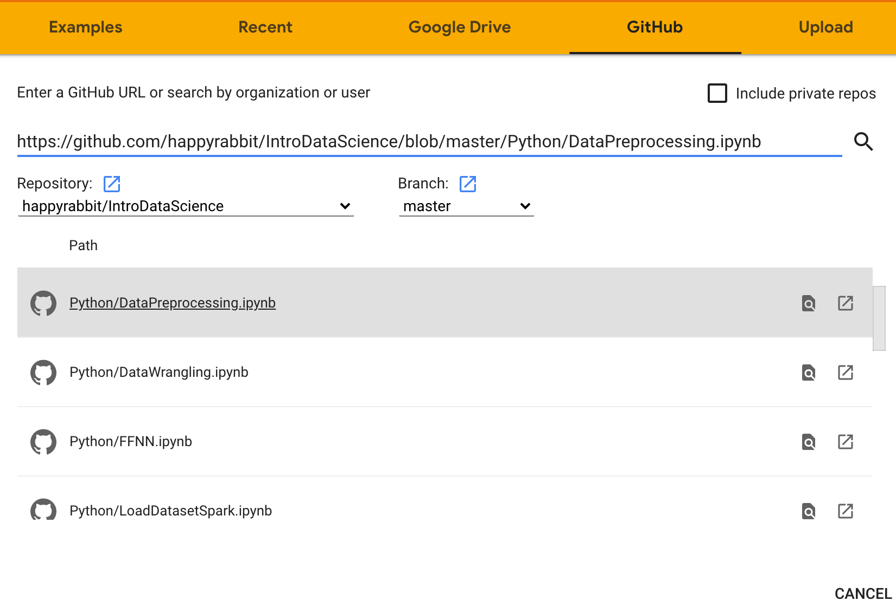

--- 
title: "Introduction to Data Science"
header-includes:
  - \usepackage{algpseudocode}
  - \usepackage{algorithm}
  - \usepackage{listings}
author: "Hui Lin and Ming Li"
date: "`r Sys.Date()`"
knit: "bookdown::render_book"
documentclass: krantz
bibliography: [bibliography.bib]
biblio-style: apalike
link-citations: yes
colorlinks: yes
lot: yes
lof: yes
fontsize: 12pt
monofont: "Source Code Pro"
monofontoptions: "Scale=0.7"
site: bookdown::bookdown_site
description: "Introduction to Data Science"
url: 'http\://scientistcafe.com/IDS/'
github-repo: happyrabbit/IntroDataScience
---

```{r include=FALSE, echo = FALSE, warning=FALSE, message=FALSE}
# Sys.setenv(TZ="UTC")
options(
  htmltools.dir.version = FALSE, formatR.indent = 2,
  width = 55, digits = 4, warnPartialMatchAttr = FALSE, warnPartialMatchDollar = FALSE
)

# package_list = c("svglite", "RANN", "proxy", "partykit", "pROC","plot3D")
# install.packages("plot3D")
# bookdown::render_book("index.Rmd", "bookdown::gitbook")
# bookdown::render_book("index.Rmd", "bookdown::pdf_book")
```

# Preface{-}

During the early years of our career as data scientists, we were bewildered by all kinds of data science hype. There is a lack of definition of many basic terminologies such as "big data," "artificial intelligence," and "data science." How big is big data? What is data science? What is the difference between the sexy title "Data Scientist" and the traditional "Data Analyst?" The term data science stirs so many associations such as machine learning, deep learning, data mining, pattern recognition. All those struck us as confusing and vague as real-world data scientists! However, we always feel something tangible in data science applications, and it has been developing very fast. After applying data science for many years, we now have a much better idea about data science in general. This book is our endeavor to make data science a more concrete and legitimate field. In addition to "hard" technical aspects, the book also covers soft skills and career development in data science. 

## Goal of the Book {-}

This is a book on data science with a specific focus on industrial experience. Data Science is a cross-disciplinary subject involving hands-on experience and business problem-solving exposures. The majority of existing introduction books on data science are about the modeling techniques and the implementation of models using R or Python. However, many of these books lack the context of the industrial environment. Moreover, a crucial part, the art of data science in practice, is often missing. This book intends to fill the gap.

Some key features of this book are as follows:

- It covers both technical and soft skills.

- It has a chapter dedicated to the big data cloud environment. In the industry, the practice of data science is often in such an environment.

- It is hands-on. We provide the data and **repeatable** R and Python code in notebooks. Readers can repeat the analysis in the book using the data and code provided. We also suggest that readers modify the notebook to perform their analyses with their data and problems whenever possible. The best way to learn data science is to do it!

- It focuses on the skills needed to solve real-world industrial problems rather than an academic book.

## What This Book Covers {-}

This book provides a comprehensive introduction to various data science fields, soft and programing skills in data science projects, and potential career paths for data scientists.

There are many existing data science books, including:

- _An Introduction to Data Science_ by **Saltz and Stanton**
- _A Hands-On Introduction to Data Science_ by **Chirag Shah** 
- _Introduction to Data Science: Data Analysis and Prediction Algorithms with R_ by 
**Rafael Irizarry** 
- _Build a Career in Data Science_ by **Robinson and Nolis**
- _Data Science (The MIT Press Essential Knowledge series)_ by **Kelleher and Tierney**
- _The Data Science Handbook_ by **Field Cady**
- _Data Science from Scratch: First Principles with Python (2nd Edition)_ by **Joel Grus**


As data science fields are fast-growing, we did not find a book covering all the contents we feel are essential for a data scientist. The following table compares the data science books mentioned above with this book for contents in Big Data (Spark), R Code, Python Code, Data Preprocessing, Deep Learning, ML models, Career Path, and Project Cycles. We use 0 for not covered, 1 for minimal coverage, 2 for some coverage, and 3 for extensive coverage.

| Author     | Big Data (Spark) | R Code | Python Code | Data Preprocessing | Deep Learning | ML Models | Career Path | Project Cycle |
|------------|------------------|--------|-------------|------------|---------------|-----------|-------------|---------------|
| Lin and Li | 3                | 3      | 3           | 3          | 3             | 3         | 3           | 3             |
| Saltz      | 1                | 3      | 0           | 1          | 0             | 3         | 0           | 0             |
| Shah       | 0                | 3      | 3           | 1          | 0             | 3         | 1           | 0             |
| Irizarry   | 0                | 3      | 0           | 3          | 0             | 3         | 0           | 0             |
| Robinson   | 0                | 0      | 0           | 0          | 0             | 0         | 3           | 3             |
| Kelleher   | 1                | 0      | 0           | 1          | 0             | 2         | 3           | 3             |
| Cady       | 0                | 0      | 3           | 3          | 0             | 3         | 1           | 1             |
| Grus       | 1                | 0      | 3           | 2          | 3             | 3         | 1           | 0             |

The book is organized as the following. 

- **Chapters 1-3** discuss various aspects of data science: difference tracks, career paths, project cycles, soft skills, and common pitfalls. Chapter 3 is an overview of the data sets used in the book.
- **Chapter 4** introduces typical big data cloud platforms and uses R library `sparklyr` \index{sparklyr} as an interface to the big data analytics engine Spark.
- **Chapters 5-6** cover the essential skills to prepare the data for further analysis and modeling, i.e., data preprocessing and wrangling.
- **Chapter 7** illustrates the practical aspects of model tuning. It covers different types of model error, sources of model error, hyperparameter tuning, how to set up your data, and how to make sure your model implementation is correct. In practice, applying machine learning is a highly iterative process. We discuss this before introducing the machine learning algorithm because it applies to nearly all models. You will use cross-validation or training/developing/testing split to tune the models presented in later chapters'. 
- **Chapters 8-14** introduce different types of models. There is a myriad of learning algorithms to learn the data patterns. This book doesn't cover all of them but presents the most common ones or the foundational methods.  

## Who This Book Is For {-}

This book is for readers who want to explore potential data science career paths and eventually want to become a data scientist. Traditional data-related practitioners such as statisticians, business analysts, and data analysts will find this book helpful in expanding their skills for future data science careers. Undergraduate and graduate students from analytics-related areas will find this book beneficial to learn real-world data science applications. Non-mathematical readers will appreciate the reproducibility of the companion R and python codes. 

## How to Use This Book {-}

### What the book assumes {-}

The first two chapters do not have any prerequisite, and the rest of the chapters do require R or Python programming experience and undergraduate level statistics. This book does NOT try to teach the readers to program in the basic sense. It assumes that readers have experience with R or Python. 
If you are new to the programming languages, you may find the code obscure. We provide some references in the **Complementary Reading** section that can help you fill the gap. 

For some chapters (\@ref(datapreprocessing), \@ref(modeltuningstrategy) - \@ref(deeplearning)), readers need to know elementary linear algebra (such as matrix manipulations) and understand basic statistical concepts (such as correlation and simple linear regression). While the book is biased against complex equations, a mathematical background is good for the deep dive under the hood mechanism for advanced topics behind applications. 

### How to use R and Python code {-}

This book uses R in the main text and provides most of the Python codes on GitHub. 

**Use R code.** You should be able to repeat the R code in your local R console or RStudio in all the chapters except for Chapter \@ref(bigdatacloudplatform). The code in each chapter is self-sufficient, and you don't need to run the code in previous chapters first to run the code in the current chapter. For code within a chapter, you do need to run from the beginning.  At the beginning of each chapter, there is a code block for installing and loading all required packages. We also provide the `.rmd` notebooks that include the code to make it easier for you to repeat the code.  Refer to this page http://bit.ly/3r7cV4s for a table with the links to the notebooks. 

To repeat the code on big data and cloud platforms [chapter \@ref(bigdatacloudplatform)], you need to use Databricks, a cloud data platform. We use Databricks' because:

- It provides a user-friendly web-based notebook environment that can create a Spark cluster on the fly to run R/Python/Scala/SQL scripts
- It has a free community edition that is convenient for teaching purpose

Follow the instructions in section \@ref(CloudEnvironment) on the process of setting up and using the spark environment.

**Use Python code.** We provide python notebooks for all the chapters on GitHub. Refer to this page http://bit.ly/3r7cV4s for a table with the links to the notebooks. Like R notebooks, you should be able to repeat all notebooks in your local machine except for Chapter \@ref(bigdatacloudplatform) with reasons stated above. An easy way to repeat the notebook is to import and run in Google Colab. To use Colab, you only need to log in to your Google account in Chrome Browser. To load the notebook to your colab, you can do any of the following:

- Click the ''Open in Colab" icon on the top of each linked notebook using the Chrome Brower. It should load the notebook and open it in your Colab. 

```{r, echo=FALSE, fig.align='center', out.width="35%"}

```

- In your Colab, choose File -> Upload notebook -> GitHub. Copy-paste the notebook's link in the box, search, and select the notebook to load it. For example, you can load the python notebook for data preprocessing like this:

```{r, echo=FALSE, fig.align='center', out.width="100%"}

```
    
To repeat the code for big data, like running R notebook, you need to set up Spark in Databricks. Follow the instructions in section \@ref(CloudEnvironment) on the process of setting up and using the spark environment. Then, run the "Create Spark Data" notebook to create Spark data frames. After that, you can run the pyspark notebook to learn how to use `pyspark`. 

## Complementary Reading {-}

**If you are new to R**, we recommend R for Marketing Research and Analytics by Chris Chapman and Elea McDonnell Feit. The book is practical and provides repeatable R code. Part I & II of the book cover basics of R programming and foundational statistics. It is an excellent book on marketing analytics. 

**If you are new to Python**, we recommend the Python version of the book mentioned above, Python for Marketing Research and Analytics by Jason Schwarz,  Chris Chapman, and Elea McDonnell Feit. 

If you want to dive deeper into some of the book's topics, there are many places to learn more.

- For machine learning, Python Machine Learning 3rd Edition by Raschka and Mirjalili is a good book on implementing machine learning in Python. Apply Predictive Modeling by Kuhn and Johnston is an applied, practitioner-friendly text using R package `caret` . 

- For statistics models in R, a recommended book is An Introduction to Statistical Learning (ISL) by James, Witten, Hastie, and Tibshirani. A more advanced treatment of the topics in ISL is The Elements of Statistical Learning by  Friedman, Tibshirani, and Hastie. 

## Acknowledgements  {-}

# About the Authors {-}

**Hui Lin** is currently a Quant Researcher at Google. Before joining Google, Hui held
different roles in data science. She was the head of data science at Netlify where she built
and led the data science team and a Data Scientist at DuPont where she did a broad range
of predictive analytics and market research analysis. She is the co-founder of Central
Iowa R User Group, blogger of https://scientistcafe.com/, and 2018 Program Chair of
ASA Statistics in Marketing Section. She enjoys making analytics accessible to a broad
audience and teaches tutorials and workshops for practitioners on data science. She holds
MS and Ph.D. in statistics from Iowa State University.

**Ming Li** is currently a Senior Research Scientist at Amazon and an Adjunct Instructor of University of Washington. He was the Chair of Quality & Productivity Section of American Statistical Association for 2017. He was a Data Scientist at Walmart and a Statistical Leader at General Electric Global Research Center. He obtained his Ph.D. in Statistics from Iowa State University at 2010. With deep statistics background and a few years’ experience in data science, he has trained and mentored numerous junior data scientist with different background such as statistician, programmer, software developer and business analyst. He was also an instructor of Amazon’s internal Machine Learning University and was one of the key founding members of Walmart’s Analytics Rotational Program.
